# 02 — Journeys and State Machines

**Pack:** MetriStay Hospitality Suite Phase 1 planning pack v0.1 (draft) • **Date:** 2026-09-28 • **Source:** master prompt v3.0 §§D, E, G, H.3, K, O, P, Q • **Conventions:** `docs/README.md` §3.

> Specification only. No state machine below is implemented. Partner-dependent transitions (PSP, bill provider, channel manager, WPS bank, government adapter, travel supplier, OTP/e-sign provider, LPR/camera) are *designed against a provider-neutral port*; each real adapter's capability flags (`docs/05`) decide which transitions are available. An unavailable capability yields the documented manual path, never a simulated success.

## 0. How to read this document

### 0.1 Structure of every state machine

Each `SM-<Name>` section contains: owning module (`M-id`, co-owners in brackets), phase, aggregate/record, a `stateDiagram-v2`, a **transition table**, **exception transitions**, **terminal states**, **invariants** and **linked acceptance tests** (`AT-Gnn.n`, defined in `docs/09`; numbers here are the proposed ids that `docs/09` must carry verbatim).

Transition table columns: `#` · **From** · **Event / command** · **Guard** · **To** · **Actor** · **Side effects / events emitted** · **Idempotency key**.

- Commands are imperative (`ConfirmReservation`); events are PascalCase past tense (`ReservationConfirmed`) emitted through the transactional outbox in the same DB transaction as the state change (README §3.5).
- **Idempotency key** is the natural key the server dedups on, scoped by `(tenant_id, property_id, command_type)`. `idem` = client `Idempotency-Key` header; `evt` = inbound provider/webhook event id deduped in the inbox. A replay with the same key and the same payload returns the original result; same key + different payload → `409 IdempotencyConflict` and no state change.
- Actor names are the standard roles of README §3.3; `*_worker` are system actors; `adapter:<x>` means an inbound callback verified by signature/mTLS.

### 0.2 Exception codes (used in every "Exception transitions" table)

| Code | Meaning | Default handling (overridden per SM) |
|---|---|---|
| `X-TMO` | Timeout / deadline / missing callback | Move to or stay in an explicit *pending/unknown* state; schedule **inquiry**; never assume success or failure. |
| `X-DUP` | Duplicate command, scan, webhook or callback | Inbox/idempotency dedup → no-op + `DuplicateSuppressed` audit record. |
| `X-OUT` | Partner/device/network outage | Queue with visible *degraded* badge; offer named manual path with owner; circuit breaker. |
| `X-REV` | Reversal / refund / cancellation / correction | Append a reversing entry linked to `reversal_of`; never mutate or delete the original. |
| `X-DSP` | Dispute / chargeback / claim | Freeze dependent payouts; open case (M60/M20/M55) with evidence; SLA owner. |
| `X-OFF` | Offline conflict (mobile/edge replay with stale `base_version`) | Server is authority for money, stock, inventory, custody; conflicting offline op → `conflict_queue` with both versions for human resolution; non-conflicting ops auto-merge. |
| `X-EXP` | Validity expiry (quote, hold, offer, OTP, credential, rule pack) | Transition to *expired*; dependent actions blocked; re-quote/renew creates a **new** record. |
| `X-GATE` | Compliance / jurisdiction / feature gate closed | Block the transition, show reviewer + evidence + manual path (M44). |

### 0.3 Global invariants (apply to all SMs; SM-local invariants add to these)

| ID | Invariant |
|---|---|
| G-INV-01 | **Pending until proven.** A payment, bill payment, payout, payroll file, travel order or government submission whose provider call timed out or returned an ambiguous status stays `pending_unknown` until an **inquiry**, signed callback, settlement file or approved manual evidence proves the final status. |
| G-INV-02 | **No blind retry.** A second money/order submission is allowed only after an inquiry returns a definitive `not_found` / `failed` for the first attempt, and reuses the same business reference; every retry has its own attempt id under the same order id. |
| G-INV-03 | **External travel is never "booked"** (flight/cruise/taxi) without a confirmed external reference (PNR/ticket/booking/trip id) received from the authorized supplier or entered from verified supplier evidence by staff. |
| G-INV-04 | **AI is advisory.** An AI actor (`ai_assistant`, `ai_followup_worker`) may draft, summarize, classify and flag; it cannot mark a delivery occurred, a receipt accepted, an award made, a booking confirmed, a payment made, a complaint closed or a filing submitted. |
| G-INV-05 | **Discarded stock never re-enters available.** Quantity in `waste`/`disposed` is terminal; quarantined quantity re-enters `available` only through an inspector-approved release with lot evidence; no transaction increases `available` from `waste`. |
| G-INV-06 | **Exactly-once reversal.** A refund/chargeback/cancellation reverses the linked points earn, referral commission, folio charge, stock movement and GL entry **exactly once** (unique constraint on `(source_txn_id, reversal_of)`). |
| G-INV-07 | **Single-tier referral.** A booking has at most one direct referrer; no referrer-to-referrer relation exists in the schema; recruitment earns zero. |
| G-INV-08 | **Rule-pack gate.** A rule pack in `draft`, `in_review`, `expired`, `rejected`, `suspended` or `unknown` blocks dependent **automated** filing, selling and payout; only a manual/compliance-review path is offered. |
| G-INV-09 | **QR is a handoff, not authentication.** Possession of a QR/deep link never authenticates; it binds to a session challenge that must be completed with an independent factor (OTP/login/staff check). |
| G-INV-10 | **Append-only ledgers.** Folio, GL, AP, points, commission, stock, cylinder custody, linen custody, lost-item custody and incident chronology are append-only; corrections are reversing entries with source links. |
| G-INV-11 | **Terminal immutability.** Terminal states accept no transition except audited *read* and explicitly listed `reopen` commands that create a linked successor record. |
| G-INV-12 | **Approval ≠ money movement.** Approver and payment releaser are different users (maker-checker, M02 SoD); UI approval never implies bank/PSP execution. |
| G-INV-13 | **Scoped actors.** Every transition checks tenant/property/department/record scope (M02); vendors see only own records; guests only own stays; corporate users only own company. |
| G-INV-14 | **Estimated vs reconciled.** A value derived from a non-final state is labelled `estimate`; only `reconciled`/`settled` states feed "actual" KPIs (M32/M65). |

### 0.4 Acceptance-test id plan (for `docs/09`)

`AT-G01` corporate search · `AT-G02` composite booking/BEO · `AT-G03` check-in/parking/POS/club · `AT-G04` cylinders/maintenance/utilities · `AT-G05` payroll/WPS · `AT-G06` gateway/bill-pay · `AT-G07` points/referral · `AT-G08` night audit/month-end · `AT-G09` five-market classifier · `AT-G10` vendor registration/search · `AT-G11` travel concierge · `AT-G12` Canada · `AT-G13` media/AI chat/ID/sign/OTP · `AT-G14` incident/lost-and-found · `AT-G15` chef continuity · `AT-G16` vendor catalog · `AT-G17` RFQ/sample/award/PO · `AT-G18` AI follow-up/receiving/issue/waste · `AT-G19` website/stay/recovery/revenue · `AT-G20` failure injection. Sub-numbers `.n` are assigned below and must be carried by `docs/09`.

## 1. State machine index

| # | SM id | Owner (co-owners) | Phase | Record | Section |
|---|---|---|---|---|---|
| 1 | SM-QuoteHold | M04 (M03, M09) | 2 | quote + inventory hold | §2.1 |
| 2 | SM-Booking | M05 (M03, M07, M08) | 2–3 | reservation | §2.2 |
| 3 | SM-RoomPhysical | M03 (M26, M06) | 2 | room physical status | §2.3 |
| 4 | SM-RoomCleaning | M06 (M56) | 2 | room cleaning status | §2.4 |
| 5 | SM-Folio | M08 (M28, M60) | 2 | folio + windows | §2.5 |
| 6 | SM-Invoice | M08 (M38, M20) | 2 | tax invoice / credit note | §2.6 |
| 7 | SM-TimedResourceHold | M09 (M03, M16, M17) | 2–3 | composite hold | §3.1 |
| 8 | SM-CorporateAgreement | M10 | 3 | negotiated agreement version | §3.2 |
| 9 | SM-Event | M12 (M09, M16, M10) | 3 | event / group booking | §3.3 |
| 10 | SM-BEORevision | M12 (M16, M13, M14) | 3 | BEO version | §3.4 |
| 11 | SM-POSCheck | M13 (M08, M14) | 3 | POS check / tab | §3.5 |
| 12 | SM-GiftVoucher | M54 (M08, M19) | 3–4 | voucher | §3.6 |
| 13 | SM-ParkingSession | M17 (M08) | 3 | parking permit + session | §3.7 |
| 14 | SM-PSPPayment | M28 | 2/5 | payment intent | §4.1 |
| 15 | SM-BillProviderOrder | M29 (M28, M20) | 5 | bill-pay order | §4.2 |
| 16 | SM-UtilityBill | M22/M23/M24 (M20) | 4–5 | utility bill | §4.3 |
| 17 | SM-APInvoice | M20 (M19, M21) | 4 | supplier invoice + payment | §4.4 |
| 18 | SM-PayrollRun | M27 (M28, M19, M38) | 4 | payroll run | §4.5 |
| 19 | SM-CashierShift | M60 (M08) | 2 | cashier shift / cash audit | §4.6 |
| 20 | SM-NightAudit | M08 (M60, M32) | 2 | business-date close | §4.7 |
| 21 | SM-PointsEntry | M30 | 5 | points ledger entry | §5.1 |
| 22 | SM-ReferralAttribution | M31 | 5 | booking attribution | §5.2 |
| 23 | SM-ReferralCommission | M31 (M20, M44) | 5–6 | commission ledger line | §5.3 |
| 24 | SM-RateAction | M53 (M04, M07) | 3/5 | forecast run + rate recommendation | §6.1 |
| 25 | SM-WebLead | M51 (M52) | 2–3 | lead / abandoned quote | §6.2 |
| 26 | SM-ContactConsent | M02 (M52) | 2–3 | consent per purpose × channel | §6.3 |
| 27 | SM-Complaint | M55 (M08, M54) | 3–4 | guest case | §6.4 |
| 28 | SM-AIChat | M40 (M55) | 3–5 | chat conversation | §6.5 |
| 29 | SM-AIFollowUpMessage | M50 (M40, M63) | 3–4 | AI-drafted vendor message | §6.6 |
| 30 | SM-LinenBatch | M56 (M20) | 3–4 | linen/laundry batch | §7.1 |
| 31 | SM-MinibarPosting | M56 (M08, M14) | 3–4 | minibar count/posting | §7.2 |
| 32 | SM-HygieneInspection | M61 (M26, M57) | 3–4 | inspection + NC | §7.3 |
| 33 | SM-VendorRegistration | M46 (M02, M44) | 2–4 | vendor + category qualification | §8.1 |
| 34 | SM-VendorOffer | M48 (M46) | 3–4 | daily stock/price offer | §8.2 |
| 35 | SM-ChefCoverage | M47 (M27) | 2–3 | service coverage slot | §8.3 |
| 36 | SM-EmergencyCallout | M47 (M63, M20) | 3–4 | callout campaign | §8.4 |
| 37 | SM-Requisition | M21 (M49) | 3 | requisition | §9.1 |
| 38 | SM-RFQ | M49 | 3 | RFQ + bids | §9.2 |
| 39 | SM-SampleImage | M49 (M02) | 3 | sample image | §9.3 |
| 40 | SM-Award | M49 | 3 | award | §9.4 |
| 41 | SM-PurchaseOrder | M49 (M21, M20) | 3–4 | PO version | §9.5 |
| 42 | SM-Delivery | M50 | 3–4 | delivery / ASN milestones | §9.6 |
| 43 | SM-GRN | M50 (M14, M20) | 3–4 | goods receipt + quarantine | §9.7 |
| 44 | SM-StockQuantity | M14 (M50) | 3–4 | lot × bin quantity buckets | §9.8 |
| 45 | SM-StoreIssue | M50 (M14, M16) | 4 | issue / return / waste doc | §9.9 |
| 46 | SM-CylinderCustody | M25 (M21) | 4 | cylinder unit | §9.10 |
| 47 | SM-TravelRequest | M45 (M46) | 3 | travel case | §10.1 |
| 48 | SM-TravelOffer | M45 | 3/5 | provider offer | §10.2 |
| 49 | SM-TravelOrder | M45 (M28, M20) | 3/5 | external order | §10.3 |
| 50 | SM-JurisdictionClassification | M44 (M38) | 2 | classification decision | §11.1 |
| 51 | SM-RulePack | M44 | 2–6 | rule pack version | §11.2 |
| 52 | SM-GovFiling | M38 (M44) | 4–6 | government submission | §11.3 |
| 53 | SM-IDIntake | M41 (M05) | 2–3 | ID image + OCR | §12.1 |
| 54 | SM-Signature | M41 | 2–3 | signature envelope | §12.2 |
| 55 | SM-OTPChallenge | M41 (M02) | 2/5 | OTP / QR challenge | §12.3 |
| 56 | SM-MediaAsset | M39 (M51) | 2–3 | media asset version | §13.1 |
| 57 | SM-Incident | M42 (M68) | 3–4 | incident | §14.1 |
| 58 | SM-LostItem | M43 | 2–3 | found item | §14.2 |

Vendor **search** is not a state machine; it is the eligibility predicate `ELIGIBLE(vendor, dept, category, location, date)` defined in §8.1 over SM-VendorRegistration and SM-VendorOffer states.

---

## 2. Rooms, stays and folio

### 2.1 SM-QuoteHold — owner M04 (M03, M09) — phase 2

Record: `quote` (priced offer with policy snapshot) and optional `inventory_hold` (room-type-night decrements, and via SM-TimedResourceHold for non-room resources).

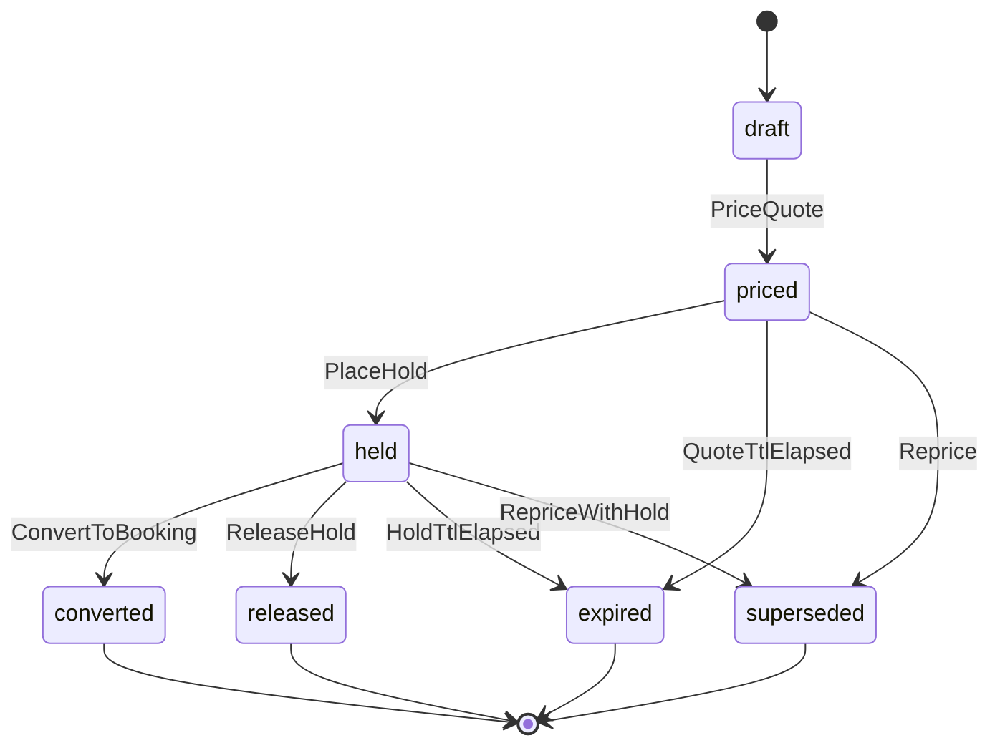
```mermaid
stateDiagram-v2
    [*] --> draft
    draft --> priced : PriceQuote
    priced --> held : PlaceHold
    priced --> expired : QuoteTtlElapsed
    held --> converted : ConvertToBooking
    held --> released : ReleaseHold
    held --> expired : HoldTtlElapsed
    priced --> superseded : Reprice
    held --> superseded : RepriceWithHold
    converted --> [*]
    released --> [*]
    expired --> [*]
    superseded --> [*]
```

| # | From | Event / command | Guard | To | Actor | Side effects / events | Idempotency key |
|---|---|---|---|---|---|---|---|
| 1 | — | `CreateQuote` | property open for dates; search params valid | draft | guest, booker, front_desk_agent, corporate_booker, ai_assistant | `QuoteDrafted` | idem |
| 2 | draft | `PriceQuote` | rate plan eligible (M04, M10 agreement `active`); tax rule pack verified for jurisdiction (SM-RulePack) else price shown `tax_estimate` and hold disallowed for auto-sell | priced | system | snapshot: rate, taxes, fees, rounding, currency, cancellation policy, `valid_until`; `QuotePriced` | quote_id+pricing_version |
| 3 | priced | `PlaceHold` | inventory available per night (room-type sellable − held − sold ≥ n) or controlled overbooking allowance; hold TTL ≤ policy | held | same as 1 | atomic decrement of `available` into `held` per night; timed resources via SM-TimedResourceHold; `InventoryHeld` | quote_id+hold_seq |
| 4 | held | `ConvertToBooking` | hold not expired; payment/guarantee satisfied per policy (SM-PSPPayment `authorized`/`captured` or corporate credit OK); ID/policy checks if required | converted | system on behalf of 1 | `held`→`sold` per night; creates SM-Booking `confirmed`; `QuoteConverted` | quote_id |
| 5 | held | `ReleaseHold` | caller owns hold or supervisor | released | owner of hold, front_office_manager | `held`→`available`; `InventoryReleased` | quote_id+release |
| 6 | held / priced | `HoldTtlElapsed` / `QuoteTtlElapsed` | now ≥ valid_until | expired | hold_expiry_worker | release inventory; `QuoteExpired` | quote_id+expire |
| 7 | priced / held | `Reprice` | rate/tax/policy changed or guest changed params | superseded | system, agent | new quote created and linked `supersedes`; hold transferred atomically only if new hold succeeds | quote_id+pricing_version |

**Exception transitions**

| Code | Situation | Transition / handling |
|---|---|---|
| X-TMO | Payment authorization pending while hold TTL elapses | Hold auto-extended once by `payment_grace` (config, e.g. 10 min) if SM-PSPPayment is `pending_unknown`; if still unknown → `expired`, inventory released, payment placed in `refund_required_if_captured` queue (never silently kept). |
| X-DUP | Double-click `ConvertToBooking` | Same idem → same booking id returned. |
| X-OUT | Channel/ARI push fails after hold | Hold is authoritative locally; ARI retry via outbox; oversell exposure monitor (M07). |
| X-OFF | Front-desk offline quote | Offline client may *draft/price from cached rates* labelled `offline_estimate`; `PlaceHold` requires server. |
| X-EXP | Price shown older than `valid_until` | Conversion rejected `QuoteExpired`; guest must re-quote. |

**Terminal:** `converted`, `released`, `expired`, `superseded`.
**Invariants:** INV-QH-1 `sold + held ≤ sellable + approved_overbook` per room type per night (DB constraint + serialized decrement). INV-QH-2 a quote's total, taxes and policy are immutable after `priced`; any change creates a new quote. INV-QH-3 an AI-originated quote cannot convert without explicit guest confirmation and payment (G-INV-04).
**ATs:** AT-G01.1 (only feasible contracted configurations), AT-G19.2 (correct total price), AT-G20.1 (concurrent bookings, no ghost sale).

### 2.2 SM-Booking — owner M05 (M03, M07, M08) — phase 2–3

Record: `reservation` (booker, occupants, payer distinct; one or more room-stays).

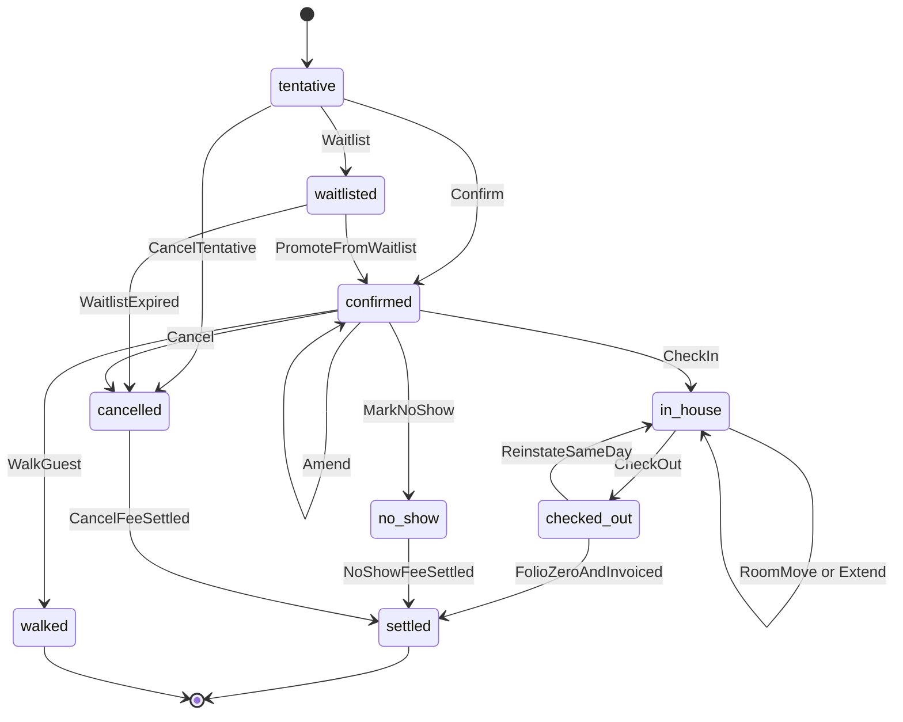
```mermaid
stateDiagram-v2
    [*] --> tentative
    tentative --> confirmed : Confirm
    tentative --> cancelled : CancelTentative
    tentative --> waitlisted : Waitlist
    waitlisted --> confirmed : PromoteFromWaitlist
    waitlisted --> cancelled : WaitlistExpired
    confirmed --> confirmed : Amend
    confirmed --> cancelled : Cancel
    confirmed --> no_show : MarkNoShow
    confirmed --> walked : WalkGuest
    confirmed --> in_house : CheckIn
    in_house --> in_house : RoomMove or Extend
    in_house --> checked_out : CheckOut
    checked_out --> settled : FolioZeroAndInvoiced
    no_show --> settled : NoShowFeeSettled
    cancelled --> settled : CancelFeeSettled
    checked_out --> in_house : ReinstateSameDay
    settled --> [*]
    walked --> [*]
```

| # | From | Event / command | Guard | To | Actor | Side effects / events | Idempotency key |
|---|---|---|---|---|---|---|---|
| 1 | — | `CreateTentative` | group/corporate option or pending guarantee | tentative | sales_manager, corporate_booker, front_desk_agent | option date set; `ReservationTentativeCreated` | idem |
| 2 | tentative / SM-QuoteHold `held` | `Confirm` | guarantee policy met; inventory `sold`; rule pack for guest registration verified or manual reg path flagged | confirmed | system, front_desk_agent | confirmation no.; folio opened (SM-Folio `open`); ARI delta to M07; attribution frozen (SM-ReferralAttribution, M51); `ReservationConfirmed` | quote_id or channel_booking_ref |
| 3 | channel | `ChannelBookingReceived` | mapping exists; inventory available | confirmed | adapter:channel | as 2; if not available → `OversellDetected` case, still confirmed with `oversold` flag (channel is contractual) | evt (channel booking id + version) |
| 4 | confirmed | `Amend` | new dates/rooms available; reprice per policy (new SM-QuoteHold) | confirmed | guest, front_desk_agent, adapter:channel | version++, inventory diff atomic; `ReservationAmended` | reservation_id+amend_seq |
| 5 | confirmed | `Cancel` | within policy or override with reason | cancelled | guest, agent, adapter:channel | release inventory; cancellation fee charge to folio; triggers X-REV on points/referral pending; `ReservationCancelled` | reservation_id+cancel |
| 6 | confirmed | `MarkNoShow` | business date > arrival date; night audit step | no_show | night_audit_worker, front_office_manager | release remaining nights; no-show fee per policy; `ReservationNoShow` | reservation_id+business_date |
| 7 | confirmed | `WalkGuest` | overbooked, no room; alternative hotel arranged | walked | duty_manager | compensation cost to M60 case; `GuestWalked` | reservation_id+walk |
| 8 | confirmed | `CheckIn` | arrival date = business date (or early check-in offer M54); room assigned and SM-RoomCleaning `inspected` (or guest accepts `clean`); ID/registration per SM-IDIntake `confirmed` or manual; signature SM-Signature `signed` if required; payment guarantee valid | in_house | front_desk_agent, guest (self check-in) | key/device entitlement events; parking permit activation; `GuestCheckedIn` | reservation_id+checkin |
| 9 | in_house | `RoomMove` | target room vacant+inspected; same or approved room type | in_house | front_desk_agent | old room → SM-RoomCleaning `dirty`; entitlements moved; `RoomMoved` | reservation_id+move_seq |
| 10 | in_house | `Extend` | inventory available for extra nights | in_house | front_desk_agent, guest | SM-QuoteHold for added nights; `StayExtended` | reservation_id+extend_seq |
| 11 | in_house | `CheckOut` | folio balance 0 or transferred to AR/city ledger with approved credit | checked_out | front_desk_agent, guest (express) | room → `dirty`/`vacant`; entitlements revoked (parking, Wi-Fi, keys); points pending→available timer; referral qualification timer; survey trigger (M52); `GuestCheckedOut` | reservation_id+checkout |
| 12 | checked_out | `ReinstateSameDay` | same business date; room still vacant; front_office_manager approval | in_house | front_office_manager | reversal of checkout side-effects; `CheckOutReversed` | reservation_id+reinstate |
| 13 | checked_out / cancelled / no_show | `FolioZeroAndInvoiced` | SM-Folio `closed` | settled | system | `ReservationSettled` | reservation_id+settle |

**Exception transitions**

| Code | Situation | Handling |
|---|---|---|
| X-DUP | Channel sends same booking twice / web double submit | Inbox dedup on channel booking id+version; web idem on quote_id. |
| X-OUT | Channel manager down | Local bookings continue; ARI queued; oversell exposure dashboard; manual stop-sell instruction to channel extranet (owner: revenue_manager). |
| X-OFF | Offline check-in (network outage) | Staff app records `CheckIn` offline with `base_version`; room assignment conflict → conflict_queue; key issuance via local lock fallback M64. Payment capture deferred as `pending_offline`. |
| X-REV | Cancel after partial stay / refund | Folio reversal entries; points and commission reversal exactly once (G-INV-06). |
| X-DSP | Guest disputes no-show fee | SM-Complaint + SM-PSPPayment `disputed`; fee held, not reversed until decision. |
| X-TMO | Guarantee payment unknown at confirm | Booking stays `tentative` with `guarantee_pending` (not confirmed) until SM-PSPPayment resolves; hold TTL rule from SM-QuoteHold. |

**Terminal:** `settled`, `walked` (compensation handled by case). `cancelled`/`no_show` are closing states that end in `settled`.
**Invariants:** INV-BK-1 booker, occupant and payer are separate references (may coincide). INV-BK-2 room *assignment* never changes sold inventory counts (M03). INV-BK-3 no `in_house` without assigned room and valid guarantee. INV-BK-4 a reservation has ≤1 frozen attribution record and ≤1 direct referrer.
**ATs:** AT-G02.1, AT-G03.1 (check-in, charges once), AT-G13.7 (booking confirmed only after payment), AT-G19.3, AT-G20.1, AT-G20.10 (corporate cancellation).

### 2.3 SM-RoomPhysical — owner M03 (M26, M06) — phase 2

Record: `room.physical_status` (separate from cleaning status and occupancy).

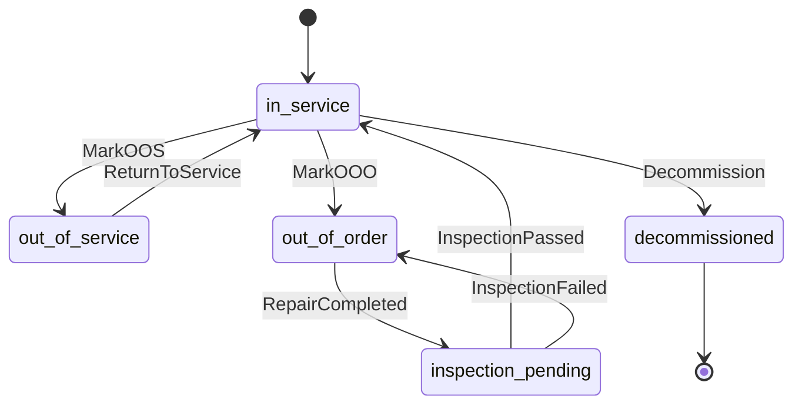
```mermaid
stateDiagram-v2
    [*] --> in_service
    in_service --> out_of_service : MarkOOS
    in_service --> out_of_order : MarkOOO
    out_of_service --> in_service : ReturnToService
    out_of_order --> inspection_pending : RepairCompleted
    inspection_pending --> in_service : InspectionPassed
    inspection_pending --> out_of_order : InspectionFailed
    in_service --> decommissioned : Decommission
    decommissioned --> [*]
```

| # | From | Event / command | Guard | To | Actor | Side effects / events | Idempotency key |
|---|---|---|---|---|---|---|---|
| 1 | in_service | `MarkOOS` | minor issue; room stays in sellable count | out_of_service | housekeeping_supervisor, engineer | not assignable; `RoomOutOfService` | room_id+reason_id |
| 2 | in_service | `MarkOOO` | date range; if occupied/assigned → must first move guests | out_of_order | chief_engineer, front_office_manager | **reduces sellable inventory** for range; work order M26; ARI update; `RoomOutOfOrder` | room_id+work_order_id |
| 3 | out_of_order | `RepairCompleted` | WO completed (vendor evidence M26) | inspection_pending | engineer, vendor_user (assigned) | `RoomRepairCompleted` | work_order_id |
| 4 | inspection_pending | `InspectionPassed` | inspector ≠ repairing vendor | in_service | chief_engineer, housekeeping_supervisor | sellable restored; cleaning → `dirty`; `RoomReturnedToService` | room_id+inspection_id |
| 5 | inspection_pending | `InspectionFailed` | — | out_of_order | inspector | reopen WO | inspection_id |
| 6 | out_of_service | `ReturnToService` | — | in_service | housekeeping_supervisor | `RoomReturnedToService` | room_id+oos_id |
| 7 | in_service | `Decommission` | no future sold nights; M66 change approved | decommissioned | property_admin | inventory structure change versioned | room_id |

**Exceptions:** X-OFF (engineer marks OOO offline while front desk assigns): server rejects assignment if OOO committed first; later OOO on assigned room → conflict_queue for front_office_manager, never silent unassign. X-DUP on WO callback. X-TMO: OOO beyond `expected_return` → escalation to chief_engineer and revenue_manager (supply forecast update M53).
**Terminal:** `decommissioned`.
**Invariants:** INV-RP-1 OOO nights excluded from sellable and from occupancy denominator per KPI dictionary (M32); OOS nights are included. INV-RP-2 no guest assigned to OOO room.
**ATs:** AT-G19.4, AT-G08.1 (occupancy denominator).

### 2.4 SM-RoomCleaning — owner M06 (M56) — phase 2

Record: `room.cleaning_status` + `hk_task`.

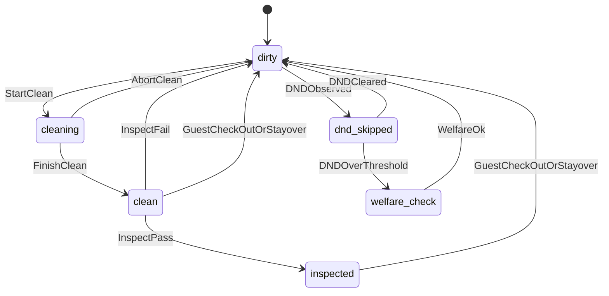
```mermaid
stateDiagram-v2
    [*] --> dirty
    dirty --> cleaning : StartClean
    cleaning --> clean : FinishClean
    cleaning --> dirty : AbortClean
    clean --> inspected : InspectPass
    clean --> dirty : InspectFail
    inspected --> dirty : GuestCheckOutOrStayover
    clean --> dirty : GuestCheckOutOrStayover
    dirty --> dnd_skipped : DNDObserved
    dnd_skipped --> dirty : DNDCleared
    dnd_skipped --> welfare_check : DNDOverThreshold
    welfare_check --> dirty : WelfareOk
```

| # | From | Event / command | Guard | To | Actor | Side effects / events | Idempotency key |
|---|---|---|---|---|---|---|---|
| 1 | dirty | `StartClean` | task assigned to actor; room not DND | cleaning | housekeeper | timestamps; `CleaningStarted` | task_id+start |
| 2 | cleaning | `FinishClean` | checklist done; minibar count captured (SM-MinibarPosting) ; lost items logged (SM-LostItem) | clean | housekeeper | linen used/soiled counts (SM-LinenBatch); `RoomCleaned` | task_id+finish |
| 3 | clean | `InspectPass` | inspector role; inspection required by policy (VIP/arrival) | inspected | housekeeping_supervisor | room-ready ETA met; notify front desk; `RoomInspected` | task_id+inspect |
| 4 | clean | `InspectFail` | reason | dirty | housekeeping_supervisor | reclean task; quality sample (M62) | task_id+inspect |
| 5 | inspected/clean | `GuestCheckOutOrStayover` | SM-Booking checkout or daily stayover schedule | dirty | system | new task with priority from arrivals/VIP | reservation_id+date |
| 6 | dirty | `DNDObserved` | DND sign/device | dnd_skipped | housekeeper | retry slot | task_id+dnd_seq |
| 7 | dnd_skipped | `DNDOverThreshold` | DND > welfare threshold (policy, e.g. 24–48 h) | welfare_check | system | duty_manager task; privacy-respecting check; may raise SM-Incident | room_id+date |

**Exceptions:** X-OFF (housekeeper app offline marks clean; supervisor already failed inspection): later timestamp wins only if same actor chain; otherwise conflict_queue; never auto-promote to `inspected`. X-DUP scans ignored. X-TMO task over SLA → supervisor escalation, ETA recomputed.
**Terminal:** none (cyclic lifecycle); record closes when room decommissioned.
**Invariants:** INV-RC-1 cleaning status is independent of SM-RoomPhysical and occupancy; front desk sees the triple (physical, cleaning, occupancy). INV-RC-2 `inspected` requires inspector ≠ cleaner when policy demands.
**ATs:** AT-G19.4 (linen/housekeeping), AT-G03.1.

### 2.5 SM-Folio — owner M08 (M28, M60) — phase 2

Record: `folio` with windows (payers) and append-only `folio_line` (charge, adjustment, reversal, transfer, payment, refund).

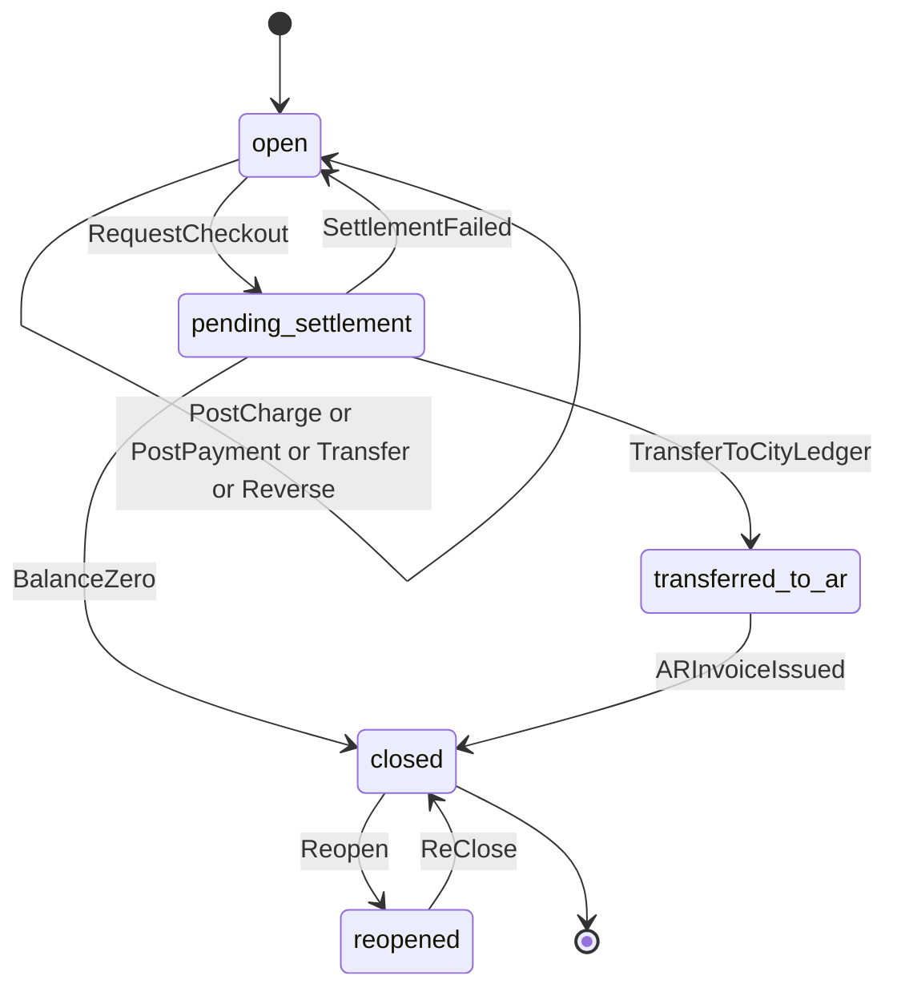
```mermaid
stateDiagram-v2
    [*] --> open
    open --> open : PostCharge or PostPayment or Transfer or Reverse
    open --> pending_settlement : RequestCheckout
    pending_settlement --> open : SettlementFailed
    pending_settlement --> closed : BalanceZero
    pending_settlement --> transferred_to_ar : TransferToCityLedger
    transferred_to_ar --> closed : ARInvoiceIssued
    closed --> reopened : Reopen
    reopened --> closed : ReClose
    closed --> [*]
```

| # | From | Event / command | Guard | To | Actor | Side effects / events | Idempotency key |
|---|---|---|---|---|---|---|---|
| 1 | open | `PostCharge` | source (room night, POS, parking, minibar, event) has unique `source_ref`; routing rules pick window | open | night_audit_worker, adapter:pos, parking_worker, front_desk_agent | `FolioChargePosted`; GL mapping on audit | **source_system+source_ref** |
| 2 | open | `PostPayment` | SM-PSPPayment `captured`/`settled` or cash receipt within cashier shift | open | cashier, payment_worker | `FolioPaymentPosted` | payment_id |
| 3 | open | `Reverse` | original line exists, not already reversed; allowance/void approval by limit (M60) | open | cashier, front_office_manager | negative line linked `reversal_of`; `FolioLineReversed` | line_id+reversal |
| 4 | open | `Transfer` | target folio/window open; payer authorised | open | front_desk_agent | paired lines; `FolioTransfer` | line_id+target |
| 5 | open | `RequestCheckout` | all pending postings flushed | pending_settlement | front_desk_agent, guest | — | folio_id+checkout |
| 6 | pending_settlement | `BalanceZero` | Σ lines per window = 0 | closed | system | invoice(s) via SM-Invoice; `FolioClosed` | folio_id+close |
| 7 | pending_settlement | `TransferToCityLedger` | corporate credit available (M10/M20) | transferred_to_ar | front_desk_agent, ar_clerk | AR open item; `FolioTransferredToAR` | folio_id+ar |
| 8 | closed | `Reopen` | same accounting period open; reason; front_office_manager | reopened | front_office_manager | audit + M60 anomaly signal; `FolioReopened` | folio_id+reopen_seq |

**Exceptions:** X-DUP same POS/parking charge → ignored by `source_system+source_ref` unique key (AT-G03.2 "posts once"). X-REV refund → negative payment line linked to SM-PSPPayment refund; points/commission reversal triggered exactly once. X-OFF offline POS/cashier postings replay with original source_ref; closed folio receiving late charge → `late_charge` case (post to reopened folio or guest-ledger follow-up, never lost). X-DSP chargeback → SM-PSPPayment `disputed` does not alter folio until outcome; outcome posts reversing line. X-TMO payment unknown at checkout → folio stays `pending_settlement`; guest may leave with authorised hold per policy.
**Terminal:** `closed` (reopen creates audited `reopened` phase, same folio id, new version).
**Invariants:** INV-FO-1 append-only; no update/delete of lines. INV-FO-2 Σ window balance computed, never stored as editable. INV-FO-3 reopen impossible after accounting period lock (then correction goes to new folio with link). INV-FO-4 a charge appears on exactly one folio window at a time.
**ATs:** AT-G03.2, AT-G06.1, AT-G07.2, AT-G08.2, AT-G20.2.

### 2.6 SM-Invoice — owner M08 (M38, M20) — phase 2

Record: fiscal document (`receipt`, `tax_invoice`, `corporate_invoice`, `credit_note`), jurisdiction-specific numbering.

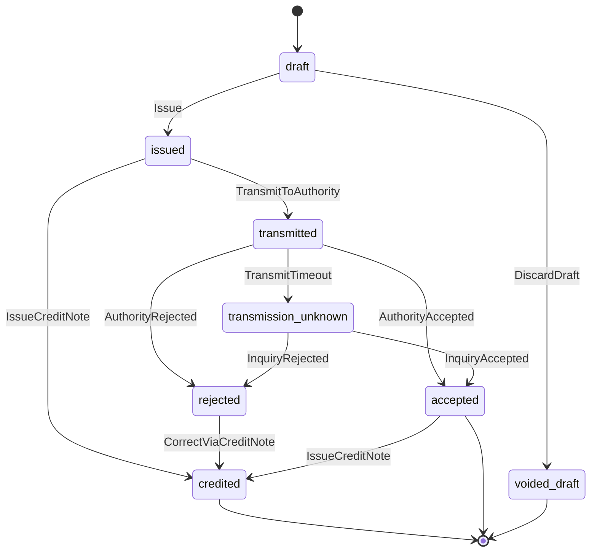
```mermaid
stateDiagram-v2
    [*] --> draft
    draft --> issued : Issue
    draft --> voided_draft : DiscardDraft
    issued --> transmitted : TransmitToAuthority
    issued --> credited : IssueCreditNote
    transmitted --> accepted : AuthorityAccepted
    transmitted --> rejected : AuthorityRejected
    transmitted --> transmission_unknown : TransmitTimeout
    transmission_unknown --> accepted : InquiryAccepted
    transmission_unknown --> rejected : InquiryRejected
    rejected --> credited : CorrectViaCreditNote
    accepted --> credited : IssueCreditNote
    credited --> [*]
    accepted --> [*]
    voided_draft --> [*]
```

| # | From | Event / command | Guard | To | Actor | Side effects / events | Idempotency key |
|---|---|---|---|---|---|---|---|
| 1 | draft | `Issue` | SM-JurisdictionClassification `decided`; invoice rule pack verified; mandatory buyer fields present; sequential number reserved | issued | system, cashier, ar_clerk | gapless number, hash chain (where required); `InvoiceIssued` | folio_id+window+doc_type |
| 2 | issued | `TransmitToAuthority` | jurisdiction requires e-invoicing/clearance AND adapter certified (SM-GovFiling capability) | transmitted | einvoice_worker | payload per rule pack; `InvoiceTransmitted` | invoice_no |
| 3 | transmitted | `AuthorityAccepted` / inquiry | signed response | accepted | adapter:gov | stamp/QR from authority stored | evt |
| 4 | transmitted | `TransmitTimeout` | no response | transmission_unknown | einvoice_worker | inquiry scheduled; **no re-submit before inquiry** | invoice_no+attempt |
| 5 | issued/accepted/rejected | `IssueCreditNote` | amount ≤ remaining creditable; approval by limit | credited | ar_clerk, front_office_manager | new credit note document (own SM) referencing original; `CreditNoteIssued` | invoice_no+credit_seq |

**Exceptions:** X-GATE rule pack not verified → `Issue` allowed only as `pro_forma/receipt` with banner; tax invoice issuance blocked (manual compliance path). X-OUT authority down → `issued` with offline/deferred-clearance flag where the jurisdiction permits; else blocked with manual path. X-REV never edit an issued invoice; credit note only.
**Terminal:** `accepted` (or `issued` where no transmission), `credited`, `voided_draft`.
**Invariants:** INV-IN-1 numbers gapless per series; voided drafts never consumed a number. INV-IN-2 tax lines computed from the frozen rule-pack version stored on the document.
**ATs:** AT-G09.2 (localized invoice outputs), AT-G12.1, AT-G20.2.

---

## 3. Commercial, events, outlets and parking

### 3.1 SM-TimedResourceHold (composite) — owner M09 (M03, M16, M17) — phase 2–3

Record: `composite_hold` = set of component holds (room-type-nights, function-space slots incl. setup/teardown and partitions, catering production slot, AV/equipment units, labor slots, club capacity, parking capacity). All-or-nothing.

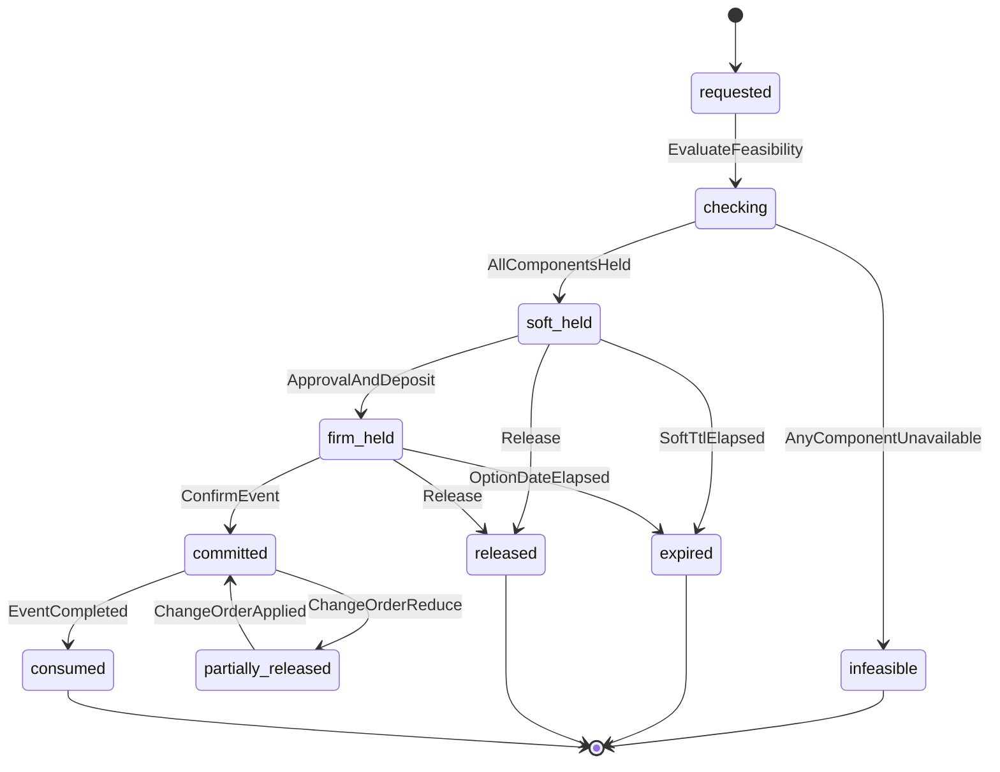
```mermaid
stateDiagram-v2
    [*] --> requested
    requested --> checking : EvaluateFeasibility
    checking --> infeasible : AnyComponentUnavailable
    checking --> soft_held : AllComponentsHeld
    soft_held --> firm_held : ApprovalAndDeposit
    soft_held --> expired : SoftTtlElapsed
    soft_held --> released : Release
    firm_held --> committed : ConfirmEvent
    firm_held --> released : Release
    firm_held --> expired : OptionDateElapsed
    committed --> partially_released : ChangeOrderReduce
    partially_released --> committed : ChangeOrderApplied
    committed --> consumed : EventCompleted
    infeasible --> [*]
    expired --> [*]
    released --> [*]
    consumed --> [*]
```

| # | From | Event / command | Guard | To | Actor | Side effects / events | Idempotency key |
|---|---|---|---|---|---|---|---|
| 1 | — | `RequestCompositeHold` | request lists components with quantities, dates, layout (e.g. classroom 80) | requested | corporate_booker, sales_manager, event_organizer | `CompositeHoldRequested` | idem |
| 2 | requested | `EvaluateFeasibility` | per component: capacity for layout ≥ attendees; partition combos valid; setup+teardown buffers free; labor/equipment pools; parking zone capacity; kitchen slot | checking | system | feasibility matrix (reasons for each infeasible option) | request_id+eval_version |
| 3 | checking | `AllComponentsHeld` | **single DB transaction** acquires all component locks in canonical order (resource_id asc) | soft_held | system | each component row `held` with shared `composite_hold_id`, TTL; `CompositeHeld` | request_id |
| 4 | checking | `AnyComponentUnavailable` | ≥1 fails | infeasible | system | nothing held (rollback); alternatives suggested | request_id |
| 5 | soft_held | `ApprovalAndDeposit` | corporate approval (M11) and deposit SM-PSPPayment `captured` or corporate PO/credit accepted | firm_held | corporate_approver, system | TTL → option date; `CompositeHoldFirmed` | hold_id+firm |
| 6 | firm_held | `ConfirmEvent` | contract signed (SM-Event) | committed | sales_manager | all components `committed`; room block to SM-Booking group block; `CompositeCommitted` | hold_id+commit |
| 7 | committed | `ChangeOrderReduce/Increase` | increase requires feasibility on delta; reduce per contract attrition | partially_released→committed | sales_manager | delta holds atomic; BEO revision (SM-BEORevision) | hold_id+change_order_no |
| 8 | any live | `Release` / TTL | owner or TTL worker | released/expired | owner, hold_expiry_worker | all components released in one transaction | hold_id+release |

**Exceptions:** X-TMO deposit pending at soft TTL → extend once by payment grace; then expire. X-DUP double request with same idem → same hold. X-OUT parking/club device offline does not affect capacity holds (capacity is PMS-owned). X-OFF not permitted (holds are server-only). X-REV cancellation after commit → contract cancellation fee; components released; attrition computed.
**Terminal:** `infeasible`, `expired`, `released`, `consumed`.
**Invariants:** INV-TR-1 **non-double-sale:** for every resource and time slice, Σ(held+committed) ≤ capacity (exclusion constraint on `tstzrange` for exclusive spaces; counter constraint for pooled capacity). INV-TR-2 composite is atomic: never a state where some components held and others not for the same `composite_hold_id`. INV-TR-3 only rates from an `active` SM-CorporateAgreement version are offered to that company.
**ATs:** AT-G01.1, AT-G01.2 (infeasible hidden), AT-G02.1 (no double sell across rooms/space/catering/parking), AT-G20.1.

### 3.2 SM-CorporateAgreement — owner M10 — phase 3

Record: `corporate_agreement_version` (rates, eligibility, credit limit, PO rules, validity).

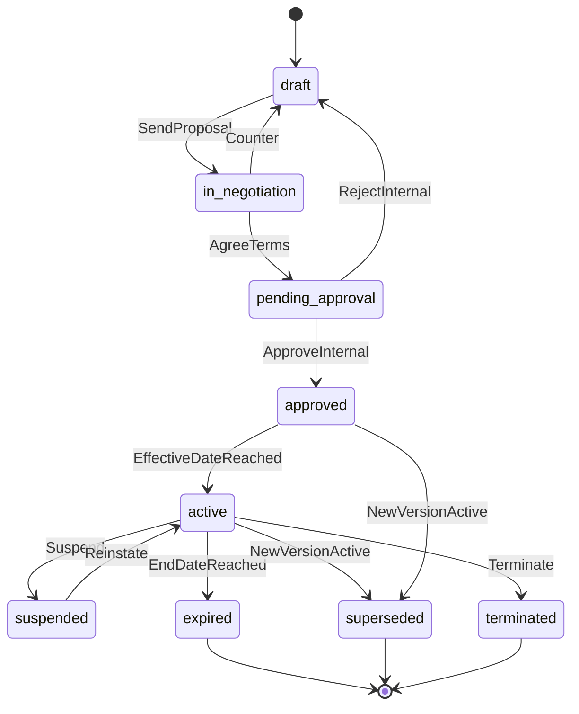
```mermaid
stateDiagram-v2
    [*] --> draft
    draft --> in_negotiation : SendProposal
    in_negotiation --> draft : Counter
    in_negotiation --> pending_approval : AgreeTerms
    pending_approval --> approved : ApproveInternal
    pending_approval --> draft : RejectInternal
    approved --> active : EffectiveDateReached
    active --> suspended : Suspend
    suspended --> active : Reinstate
    active --> expired : EndDateReached
    active --> superseded : NewVersionActive
    approved --> superseded : NewVersionActive
    expired --> [*]
    superseded --> [*]
    active --> terminated : Terminate
    terminated --> [*]
```

| # | From | Event / command | Guard | To | Actor | Side effects / events | Idempotency key |
|---|---|---|---|---|---|---|---|
| 1 | draft | `SendProposal` | rates ≥ floor or approval flag; tax treatment from rule pack | in_negotiation | sales_manager | proposal document v-n; `AgreementProposed` | agreement_id+version |
| 2 | in_negotiation | `AgreeTerms` | signed by corporate signatory (SM-Signature) | pending_approval | corporate_admin | — | agreement_id+version |
| 3 | pending_approval | `ApproveInternal` | approver ≠ author; discount beyond guardrail → gm | approved | revenue_manager, gm | `AgreementApproved` | agreement_id+version |
| 4 | approved | `EffectiveDateReached` | business date ≥ valid_from | active | scheduler | rate plans visible to eligible company users; `AgreementActivated` | agreement_id+version |
| 5 | active | `Suspend` | credit breach (M20 AR aging) or dispute | suspended | ar_clerk, financial_controller | new bookings at agreement rate blocked; existing honoured | agreement_id+suspend_seq |
| 6 | active/approved | `NewVersionActive` | new version effective | superseded | scheduler | existing bookings keep their frozen rate | agreement_id+version |

**Exceptions:** X-EXP booking dated after `valid_to` gets public/BAR rate unless renewal active. X-DSP rate dispute → case; no retroactive repricing of confirmed bookings without explicit amendment.
**Terminal:** `expired`, `superseded`, `terminated`.
**Invariants:** INV-CA-1 one `active` version per company per rate scope per date. INV-CA-2 booking stores agreement version id; later versions never reprice it.
**ATs:** AT-G01.1 (contracted rates only), AT-G01.3 (two corporations, different rates).

### 3.3 SM-Event — owner M12 (M09, M16, M10) — phase 3

Record: `event` (group/MICE: function diary entries, room block, BEO, billing).

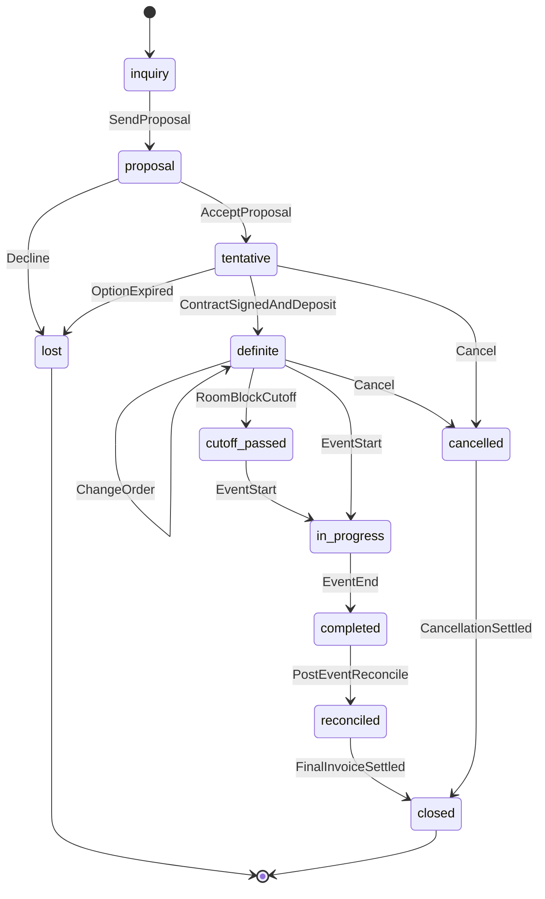
```mermaid
stateDiagram-v2
    [*] --> inquiry
    inquiry --> proposal : SendProposal
    proposal --> tentative : AcceptProposal
    proposal --> lost : Decline
    tentative --> definite : ContractSignedAndDeposit
    tentative --> lost : OptionExpired
    definite --> definite : ChangeOrder
    definite --> cutoff_passed : RoomBlockCutoff
    cutoff_passed --> in_progress : EventStart
    definite --> in_progress : EventStart
    in_progress --> completed : EventEnd
    completed --> reconciled : PostEventReconcile
    reconciled --> closed : FinalInvoiceSettled
    definite --> cancelled : Cancel
    tentative --> cancelled : Cancel
    cancelled --> closed : CancellationSettled
    lost --> [*]
    closed --> [*]
```

| # | From | Event / command | Guard | To | Actor | Side effects / events | Idempotency key |
|---|---|---|---|---|---|---|---|
| 1 | inquiry | `SendProposal` | SM-TimedResourceHold `soft_held` for proposed configuration | proposal | sales_manager | proposal with expiry; `EventProposed` | event_id+proposal_v |
| 2 | proposal | `AcceptProposal` | within proposal expiry | tentative | event_organizer, corporate_approver | composite hold firmed pending deposit | event_id+accept |
| 3 | tentative | `ContractSignedAndDeposit` | SM-Signature signed; deposit captured or corporate PO accepted; credit check | definite | sales_manager, system | SM-TimedResourceHold `committed`; BEO v1 (SM-BEORevision `draft`); master folio + individual folios per billing instructions; `EventDefinite` | event_id+definite |
| 4 | definite | `ChangeOrder` | feasibility on delta; price delta approved | definite | sales_manager, event_organizer | change order no.; BEO revision; `EventChangeOrdered` | event_id+change_order_no |
| 5 | definite | `RoomBlockCutoff` | cutoff date | cutoff_passed | scheduler | unpicked rooms released to general inventory; attrition calc; `RoomBlockReleased` | event_id+cutoff |
| 6 | in_progress | `EventEnd` | — | completed | catering_manager | actual covers, bar consumption, parking sessions posted | event_id+end |
| 7 | completed | `PostEventReconcile` | actual vs contracted vs guaranteed covers; BEO final | reconciled | catering_manager, ar_clerk | invoice lines per guarantee rule; AR | event_id+reconcile |

**Exceptions:** X-REV cancellation → per-contract cancellation schedule; deposit refund via SM-PSPPayment refund; components released. X-DSP organizer disputes invoice → AR hold; SM-Complaint. X-TMO deposit not received by option date → `lost`/released. X-OUT POS offline during event → queued checks post with source refs.
**Terminal:** `lost`, `closed`.
**Invariants:** INV-EV-1 event revenue billed from reconciled actuals with guarantee rule, each source line once. INV-EV-2 room block pickup ≤ block; pickup counted in SM-Booking group.
**ATs:** AT-G02.1, AT-G02.2, AT-G03.3, AT-G20.10.

### 3.4 SM-BEORevision — owner M12 (M16, M13, M14) — phase 3

Record: `beo_version` (menus, covers, allergens, timings, bar package, room layout, AV).

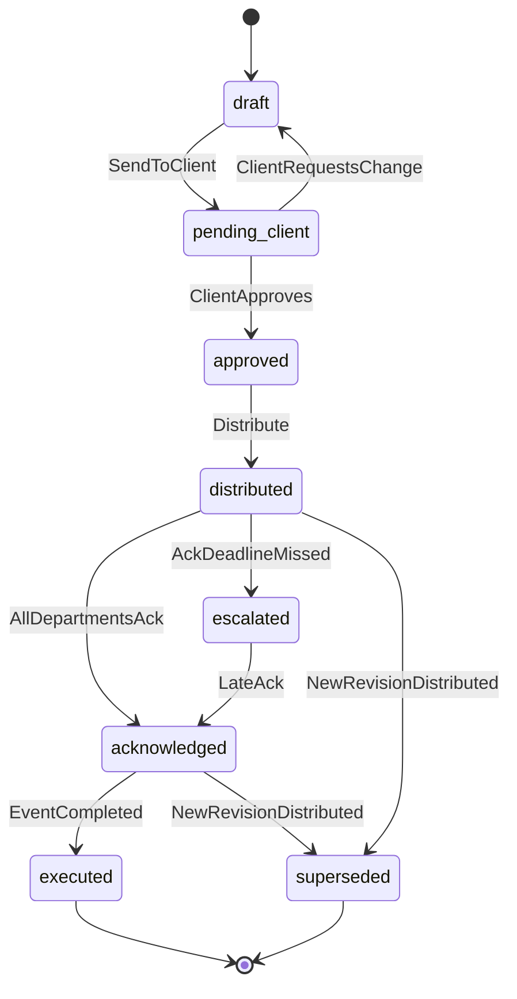
```mermaid
stateDiagram-v2
    [*] --> draft
    draft --> pending_client : SendToClient
    pending_client --> draft : ClientRequestsChange
    pending_client --> approved : ClientApproves
    approved --> distributed : Distribute
    distributed --> acknowledged : AllDepartmentsAck
    distributed --> escalated : AckDeadlineMissed
    escalated --> acknowledged : LateAck
    acknowledged --> superseded : NewRevisionDistributed
    distributed --> superseded : NewRevisionDistributed
    acknowledged --> executed : EventCompleted
    executed --> [*]
    superseded --> [*]
```

| # | From | Event / command | Guard | To | Actor | Side effects / events | Idempotency key |
|---|---|---|---|---|---|---|---|
| 1 | draft | `SendToClient` | recipe allergens resolved (M57); guarantee cutoff not passed or change fee flagged | pending_client | catering_manager | `BEOSentForApproval` | beo_id+rev |
| 2 | pending_client | `ClientApproves` | authorized organizer | approved | event_organizer | `BEOApproved` | beo_id+rev |
| 3 | approved | `Distribute` | — | distributed | catering_manager | kitchen production plan, bar par, store reservations (SM-StockQuantity `reserved`), chef coverage need (SM-ChefCoverage), diff vs prior rev highlighted; `BEORevisionDistributed` | beo_id+rev |
| 4 | distributed | `AllDepartmentsAck` | kitchen, bar, banquet, AV, housekeeping ack | acknowledged | executive_chef, fnb_manager, … | — | beo_id+rev+dept |
| 5 | distributed | `AckDeadlineMissed` | deadline | escalated | workflow_worker | notify catering_manager/duty_manager | beo_id+rev |
| 6 | * | `NewRevisionDistributed` | rev+1 approved | superseded | system | previous stock reservations adjusted by delta (not re-created) | beo_id+rev+1 |

**Exceptions:** X-OFF kitchen display offline shows last acknowledged revision with a stale banner; offline ack replays but cannot ack a superseded revision. X-DUP ack idempotent per dept.
**Terminal:** `executed`, `superseded`.
**Invariants:** INV-BEO-1 exactly one current revision; kitchen/bar always see the latest distributed revision and the diff. INV-BEO-2 allergen change requires chef acknowledgment before execution.
**ATs:** AT-G02.3 (revisions propagate to kitchen and bar), AT-G15.3 (handover of BEO/allergens).

### 3.5 SM-POSCheck — owner M13 (M08, M14) — phase 3

Record: `pos_check` (table/tab/room-service order).

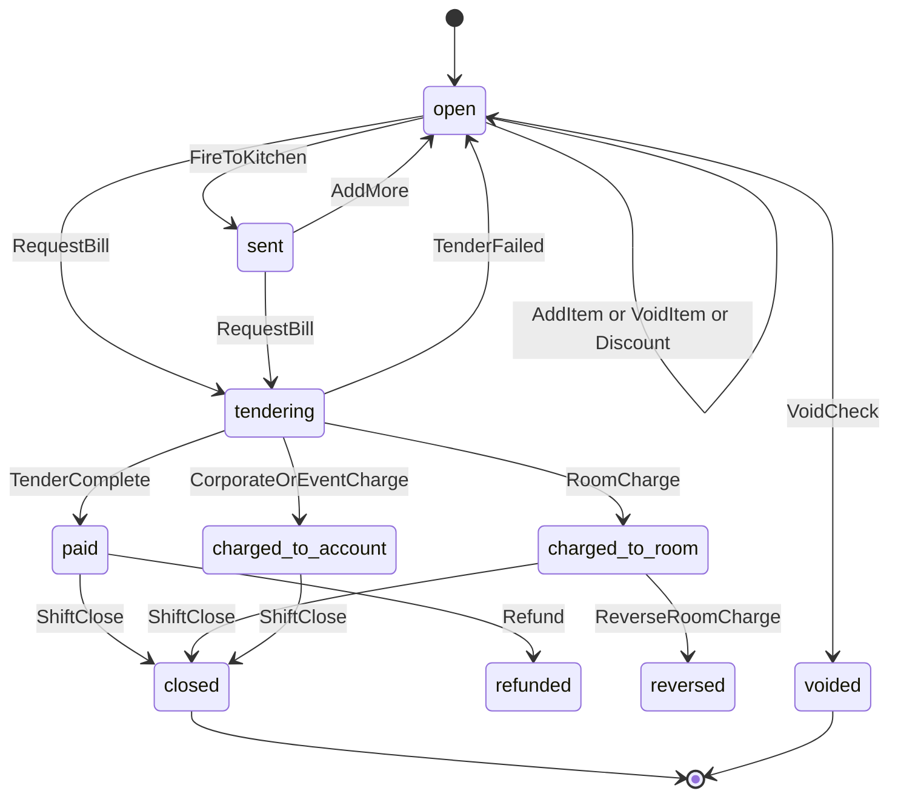
```mermaid
stateDiagram-v2
    [*] --> open
    open --> open : AddItem or VoidItem or Discount
    open --> sent : FireToKitchen
    sent --> open : AddMore
    open --> tendering : RequestBill
    sent --> tendering : RequestBill
    tendering --> paid : TenderComplete
    tendering --> charged_to_room : RoomCharge
    tendering --> charged_to_account : CorporateOrEventCharge
    tendering --> open : TenderFailed
    open --> voided : VoidCheck
    paid --> refunded : Refund
    charged_to_room --> reversed : ReverseRoomCharge
    paid --> closed : ShiftClose
    charged_to_room --> closed : ShiftClose
    charged_to_account --> closed : ShiftClose
    closed --> [*]
    voided --> [*]
```

| # | From | Event / command | Guard | To | Actor | Side effects / events | Idempotency key |
|---|---|---|---|---|---|---|---|
| 1 | open | `AddItem` | item on active menu; age/licensing gate (M57) | open | server, bartender | theoretical depletion reserved | check_id+line_uuid |
| 2 | open | `VoidItem` / `Discount` / `Comp` | above limit → manager PIN/step-up | open | server, fnb_manager | M60 outlier signal | check_id+line_uuid+op |
| 3 | open | `FireToKitchen` | — | sent | server | KDS ticket; `CheckFired` | check_id+fire_seq |
| 4 | tendering | `RoomCharge` | guest in_house; posting allowed on folio window; name/room verified | charged_to_room | server, cashier | SM-Folio `PostCharge` with `source_ref=check_id` | check_id |
| 5 | tendering | `TenderComplete` | Σ tenders = total (+tips); card via SM-PSPPayment | paid | cashier | stock depletion (theoretical) posted; tips ledger; `CheckPaid` | check_id |
| 6 | paid | `Refund` | approval | refunded | fnb_manager | SM-PSPPayment refund; points reversal | check_id+refund_seq |
| 7 | paid/charged | `ShiftClose` | SM-CashierShift closing | closed | cashier | revenue to GL via audit | shift_id |

**Exceptions:** X-OFF outlet offline: local queue with sequential local check ids; card payments via terminal offline mode only if PSP permits (flag `offline_auth_risk`); room charges queued and validated on reconnect — if guest checked out meanwhile → late-charge case (never lost). X-DUP room-charge replay deduped by check_id. X-TMO card terminal no response → check stays `tendering` with `payment_pending_unknown`; inquiry to PSP before re-tender (G-INV-02).
**Terminal:** `closed`, `voided`, `refunded`, `reversed`.
**Invariants:** INV-POS-1 every sold item depletes theoretical stock exactly once; void before fire restores reservation, void after fire records waste (SM-StoreIssue waste) not restock. INV-POS-2 a check posts to a folio once.
**ATs:** AT-G03.2, AT-G03.4 (bar sales deplete stock), AT-G20.9 (network outage).

### 3.6 SM-GiftVoucher — owner M54 (M08, M19) — phase 3–4

Record: `voucher` with append-only `voucher_ledger` (issue, redeem, partial, expire, refund).

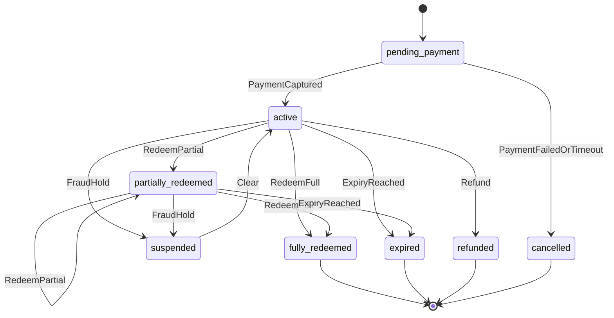
```mermaid
stateDiagram-v2
    [*] --> pending_payment
    pending_payment --> active : PaymentCaptured
    pending_payment --> cancelled : PaymentFailedOrTimeout
    active --> partially_redeemed : RedeemPartial
    partially_redeemed --> partially_redeemed : RedeemPartial
    active --> fully_redeemed : RedeemFull
    partially_redeemed --> fully_redeemed : RedeemFull
    active --> suspended : FraudHold
    partially_redeemed --> suspended : FraudHold
    suspended --> active : Clear
    active --> expired : ExpiryReached
    partially_redeemed --> expired : ExpiryReached
    active --> refunded : Refund
    fully_redeemed --> [*]
    expired --> [*]
    refunded --> [*]
    cancelled --> [*]
```

| # | From | Event / command | Guard | To | Actor | Side effects / events | Idempotency key |
|---|---|---|---|---|---|---|---|
| 1 | — | `IssueVoucher` | jurisdiction rule pack for vouchers verified (expiry/tax); amount ≤ cap | pending_payment | guest, guest_relations | code generated (unguessable, hashed at rest) | idem |
| 2 | pending_payment | `PaymentCaptured` | SM-PSPPayment captured | active | payment_worker | liability GL (deferred revenue); `VoucherIssued` | payment_id |
| 3 | active | `Redeem` | code+PIN or bound account; within validity; eligible outlet; balance ≥ amount | partially/fully_redeemed | cashier, server | folio/POS tender; liability→revenue; `VoucherRedeemed` | voucher_id+redemption_ref |
| 4 | active | `ExpiryReached` | expiry per rule pack (some markets restrict expiry) | expired | scheduler | breakage per accounting policy; `VoucherExpired` | voucher_id+expire |
| 5 | active | `Refund` | policy; unredeemed only | refunded | guest_relations + finance_approver | PSP refund; liability reversed | voucher_id+refund |
| 6 | any live | `FraudHold` | velocity/brute-force detection | suspended | risk_worker | redemptions blocked | voucher_id+hold_seq |

**Exceptions:** X-DUP redemption replay by redemption_ref. X-REV folio refund of a voucher-paid charge re-credits voucher balance (not cash) exactly once. X-DSP chargeback on purchase → suspend + case. X-OFF offline redemption disallowed (balance authority is server).
**Terminal:** `fully_redeemed`, `expired`, `refunded`, `cancelled`.
**Invariants:** INV-GV-1 balance = Σ ledger ≥ 0. INV-GV-2 voucher is not a cash wallet: no cash-out, no P2P transfer unless rule pack + legal review allow.
**ATs:** AT-G19.5, AT-G07.3.

### 3.7 SM-ParkingSession — owner M17 (M08) — phase 3

Record: `parking_permit` (guest/corporate/staff/event pass) and `parking_session` (entry→exit).

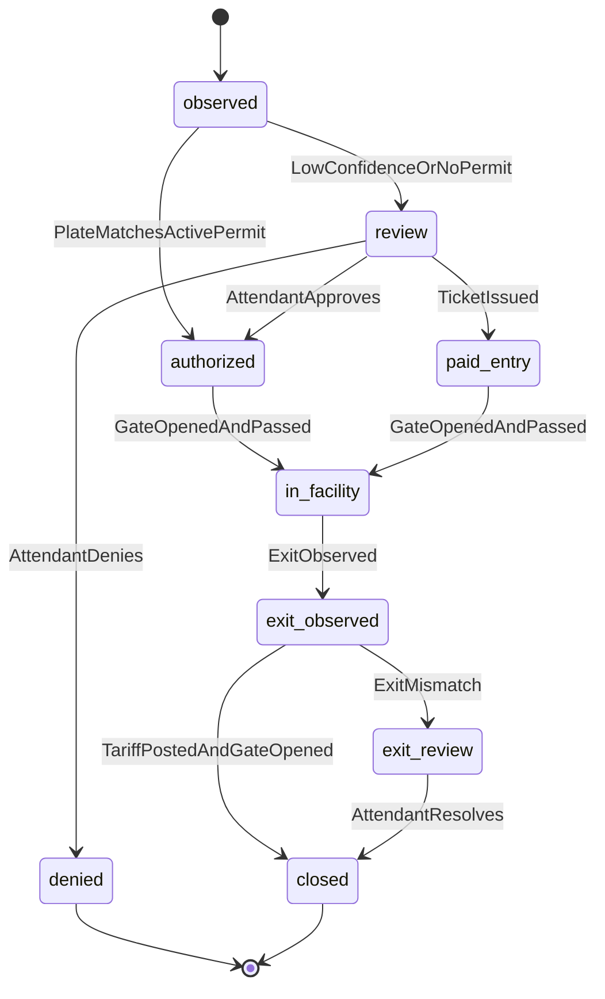
```mermaid
stateDiagram-v2
    [*] --> observed
    observed --> authorized : PlateMatchesActivePermit
    observed --> review : LowConfidenceOrNoPermit
    review --> authorized : AttendantApproves
    review --> denied : AttendantDenies
    review --> paid_entry : TicketIssued
    authorized --> in_facility : GateOpenedAndPassed
    paid_entry --> in_facility : GateOpenedAndPassed
    in_facility --> exit_observed : ExitObserved
    exit_observed --> closed : TariffPostedAndGateOpened
    exit_observed --> exit_review : ExitMismatch
    exit_review --> closed : AttendantResolves
    denied --> [*]
    closed --> [*]
```

| # | From | Event / command | Guard | To | Actor | Side effects / events | Idempotency key |
|---|---|---|---|---|---|---|---|
| 1 | — | `PlateObserved` | signed adapter message; camera/LPR in device registry | observed | adapter:lpr | observation with confidence, image pointer (retention-limited) | evt (device_id+observation_id) |
| 2 | observed | `PlateMatchesActivePermit` | confidence ≥ threshold; permit active for date/zone; zone capacity > 0 | authorized | parking_worker | gate open command; capacity −1; `ParkingEntryAuthorized` | observation_id |
| 3 | observed | `LowConfidenceOrNoPermit` | else | review | parking_worker | attendant queue | observation_id |
| 4 | review | `AttendantApproves` / `Denies` / `TicketIssued` | attendant on shift; reason | authorized/denied/paid_entry | parking_attendant | audited override; `GateOverride` | observation_id+decision |
| 5 | exit_observed | `TariffPostedAndGateOpened` | tariff computed; free entitlement or post to folio / pay at lane | closed | parking_worker | SM-Folio `PostCharge source_ref=session_id` **once**; capacity +1 | session_id |

**Exceptions:** X-OUT LPR/camera or server down → manual mode: attendant scans permit QR or enters plate; gate manual override audited; sessions reconciled later against observations. X-DUP duplicate observations within dedup window collapse to one session. X-OFF gate controller offline → local allow-list cache (valid permits, TTL) and local event log replay. X-DSP guest disputes charge → folio reversal via approval. X-TMO session open > max duration → exception queue.
**Terminal:** `closed`, `denied`.
**Invariants:** INV-PK-1 one open session per plate per facility. INV-PK-2 each session posts at most one tariff charge. INV-PK-3 occupancy ≤ capacity except audited override. INV-PK-4 plate images deleted per retention rule pack.
**ATs:** AT-G03.1 (camera/LPR authorizes vehicle), AT-G03.2 (charges post once), AT-G20.9.

---

## 4. Payments, payables, payroll and close

### 4.1 SM-PSPPayment — owner M28 — phase 2 (abstraction) / 5 (certified gateway)

Record: `payment_intent` with `payment_attempt[]`, `refund[]`, `dispute[]`. Tokens only; no PAN/CVV (PCI boundary `docs/07`).

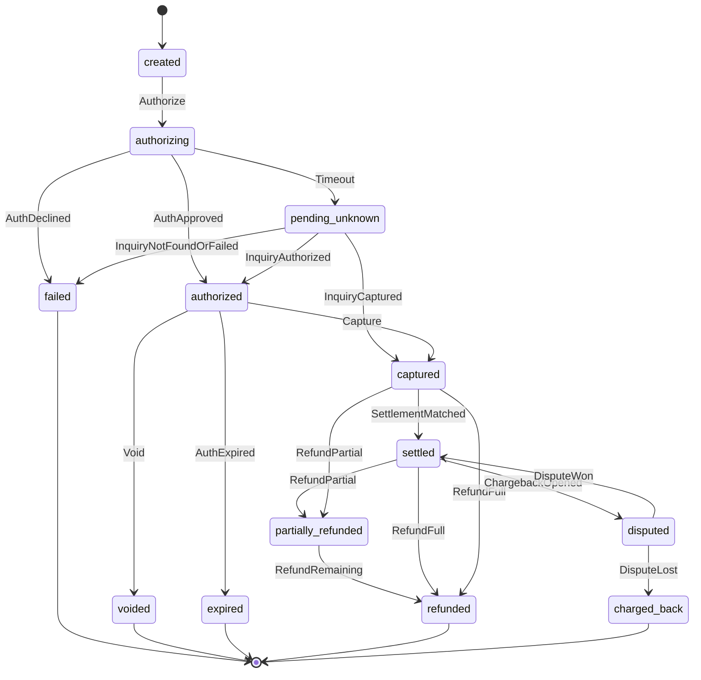
```mermaid
stateDiagram-v2
    [*] --> created
    created --> authorizing : Authorize
    authorizing --> authorized : AuthApproved
    authorizing --> failed : AuthDeclined
    authorizing --> pending_unknown : Timeout
    pending_unknown --> authorized : InquiryAuthorized
    pending_unknown --> captured : InquiryCaptured
    pending_unknown --> failed : InquiryNotFoundOrFailed
    authorized --> captured : Capture
    authorized --> voided : Void
    authorized --> expired : AuthExpired
    captured --> settled : SettlementMatched
    settled --> partially_refunded : RefundPartial
    captured --> partially_refunded : RefundPartial
    partially_refunded --> refunded : RefundRemaining
    settled --> refunded : RefundFull
    captured --> refunded : RefundFull
    settled --> disputed : ChargebackOpened
    disputed --> settled : DisputeWon
    disputed --> charged_back : DisputeLost
    failed --> [*]
    voided --> [*]
    expired --> [*]
    refunded --> [*]
    charged_back --> [*]
```

| # | From | Event / command | Guard | To | Actor | Side effects / events | Idempotency key |
|---|---|---|---|---|---|---|---|
| 1 | — | `CreateIntent` | amount>0 minor units; currency; target (folio/voucher/AR/event deposit); PSP `certified` or sandbox in non-prod | created | system, cashier, guest | `PaymentIntentCreated` | idem |
| 2 | created | `Authorize` | tokenized method; 3DS/SCA per PSP; fraud check | authorizing | payment_worker | provider call with **provider idempotency key = attempt_id** | intent_id+attempt_no |
| 3 | authorizing | `AuthApproved` (sync or signed webhook) | signature valid; amount/currency match | authorized | adapter:psp | `PaymentAuthorized` | evt / provider_txn_id |
| 4 | authorizing | `Timeout` | no response within SLA | pending_unknown | payment_worker | schedule inquiry (backoff); UI "confirming" not "failed"; `PaymentStatusUnknown` | intent_id+attempt_no |
| 5 | pending_unknown | `Inquiry*` | provider inquiry result or webhook | authorized / captured / failed | payment_worker | only `InquiryNotFoundOrFailed` permits a **new attempt** (G-INV-02) | provider_txn_id |
| 6 | authorized | `Capture` | ≤ authorized amount; within auth validity | captured | system (checkout), cashier | SM-Folio `PostPayment`; `PaymentCaptured` | intent_id+capture_seq |
| 7 | captured | `SettlementMatched` | settlement file line matched (amount, fee, date) | settled | recon_worker | fee GL, bank clearing; `PaymentSettled` | settlement_line_id |
| 8 | captured/settled | `Refund` | ≤ captured − refunded; approval by limit; refunder ≠ original cashier above threshold | partially_refunded / refunded | cashier + front_office_manager | SM-Folio reversal line; points reversal (SM-PointsEntry), commission reversal (SM-ReferralCommission) **once**; `PaymentRefunded` | intent_id+refund_request_id |
| 9 | settled | `ChargebackOpened` | signed notice | disputed | adapter:psp | evidence case M60/M20; freeze related commission payout; `ChargebackOpened` | evt |
| 10 | disputed | `DisputeLost` | — | charged_back | adapter:psp | reversing entries like refund (exactly once) | evt |

**Exceptions:** X-TMO → `pending_unknown` (never auto-fail, never re-charge without inquiry). X-DUP webhook replay → inbox dedup on `evt`; out-of-order webhook (captured before authorized) applied by monotonic status rank. X-OUT PSP down → pay-by-link later / cash / corporate credit as manual path; booking guarantee policy decides. X-REV refund timeout → refund `pending_unknown` with inquiry; no second refund. X-OFF terminal offline auth → stored with `offline_risk` flag, uploaded on reconnect, reconciled.
**Terminal:** `failed`, `voided`, `expired`, `refunded`, `charged_back`, (`settled` is stable-but-refundable).
**Invariants:** INV-PY-1 Σ captured − Σ refunded ≥ 0 per intent. INV-PY-2 at most one successful capture per capture_seq; one refund per refund_request_id. INV-PY-3 status monotonic by rank except explicit refund/dispute transitions. INV-PY-4 folio/GL posted only from `captured`/`settled`, never from `authorizing`/`pending_unknown`.
**ATs:** AT-G06.1, AT-G06.2 (payment replay/failure), AT-G07.2, AT-G20.2 (duplicate payment webhook).

### 4.2 SM-BillProviderOrder — owner M29 (M28, M20) — phase 5

Record: `bill_payment_order` (provider-neutral `inquire → quote → authorize → pay → status → reverse → receipt → settlement`). Khedmah/ONEIC are candidate adapters; without contract+sandbox the capability flag is `blocked` and only the manual/bank path exists.

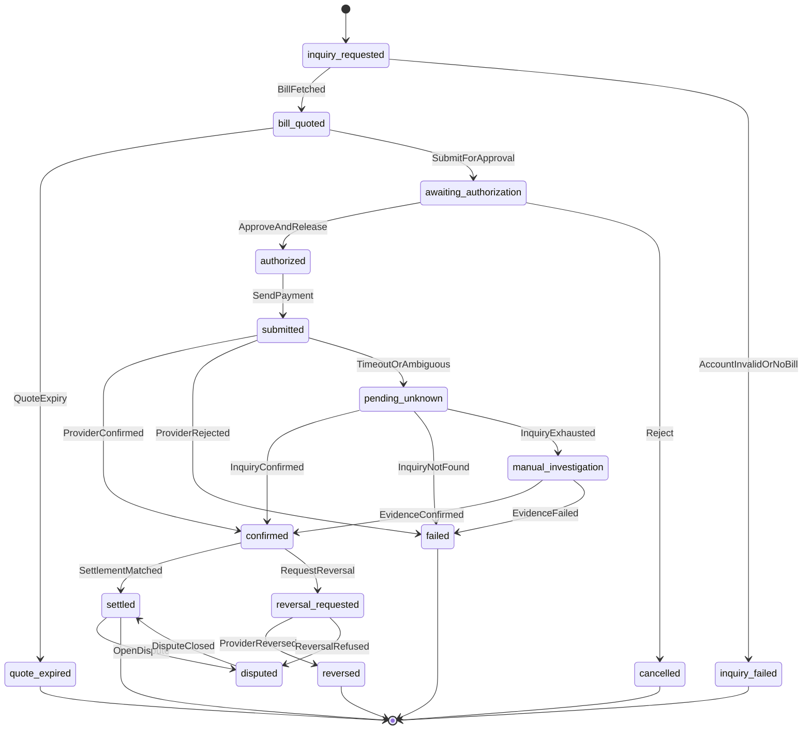
```mermaid
stateDiagram-v2
    [*] --> inquiry_requested
    inquiry_requested --> bill_quoted : BillFetched
    inquiry_requested --> inquiry_failed : AccountInvalidOrNoBill
    bill_quoted --> quote_expired : QuoteExpiry
    bill_quoted --> awaiting_authorization : SubmitForApproval
    awaiting_authorization --> authorized : ApproveAndRelease
    awaiting_authorization --> cancelled : Reject
    authorized --> submitted : SendPayment
    submitted --> confirmed : ProviderConfirmed
    submitted --> failed : ProviderRejected
    submitted --> pending_unknown : TimeoutOrAmbiguous
    pending_unknown --> confirmed : InquiryConfirmed
    pending_unknown --> failed : InquiryNotFound
    pending_unknown --> manual_investigation : InquiryExhausted
    manual_investigation --> confirmed : EvidenceConfirmed
    manual_investigation --> failed : EvidenceFailed
    confirmed --> settled : SettlementMatched
    confirmed --> reversal_requested : RequestReversal
    reversal_requested --> reversed : ProviderReversed
    reversal_requested --> disputed : ReversalRefused
    settled --> disputed : OpenDispute
    disputed --> settled : DisputeClosed
    failed --> [*]
    settled --> [*]
    reversed --> [*]
    cancelled --> [*]
    quote_expired --> [*]
    inquiry_failed --> [*]
```

| # | From | Event / command | Guard | To | Actor | Side effects / events | Idempotency key |
|---|---|---|---|---|---|---|---|
| 1 | — | `InquireBill` | provider capability `inquiry` ≠ blocked; biller in allowed list; account registered & validated (SF29.1.2); permission scope = hotel operating bill vs guest bill | inquiry_requested | ap_clerk, billpay_worker | provider inquiry | provider+biller+account+period |
| 2 | inquiry_requested | `BillFetched` | amount, due date, fee, quote expiry returned | bill_quoted | adapter:billpay | links to SM-UtilityBill; `BillQuoted` | provider_inquiry_ref |
| 3 | bill_quoted | `SubmitForApproval` | amount = approved payable (SM-UtilityBill `approved`) within tolerance | awaiting_authorization | ap_clerk | — | order_id |
| 4 | awaiting_authorization | `ApproveAndRelease` | finance_approver approval + payment_releaser step-up MFA; releaser ≠ approver ≠ maker; quote not expired | authorized | finance_approver, payment_releaser | — | order_id+release |
| 5 | authorized | `SendPayment` | exactly one open attempt | submitted | billpay_worker | provider pay call with provider idem = order_id+attempt_no | order_id+attempt_no |
| 6 | submitted | `TimeoutOrAmbiguous` | no/ambiguous response | pending_unknown | billpay_worker | inquiry schedule; AP shows "pending, do not repay"; `BillPaymentStatusChanged` | order_id+attempt_no |
| 7 | pending_unknown | `InquiryConfirmed` / signed callback | receipt no. | confirmed | adapter:billpay | AP payable → `paid_pending_settlement`; `BillPaymentStatusChanged` | evt / provider_receipt_no |
| 8 | pending_unknown | `InquiryNotFound` | provider definitively has no record | failed | billpay_worker | a new attempt (attempt_no+1, same order id) is allowed under the existing approval only while the bill quote is unexpired and amount unchanged; otherwise re-inquiry and re-approval are required | order_id+attempt_no |
| 9 | pending_unknown | `InquiryExhausted` | N inquiries ambiguous or provider outage > T | manual_investigation | billpay_worker | exception queue owner ap_clerk; `BillPaymentReconciliationNeeded` | order_id |
| 10 | confirmed | `SettlementMatched` | provider settlement line + bank line + gateway (if any) match | settled | recon_worker | GL: AP debit / bank credit, fees; SM-UtilityBill `paid` | settlement_line_id |
| 11 | confirmed | `RequestReversal` | provider capability `reverse` | reversal_requested | finance_approver | — | order_id+reversal |

**Exceptions:** X-TMO → `pending_unknown` (G-INV-01). X-DUP duplicate callbacks → one status change; "exactly one payable settled" (SF29.1.7 acceptance). X-OUT provider/biller outage → circuit open; order stays `authorized` (not sent) or `pending_unknown`; manual bank payment path requires *first* cancelling the provider order with inquiry proof of non-payment, to avoid double payment. X-GATE capability `blocked` (no contract) → `InquireBill` unavailable; UI shows "Khedmah/ONEIC: blocked — external dependency; use bank transfer workflow" (SM-APInvoice). X-DSP provider says paid, biller says unpaid → `disputed` with evidence.
**Terminal:** `settled`, `reversed`, `failed`, `cancelled`, `quote_expired`, `inquiry_failed`.
**Invariants:** INV-BP-1 at most one attempt in {submitted, pending_unknown} per order. INV-BP-2 gateway charge success alone never implies provider `confirmed` (cross-utility guard). INV-BP-3 each utility bill id has at most one `confirmed` bill order unless the prior is `reversed`.
**ATs:** AT-G06.3 (bill inquiry/pay/reconcile or blocked marking), AT-G06.4 (timeout + duplicate callback → exactly one payable settled), AT-G20.2.

### 4.3 SM-UtilityBill — owner M22/M23/M24 (M20) — phase 4–5

Record: `utility_bill` (electricity, water, pipeline gas; meter-linked).

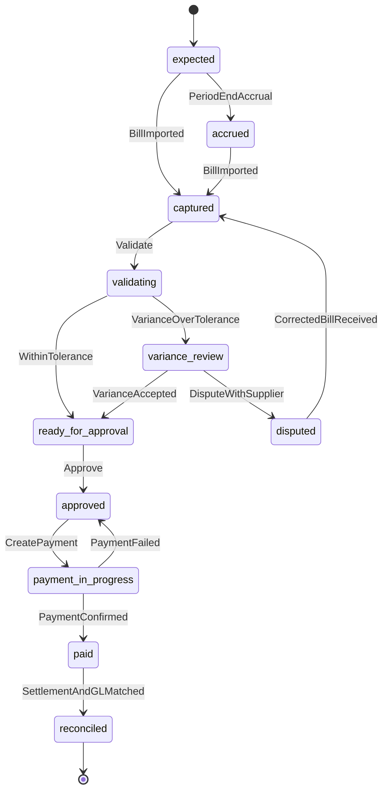
```mermaid
stateDiagram-v2
    [*] --> expected
    expected --> accrued : PeriodEndAccrual
    expected --> captured : BillImported
    accrued --> captured : BillImported
    captured --> validating : Validate
    validating --> variance_review : VarianceOverTolerance
    validating --> ready_for_approval : WithinTolerance
    variance_review --> ready_for_approval : VarianceAccepted
    variance_review --> disputed : DisputeWithSupplier
    disputed --> captured : CorrectedBillReceived
    ready_for_approval --> approved : Approve
    approved --> payment_in_progress : CreatePayment
    payment_in_progress --> paid : PaymentConfirmed
    payment_in_progress --> approved : PaymentFailed
    paid --> reconciled : SettlementAndGLMatched
    reconciled --> [*]
```

| # | From | Event / command | Guard | To | Actor | Side effects / events | Idempotency key |
|---|---|---|---|---|---|---|---|
| 1 | expected | `PeriodEndAccrual` | no bill by period close | accrued | accrual_worker | estimate from meter × tariff version, labelled `estimate`; GL accrual | account+period |
| 2 | expected/accrued | `BillImported` | PDF/OCR/CSV/provider inquiry; supplier account recognized | captured | ap_clerk, billpay_worker | duplicate check on (supplier, account, bill_no, period) | supplier+account+bill_no |
| 3 | captured | `Validate` | meter usage for period (gaps/resets flagged), tariff version, tax | validating | system | kWh/m³ vs bill variance | bill_id+validate_v |
| 4 | variance_review | `VarianceAccepted` | reason; chief_engineer/finance | ready_for_approval | chief_engineer, finance_clerk | leak/anomaly → work order (M26) | bill_id+decision |
| 5 | ready_for_approval | `Approve` | budget/cost center; approver limit | approved | finance_approver | payable created (SM-APInvoice `approved`); allocation per driver version | bill_id+approve |
| 6 | approved | `CreatePayment` | route: bill provider (SM-BillProviderOrder) if capability live, else bank batch (SM-APInvoice payment) | payment_in_progress | ap_clerk | — | bill_id+route |
| 7 | payment_in_progress | `PaymentConfirmed` | provider confirmation or bank confirmation | paid | system | accrual reversal; `UtilityBillPaid` | payment_ref |

**Exceptions:** X-TMO → inherits `pending_unknown` from payment SM; bill stays `payment_in_progress`. X-DUP repeated invoice → blocked by unique key → `DuplicateInvoiceSuspected` case (AT-G20.6). Missed meter interval → validation uses flagged estimate; bill cannot be `reconciled` as actual consumption until meter gap resolved or accepted (AT-G20.5). X-DSP mismatch → `disputed`; late-fee risk shown with due date.
**Terminal:** `reconciled`.
**Invariants:** INV-UB-1 one bill per (supplier, account, bill_no). INV-UB-2 accrual reversed exactly once when actual posts. INV-UB-3 allocation driver version recorded on each allocation journal.
**ATs:** AT-G04.3, AT-G06.3, AT-G08.3, AT-G20.5, AT-G20.6.

### 4.4 SM-APInvoice — owner M20 (M19, M21) — phase 4

Record: `supplier_invoice` + `payment_batch_line`.

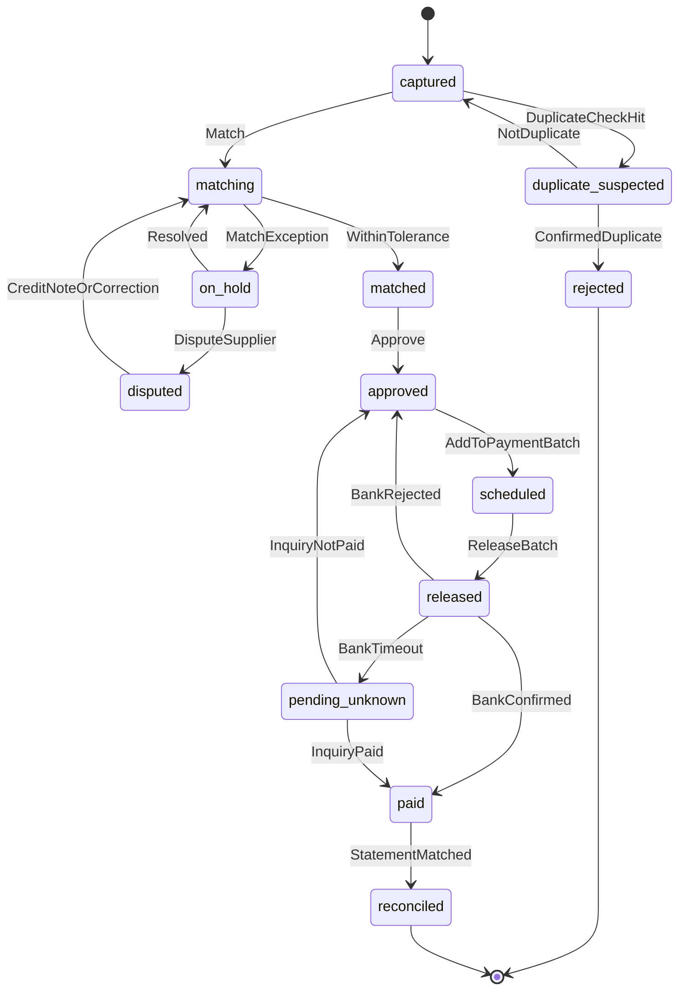
```mermaid
stateDiagram-v2
    [*] --> captured
    captured --> duplicate_suspected : DuplicateCheckHit
    duplicate_suspected --> captured : NotDuplicate
    duplicate_suspected --> rejected : ConfirmedDuplicate
    captured --> matching : Match
    matching --> matched : WithinTolerance
    matching --> on_hold : MatchException
    on_hold --> matching : Resolved
    on_hold --> disputed : DisputeSupplier
    disputed --> matching : CreditNoteOrCorrection
    matched --> approved : Approve
    approved --> scheduled : AddToPaymentBatch
    scheduled --> released : ReleaseBatch
    released --> paid : BankConfirmed
    released --> pending_unknown : BankTimeout
    pending_unknown --> paid : InquiryPaid
    pending_unknown --> approved : InquiryNotPaid
    released --> approved : BankRejected
    paid --> reconciled : StatementMatched
    rejected --> [*]
    reconciled --> [*]
```

| # | From | Event / command | Guard | To | Actor | Side effects / events | Idempotency key |
|---|---|---|---|---|---|---|---|
| 1 | — | `CaptureInvoice` | supplier `approved` (SM-VendorRegistration); OCR/EDI/manual | captured | ap_clerk, vendor_user | raw evidence stored | supplier_id+invoice_no+invoice_date |
| 2 | captured | `DuplicateCheckHit` | fuzzy match (amount, date, supplier, PO) | duplicate_suspected | system | M60 case | invoice_id |
| 3 | captured | `Match` | PO (SM-PurchaseOrder) + GRN/service acceptance (SM-GRN `accepted`) for 3-way; 2-way for services/utilities | matching | system | — | invoice_id+match_v |
| 4 | matching | `WithinTolerance` | qty ≤ accepted qty not yet invoiced; price within tolerance | matched | system | GRNI cleared; `InvoiceMatched` | invoice_id |
| 5 | matched | `Approve` | budget; approver ≠ requisitioner (SoD) | approved | finance_approver | liability GL; `PayableApproved` | invoice_id+approve |
| 6 | scheduled | `ReleaseBatch` | payment_releaser step-up; releaser ≠ approver; authorized bank/PSP adapter or bank file | released | payment_releaser | bank file / API; `PaymentReleased` | batch_id |
| 7 | released | `BankConfirmed` | bank status/statement | paid | adapter:bank | `SupplierPaid` | bank_ref |

**Exceptions:** X-TMO bank API timeout → `pending_unknown`, inquiry before re-release. X-DUP repeated invoice (AT-G20.6). X-REV supplier credit note → negative payable linked. X-DSP short delivery → `on_hold` until credit note (AT-G20.7). Invoice without accepted GRN can never reach `approved` (SF49.3.7: no payment because PO exists).
**Terminal:** `rejected`, `reconciled`.
**Invariants:** INV-AP-1 Σ invoiced qty ≤ Σ accepted qty per PO line (+tolerance). INV-AP-2 SoD: requisitioner, approver, releaser distinct. INV-AP-3 dashboard separates planned/accrued/invoiced/approved/paid/settled.
**ATs:** AT-G04.2, AT-G10.4, AT-G17.5, AT-G18.4 (three-way match once), AT-G20.6, AT-G20.7.

### 4.5 SM-PayrollRun — owner M27 (M28, M19, M38) — phase 4

Record: `payroll_run` per legal entity × pay period × jurisdiction rule pack (Oman WPS, Canada CPP/EI/QPP/QPIP etc.).

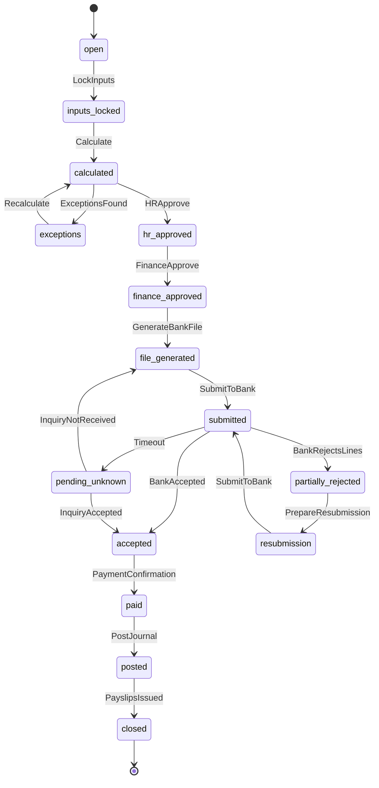
```mermaid
stateDiagram-v2
    [*] --> open
    open --> inputs_locked : LockInputs
    inputs_locked --> calculated : Calculate
    calculated --> exceptions : ExceptionsFound
    exceptions --> calculated : Recalculate
    calculated --> hr_approved : HRApprove
    hr_approved --> finance_approved : FinanceApprove
    finance_approved --> file_generated : GenerateBankFile
    file_generated --> submitted : SubmitToBank
    submitted --> accepted : BankAccepted
    submitted --> pending_unknown : Timeout
    pending_unknown --> accepted : InquiryAccepted
    pending_unknown --> file_generated : InquiryNotReceived
    submitted --> partially_rejected : BankRejectsLines
    partially_rejected --> resubmission : PrepareResubmission
    resubmission --> submitted : SubmitToBank
    accepted --> paid : PaymentConfirmation
    paid --> posted : PostJournal
    posted --> closed : PayslipsIssued
    closed --> [*]
```

| # | From | Event / command | Guard | To | Actor | Side effects / events | Idempotency key |
|---|---|---|---|---|---|---|---|
| 1 | open | `LockInputs` | attendance/overtime/leave approved (M27 time); cutoff | inputs_locked | payroll_officer | snapshot of inputs | run_id+lock |
| 2 | inputs_locked | `Calculate` | payroll rule pack(s) for each employee's jurisdiction `verified`; SIN/ID present (masked) where required | calculated | payroll_worker | gross-to-net per employee; `PayrollCalculated` | run_id+calc_v |
| 3 | calculated | `HRApprove` → `FinanceApprove` | maker-checker; approvers ≠ calculator; confidential views only | finance_approved | hr_officer, payroll_approver | — | run_id+stage |
| 4 | finance_approved | `GenerateBankFile` | WPS/bank format version verified with bank | file_generated | payroll_worker | file hash stored | run_id+file_v |
| 5 | file_generated | `SubmitToBank` | payment_releaser step-up | submitted | payment_releaser | channel: bank API/host-to-host or approved manual upload with receipt | run_id+file_hash |
| 6 | submitted | `BankRejectsLines` | rejection file | partially_rejected | adapter:bank | per-line reason (IBAN/ID mismatch); rejected employees flagged; `PayrollLinesRejected` | evt |
| 7 | partially_rejected | `PrepareResubmission` | corrections approved by maker-checker | resubmission | payroll_officer, payroll_approver | new file containing **only rejected lines** | run_id+resub_seq |
| 8 | paid | `PostJournal` | — | posted | system | salary expense by department/cost center (aggregate only); statutory liabilities; `PayrollPosted` | run_id |

**Exceptions:** X-TMO → `pending_unknown`; inquiry with bank before regenerating (no double salary). X-GATE payroll rule pack unverified (e.g. Pakistan/Saudi) → `Calculate` for that employee group blocked; manual payroll-provider import path. X-REV correction after close → off-cycle run with reversing lines, never edit closed run. X-DUP resubmission file contains only rejected lines (hash check against accepted lines).
**Terminal:** `closed`.
**Invariants:** INV-PR-1 each employee paid at most once per run (accepted lines ∪ resubmitted lines disjoint). INV-PR-2 individual pay visible only to hr/payroll roles; GL/BI get department aggregates (F27.4). INV-PR-3 SIN stored encrypted, masked display, access audited.
**ATs:** AT-G05.1, AT-G05.2 (confidentiality), AT-G12.2 (Canadian payroll), AT-G20.8 (payroll rejection).

### 4.6 SM-CashierShift (cash audit) — owner M60 (M08) — phase 2

Record: `cashier_shift` (till, float, drops, refunds, count).

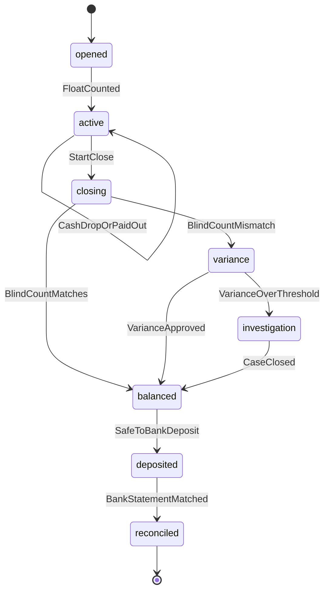
```mermaid
stateDiagram-v2
    [*] --> opened
    opened --> active : FloatCounted
    active --> active : CashDropOrPaidOut
    active --> closing : StartClose
    closing --> balanced : BlindCountMatches
    closing --> variance : BlindCountMismatch
    variance --> balanced : VarianceApproved
    variance --> investigation : VarianceOverThreshold
    investigation --> balanced : CaseClosed
    balanced --> deposited : SafeToBankDeposit
    deposited --> reconciled : BankStatementMatched
    reconciled --> [*]
```

| # | From | Event / command | Guard | To | Actor | Side effects / events | Idempotency key |
|---|---|---|---|---|---|---|---|
| 1 | opened | `FloatCounted` | two-person count if policy | active | cashier, duty_manager | `ShiftOpened` | shift_id |
| 2 | active | `CashDrop` / `PaidOut` / `CashRefund` | refund approval by limit | active | cashier | safe ledger | shift_id+slip_no |
| 3 | closing | `BlindCountSubmitted` | cashier cannot see expected before submitting | balanced / variance | cashier | variance computed server-side | shift_id+count |
| 4 | variance | `VarianceApproved` | ≤ threshold; approver ≠ cashier | balanced | front_office_manager | variance GL | shift_id+approve |
| 5 | variance | `VarianceOverThreshold` | — | investigation | system | M60 case with evidence | shift_id |
| 6 | balanced | `SafeToBankDeposit` | deposit slip | deposited | cashier, finance_clerk | — | deposit_slip_no |

**Exceptions:** X-OFF offline POS cash sales appear after close → post to next shift as late items with link; never reopen silently. X-DUP slips deduped. X-DSP cashier disputes count → recount by second person.
**Terminal:** `reconciled`.
**Invariants:** INV-CS-1 blind count. INV-CS-2 one open shift per cashier per till.
**ATs:** AT-G08.4.

### 4.7 SM-NightAudit — owner M08 (M60, M32) — phase 2

Record: `business_date_close` for property.

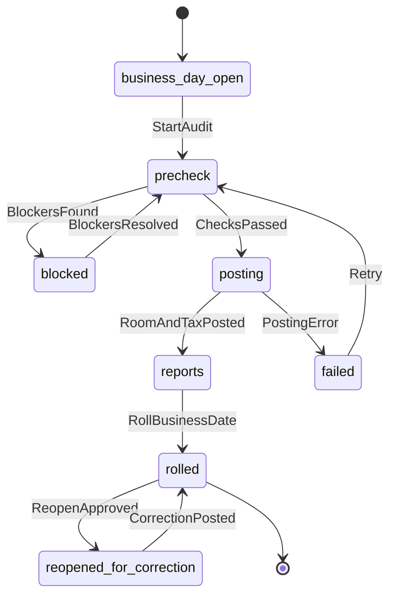
```mermaid
stateDiagram-v2
    [*] --> business_day_open
    business_day_open --> precheck : StartAudit
    precheck --> blocked : BlockersFound
    blocked --> precheck : BlockersResolved
    precheck --> posting : ChecksPassed
    posting --> reports : RoomAndTaxPosted
    reports --> rolled : RollBusinessDate
    posting --> failed : PostingError
    failed --> precheck : Retry
    rolled --> reopened_for_correction : ReopenApproved
    reopened_for_correction --> rolled : CorrectionPosted
    rolled --> [*]
```

| # | From | Event / command | Guard | To | Actor | Side effects / events | Idempotency key |
|---|---|---|---|---|---|---|---|
| 1 | business_day_open | `StartAudit` | after configured time | precheck | night_auditor, night_audit_worker | — | property+business_date |
| 2 | precheck | `BlockersFound` | unbalanced cashier shifts; arrivals not processed (no-show decision); departures not checked out; `pending_unknown` payments listed (non-blocking but reported); POS offline queue not drained; rate discrepancies | blocked | system | difference queue | property+business_date |
| 3 | precheck | `ChecksPassed` | blockers resolved or overridden with reason by front_office_manager | posting | night_auditor | — | property+business_date |
| 4 | posting | `RoomAndTaxPosted` | each in_house stay | reports | night_audit_worker | room+tax charges with `source_ref=stay_id+business_date` (idempotent); no-shows (SM-Booking) | stay_id+business_date |
| 5 | reports | `RollBusinessDate` | reports generated (occupancy, ADR, RevPAR, TRevPAR, cash, AR) with `estimate` flags where sources missing | rolled | night_audit_worker | business date +1; GL batch; `BusinessDateRolled` | property+business_date |
| 6 | rolled | `ReopenApproved` | accounting period open; financial_controller | reopened_for_correction | financial_controller | corrections as reversing entries dated original business date | property+business_date+reopen_seq |

**Exceptions:** X-TMO worker crash mid-posting → resume; room charge idempotency key prevents double post. X-OUT cloud unreachable (on-prem profile continues; SaaS: local cache only reads) → night audit deferred, business date not rolled, flagged to gm. X-OFF late offline postings land on next business date with original timestamp reference.
**Terminal:** `rolled` (per date).
**Invariants:** INV-NA-1 room revenue for a stay-night posted exactly once. INV-NA-2 business date rolls monotonically; reopen does not roll back date.
**ATs:** AT-G08.1, AT-G08.2, AT-G20.9.

---

## 5. Loyalty and referral

### 5.1 SM-PointsEntry — owner M30 — phase 5

Record: append-only `points_ledger_entry` (earn, redeem, expire, reverse, adjust) on a closed-loop non-cash account. Balances (`pending`, `available`, `expired`) are derived.

```mermaid
stateDiagram-v2
    [*] --> pending
    pending --> available : QualifyingEventCompleted
    pending --> reversed : SourceCancelledOrRefunded
    available --> redeemed_hold : RedeemRequest
    redeemed_hold --> redeemed : RedemptionCommitted
    redeemed_hold --> available : RedemptionAborted
    available --> expired : ExpiryReached
    available --> reversed : SourceRefundedAfterAvailable
    redeemed --> restored : RedemptionRefunded
    pending --> fraud_review : VelocityFlag
    fraud_review --> pending : Cleared
    fraud_review --> reversed : Confirmed
    reversed --> [*]
    expired --> [*]
    redeemed --> [*]
    restored --> [*]
```

| # | From | Event / command | Guard | To | Actor | Side effects / events | Idempotency key |
|---|---|---|---|---|---|---|---|
| 1 | — | `EarnPoints` | member enrolled with consent; source eligible (room/F&B/catering/club per F30.1.1); campaign version active; caps | pending | points_worker (on `CheckPaid`, `GuestCheckedOut`, `PaymentCaptured`) | liability estimate; `PointsEarned` | **source_type+source_txn_id+rule_version** |
| 2 | pending | `QualifyingEventCompleted` | stay checked out / payment settled / refund window elapsed per rule | available | points_worker | `PointsAvailable` | entry_id+qualify |
| 3 | available | `RedeemRequest` | eligible hotel purchase only; ≤ available; partial tender rules | redeemed_hold | guest, cashier | hold on balance | redemption_request_id |
| 4 | redeemed_hold | `RedemptionCommitted` | tender posted to folio/POS | redeemed | system | liability → revenue discount; `PointsRedeemed` | redemption_request_id |
| 5 | pending/available | `SourceCancelledOrRefunded` | refund/cancel/chargeback of source (pro-rata for partial refund) | reversed | points_worker | negative entry `reversal_of=entry_id`; if balance insufficient → negative balance flagged for recovery, never other members; `PointsReversed` | **source_txn_id+reversal_of** (unique) |
| 6 | redeemed | `RedemptionRefunded` | purchase paid with points refunded | restored | points_worker | new earn-back entry linked | redemption_id+refund_id |
| 7 | available | `ExpiryReached` | policy (FIFO lots) | expired | scheduler | breakage; `PointsExpired` | entry_id+expire |

**Exceptions:** X-DUP earn on replayed `CheckPaid` → unique key rejects. X-REV exactly-once reversal (G-INV-06, AT-G07.2). X-DSP member disputes missing points → case, manual adjust entry with approval (not edit). X-OFF offline POS earn queued until check posted server-side.
**Terminal:** `reversed`, `expired`, `redeemed`, `restored`.
**Invariants:** INV-PT-1 points never convertible to cash, never P2P-transferable (F30.2.6); a cash/stored-value wallet is a separate gated feature via licensed PSP. INV-PT-2 derived balance = Σ entries; available ≥ 0 for redemption. INV-PT-3 each source transaction yields ≤ 1 earn per rule version and ≤ 1 reversal per earn.
**ATs:** AT-G07.1 (earn/redeem), AT-G07.2 (refund reverses points and charges exactly once).

### 5.2 SM-ReferralAttribution — owner M31 — phase 5

Record: `booking_attribution` (one per reservation). **No referrer→referrer relation exists in the data model** (no `recruited_by`, no upline/downline table).

```mermaid
stateDiagram-v2
    [*] --> captured
    captured --> no_referrer : NoValidClaim
    captured --> attributed : SingleValidClaim
    captured --> contested : MultipleClaims
    contested --> attributed : DeterministicPrecedence
    contested --> disputed : PrecedenceTieOrManualClaim
    disputed --> attributed : DisputeResolved
    disputed --> no_referrer : DisputeRejected
    attributed --> rejected_fraud : FraudOrSelfReferral
    attributed --> locked : BookingConfirmedAndFrozen
    no_referrer --> [*]
    rejected_fraud --> [*]
    locked --> [*]
```

| # | From | Event / command | Guard | To | Actor | Side effects / events | Idempotency key |
|---|---|---|---|---|---|---|---|
| 1 | — | `CaptureClaims` | at quote/booking: code entered, link click (cookie consent), manual claim | captured | system | claims stored with timestamps; no guest PII shared with referrer | reservation_id |
| 2 | captured | `SingleValidClaim` | referrer agreement `active` for country/hotel/channel; SM-RulePack referral gate verified for payout market (may attribute while payout gated) | attributed | attribution_worker | `ReferralAttributed(referrer_id)` | reservation_id |
| 3 | captured | `MultipleClaims` → `DeterministicPrecedence` | precedence: explicit code > last valid click within window > manual claim | attributed | attribution_worker | losing claims recorded as `not_awarded` | reservation_id |
| 4 | contested | `PrecedenceTieOrManualClaim` | tie or evidence conflict | disputed | attribution_worker | dispute queue, referral_program_admin | reservation_id |
| 5 | attributed | `FraudOrSelfReferral` | referrer = guest/payer/household device; velocity; employee conflict | rejected_fraud | risk_worker, referral_program_admin | — | reservation_id+fraud_case |
| 6 | attributed | `BookingConfirmedAndFrozen` | SM-Booking `confirmed` | locked | system | at most one direct referrer frozen | reservation_id |

**Exceptions:** X-DUP same code applied twice → one claim. X-DSP two referrers claim → one winner or `disputed`; **never two commissions** (AT-G07.4). A referred guest who later becomes a referrer: their referrals attribute to *them* only; the original referrer earns nothing from those bookings (no graph traversal exists).
**Terminal:** `no_referrer`, `rejected_fraud`, `locked`.
**Invariants:** INV-RA-1 ≤1 `attributed/locked` referrer per reservation (unique index). INV-RA-2 attribution query never joins referrer→referrer. INV-RA-3 recruiting a referrer creates no ledger entry of any kind.
**ATs:** AT-G07.4 (two claimants → one or disputed), AT-G07.5 (recruiter earns zero), AT-G07.6 (A paid only for first guest, never guest C).

### 5.3 SM-ReferralCommission — owner M31 (M20, M44) — phase 5 build / 6 activation

Record: `commission_ledger_line` per locked attribution; formula version + cost-component version stored.

```mermaid
stateDiagram-v2
    [*] --> not_yet_eligible
    not_yet_eligible --> calculated : StayCompletedPaidRefundWindowElapsed
    not_yet_eligible --> void : BookingCancelledOrNoShow
    calculated --> zero_margin : MarginLeqZero
    calculated --> pending_approval : MarginPositive
    pending_approval --> approved : FinanceAndComplianceApprove
    pending_approval --> held : JurisdictionGateClosed
    held --> pending_approval : GateReopened
    approved --> payout_submitted : ReleasePayout
    payout_submitted --> paid : PayoutConfirmed
    payout_submitted --> payout_unknown : PayoutTimeout
    payout_unknown --> paid : InquiryPaid
    payout_unknown --> approved : InquiryNotPaid
    calculated --> reversed : RefundOrChargeback
    pending_approval --> reversed : RefundOrChargeback
    approved --> reversed : RefundOrChargeback
    paid --> clawback_due : RefundOrChargebackAfterPaid
    clawback_due --> clawed_back : OffsetOrRecovered
    zero_margin --> [*]
    void --> [*]
    paid --> [*]
    reversed --> [*]
    clawed_back --> [*]
```

| # | From | Event / command | Guard | To | Actor | Side effects / events | Idempotency key |
|---|---|---|---|---|---|---|---|
| 1 | not_yet_eligible | `StayCompletedPaidRefundWindowElapsed` | SM-Booking `settled`; payments `settled`; refund window elapsed | calculated | commission_worker | margin = net collected revenue − contract-defined attributable costs (tax, refunds, OTA/gateway fees, variable fulfilment, excluded services) using **cost version v**; commission = rate × max(margin, 0) | reservation_id+formula_version |
| 2 | calculated | `MarginLeqZero` | margin ≤ 0 | zero_margin | commission_worker | statement line 0 with components | reservation_id |
| 3 | pending_approval | `FinanceAndComplianceApprove` | tax docs of referrer valid; referral rule pack for payout jurisdiction `verified`; program not disabled for country/hotel/category/campaign; approver ≠ calculator | approved | finance_approver, compliance_officer | commission expense accrual; `CommissionApproved` | line_id+approve |
| 4 | pending_approval/approved | `JurisdictionGateClosed` | **Oman: documented legal+tax opinion absent**; kill switch on | held | system | server-side block independent of UI (AT-G07.7) | line_id+gate_check |
| 5 | approved | `ReleasePayout` | payment_releaser; authorized bank/PSP payout channel | payout_submitted | payment_releaser | SM-APInvoice-like payout line | line_id+payout_attempt |
| 6 | calculated…approved | `RefundOrChargeback` | source refund/chargeback event | reversed | commission_worker | reversal entry once | **source_refund_id+line_id** |
| 7 | paid | `RefundOrChargebackAfterPaid` | — | clawback_due | commission_worker | receivable from referrer or offset against next statement per contract | source_refund_id+line_id |

**Exceptions:** X-TMO payout → `payout_unknown`, inquiry first (G-INV-01/02). X-DSP referrer disputes calculation → audit view shows booking, revenue, cost components, formula version, approvals, payment ref. X-GATE disabled jurisdiction rejects payout regardless of UI state. X-REV amended booking → recalculation creates delta line, not edit.
**Terminal:** `zero_margin`, `void`, `paid`, `reversed`, `clawed_back`.
**Invariants:** INV-CM-1 ≤1 commission line per locked attribution per formula version; a new version supersedes with delta lines. INV-CM-2 commission source is booking contribution margin only (no fees from referrers, no guest-funded returns, no downline). INV-CM-3 refund reverses commission exactly once.
**ATs:** AT-G07.2, AT-G07.7 (disabled jurisdiction rejects payout), AT-G07.8 (zero/negative margin earns zero), AT-G07.9 (audit trail complete).

---

## 6. Revenue, acquisition, CRM and guest service

### 6.1 SM-RateAction (demand forecast → rate approval) — owner M53 (M04, M07) — phase 3 baseline / 5 recommendations

Records: `forecast_run` and `rate_recommendation`.

```mermaid
stateDiagram-v2
    [*] --> forecast_running
    forecast_running --> forecast_ready : RunCompleted
    forecast_running --> forecast_failed : RunFailed
    forecast_ready --> recommended : GenerateRecommendation
    recommended --> dismissed : Dismiss
    recommended --> pending_approval : Propose
    pending_approval --> rejected : Reject
    pending_approval --> approved : Approve
    approved --> publishing : Publish
    publishing --> live : AllChannelsAcknowledged
    publishing --> partially_live : SomeChannelsFailed
    partially_live --> live : RetrySucceeded
    partially_live --> rolled_back : Rollback
    live --> rolled_back : Rollback
    live --> superseded : NewRateLive
    forecast_failed --> [*]
    dismissed --> [*]
    rejected --> [*]
    rolled_back --> [*]
    superseded --> [*]
```

| # | From | Event / command | Guard | To | Actor | Side effects / events | Idempotency key |
|---|---|---|---|---|---|---|---|
| 1 | — | `RunForecast` | data coverage computed (pickup, cancellations, OOO supply, events) | forecast_running | forecast_worker | — | property+horizon+as_of |
| 2 | forecast_running | `RunCompleted` | — | forecast_ready | forecast_worker | forecast with confidence band + coverage; low coverage → `low_confidence` badge | run_id |
| 3 | forecast_ready | `GenerateRecommendation` | guardrails (min/max rate, max change %, corporate contract floors) | recommended | forecast_worker / ai_assistant | rationale, simulated net yield; no promised uplift | run_id+date+room_type |
| 4 | recommended | `Propose` | human | pending_approval | revenue_manager | — | rec_id |
| 5 | pending_approval | `Approve` | within role guardrail; outside → gm approval; approver may be proposer only within own limit | approved | revenue_manager, gm | — | rec_id+approve |
| 6 | approved | `Publish` | rate plan version created (M04) | publishing | system | ARI to channels (M07) with per-channel ack tracking | rec_id+publish |
| 7 | publishing | `AllChannelsAcknowledged` | acks received | live | adapter:channel | `RateChangeLive` | evt |
| 8 | live / partially_live | `Rollback` | prior version retained | rolled_back | revenue_manager | republish prior version; discrepancy queue | rec_id+rollback |

**Exceptions:** X-TMO channel ack missing → `partially_live` with price-discrepancy queue; direct website already live (parity risk shown). X-OUT channel manager down → publish queued; no claim of "live" on channels. X-DUP ack replay deduped.
**Terminal:** `forecast_failed`, `dismissed`, `rejected`, `rolled_back`, `superseded`.
**Invariants:** INV-RT-1 AI/worker cannot move `recommended → approved` (G-INV-04). INV-RT-2 every live rate traceable to recommendation (or manual change), approver, version, acks. INV-RT-3 confirmed bookings keep their frozen price.
**ATs:** AT-G19.7 (90-day forecast, guardrailed rate change, channel ack, reversibility).

### 6.2 SM-WebLead — owner M51 (M52) — phase 2–3

Record: `web_session_attribution` + `lead` (quote started, abandoned, contacted, converted).

```mermaid
stateDiagram-v2
    [*] --> anonymous_visit
    anonymous_visit --> identified_lead : ContactDetailsGivenWithPurpose
    anonymous_visit --> converted : BookingCompleted
    anonymous_visit --> discarded : SessionEnds
    identified_lead --> abandoned : CheckoutAbandoned
    abandoned --> recovery_sent : RecoveryMessageSent
    recovery_sent --> converted : BookingCompleted
    recovery_sent --> lost : RecoveryWindowElapsed
    identified_lead --> converted : BookingCompleted
    abandoned --> suppressed : NoConsentOrOptOut
    discarded --> [*]
    converted --> [*]
    lost --> [*]
    suppressed --> [*]
```

| # | From | Event / command | Guard | To | Actor | Side effects / events | Idempotency key |
|---|---|---|---|---|---|---|---|
| 1 | — | `VisitStarted` | analytics consent state recorded (SF51.2.4); bot filter | anonymous_visit | web | source/medium/campaign captured only per consent | session_id |
| 2 | anonymous_visit | `ContactDetailsGivenWithPurpose` | purpose text shown; SM-ContactConsent evaluated | identified_lead | guest | lead record; `LeadCaptured` | session_id+email_hash |
| 3 | identified_lead | `CheckoutAbandoned` | quote priced, no booking in N min | abandoned | lead_worker | — | lead_id+quote_id |
| 4 | abandoned | `RecoveryMessageSent` | consent `granted` for marketing on that channel in that jurisdiction; frequency cap | recovery_sent | lead_worker (template approved) | `RecoveryMessageSent` | lead_id+template+day |
| 5 | abandoned | `NoConsentOrOptOut` | consent absent/withdrawn | suppressed | lead_worker | no message | lead_id |
| 6 | * | `BookingCompleted` | SM-Booking confirmed | converted | system | quote→paid-stay attribution; channel net cost (SF51.2.5) | reservation_id |

**Exceptions:** X-DUP same guest multiple sessions → dedup by consented identifier. X-OUT analytics provider down → server-side first-party attribution continues. Privacy: deletion request purges lead but keeps anonymised aggregate.
**Terminal:** `discarded`, `converted`, `lost`, `suppressed`.
**Invariants:** INV-WL-1 no recovery message without valid marketing consent for purpose × channel × jurisdiction. INV-WL-2 attribution never exposes PII to referrer or ad partner beyond consent.
**ATs:** AT-G19.1 (attribute direct/search/channel visitor), AT-G19.8 (net acquisition cost, quote conversion).

### 6.3 SM-ContactConsent — owner M02 (M52) — phase 2–3

Record: `consent` per (subject, purpose, channel, jurisdiction) — purposes e.g. `transactional`, `marketing`, `survey`, `review_request`, `ai_chat_transcript`, `whatsapp_otp`, `biometric_check`.

```mermaid
stateDiagram-v2
    [*] --> unknown
    unknown --> requested : RequestConsent
    requested --> granted : Grant
    requested --> denied : Deny
    requested --> unknown : RequestExpired
    unknown --> granted : ImportWithEvidence
    granted --> withdrawn : Withdraw
    granted --> expired : ReconfirmDue
    denied --> requested : ReRequestAfterCooldown
    withdrawn --> requested : ReRequestByGuestAction
    expired --> requested : RequestConsent
    granted --> suppressed : HardBounceOrComplaint
    suppressed --> requested : GuestReactivates
```

| # | From | Event / command | Guard | To | Actor | Side effects / events | Idempotency key |
|---|---|---|---|---|---|---|---|
| 1 | unknown | `RequestConsent` | purpose/channel text version per language; jurisdiction rule pack | requested | web, front_desk_agent, guest_app | — | subject+purpose+channel+text_version |
| 2 | requested | `Grant` | affirmative act (no pre-ticked box); double opt-in where rule pack requires | granted | guest | evidence (timestamp, IP/device hash, text version); `ConsentGranted` | subject+purpose+channel+text_version |
| 3 | granted | `Withdraw` | any channel (unsubscribe link, STOP, staff) | withdrawn | guest, guest_relations | suppression within SLA; `ConsentWithdrawn` | subject+purpose+channel+withdraw_ts |
| 4 | granted | `ReconfirmDue` | rule pack max age | expired | scheduler | — | consent_id+expire |
| 5 | granted | `HardBounceOrComplaint` | — | suppressed | messaging_worker | — | evt |

**Exceptions:** X-OFF front-desk offline consent capture stored with evidence and synced; conflicting later withdrawal wins (most-protective rule). X-DUP double opt-in link clicked twice → no-op. `transactional` messages do not require marketing consent but respect channel availability.
**Terminal:** none (evidence retained per retention policy; deletion request tombstones subject).
**Invariants:** INV-CC-1 withdrawal beats any concurrent grant with earlier timestamp. INV-CC-2 every outbound marketing message references the consent id it relied on.
**ATs:** AT-G19.9 (consented review), AT-G13.6 (WhatsApp OTP consent).

### 6.4 SM-Complaint (guest case) — owner M55 (M08, M54, M26) — phase 3–4

```mermaid
stateDiagram-v2
    [*] --> reported
    reported --> triaged : Triage
    triaged --> in_progress : AssignOwner
    in_progress --> escalated : SLABreachedOrSevere
    escalated --> in_progress : Reassigned
    in_progress --> recovery_proposed : ProposeRecovery
    recovery_proposed --> recovery_approved : ApproveCompensation
    recovery_proposed --> in_progress : ApprovalRejected
    recovery_approved --> resolved_pending_guest : RecoveryDelivered
    in_progress --> resolved_pending_guest : FixedNoCompensation
    resolved_pending_guest --> closed : GuestConfirmsOrTimeout
    resolved_pending_guest --> reopened : GuestRejects
    reopened --> in_progress : AssignOwner
    closed --> [*]
```

| # | From | Event / command | Guard | To | Actor | Side effects / events | Idempotency key |
|---|---|---|---|---|---|---|---|
| 1 | — | `ReportComplaint` | channel: desk, app, phone, AI chat handoff, survey, review | reported | guest, guest_relations, ai_assistant (draft only) | `ComplaintReported` | channel_msg_id |
| 2 | reported | `Triage` | severity (safety → SM-Incident link), category, vulnerability/accessibility flag | triaged | guest_relations, duty_manager | SLA timer | case_id |
| 3 | triaged | `AssignOwner` | owning dept (HK, F&B, engineering) | in_progress | guest_relations | work task (M63) | case_id+owner |
| 4 | in_progress | `ProposeRecovery` | options: folio allowance, voucher (SM-GiftVoucher), points (manual earn), upgrade | recovery_proposed | guest_relations | — | case_id+proposal_seq |
| 5 | recovery_proposed | `ApproveCompensation` | within cap by role; above → gm | recovery_approved | duty_manager, gm | — | case_id+approve |
| 6 | recovery_approved | `RecoveryDelivered` | folio reversal/allowance posted (SM-Folio) or voucher issued | resolved_pending_guest | system | cost to recovery GL; `RecoveryDelivered` | case_id+delivery |
| 7 | resolved_pending_guest | `GuestConfirmsOrTimeout` | confirmation or N days silence | closed | guest, scheduler | recovery time KPI; `ComplaintClosed` | case_id+close |

**Exceptions:** X-DUP same complaint via chat and desk → merge cases. X-TMO SLA breach → escalate. X-DSP guest disputes charge → link SM-PSPPayment dispute; no automatic refund. AI may summarise, never close (G-INV-04). Vulnerable-guest escalation is human-routed, no discriminatory automation.
**Terminal:** `closed` (reopen creates `reopened` on same case within reopen window; after window a new linked case).
**Invariants:** INV-CP-1 compensation posted exactly once per approval. INV-CP-2 case owner always set after triage.
**ATs:** AT-G19.6 (room-service complaint, supervised recovery).

### 6.5 SM-AIChat (handoff) — owner M40 (M55) — phase 3–5

Record: `chat_conversation`.

```mermaid
stateDiagram-v2
    [*] --> ai_active
    ai_active --> ai_active : AnswerWithCitation
    ai_active --> handoff_requested : GuestAsksHumanOrLowConfidenceOrDispute
    ai_active --> emergency_escalated : SafetySignal
    handoff_requested --> queued : NoAgentAvailable
    handoff_requested --> human_active : AgentAccepts
    queued --> human_active : AgentAccepts
    queued --> after_hours_ticket : BusinessHoursClosed
    human_active --> ai_active : AgentReturnsToAI
    human_active --> closed : Resolve
    ai_active --> closed : GuestEnds
    after_hours_ticket --> closed : TicketResolved
    emergency_escalated --> closed : IncidentLinked
    ai_active --> degraded : ModelOutage
    degraded --> queued : RouteToHuman
    closed --> [*]
```

| # | From | Event / command | Guard | To | Actor | Side effects / events | Idempotency key |
|---|---|---|---|---|---|---|---|
| 1 | — | `StartChat` | disclosure "AI assistant" shown; transcript consent per SM-ContactConsent | ai_active | guest | — | channel_conv_id |
| 2 | ai_active | `AnswerWithCitation` | retrieval from approved KB only; citation + freshness; tools scoped (availability/quote read, draft booking) | ai_active | ai_assistant | PII redaction in logs | message_id |
| 3 | ai_active | `GuestAsksHumanOrLowConfidenceOrDispute` | explicit request, confidence < τ, disputed answer, complaint, payment/refund question | handoff_requested | ai_assistant | case context packet (summary, citations, draft quote); `ChatHandoffRequested` | conv_id+handoff_seq |
| 4 | handoff_requested/queued | `AgentAccepts` | agent on duty with scope | human_active | guest_relations, front_desk_agent | SLA timer stops | conv_id+agent |
| 5 | ai_active | `SafetySignal` | medical/fire/security keywords or classifier | emergency_escalated | ai_assistant | SM-Incident `reported` + local emergency guidance; never wait on AI | conv_id+incident |
| 6 | ai_active | `ModelOutage` | provider/local model down | degraded | system | static FAQ + human route | conv_id |

**Exceptions:** X-OUT model/channel outage → `degraded`. X-DUP duplicate inbound message ids ignored. Prompt injection detected → refuse tool call, log, handoff. AI draft booking cannot confirm (SM-QuoteHold INV-QH-3).
**Terminal:** `closed`.
**Invariants:** INV-AC-1 AI never quotes non-live rates as final; quotes carry `valid_until`. INV-AC-2 handoff carries full context; guest never repeats. INV-AC-3 transcripts retained per consent/retention, excluded from model training by default.
**ATs:** AT-G13.3 (AI answers and hands off disputed answer).

### 6.6 SM-AIFollowUpMessage — owner M50 (M40, M63) — phase 3–4

Record: `followup_message` tied to a PO milestone (SM-Delivery).

```mermaid
stateDiagram-v2
    [*] --> scheduled
    scheduled --> drafted : MilestoneDue
    drafted --> auto_approved : TemplateLowRisk
    drafted --> pending_review : ConsequentialOrNovel
    pending_review --> approved : HumanApproves
    pending_review --> cancelled : HumanCancels
    auto_approved --> sent : Send
    approved --> sent : Send
    sent --> delivered : ChannelDelivered
    sent --> send_failed : ChannelFailed
    send_failed --> sent : RetryWithinPolicy
    delivered --> reply_received : VendorReplies
    delivered --> no_response : ReplyDeadlineElapsed
    reply_received --> parsed : AIParses
    parsed --> human_confirmed : StaffConfirmsProposal
    parsed --> human_rejected : StaffRejectsProposal
    no_response --> escalated : Escalate
    scheduled --> cancelled : MilestoneAlreadyMet
    human_confirmed --> [*]
    human_rejected --> [*]
    escalated --> [*]
    cancelled --> [*]
```

| # | From | Event / command | Guard | To | Actor | Side effects / events | Idempotency key |
|---|---|---|---|---|---|---|---|
| 1 | scheduled | `MilestoneDue` | PO acknowledged; milestone (dispatch/ETA/gate) approaching; rate limit per vendor; channel consent/approved WhatsApp template | drafted | ai_followup_worker | draft text grounded in PO facts only | po_id+milestone+window |
| 2 | drafted | `TemplateLowRisk` | pre-approved template, no commercial change | auto_approved | ai_followup_worker | — | message_id |
| 3 | drafted | `ConsequentialOrNovel` | mentions price/qty/date change, penalty, cancellation | pending_review | ai_followup_worker | procurement_officer queue | message_id |
| 4 | reply_received | `AIParses` | — | parsed | ai_followup_worker | proposed status/ETA with confidence; **never sets SM-Delivery `delivered` or SM-GRN `accepted`** | inbound_msg_id |
| 5 | parsed | `StaffConfirmsProposal` | consequential change (new ETA, substitution, partial) | human_confirmed | procurement_officer | SM-Delivery ETA update; late ETA → risk alert to catering/kitchen (SF50.1.6) | inbound_msg_id+decision |
| 6 | delivered | `ReplyDeadlineElapsed` | — | no_response | scheduler | — | message_id |
| 7 | no_response | `Escalate` | — | escalated | ai_followup_worker | exception queue; alternate supplier suggestion (SM-Award runner-up) | message_id |

**Exceptions:** X-DUP inbound reply webhook deduped. X-OUT messaging channel down → fallback channel if consented, else staff call task. AI hallucinated fact detected (not in PO) → block send, route to review. X-TMO see `no_response`.
**Terminal:** `human_confirmed`, `human_rejected`, `escalated`, `cancelled`.
**Invariants:** INV-AF-1 an AI parse can only create a *proposal*; delivery occurrence requires gate/scan/receiver evidence (G-INV-04, SF50.1.7). INV-AF-2 ≤ N messages per vendor per PO per day.
**ATs:** AT-G18.1 (AI prompts, summarises, flags late ETA, never invents delivery).

---

## 7. Housekeeping, laundry, minibar and hygiene

### 7.1 SM-LinenBatch (laundry custody) — owner M56 (M20) — phase 3–4

Record: `linen_batch` moving soiled linen out and clean linen back (in-house or outsourced laundry), per SKU counts/weights.

```mermaid
stateDiagram-v2
    [*] --> collected
    collected --> counted : CountSoiled
    counted --> dispatched : HandToLaundry
    dispatched --> at_laundry : LaundryAcknowledges
    at_laundry --> returned : CleanReturned
    returned --> accepted : CountMatches
    returned --> discrepancy : CountOrQualityMismatch
    discrepancy --> accepted : ResolvedWithClaim
    discrepancy --> disputed : VendorDisputes
    disputed --> accepted : Settled
    accepted --> invoiced : LaundryInvoiceMatched
    invoiced --> [*]
```

| # | From | Event / command | Guard | To | Actor | Side effects / events | Idempotency key |
|---|---|---|---|---|---|---|---|
| 1 | — | `CollectSoiled` | from rooms/floor (SM-RoomCleaning finish) | collected | housekeeper, laundry_attendant | custody: floor → linen room | batch_id |
| 2 | collected | `CountSoiled` | SKU counts and/or weight; stained/damaged flagged | counted | laundry_attendant | stain/damage → SM-StoreIssue waste candidate | batch_id+count |
| 3 | counted | `HandToLaundry` | external laundry contract active (SM-VendorRegistration approved) or in-house | dispatched | laundry_attendant | custody → vendor; driver signature (SM-Signature lightweight) | batch_id+handover |
| 4 | at_laundry | `CleanReturned` | vendor delivery note | returned | vendor_user | — | batch_id+return_note |
| 5 | returned | `CountMatches` | counts/weights within tolerance; quality OK | accepted | laundry_attendant | clean par stock + ; `LinenBatchAccepted` | batch_id+accept |
| 6 | returned | `CountOrQualityMismatch` | short/damaged/lost | discrepancy | laundry_attendant | loss/damage claim to vendor; replacement cost | batch_id+discrepancy |
| 7 | accepted | `LaundryInvoiceMatched` | invoice kg/pieces = accepted | invoiced | ap_clerk | SM-APInvoice match | batch_id+invoice_id |

**Exceptions:** X-OFF counts captured offline; later server count differing → conflict_queue (no auto-overwrite). X-DUP scanning same bag twice ignored (bag tag id). X-DSP vendor disputes loss → `disputed`. X-TMO batch not returned by SLA → escalation and par shortage alert for arrivals.
**Terminal:** `invoiced`.
**Invariants:** INV-LN-1 each piece/bag is in exactly one custody location at a time. INV-LN-2 condemned linen never returns to clean par.
**ATs:** AT-G19.4 (linen/housekeeping), AT-G08.3 (laundry cost drill-down).

### 7.2 SM-MinibarPosting — owner M56 (M08, M14) — phase 3–4

Record: `minibar_count` per room per visit.

```mermaid
stateDiagram-v2
    [*] --> counted
    counted --> no_consumption : NothingConsumed
    counted --> pending_post : ConsumptionFound
    pending_post --> posted : PostToFolio
    pending_post --> late_charge : GuestAlreadyCheckedOut
    late_charge --> posted : PostedToReopenedOrGuestLedger
    late_charge --> written_off : WriteOffApproved
    posted --> reversed : GuestDisputeAccepted
    posted --> restocked : RestockRecorded
    no_consumption --> [*]
    restocked --> [*]
    reversed --> [*]
    written_off --> [*]
```

| # | From | Event / command | Guard | To | Actor | Side effects / events | Idempotency key |
|---|---|---|---|---|---|---|---|
| 1 | — | `RecordCount` | housekeeper in room task; par list | counted | housekeeper | — | room_id+visit_id |
| 2 | counted | `PostToFolio` | guest in_house; items priced | posted | system | SM-Folio `PostCharge source_ref=count_id` **once**; stock issue from minibar sub-store | count_id |
| 3 | pending_post | `GuestAlreadyCheckedOut` | — | late_charge | system | late-charge queue | count_id |
| 4 | posted | `GuestDisputeAccepted` | approval | reversed | front_office_manager | folio reversal; stock variance | count_id+dispute |
| 5 | posted | `RestockRecorded` | items replaced | restocked | housekeeper | store issue to minibar | count_id+restock |

**Exceptions:** X-OFF double count (offline + online) for same visit_id → dedup. X-DUP posts once. X-DSP → reversal + stock variance, not edit.
**Terminal:** `no_consumption`, `restocked`, `reversed`, `written_off`.
**Invariants:** INV-MB-1 one folio posting per count. INV-MB-2 minibar sub-store balance = par − consumed + restocked (variance reported).
**ATs:** AT-G19.4 (minibar posted once).

### 7.3 SM-HygieneInspection — owner M61 (M26, M57) — phase 3–4

Record: `inspection` (room, kitchen, pool, pest, fire, water checklists per verified rule pack) and `nonconformance` (NC).

```mermaid
stateDiagram-v2
    [*] --> scheduled
    scheduled --> in_progress : StartInspection
    scheduled --> overdue : DueDatePassed
    overdue --> in_progress : StartInspection
    in_progress --> passed : AllItemsPass
    in_progress --> nc_open : ItemFails
    nc_open --> service_stopped : CriticalSeverity
    nc_open --> corrective_action : AssignCorrection
    service_stopped --> corrective_action : AssignCorrection
    corrective_action --> retest : CorrectionDone
    retest --> passed : RetestPass
    retest --> corrective_action : RetestFail
    passed --> [*]
```

| # | From | Event / command | Guard | To | Actor | Side effects / events | Idempotency key |
|---|---|---|---|---|---|---|---|
| 1 | scheduled | `StartInspection` | assessor credential valid (M62); checklist version from rule pack (or `unverified` label) | in_progress | executive_chef, housekeeping_supervisor, chief_engineer, external inspector | — | inspection_id |
| 2 | in_progress | `ItemFails` | evidence photo/sensor | nc_open | assessor | NC record with severity | inspection_id+item |
| 3 | nc_open | `CriticalSeverity` | e.g. cold room > limit, pool chemical out of range | service_stopped | assessor | room block (SM-RoomPhysical OOO), pool closed (M58), food lot quarantine (SM-StockQuantity), SM-Incident if guest safety | nc_id+stop |
| 4 | nc_open/service_stopped | `AssignCorrection` | owner/vendor | corrective_action | duty_manager | work order M26 / vendor corrective action | nc_id+assign |
| 5 | retest | `RetestPass` | retester independent from corrector | passed | assessor | service released; `NCClosed` | nc_id+retest |

**Exceptions:** X-TMO overdue → escalation to gm; permit expiry calendar. X-OFF offline checklist allowed; critical fail offline triggers local alert immediately and syncs. X-GATE jurisdiction checklist unverified → run as internal checklist labelled "not validated for regulator".
**Terminal:** `passed`.
**Invariants:** INV-HY-1 service stopped for critical NC is released only after independent retest. INV-HY-2 evidence immutable and exportable for inspectors.
**ATs:** AT-G18.6 (food safety/recall).

---

## 8. Vendors, catalog and kitchen continuity

### 8.1 SM-VendorRegistration (+ category qualification + search predicate) — owner M46 (M02, M44) — phase 2–4

Records: `vendor` (legal entity) and `vendor_category_qualification` (vendor × category × location × property). Each has a state; eligibility needs both.

```mermaid
stateDiagram-v2
    [*] --> draft
    draft --> submitted : SubmitRegistration
    submitted --> verifying : StartVerification
    verifying --> info_requested : DocumentsMissing
    info_requested --> verifying : Resubmit
    verifying --> pending_approval : ChecksPassed
    verifying --> rejected : ChecksFailed
    pending_approval --> approved : CheckerApproves
    pending_approval --> rejected : CheckerRejects
    approved --> expiring : CredentialNearExpiry
    expiring --> approved : Renewed
    expiring --> suspended : CredentialExpired
    approved --> suspended : Suspend
    suspended --> verifying : Reinstatement
    approved --> offboarded : Offboard
    rejected --> [*]
    offboarded --> [*]
```

| # | From | Event / command | Guard | To | Actor | Side effects / events | Idempotency key |
|---|---|---|---|---|---|---|---|
| 1 | draft | `SubmitRegistration` | legal entity, contacts, categories, operating locations, privacy consent, MFA on vendor_admin | submitted | vendor_admin | `VendorRegistered` | tax_id+country |
| 2 | submitted | `StartVerification` | category-specific required docs from rule pack (trade licence, insurance, food/transport/travel permit, tax) | verifying | procurement_officer, vendor_verification_worker | sanctions/duplicate check; bank-detail check | vendor_id+verif_seq |
| 3 | verifying | `ChecksPassed` | all required docs valid for each category; no duplicate/sanction hit | pending_approval | procurement_officer (maker) | conflict-of-interest declaration | vendor_id+category |
| 4 | pending_approval | `CheckerApproves` | checker ≠ maker; dept head for category | approved | procurement_approver | qualification per category/location/property; `VendorApproved` | vendor_id+category+property |
| 5 | approved | `CredentialNearExpiry` | expiry − N days | expiring | scheduler | reminders to vendor | doc_id+expiry |
| 6 | expiring | `CredentialExpired` | — | suspended | scheduler | excluded from search/orders; open POs flagged | doc_id+expiry |
| 7 | approved | `Suspend` | performance/incident/fraud; bank detail change pending review | suspended | procurement_approver | — | vendor_id+suspend_seq |

**Search predicate** `ELIGIBLE(v, dept, category, location, date)` = vendor.state ∈ {approved, expiring} ∧ qualification(v, category, property).state = approved ∧ all category docs valid on `date` ∧ `location` within service radius ∧ dept ∈ category.allowed_departments ∧ not conflicted with requester ∧ (for stock queries) SM-VendorOffer `published` and not `stale`. Search results for ineligible vendors are hidden from ordering but retained for audit (SF46.2.7).

**Exceptions:** X-DUP same tax id → merge review. Bank detail change → `pending_bank_change` sub-state blocks payouts until verified callback. X-EXP expiry. X-GATE travel/transport categories require permit evidence per market rule pack.
**Terminal:** `rejected`, `offboarded`.
**Invariants:** INV-VR-1 vendor users see only their own profile, RFQs, POs, jobs and payments. INV-VR-2 no PO/RFQ invite to a non-ELIGIBLE vendor. INV-VR-3 maker ≠ checker.
**ATs:** AT-G10.1 (six vendor types register), AT-G10.2 (credential/expiry, maker-checker), AT-G10.3 (department sees only eligible), AT-G10.5 (vendor restricted to own jobs), AT-G16.2.

### 8.2 SM-VendorOffer (daily stock / catalog / mobile offer) — owner M48 (M46) — phase 3–4

Record: `vendor_offer` = vendor SKU/service variant × price tier × available quantity with `as_of` timestamp, validity.

```mermaid
stateDiagram-v2
    [*] --> draft
    draft --> pending_mapping : SubmitOffer
    pending_mapping --> published : MappedAndValidated
    pending_mapping --> rejected : InvalidOrUnapprovedCategory
    published --> stale : AsOfOlderThanThreshold
    stale --> published : VendorRefreshes
    published --> reserved_partial : HotelHoldPlaced
    reserved_partial --> published : HoldReleased
    published --> sold_out : QuantityZero
    published --> withdrawn : VendorWithdraws
    published --> expired : ValidToPassed
    stale --> expired : ValidToPassed
    rejected --> [*]
    withdrawn --> [*]
    expired --> [*]
    sold_out --> [*]
```

| # | From | Event / command | Guard | To | Actor | Side effects / events | Idempotency key |
|---|---|---|---|---|---|---|---|
| 1 | draft | `SubmitOffer` | vendor app/web/API/CSV; server acknowledgment required (offline draft cannot publish) | pending_mapping | vendor_user | — | vendor_id+sku+as_of |
| 2 | pending_mapping | `MappedAndValidated` | vendor SKU → hotel master item crosswalk; category approved for vendor; UOM conversion (kg/g/packet/case/per-job) canonical; variant attributes (fresh/frozen/pulp/powder; species/cut; material/size; print/custom pack; electrical/plumbing scope) | published | system, procurement_officer (first-time mapping) | searchable; `VendorOfferPublished` | offer_id+version |
| 3 | published | `AsOfOlderThanThreshold` | now − as_of > category freshness threshold | stale | scheduler | stale badge; excluded from "available today" filter | offer_id+stale_check |
| 4 | published | `HotelHoldPlaced` | hotel requests hold (SF48.3.6) and vendor confirms | reserved_partial | procurement_officer, vendor_user | hold ≠ guaranteed fulfilment until PO acknowledged | offer_id+hold_id |
| 5 | published | `VendorWithdraws` / `ValidToPassed` | — | withdrawn/expired | vendor_user, scheduler | open RFQs notified | offer_id+version |

**Exceptions:** X-OFF vendor app offline draft → never shown as published. X-DUP same as_of payload ignored. Price change after RFQ bid → bid holds its own price; offer change doesn't alter bid. Vendors cannot see competitor offers/bids (SF48.3.7).
**Terminal:** `rejected`, `withdrawn`, `expired`, `sold_out`.
**Invariants:** INV-VO-1 published stock is informational; never asserted as guaranteed (P.3 "stale vendor stock asserted as guaranteed"). INV-VO-2 price history immutable; each change is a new version.
**ATs:** AT-G16.1 (variants, dated quantity, unit conversions), AT-G16.3 (search by department/location/category/freshness).

### 8.3 SM-ChefCoverage — owner M47 (M27) — phase 2–3

Record: `coverage_slot` = meal service/outlet/event × shift, with `primary_chef`, `backup_chef`.

```mermaid
stateDiagram-v2
    [*] --> planned
    planned --> covered : PrimaryAndBackupAssigned
    planned --> gap_detected : NoQualifiedAssignee
    covered --> at_risk : PrimaryUnavailable
    at_risk --> covered : BackupConfirmed
    at_risk --> gap_detected : BackupUnavailable
    covered --> gap_detected : BothUnavailable
    gap_detected --> callout_active : StartEmergencyCallout
    callout_active --> covered : EmergencyChefAssigned
    callout_active --> contingency : NoAcceptanceBeforeDeadline
    contingency --> covered : LateCoverFound
    contingency --> service_modified : MenuOrServiceChangeApproved
    covered --> in_service : ShiftStarted
    in_service --> completed : ShiftEnded
    service_modified --> completed : ServiceEnded
    completed --> [*]
```

| # | From | Event / command | Guard | To | Actor | Side effects / events | Idempotency key |
|---|---|---|---|---|---|---|---|
| 1 | planned | `PrimaryAndBackupAssigned` | skills (cuisine/allergen), food-safety credential valid, no roster conflict, not on leave | covered | executive_chef | `CoverageAssigned` | slot_id+version |
| 2 | covered | `PrimaryUnavailable` | sick call, leave, no-show at threshold (punch absent by T−x) | at_risk | shift_chef, attendance_worker | notify backup + executive_chef | slot_id+primary_status |
| 3 | at_risk | `BackupConfirmed` | backup authenticated accept | covered | backup_chef | handover pack | slot_id+backup |
| 4 | at_risk/covered | `BackupUnavailable` / `BothUnavailable` | within meal-window SLA | gap_detected | system | alert fnb_manager, duty_manager | slot_id+gap |
| 5 | gap_detected | `StartEmergencyCallout` | automatic at gap detection (config) or manager | callout_active | system, fnb_manager | SM-EmergencyCallout created | slot_id+callout |
| 6 | callout_active | `EmergencyChefAssigned` | SM-EmergencyCallout `assigned` | covered | system | — | callout_id |
| 7 | callout_active | `NoAcceptanceBeforeDeadline` | — | contingency | system | guest/catering contingency; menu substitution approval flow (SF47.2.6) | callout_id |

**Exceptions:** X-OFF chef app offline acceptance must reach server to count. X-DUP multiple accepts handled in SM-EmergencyCallout lock. X-TMO see contingency.
**Terminal:** `completed`.
**Invariants:** INV-CH-1 a chef is assigned to ≤1 overlapping slot (exclusion constraint on person × time). INV-CH-2 no assignment without valid food-safety credential (never bypassed in emergency).
**ATs:** AT-G15.1, AT-G15.4 (escalation when nobody accepts).

### 8.4 SM-EmergencyCallout — owner M47 (M63, M20) — phase 3–4

Record: `callout` with ordered `callout_attempt[]` to roster candidates.

```mermaid
stateDiagram-v2
    [*] --> contacting
    contacting --> contacting : NextCandidateContacted
    contacting --> tentatively_reserved : FirstEligibleAcceptance
    tentatively_reserved --> contacting : EligibilityCheckFails
    tentatively_reserved --> pending_manager_approval : EligibilityVerified
    pending_manager_approval --> assigned : ManagerApproves
    pending_manager_approval --> contacting : ManagerRejects
    contacting --> exhausted : RosterExhaustedOrDeadline
    assigned --> handed_over : HandoverAcknowledged
    handed_over --> attended : CheckedInOnSite
    handed_over --> no_show : NotArrivedByStart
    no_show --> contacting : Recontact
    attended --> settled : TimeAndInvoicePosted
    exhausted --> [*]
    settled --> [*]
```

| # | From | Event / command | Guard | To | Actor | Side effects / events | Idempotency key |
|---|---|---|---|---|---|---|---|
| 1 | — | `StartCallout` | coverage gap; roster ordered by priority, response time, distance | contacting | system | push/SMS/approved WhatsApp/voice per consent; reply deadline per attempt | slot_id+callout |
| 2 | contacting | `FirstEligibleAcceptance` | acceptance via authenticated app or OTP-verified link (G-INV-09); **atomic lock** `UPDATE … WHERE state='contacting'` | tentatively_reserved | emergency_chef | other candidates get "filled, thanks" | callout_id (single winner) |
| 3 | tentatively_reserved | `EligibilityVerified` | credential valid, contract/rate on file, no overlapping assignment anywhere | pending_manager_approval | system | — | callout_id+candidate |
| 4 | pending_manager_approval | `ManagerApproves` | paid external chef → fnb_manager/gm approval with cost | assigned | fnb_manager | SM-ChefCoverage `covered`; `EmergencyChefAssigned` | callout_id+approve |
| 5 | assigned | `HandoverAcknowledged` | BEO/allergen/menu/production plan access scoped to assignment and time-boxed | handed_over | emergency_chef, shift_chef | access grant auto-revokes at shift end | callout_id+handover |
| 6 | attended | `TimeAndInvoicePosted` | attendance punch; vendor invoice (agency) or casual payroll line | settled | ap_clerk, payroll_officer | labor cost to outlet/event | callout_id+settle |

**Exceptions:** X-DUP second acceptance after lock → rejected politely (AT-G15.2 no double assignment). X-TMO attempt deadline → next candidate; overall deadline → `exhausted` → SM-ChefCoverage contingency, escalation to gm. X-OUT SMS provider down → next channel / voice by manager.
**Terminal:** `exhausted`, `settled`.
**Invariants:** INV-EC-1 exactly one assigned candidate per callout. INV-EC-2 candidate cannot be simultaneously assigned to two properties/slots.
**ATs:** AT-G15.2 (one authenticated acceptance, no double assignment), AT-G15.3 (qualification, handover), AT-G15.4.

---

## 9. Source-to-pay, receiving and stock

### 9.1 SM-Requisition — owner M21 (M49) — phase 3

```mermaid
stateDiagram-v2
    [*] --> draft
    draft --> submitted : Submit
    submitted --> returned : ReturnForInfo
    returned --> submitted : Resubmit
    submitted --> approved : ApproveWithinBudget
    submitted --> rejected : Reject
    approved --> sourcing : StartRFQ
    approved --> direct_order : UnderThresholdOrContract
    approved --> emergency_ordered : EmergencyPurchase
    emergency_ordered --> retro_approved : RetrospectiveApproval
    emergency_ordered --> retro_rejected : RetrospectiveRejection
    sourcing --> ordered : AwardedAndPOIssued
    direct_order --> ordered : POIssued
    retro_approved --> ordered : POIssued
    submitted --> cancelled : Cancel
    approved --> cancelled : Cancel
    ordered --> [*]
    rejected --> [*]
    cancelled --> [*]
    retro_rejected --> [*]
```

| # | From | Event / command | Guard | To | Actor | Side effects / events | Idempotency key |
|---|---|---|---|---|---|---|---|
| 1 | draft | `Submit` | item spec, pack/UOM, qty, date, location, cost center; source (reorder point, BEO, work order, cylinder threshold) | submitted | storekeeper, executive_chef, engineer, housekeeping_supervisor | `RequisitionSubmitted` | idem |
| 2 | submitted | `ApproveWithinBudget` | budget available; approver ≠ requester; threshold by value | approved | procurement_approver, department head | budget pre-encumbrance | req_id+approve |
| 3 | approved | `StartRFQ` | value/category policy requires competition | sourcing | procurement_officer | SM-RFQ created | req_id+rfq |
| 4 | approved | `UnderThresholdOrContract` | blanket contract/catalog price with ELIGIBLE vendor | direct_order | procurement_officer | SM-PurchaseOrder draft | req_id+po |
| 5 | approved | `EmergencyPurchase` | emergency flag + reason (safety, service stoppage) | emergency_ordered | duty_manager | retrospective approval due in N hours | req_id+emergency |

**Exceptions:** X-DUP duplicate requisition (same item/date/dept) → warning + link. Split-order detection (M60) for threshold avoidance. X-OFF mobile draft only.
**Terminal:** `ordered`, `rejected`, `cancelled`, `retro_rejected` (→ M60 case).
**Invariants:** INV-RQ-1 requester ≠ approver. INV-RQ-2 every PO traces to a requisition or approved contract release.
**ATs:** AT-G04.1, AT-G17.1.

### 9.2 SM-RFQ — owner M49 — phase 3

Record: `rfq` with `bid[]` (sealed), addenda versions, evaluation weights version.

```mermaid
stateDiagram-v2
    [*] --> draft
    draft --> published : PublishToEligibleVendors
    published --> published : AddendumIssued
    published --> closed : DeadlineReached
    closed --> evaluating : OpenBids
    evaluating --> insufficient_quotes : ResponsiveBelowMinimum
    insufficient_quotes --> published : ExtendAndReinvite
    insufficient_quotes --> evaluating : WaiverApproved
    insufficient_quotes --> cancelled : Cancel
    evaluating --> recommended : ScoresComputed
    recommended --> awarded : AwardApproved
    recommended --> evaluating : ApproverReturns
    published --> cancelled : Cancel
    awarded --> [*]
    cancelled --> [*]
```

| # | From | Event / command | Guard | To | Actor | Side effects / events | Idempotency key |
|---|---|---|---|---|---|---|---|
| 1 | draft | `PublishToEligibleVendors` | invitees ⊆ ELIGIBLE; weights + minimum scores **locked** (version) before publication or sealed per policy; sample-photo request flag; deadline | published | procurement_officer | invitations; `RFQPublished` | rfq_id+version |
| 2 | published | `SubmitBid` (not a state change) | vendor ELIGIBLE; before deadline; bid sealed (encrypted/hidden to hotel until opening) | published | vendor_user | bid version n; samples → SM-SampleImage | rfq_id+vendor_id+bid_version |
| 3 | published | `AddendumIssued` | clarification; all invitees notified; deadline may extend | published | procurement_officer | bids before addendum flagged "pre-addendum" | rfq_id+addendum_no |
| 4 | closed | `OpenBids` | after deadline; two-person opening if policy | evaluating | procurement_officer + procurement_approver | bids revealed; no-bids recorded | rfq_id+open |
| 5 | evaluating | `ResponsiveBelowMinimum` | responsive eligible bids < configured minimum (e.g. 3 for food > value X) | insufficient_quotes | system | exception (e.g. 2 bids for 120 kg vegetables) | rfq_id |
| 6 | insufficient_quotes | `WaiverApproved` | reason + higher approver (SF49.1.6) | evaluating | procurement_approver (higher tier) | waiver recorded in award audit | rfq_id+waiver |
| 7 | evaluating | `ScoresComputed` | normalization to common pack/UOM/tax/freight/FX landed cost; weights version; previous-history score with confidence/sample size; AI summary is advisory | recommended | system, procurement_officer | recommendation + runner-up | rfq_id+eval_version |
| 8 | recommended | `AwardApproved` | → SM-Award | awarded | procurement_approver | — | rfq_id+award |

**Exceptions:** X-DUP bid resubmission creates new bid version; last before deadline counts. Late bid → recorded `late`, excluded. X-TMO deadline. Conflict of interest detected (evaluator linked to vendor) → evaluator removed, audit. Vendor never sees competitor bids.
**Terminal:** `awarded`, `cancelled`.
**Invariants:** INV-RF-1 weights immutable after publication/lock. INV-RF-2 AI cannot change weights or award (SF49.2.6). INV-RF-3 comparison only on normalized landed cost per canonical UOM.
**ATs:** AT-G10.4 (RFQ to several eligible), AT-G17.1 (≥3 quotes; exception with 2), AT-G17.3 (normalized comparison, published weights).

### 9.3 SM-SampleImage (retention and purge) — owner M49 (M02) — phase 3

Record: `sample_image` uploaded by vendor or staff for an RFQ/requisition. Retention start event configurable per property (RFQ close **or** award approval — decision D-owner: procurement policy); purge at start + 90 days unless an approved hold.

```mermaid
stateDiagram-v2
    [*] --> uploaded
    uploaded --> scanning : MalwareScan
    scanning --> quarantined_file : Infected
    scanning --> active : Clean
    active --> retention_clock_running : RetentionStartEvent
    retention_clock_running --> on_hold : ApprovedHold
    on_hold --> retention_clock_running : HoldReleased
    retention_clock_running --> purge_due : Day90Reached
    purge_due --> purged : DeleteAllCopies
    purge_due --> purge_failed : DeleteError
    purge_failed --> purged : RetryDelete
    quarantined_file --> purged : DeleteInfected
    purged --> [*]
```

| # | From | Event / command | Guard | To | Actor | Side effects / events | Idempotency key |
|---|---|---|---|---|---|---|---|
| 1 | — | `UploadSample` | uploader owns rights/consent; linked to rfq_id/bid; size/type allowed | uploaded | vendor_user, executive_chef | stored separately from PO/invoice/food-trace records | sha256+rfq_id |
| 2 | active | `RetentionStartEvent` | configured event (`RFQClosed` or `AwardApproved`) | retention_clock_running | system | `purge_at = start + 90 d` (property time zone) | image_id+start_event |
| 3 | retention_clock_running | `ApprovedHold` | narrow reason (dispute, food-safety investigation, legal); approver; hold expiry | on_hold | compliance_officer, procurement_approver | — | image_id+hold_id |
| 4 | retention_clock_running | `Day90Reached` | now ≥ purge_at and no active hold | purge_due | purge_worker | — | image_id+purge_at |
| 5 | purge_due | `DeleteAllCopies` | original, derivatives, CDN/cache, backups per backup-expiry policy | purged | purge_worker | deletion proof record (hash, timestamps, locations) retained; `SampleImagePurged` | image_id |

**Exceptions:** X-TMO purge worker down → `purge_due` persists and alerts; overdue purge is a compliance incident. Backup copies: purge proof records the backup rotation date after which the image is unrecoverable. X-DUP same hash re-upload → reference existing if same RFQ.
**Terminal:** `purged`.
**Invariants:** INV-SI-1 no sample image survives purge_at + purge SLA unless on approved hold. INV-SI-2 bid/award/PO/invoice records are retained on their own lawful schedules and do not embed the image (only hash/reference).
**ATs:** AT-G17.2 (90-day retention, purge on schedule, hold exception).

### 9.4 SM-Award — owner M49 — phase 3

```mermaid
stateDiagram-v2
    [*] --> proposed
    proposed --> override_pending : SelectedDiffersFromTopScore
    override_pending --> approved : OverrideApprovedWithReason
    override_pending --> proposed : OverrideRejected
    proposed --> approved : ApproveTopScore
    approved --> notified : NotifySelectedAndOthers
    notified --> accepted : SupplierAccepts
    notified --> declined : SupplierDeclines
    declined --> proposed : PromoteRunnerUp
    notified --> lapsed : AcceptanceDeadlinePassed
    lapsed --> proposed : PromoteRunnerUp
    notified --> appealed : BidderAppeals
    appealed --> notified : AppealDismissed
    appealed --> proposed : AppealUpheld
    accepted --> [*]
```

| # | From | Event / command | Guard | To | Actor | Side effects / events | Idempotency key |
|---|---|---|---|---|---|---|---|
| 1 | proposed | `ApproveTopScore` | budget encumbrance; delegated authority; approver ≠ evaluator (SoD) | approved | procurement_approver | `AwardApproved` (starts sample retention clock if configured) | rfq_id+award_v |
| 2 | proposed | `SelectedDiffersFromTopScore` | documented reason | override_pending | procurement_officer | — | rfq_id+award_v |
| 3 | override_pending | `OverrideApprovedWithReason` | higher approver; conflict check | approved | procurement_approver (higher) | override logged for audit (AT-G17.4) | rfq_id+override |
| 4 | approved | `NotifySelectedAndOthers` | limited bidder disclosure | notified | system | multi-supplier split / partial-fill allowed | rfq_id+notify |
| 5 | notified | `SupplierAccepts` | authenticated vendor_admin; digital acceptance (SM-Signature) | accepted | vendor_admin | SM-PurchaseOrder `draft→issued` | rfq_id+vendor_id |

**Exceptions:** X-TMO acceptance lapse → runner-up. X-DSP appeal. AI cannot move any state (G-INV-04).
**Terminal:** `accepted` (declined/lapsed loop back).
**Invariants:** INV-AW-1 award signature + weights version + scores + override reason stored immutably. INV-AW-2 awarded quantity ≤ requisition quantity.
**ATs:** AT-G17.3, AT-G17.4 (sign award, rejection/conflict override logged).

### 9.5 SM-PurchaseOrder — owner M49 (M21, M20) — phase 3–4

Record: `purchase_order` with versions.

```mermaid
stateDiagram-v2
    [*] --> draft
    draft --> pending_approval : Submit
    pending_approval --> issued : Approve
    issued --> acknowledged : SupplierAcknowledges
    issued --> ack_overdue : AckDeadlinePassed
    ack_overdue --> acknowledged : SupplierAcknowledges
    ack_overdue --> cancelled : CancelAndReaward
    acknowledged --> change_pending : ChangeRequest
    change_pending --> acknowledged : ChangeAcceptedNewVersion
    change_pending --> acknowledged : ChangeRejected
    acknowledged --> partially_received : PartialGRN
    partially_received --> received : RemainingGRN
    acknowledged --> received : FullGRN
    partially_received --> short_closed : ShortClose
    received --> invoiced : InvoiceMatched
    short_closed --> invoiced : InvoiceMatched
    invoiced --> closed : PaidAndReconciled
    acknowledged --> cancelled : Cancel
    closed --> [*]
    cancelled --> [*]
```

| # | From | Event / command | Guard | To | Actor | Side effects / events | Idempotency key |
|---|---|---|---|---|---|---|---|
| 1 | pending_approval | `Approve` | budget encumbrance; award accepted or direct-order rule; legal entity, SKU/UOM, price/tax/freight, window, quality/temperature spec, sample ref, payment terms | issued | procurement_approver | encumbrance; PO document v1; `POIssued` | po_id+version |
| 2 | issued | `SupplierAcknowledges` | authenticated vendor | acknowledged | vendor_admin | SM-Delivery `awaiting_dispatch`; SM-AIFollowUpMessage schedule | po_id+version |
| 3 | acknowledged | `ChangeRequest` | either party; delta priced | change_pending | procurement_officer, vendor_admin | — | po_id+change_no |
| 4 | change_pending | `ChangeAcceptedNewVersion` | both sides; approval if value ↑ | acknowledged | procurement_approver + vendor_admin | version+1; encumbrance delta | po_id+version |
| 5 | acknowledged/partial | `GRN*` | SM-GRN `accepted` quantities | partially_received/received | system | — | grn_id |
| 6 | partially_received | `ShortClose` | remaining qty cancelled | short_closed | procurement_officer | encumbrance released | po_id+shortclose |
| 7 | received/short_closed | `InvoiceMatched` | SM-APInvoice matched | invoiced | system | — | invoice_id |

**Exceptions:** X-DUP ack replays. X-TMO ack overdue → AI follow-up + escalation. X-REV cancellation after dispatch → return logistics / claim. A PO alone never authorises payment (SF49.3.7).
**Terminal:** `closed`, `cancelled`.
**Invariants:** INV-PO-1 Σ received ≤ ordered + over-tolerance; Σ invoiced ≤ Σ accepted. INV-PO-2 only latest acknowledged version is receivable.
**ATs:** AT-G17.5 (PO generated, vendor acceptance verified), AT-G18.4.

### 9.6 SM-Delivery (milestones / ASN) — owner M50 — phase 3–4

```mermaid
stateDiagram-v2
    [*] --> awaiting_dispatch
    awaiting_dispatch --> dispatched : ASNReceived
    awaiting_dispatch --> late_risk : ETAAnomalyOrNoResponse
    late_risk --> dispatched : ASNReceived
    late_risk --> failed_supply : VendorCannotSupply
    dispatched --> eta_updated : ETAConfirmedByStaff
    eta_updated --> dispatched : Continue
    dispatched --> at_gate : GateOrDockScan
    at_gate --> unloading : DockAssigned
    unloading --> handed_to_receiving : UnloadComplete
    handed_to_receiving --> [*]
    failed_supply --> [*]
```

| # | From | Event / command | Guard | To | Actor | Side effects / events | Idempotency key |
|---|---|---|---|---|---|---|---|
| 1 | awaiting_dispatch | `ASNReceived` | vendor ASN: PO lines, pack, qty, lot, expiry, vehicle, cold-chain evidence | dispatched | vendor_user, adapter:edi | expected receipt draft prepared | asn_id |
| 2 | awaiting_dispatch | `ETAAnomalyOrNoResponse` | AI/rule flag | late_risk | ai_followup_worker (flag only) | alert procurement + catering/kitchen risk (SF50.1.6) | po_id+risk_seq |
| 3 | dispatched | `ETAConfirmedByStaff` | parsed ETA confirmed by human (SM-AIFollowUpMessage) | eta_updated | procurement_officer | — | po_id+eta_version |
| 4 | dispatched | `GateOrDockScan` | **physical evidence**: gate check-in, vehicle plate (LPR), PO/ASN barcode scan | at_gate | receiver, security_officer, adapter:gate | `DeliveryArrived` | asn_id+gate_event |
| 5 | unloading | `UnloadComplete` | — | handed_to_receiving | receiver | SM-GRN `draft` | asn_id+unload |
| 6 | late_risk | `VendorCannotSupply` | confirmed by human | failed_supply | procurement_officer | runner-up / emergency requisition | po_id+fail |

**Exceptions:** X-DUP duplicate ASN/gate scans deduped. X-OUT scanner offline → manual gate log with photo; synced. **Only a physical gate/dock scan or receiver action moves to `at_gate`; chat, GPS ping or invoice cannot** (G-INV-04, SF50.1.7).
**Terminal:** `handed_to_receiving`, `failed_supply`.
**Invariants:** INV-DL-1 no transition to `at_gate` from AI or message parsing. INV-DL-2 ASN lines must reference acknowledged PO version.
**ATs:** AT-G18.1, AT-G18.2 (lot-coded ASN, gate check-in).

### 9.7 SM-GRN (receipt and quarantine) — owner M50 (M14, M20) — phase 3–4

Record: `goods_receipt` with lines; each line splits into accepted / quarantined / rejected quantities.

```mermaid
stateDiagram-v2
    [*] --> draft
    draft --> auto_matched : ScansAndWeightsMatchLowRisk
    draft --> verification_required : HighRiskOrMismatch
    auto_matched --> attested : DesignatedStaffAttests
    verification_required --> verified : ReceiverVerifiesPhysically
    verified --> accepted : AllLinesWithinTolerance
    verified --> partially_accepted : SomeLinesQuarantinedOrRejected
    attested --> accepted : Post
    partially_accepted --> accepted_with_claims : ClaimsRaised
    accepted --> [*]
    accepted_with_claims --> [*]
    draft --> voided : DuplicateOrError
    voided --> [*]
```

| # | From | Event / command | Guard | To | Actor | Side effects / events | Idempotency key |
|---|---|---|---|---|---|---|---|
| 1 | — | `CreateDraftGRN` | from SM-Delivery handover; expected = ASN/PO | draft | system | raw evidence (scans, scale readings, OCR of slip, temperature, photos) immutable | asn_id (one GRN per ASN) |
| 2 | draft | `ScansAndWeightsMatchLowRisk` | SKU/UOM/lot/qty/weight within tolerance; category low-risk; not food/high-value | auto_matched | system | — | grn_id |
| 3 | draft | `HighRiskOrMismatch` | food, high value, temperature evidence required, or any mismatch | verification_required | system | receiver task | grn_id |
| 4 | verification_required | `ReceiverVerifiesPhysically` | accountable receiver (not the vendor, not the requester if SoD policy); temperature/condition/expiry/packaging checks | verified | receiver | per-line accepted/quarantine/reject split | grn_id+verify |
| 5 | verified/attested | `Post` | — | accepted / partially_accepted | receiver | **one** stock-ledger entry per accepted line (SM-StockQuantity `available`); quarantined qty → `quarantined` bucket; rejected → return-to-vendor; GRNI accrual; `GoodsReceived` | grn_id+line_id |
| 6 | partially_accepted | `ClaimsRaised` | short/damaged/substituted/temperature breach | accepted_with_claims | receiver, procurement_officer | vendor claim, credit memo request; AP hold for affected lines | grn_id+claim |

**Exceptions:** X-DUP duplicate scans/webhooks → same grn_id+line_id → no second stock entry (AT-G18.3). X-OFF offline receiving with signed timestamp; sync conflict if another receiver posted → conflict_queue, no double stock. X-REV post-acceptance defect → return-to-vendor document (SM-StoreIssue return_to_vendor), credit note, never edit GRN. Recall → quarantine by lot across buckets.
**Terminal:** `accepted`, `accepted_with_claims`, `voided`.
**Invariants:** INV-GR-1 accepted + quarantined + rejected = delivered per line. INV-GR-2 one GRN per ASN; one stock posting per GRN line. INV-GR-3 quarantined stock is not available for issue.
**ATs:** AT-G18.2, AT-G18.3 (quarantine short/damaged, duplicate scans), AT-G18.4 (stock ledger and AP 3-way match once), AT-G20.7 (short delivery).

### 9.8 SM-StockQuantity (lot × bin buckets) — owner M14 (M50) — phase 3–4

Quantity of a lot in a store/bin moves between buckets via append-only ledger transactions; the "state" is the bucket.

```mermaid
stateDiagram-v2
    [*] --> available : GRNAccepted
    [*] --> quarantined : GRNQuarantined
    available --> reserved : ReserveForBEOOrRequest
    reserved --> available : ReservationReleased
    reserved --> issued : Issue
    available --> issued : Issue
    issued --> returned_pending_inspection : ReturnIntact
    returned_pending_inspection --> available : InspectorApprovesOriginalLot
    returned_pending_inspection --> quarantined : InspectorDoubts
    returned_pending_inspection --> waste : InspectorRejects
    issued --> consumed : ConsumptionRecorded
    issued --> waste : DiscardRecorded
    available --> quarantined : RecallOrExpiryOrDamage
    quarantined --> available : ReleaseApproved
    quarantined --> waste : DisposeApproved
    quarantined --> returned_to_vendor : RTVShipped
    available --> waste : SpoilageApproved
    waste --> disposed : DisposalRecorded
    consumed --> [*]
    disposed --> [*]
    returned_to_vendor --> [*]
```

| # | From | Event / command | Guard | To | Actor | Side effects / events | Idempotency key |
|---|---|---|---|---|---|---|---|
| 1 | available | `Reserve` | qty ≤ available; FEFO lot suggestion | reserved | system (BEO), storekeeper | — | demand_ref+lot |
| 2 | available/reserved | `Issue` | request approved; barcode scan lot; not expired; not on recall hold | issued | storekeeper | cost moved to dept/event WIP; `StockIssued` | issue_doc_id+line |
| 3 | issued | `ReturnIntact` | unopened/intact; original lot/expiry | returned_pending_inspection | shift_chef, bartender | — | return_doc_id+line |
| 4 | returned_pending_inspection | `InspectorApprovesOriginalLot` | inspector ≠ returner; temperature/time-out-of-control rules | available | storekeeper (inspector role), executive_chef | `StockReturnedToAvailable` | return_doc_id+line |
| 5 | issued / returned_pending_inspection / available / quarantined | `DiscardRecorded` / `InspectorRejects` / `SpoilageApproved` / `DisposeApproved` | reason, qty, photo, lot | waste | shift_chef, storekeeper, fnb_manager (approval) | waste cost GL; **no path back to available** | waste_doc_id+line |
| 6 | available | `RecallOrExpiryOrDamage` | recall notice by supplier/lot; expiry passed | quarantined | storekeeper, system | recall hold across all bins/buckets for lot | recall_id+lot / lot+expiry |
| 7 | quarantined | `ReleaseApproved` | inspector approval with evidence; not recalled; not expired | available | executive_chef / quality role | — | lot+release_id |
| 8 | issued | `ConsumptionRecorded` | recipe BOM × actual covers (estimate) + actual count reconcile | consumed | system, shift_chef | theory-vs-actual variance | event_id+lot |

**Exceptions:** X-DUP duplicate scans → idempotent per doc line. X-OFF offline issue from kitchen tablet: server rejects if lot quarantined meanwhile → conflict_queue; never negative. X-REV mistaken issue → reversing issue doc (returns to `returned_pending_inspection`, not directly `available`, for food).
**Terminal:** `consumed`, `disposed`, `returned_to_vendor`.
**Invariants:** INV-SQ-1 every bucket ≥ 0 per lot × bin (no negative food lot). INV-SQ-2 **no ledger transaction type has source bucket `waste` or `disposed`** and target `available`/`reserved` (enforced by transaction-type whitelist + DB check) — G-INV-05. INV-SQ-3 recalled lot cannot be issued.
**ATs:** AT-G03.4, AT-G18.5 (issue to BEO, estimated consumption, count, waste), AT-G18.6 (recall, duplicate scans), AT-G18.7 (unusable stock never increases available).

### 9.9 SM-StoreIssue (issue / return / waste document) — owner M50 (M14, M16) — phase 4

Record: `store_doc` of type `issue`, `return_intact`, `waste`, `return_to_vendor`, `transfer`.

```mermaid
stateDiagram-v2
    [*] --> requested
    requested --> approved : ApproveRequest
    requested --> rejected : RejectRequest
    approved --> picking : StartPick
    picking --> posted : ScanAndPost
    picking --> short_picked : InsufficientStock
    short_picked --> posted : PostPartial
    posted --> acknowledged : RecipientAcknowledges
    posted --> reversed : ReverseWithReason
    acknowledged --> [*]
    reversed --> [*]
    rejected --> [*]
```

| # | From | Event / command | Guard | To | Actor | Side effects / events | Idempotency key |
|---|---|---|---|---|---|---|---|
| 1 | — | `RequestIssue`/`RequestWaste`/`RequestReturn` | destination: kitchen, bar, catering, housekeeping, maintenance, job/BEO | requested | shift_chef, bartender, housekeeper, engineer | — | idem |
| 2 | requested | `ApproveRequest` | waste above value threshold requires fnb_manager; issue within par | approved | storekeeper, fnb_manager | — | doc_id+approve |
| 3 | picking | `ScanAndPost` | lot scan, FEFO, weights | posted | storekeeper | SM-StockQuantity transitions per line; COGS/WIP GL | doc_id+line |
| 4 | posted | `RecipientAcknowledges` | — | acknowledged | recipient | custody transfer | doc_id+ack |
| 5 | posted | `ReverseWithReason` | same period; approval | reversed | storekeeper + fnb_manager | reversing doc; food returns go to `returned_pending_inspection` | doc_id+reverse |

**Exceptions:** X-OFF, X-DUP as §9.8. Waste doc for discarded prepared food never creates available stock.
**Terminal:** `acknowledged`, `reversed`, `rejected`.
**Invariants:** INV-SD-1 each doc line posts once. INV-SD-2 `waste` doc lines only target `waste` bucket.
**ATs:** AT-G18.5, AT-G18.7.

### 9.10 SM-CylinderCustody — owner M25 (M21) — phase 4

Record: `cylinder` (serial or type-level count where serials absent) with custody + deposit ledger.

```mermaid
stateDiagram-v2
    [*] --> ordered
    ordered --> full_in_store : DeliveredAndAccepted
    ordered --> rejected_delivery : FailedSafetyOrQtyCheck
    full_in_store --> in_use : IssuedToOutlet
    in_use --> empty_in_store : ReturnedEmpty
    in_use --> full_in_store : ReturnedUnused
    empty_in_store --> returned_to_supplier : ExchangeCollected
    full_in_store --> quarantined : SafetyDefectFound
    in_use --> quarantined : LeakOrDefect
    quarantined --> returned_to_supplier : CollectedDefective
    in_use --> lost : ReportedMissing
    empty_in_store --> lost : StocktakeMissing
    lost --> deposit_forfeited : LossConfirmed
    returned_to_supplier --> [*]
    deposit_forfeited --> [*]
    rejected_delivery --> [*]
```

| # | From | Event / command | Guard | To | Actor | Side effects / events | Idempotency key |
|---|---|---|---|---|---|---|---|
| 1 | — | `ReorderTriggered` | full_count < par/reorder point → SM-Requisition | ordered | cylinder_worker | PO via SM-PurchaseOrder | po_line_id+serial/seq |
| 2 | ordered | `DeliveredAndAccepted` | GRN (SM-GRN) incl. seal/safety tag check, serial or count; paired empty collection recorded in same delivery | full_in_store | receiver | deposit ledger +; `CylinderReceived` | grn_line_id+serial |
| 3 | full_in_store | `IssuedToOutlet` | outlet (kitchen/bar/event) | in_use | storekeeper | consumption cost to outlet/event on issue | serial+issue_doc |
| 4 | in_use | `ReturnedEmpty` | — | empty_in_store | shift_chef | — | serial+return_doc |
| 5 | empty_in_store | `ExchangeCollected` | supplier driver signature; count matches delivery note | returned_to_supplier | receiver, vendor_user | deposit ledger −; refill invoice match; `CylinderReturned` | delivery_note+serial |
| 6 | in_use | `LeakOrDefect` | — | quarantined | any staff | SM-Incident (gas) if hazard; isolate | serial+incident |
| 7 | lost | `LossConfirmed` | investigation | deposit_forfeited | financial_controller | loss expense | serial+loss |

**Exceptions:** X-DSP supplier disputes returned count → reconciliation on delivery notes. X-DUP scans. X-OFF offline issue/return recorded with base_version; conflicting custody → conflict_queue. Price variance at invoice → SM-APInvoice hold.
**Terminal:** `returned_to_supplier`, `deposit_forfeited`, `rejected_delivery`.
**Invariants:** INV-CY-1 each cylinder in exactly one custody state. INV-CY-2 Σ deposits held = count(cylinders not returned) × deposit. INV-CY-3 full delivered = invoiced refills (± approved variance).
**ATs:** AT-G04.1 (cylinder exchange, returns, invoice), AT-G08.3.

---

## 10. Travel and mobility concierge (air, cruise, taxi)

Market gate first: each property is classified (SF45.3.1) as `concierge_referrer` (hotel only refers/relays; supplier is merchant of record) or `licensed_seller` (hotel/agency holds required licence/accreditation and ticketing authority). Order and payment controls are hidden unless the gate for that service type and market is `verified` (SM-RulePack) and the provider is `partner-contracted`/`certified` for the capability.

### 10.1 SM-TravelRequest — owner M45 (M46) — phase 3

Record: `travel_case` (one guest/corporate itinerary need; contains offers and orders).

```mermaid
stateDiagram-v2
    [*] --> draft
    draft --> consent_pending : RequestGuestConsent
    consent_pending --> open : ConsentGranted
    consent_pending --> cancelled : ConsentDenied
    open --> quoting : RequestQuotes
    quoting --> offers_available : OfferReceived
    quoting --> no_offers : QuoteDeadlineNoOffers
    offers_available --> awaiting_guest_choice : PresentOffers
    awaiting_guest_choice --> ordering : GuestApprovesOffer
    awaiting_guest_choice --> quoting : AllOffersExpired
    ordering --> fulfilled : OrderConfirmedWithReference
    ordering --> offers_available : OrderFailed
    fulfilled --> disrupted : SupplierDisruption
    disrupted --> fulfilled : Rebooked
    disrupted --> refund_in_progress : RefundRequested
    fulfilled --> refund_in_progress : GuestCancels
    refund_in_progress --> closed : RefundSettled
    fulfilled --> closed : TravelCompleted
    no_offers --> closed : Close
    cancelled --> [*]
    closed --> [*]
```

| # | From | Event / command | Guard | To | Actor | Side effects / events | Idempotency key |
|---|---|---|---|---|---|---|---|
| 1 | — | `CreateTravelRequest` | requester role (front_desk_agent, concierge, sales_manager, corporate_booker); type flight/cruise/taxi; minimum traveler data | draft | concierge | private case | idem |
| 2 | draft | `RequestGuestConsent` | purpose-limited data list shown; merchant-of-record disclosure draft | consent_pending | concierge | SM-ContactConsent / signature if required | case_id+consent |
| 3 | open | `RequestQuotes` | providers ELIGIBLE (M46) for service/location; capability `quote` via API or manual RFQ | quoting | concierge | SM-TravelOffer per provider | case_id+rfq_seq |
| 4 | awaiting_guest_choice | `GuestApprovesOffer` | offer `valid`; final price, taxes, fees, FX, cancellation terms shown; explicit approval captured (SM-OTPChallenge or signed/recorded consent) | ordering | guest, corporate_approver | SM-TravelOrder created | offer_id+approval |
| 5 | ordering | `OrderConfirmedWithReference` | SM-TravelOrder `confirmed` (external reference present) | fulfilled | system | itinerary shows **booked** only now; `TravelBooked` | order_id |
| 6 | fulfilled | `SupplierDisruption` | cancelled flight / delayed ship / driver no-show | disrupted | adapter:provider, concierge | guest alert; after-hours escalation | evt / disruption_ref |

**Exceptions:** X-EXP all offers expired → re-quote. X-DUP duplicate request merges. X-OUT provider API down → manual RFQ (email/portal) with staff evidence. X-GATE no licence/authorisation → only "refer to supplier" action; no hotel ticket issuance.
**Terminal:** `cancelled`, `closed`.
**Invariants:** INV-TQ-1 case shows "booked" only if ≥1 linked SM-TravelOrder is `confirmed` with external reference (G-INV-03). INV-TQ-2 traveler data minimised and shared only with the chosen provider.
**ATs:** AT-G11.1 (consent, taxi airport ride), AT-G11.2 (flight and cruise quotes via adapter or manual RFQ), AT-G11.3 (expiry, final price, cancellation terms).

### 10.2 SM-TravelOffer — owner M45 — phase 3 manual / 5 adapters

```mermaid
stateDiagram-v2
    [*] --> requested
    requested --> received : ProviderResponds
    requested --> no_response : ProviderDeadline
    received --> valid : Validate
    received --> invalid : MissingMandatoryTerms
    valid --> held : HoldAtProvider
    valid --> expired : ValidityElapsed
    held --> expired : HoldElapsed
    valid --> selected : GuestSelects
    held --> selected : GuestSelects
    valid --> superseded : RepricedByProvider
    selected --> [*]
    expired --> [*]
    invalid --> [*]
    no_response --> [*]
    superseded --> [*]
```

| # | From | Event / command | Guard | To | Actor | Side effects / events | Idempotency key |
|---|---|---|---|---|---|---|---|
| 1 | requested | `ProviderResponds` | API response or staff-entered manual quote with attached evidence (email/PDF) | received | adapter:provider, concierge | — | provider+provider_offer_id / evidence hash |
| 2 | received | `Validate` | price, taxes, fees, currency, FX, service fee/commission, validity, fare/cancellation rules, booking authority, merchant of record | valid | system | — | offer_id |
| 3 | valid | `HoldAtProvider` | capability `hold` | held | system | hold expiry from provider | offer_id+hold |
| 4 | valid/held | `ValidityElapsed` / `HoldElapsed` | — | expired | scheduler | guest notified | offer_id+expire |

**Exceptions:** X-DUP duplicate callbacks → one offer. Price change at order time → `superseded`, guest re-approval required.
**Terminal:** `selected`, `expired`, `invalid`, `no_response`, `superseded`.
**Invariants:** INV-TOF-1 an expired offer cannot be ordered. INV-TOF-2 displayed price = provider price + disclosed fees; no hidden markup.
**ATs:** AT-G11.3, AT-G11.4 (quote expiry simulation).

### 10.3 SM-TravelOrder — owner M45 (M28, M20) — phase 3 taxi/manual / 5 contracted adapters

```mermaid
stateDiagram-v2
    [*] --> created
    created --> submitted : SubmitToProvider
    created --> referred : ReferOnlyHandoff
    submitted --> confirmed : ConfirmationWithExternalRef
    submitted --> rejected : ProviderRejects
    submitted --> pending_unknown : TimeoutOrAmbiguous
    pending_unknown --> confirmed : InquiryConfirmedWithRef
    pending_unknown --> rejected : InquiryNotFound
    pending_unknown --> manual_check : InquiryUnavailable
    manual_check --> confirmed : StaffEntersVerifiedRef
    manual_check --> rejected : SupplierDeniesBooking
    confirmed --> ticketed : TicketOrVoucherIssued
    confirmed --> change_requested : ChangeRequest
    ticketed --> change_requested : ChangeRequest
    change_requested --> confirmed : ChangeConfirmed
    confirmed --> cancel_requested : Cancel
    ticketed --> cancel_requested : Cancel
    cancel_requested --> cancelled : ProviderCancels
    cancelled --> refunded : RefundSettled
    ticketed --> completed : TravelOccurred
    confirmed --> completed : TripCompleted
    completed --> [*]
    refunded --> [*]
    rejected --> [*]
    referred --> [*]
    cancelled --> [*]
```

| # | From | Event / command | Guard | To | Actor | Side effects / events | Idempotency key |
|---|---|---|---|---|---|---|---|
| 1 | created | `SubmitToProvider` | gate `licensed_seller` or supplier-direct booking via contracted API; capability `book`; offer valid; guest approval; payment (SM-PSPPayment captured or supplier-collected) | submitted | concierge, travel_worker | provider idem = order_id+attempt | order_id+attempt_no |
| 2 | created | `ReferOnlyHandoff` | gate `concierge_referrer` | referred | concierge | guest given supplier link/contact; itinerary shows "referred, not booked" | order_id |
| 3 | submitted | `ConfirmationWithExternalRef` | PNR/booking ref/trip id present and verified format | confirmed | adapter:provider | itinerary sync; supplier payable/receivable; commission accrual; `TravelOrderConfirmed` | evt / external_ref |
| 4 | submitted | `TimeoutOrAmbiguous` | — | pending_unknown | travel_worker | inquiry; **never re-submit before inquiry** | order_id+attempt_no |
| 5 | manual_check | `StaffEntersVerifiedRef` | supplier evidence attached; second staff check above value threshold | confirmed | concierge + duty_manager | — | order_id+external_ref |
| 6 | confirmed | `TicketOrVoucherIssued` | issued by authorized ticketing party only | ticketed | adapter:provider | e-ticket/voucher stored | ticket_no |
| 7 | cancel_requested | `ProviderCancels` | per fare rules | cancelled | adapter:provider | penalty; refund via SM-PSPPayment or supplier; commission reversal once | evt |

**Exceptions:** X-TMO → pending_unknown (G-INV-01/02). X-DUP duplicate callback (AT-G11.5) → one confirmation. X-OUT → manual_check path. Disruption (cancelled flight) → change_requested/cancel; guest care. X-DSP guest disputes refund → case.
**Terminal:** `completed`, `refunded`, `rejected`, `referred`, `cancelled`.
**Invariants:** INV-TO-1 `confirmed` requires non-null external_ref (DB check) — G-INV-03. INV-TO-2 no ticket issuance through an unlicensed or unauthorised seller (gate check on `TicketOrVoucherIssued`). INV-TO-3 refund and commission reversal exactly once.
**ATs:** AT-G11.4 (booked only with external ref), AT-G11.5 (duplicate callback), AT-G11.6 (cancelled flight and refund), AT-G11.7 (no unlicensed issuance).

---

## 11. Jurisdiction, rule packs and government filing

### 11.1 SM-JurisdictionClassification — owner M44 (M38) — phase 2

Record: `classification_decision` for (property legal entity, transaction/service/location, tax date).

```mermaid
stateDiagram-v2
    [*] --> requested
    requested --> classified : DeterministicMatch
    requested --> ambiguous : ConflictOrMissingData
    requested --> unknown : NoRulePackForArea
    ambiguous --> override_pending : ProposeOverride
    override_pending --> overridden : OverrideApproved
    override_pending --> ambiguous : OverrideRejected
    classified --> superseded : RulePackOrMasterDataChanged
    overridden --> superseded : RulePackOrMasterDataChanged
    unknown --> classified : RulePackAdded
    superseded --> [*]
```

| # | From | Event / command | Guard | To | Actor | Side effects / events | Idempotency key |
|---|---|---|---|---|---|---|---|
| 1 | — | `Classify` | inputs: entity domicile, property address (country→province→municipality), service type, place of supply, guest residency (if relevant), tax date | requested | system | — | hash(inputs)+date |
| 2 | requested | `DeterministicMatch` | precedence rules (SF44.1.4) yield exactly one pack per obligation category | classified | system | decision stores pack versions + reasons; `JurisdictionClassified` | hash(inputs)+date |
| 3 | requested | `NoRulePackForArea` | — | unknown | system | **dependent automation blocked (G-INV-08)**; coverage dashboard; manual path | hash(inputs)+date |
| 4 | ambiguous | `ProposeOverride` | reason + evidence | override_pending | compliance_officer | — | decision_id+override |
| 5 | override_pending | `OverrideApproved` | approver ≠ proposer; counsel reference where required; scoped (property, obligation, date range) | overridden | compliance_officer (senior), financial_controller | audit; expiry on override | decision_id+override |

**Exceptions:** No implicit global fallback (SF44.1.6): missing data never defaults to "home country". Retroactive rule change → `superseded` and adjustment workflow (SF44.2.7).
**Terminal:** `superseded`.
**Invariants:** INV-JC-1 every tax/payroll/invoice/guest-registration computation references a decision id + pack versions. INV-JC-2 override scoped and expiring.
**ATs:** AT-G09.1 (five properties classified), AT-G09.3 (unknown obligation blocks filing, shows reviewer/evidence/contingency), AT-G12.1.

### 11.2 SM-RulePack — owner M44 — phase 2 foundation / 4–6 verification

Record: `rule_pack_version` (country × subnational × obligation category × effective range).

```mermaid
stateDiagram-v2
    [*] --> draft
    draft --> in_review : SubmitForReview
    in_review --> draft : ChangesRequested
    in_review --> rejected : Reject
    in_review --> verified : VerifyWithEvidence
    verified --> active : EffectiveFromReached
    active --> expiring : EffectiveToNear
    expiring --> expired : EffectiveToReached
    active --> suspended : LegalChangeOrDefectFound
    suspended --> in_review : Revise
    active --> superseded : NewerVersionActive
    rejected --> [*]
    expired --> [*]
    superseded --> [*]
```

| # | From | Event / command | Guard | To | Actor | Side effects / events | Idempotency key |
|---|---|---|---|---|---|---|---|
| 1 | draft | `SubmitForReview` | primary sources cited with access date; test fixtures attached; honesty label ≥ `source-cited` | in_review | compliance_officer | — | pack_id+version |
| 2 | in_review | `VerifyWithEvidence` | reviewer ≠ author; counsel/partner validation where category requires (tax, payroll, travel, referral, ID); fixtures pass | verified | compliance_officer (reviewer), counsel record | label `counsel-reviewed` | pack_id+version |
| 3 | verified | `EffectiveFromReached` | — | active | scheduler | dependent features may auto-run; `RulePackActivated` | pack_id+version |
| 4 | active | `LegalChangeOrDefectFound` | — | suspended | compliance_officer | **dependent automated filing/selling/payout blocked immediately**; manual path; `RulePackSuspended` | pack_id+suspend_seq |
| 5 | expiring | `EffectiveToReached` | no successor active | expired | scheduler | block as above | pack_id+version |

**Exceptions:** X-EXP expired without successor → G-INV-08 block + alert 30/7/1 days before. Scheduled change alert (SF44.2.7).
**Terminal:** `rejected`, `expired`, `superseded`.
**Invariants:** INV-RPK-1 only `active` packs (with `verified` provenance) drive automated filing, selling or payout; `draft/in_review/suspended/expired/rejected/unknown` → block (G-INV-08). INV-RPK-2 packs are independent per country; no copying across CA/OM/PK/SA/PT without separate review.
**ATs:** AT-G09.2 (different effective-dated packs, localized outputs, submission mode), AT-G09.3, AT-G12.3.

### 11.3 SM-GovFiling — owner M38 (M44) — phase 4–6

Record: `gov_submission` (tax return, remittance, e-invoice batch, payroll slip file e.g. T4, guest registration report, WPS where ministry-facing).

```mermaid
stateDiagram-v2
    [*] --> prepared
    prepared --> blocked_rule_pack : RulePackNotActive
    blocked_rule_pack --> prepared : RulePackActivated
    prepared --> review : SubmitForApproval
    review --> approved : Approve
    review --> prepared : Return
    approved --> submitting : SubmitViaAdapter
    approved --> manual_handoff : ManualPortalOrFileRoute
    submitting --> acknowledged : ReceiptReceived
    submitting --> rejected_by_authority : AuthorityRejects
    submitting --> pending_unknown : TimeoutOrOutage
    pending_unknown --> acknowledged : StatusInquiryReceipt
    pending_unknown --> approved : InquiryNotReceived
    manual_handoff --> acknowledged : StaffUploadsReceipt
    rejected_by_authority --> prepared : Correct
    acknowledged --> amended : FileAmendment
    acknowledged --> [*]
    amended --> [*]
```

| # | From | Event / command | Guard | To | Actor | Side effects / events | Idempotency key |
|---|---|---|---|---|---|---|---|
| 1 | — | `PrepareFiling` | period closed; source ledgers reconciled; classification decision | prepared | system, finance_clerk, payroll_officer | payload + human-readable artifact; minimum data | entity+obligation+period |
| 2 | prepared | `RulePackNotActive` | pack not `active` or connector not `certified` for automated route | blocked_rule_pack | system | shows reviewer, evidence, contingency (AT-G09.3) | entity+obligation+period |
| 3 | review | `Approve` | approver ≠ preparer; financial_controller / payroll_approver | approved | financial_controller | — | filing_id+approve |
| 4 | approved | `SubmitViaAdapter` | adapter registry: agency protocol authorised, credentials in vault, mTLS/OAuth/signing as prescribed | submitting | gov_filing_worker | request with idempotency/reference per agency | filing_id+attempt_no |
| 5 | approved | `ManualPortalOrFileRoute` | no API or not certified | manual_handoff | finance_clerk | labelled "manual handoff — not submitted by system"; file export | filing_id+manual |
| 6 | submitting | `ReceiptReceived` | agency receipt/confirmation number | acknowledged | adapter:gov | receipt stored; status `submitted` displayed only now; `FilingAcknowledged` | evt / receipt_no |
| 7 | submitting | `TimeoutOrOutage` | — | pending_unknown | gov_filing_worker | status inquiry if agency supports; else manual check before resubmission | filing_id+attempt_no |

**Exceptions:** X-TMO/X-OUT → pending_unknown, no duplicate filing (G-INV-02). No scraping/CAPTCHA bypass. X-REV amendment as a new linked filing.
**Terminal:** `acknowledged`, `amended`.
**Invariants:** INV-GF-1 UI/report never shows "submitted" without authority receipt or uploaded manual receipt (P.3). INV-GF-2 blocked when rule pack not active (G-INV-08).
**ATs:** AT-G09.3, AT-G12.3 (T4 artifact and receipt or labelled manual handoff), AT-G12.4 (adapter authentication and outage).

---

## 12. Identity, signature and verification

### 12.1 SM-IDIntake (ID image + OCR) — owner M41 (M05) — phase 2–3

```mermaid
stateDiagram-v2
    [*] --> not_required
    [*] --> requested
    requested --> captured : UploadImage
    requested --> manual_path : GuestChoosesManual
    captured --> rejected_quality : QualityOrMalwareFail
    rejected_quality --> requested : Retry
    captured --> ocr_extracted : OCRComplete
    captured --> ocr_failed : OCRError
    ocr_failed --> manual_path : FallbackManual
    ocr_extracted --> guest_confirmed : GuestConfirmsOrCorrects
    guest_confirmed --> staff_review : MismatchOrAuthenticityCue
    staff_review --> confirmed : StaffVerifies
    staff_review --> refused : StaffRefuses
    guest_confirmed --> confirmed : NoMismatch
    manual_path --> confirmed : StaffVerifiesInPerson
    confirmed --> purged : RetentionElapsed
    refused --> purged : RetentionElapsed
    not_required --> [*]
    purged --> [*]
```

| # | From | Event / command | Guard | To | Actor | Side effects / events | Idempotency key |
|---|---|---|---|---|---|---|---|
| 1 | — | `RequireID` | rule pack guest-registration/ID for jurisdiction says required & document types | requested | system | — | reservation_id+guest_id |
| 2 | requested | `UploadImage` | encrypted short-lived upload; malware scan; purpose notice | captured | guest, front_desk_agent | image in restricted store; excluded from analytics/AI training | sha256 |
| 3 | captured | `OCRComplete` | — | ocr_extracted | ocr_worker | fields with per-field confidence | image_id+ocr_version |
| 4 | ocr_extracted | `GuestConfirmsOrCorrects` | guest reviews field-by-field; corrections logged (original OCR value kept for quality metrics without image) | guest_confirmed | guest | reservation fields autofilled only after confirmation | image_id+confirm |
| 5 | guest_confirmed | `MismatchOrAuthenticityCue` | name ≠ booking, expired document, low confidence, authenticity cue | staff_review | system | — | image_id |
| 6 | staff_review | `StaffVerifies` | front_desk_agent sees masked image in context | confirmed | front_desk_agent | `GuestIdentityConfirmed` | image_id+verify |
| 7 | confirmed | `RetentionElapsed` | rule pack retention (minimum needed) | purged | purge_worker | image deleted; extracted fields retained only as required | image_id |

Biometric/liveness is a separate optional sub-flow allowed only if rule pack + consent (`biometric_check` purpose) permit, and always with the non-biometric `manual_path`.

**Exceptions:** X-OUT OCR provider down → manual path. OCR error (AT-G13.4, AT-G20.3) → guest correction. X-DUP re-upload same hash → same record.
**Terminal:** `not_required`, `purged`.
**Invariants:** INV-ID-1 no auto-fill without guest confirmation. INV-ID-2 identity images never enter analytics, AI training or general search. INV-ID-3 ID confirmation does not itself confirm a booking (separate inventory/payment/policy checks, SF41.2.1).
**ATs:** AT-G13.4 (OCR autofill, guest corrects error), AT-G20.3.

### 12.2 SM-Signature — owner M41 — phase 2–3

Record: `signature_envelope` (registration card, event contract, award acceptance, handover).

```mermaid
stateDiagram-v2
    [*] --> prepared
    prepared --> sent : SendForSignature
    sent --> viewed : SignerOpens
    viewed --> signed : SignerSignsWithIntent
    viewed --> declined : SignerDeclines
    sent --> expired : EnvelopeExpiry
    viewed --> expired : EnvelopeExpiry
    signed --> sealed : HashAndTimestampSealed
    sealed --> revoked_superseded : NewVersionSigned
    sealed --> [*]
    declined --> [*]
    expired --> [*]
    revoked_superseded --> [*]
```

| # | From | Event / command | Guard | To | Actor | Side effects / events | Idempotency key |
|---|---|---|---|---|---|---|---|
| 1 | prepared | `SendForSignature` | document hash computed; legal signature type required per document/jurisdiction (simple/advanced/qualified) from rule pack; provider capability | sent | system, front_desk_agent | — | document_hash+signer |
| 2 | viewed | `SignerSignsWithIntent` | signer authenticated (session login or SM-OTPChallenge `verified`); explicit intent statement; accessible alternative | signed | guest, corporate_admin, vendor_admin | — | envelope_id+signer |
| 3 | signed | `HashAndTimestampSealed` | provider or internal tamper-evident seal | sealed | esign_worker | receipt to signer; `DocumentSigned` | envelope_id |

**Exceptions:** X-OUT e-sign provider down → wet signature / in-person path with scan. X-EXP envelope expiry. Hash mismatch on verification → integrity incident.
**Terminal:** `sealed`, `declined`, `expired`, `revoked_superseded`.
**Invariants:** INV-SG-1 signed document hash immutable; any change requires new envelope. INV-SG-2 signature evidence includes signer identity method, timestamp, IP/device, intent text version.
**ATs:** AT-G13.5 (signs registration).

### 12.3 SM-OTPChallenge (SMS/WhatsApp OTP and QR handoff) — owner M41 (M02) — phase 2 / 5 messaging adapters

Record: `verification_challenge` bound to `(session_id, device_binding, purpose, subject)`.

```mermaid
stateDiagram-v2
    [*] --> created
    created --> sent : DeliverOTP
    created --> qr_displayed : ShowQRHandoff
    qr_displayed --> qr_scanned : SecondDeviceOpensLink
    qr_scanned --> sent : DeliverOTPToBoundChannel
    qr_scanned --> expired : QRTtlElapsed
    sent --> verified : CorrectCodeWithinTTL
    sent --> sent : WrongCodeUnderLimit
    sent --> locked : AttemptLimitReached
    sent --> expired : TTLElapsed
    sent --> delivery_failed : ProviderReportsFailure
    delivery_failed --> sent : ResendAlternateChannel
    delivery_failed --> manual_fallback : NoChannelWorks
    verified --> consumed : UsedForPurpose
    consumed --> [*]
    expired --> [*]
    locked --> [*]
    manual_fallback --> [*]
```

| # | From | Event / command | Guard | To | Actor | Side effects / events | Idempotency key |
|---|---|---|---|---|---|---|---|
| 1 | — | `CreateChallenge` | purpose (booking confirmation, check-in, signature, chef acceptance); subject's verified phone; channel consent (WhatsApp approved template) | created | system | nonce, TTL (e.g. 5 min), attempt limit | session_id+purpose+nonce |
| 2 | created | `ShowQRHandoff` | desktop→mobile handoff | qr_displayed | system | QR encodes challenge id + nonce (single-use, short TTL); **not an authentication token** | challenge_id |
| 3 | qr_displayed | `SecondDeviceOpensLink` | nonce unused, TTL valid; binds second device to same challenge | qr_scanned | guest | nonce burned (replay → reject) | challenge_id+nonce |
| 4 | created/qr_scanned | `DeliverOTP` | rate limit per phone/IP; provider available | sent | otp_worker | hashed code stored; `OTPSent` | challenge_id+send_seq |
| 5 | sent | `CorrectCodeWithinTTL` | code matches hash; same session/device binding; attempts ≤ limit | verified | guest | `ChallengeVerified` | challenge_id |
| 6 | verified | `UsedForPurpose` | purpose matches; single use | consumed | system | proceeds to e.g. SM-Booking confirm (still requires inventory/payment/policy) | challenge_id+purpose |
| 7 | delivery_failed | `NoChannelWorks` | — | manual_fallback | front_desk_agent | in-person verification path | challenge_id |

**Exceptions:** X-DUP replayed QR/link → rejected (anti-replay). X-OUT SMS/WhatsApp provider down → alternate channel or manual. Brute force → `locked` + cooldown. SIM-swap risk signal (where provider supports) → step-up/manual.
**Terminal:** `consumed`, `expired`, `locked`, `manual_fallback`.
**Invariants:** INV-OT-1 QR possession alone never yields `verified` (G-INV-09). INV-OT-2 a verified challenge is single-use and purpose-bound. INV-OT-3 OTP codes stored hashed only.
**ATs:** AT-G13.6 (bound SMS/WhatsApp verification), AT-G13.7 (booking confirmation after payment), AT-G13.8 (QR alone rejected; replay rejected).

---

## 13. Media publishing

### 13.1 SM-MediaAsset — owner M39 (M51) — phase 2–3

Record: `media_asset` (immutable original) with `media_version[]` (derivative, enhanced copy).

```mermaid
stateDiagram-v2
    [*] --> uploaded
    uploaded --> scanning : Scan
    scanning --> rejected : MalwareOrFormat
    scanning --> rights_pending : Clean
    rights_pending --> ready : RightsConfirmed
    rights_pending --> rejected : RightsMissing
    ready --> enhancing : RequestEnhancement
    enhancing --> enhancement_review : EnhancementDone
    enhancing --> ready : EnhancementFailed
    enhancement_review --> ready : RejectEnhancedKeepOriginal
    ready --> pending_approval : SubmitForPublishing
    enhancement_review --> pending_approval : AcceptEnhancedVersion
    pending_approval --> approved : ContentApproverApproves
    pending_approval --> ready : ReturnWithComments
    approved --> published : PublishOrScheduleReached
    published --> unpublished : TakedownOrRightsExpired
    published --> superseded : NewVersionPublished
    unpublished --> archived : Archive
    rejected --> [*]
    archived --> [*]
    superseded --> [*]
```

| # | From | Event / command | Guard | To | Actor | Side effects / events | Idempotency key |
|---|---|---|---|---|---|---|---|
| 1 | — | `Upload` | supported format/size | uploaded | content_editor | original immutable (hash) | sha256 |
| 2 | rights_pending | `RightsConfirmed` | owner/licence/model-release/property permission and expiry | ready | content_editor | — | asset_id+rights_v |
| 3 | ready | `RequestEnhancement` | local licensed pipeline (weights licence reviewed); preset | enhancing | content_editor | job queued, compute cost metered | asset_id+preset+v |
| 4 | enhancing | `EnhancementDone` | provenance metadata | enhancement_review | enhance_worker | before/after comparison | job_id |
| 5 | enhancement_review | `AcceptEnhancedVersion` | human check: no fabricated features, dimensions or views (SF39.2.4) | pending_approval | content_editor | — | version_id |
| 6 | pending_approval | `ContentApproverApproves` | approver ≠ editor; alt-text/captions present (a11y) | approved | content_approver | — | version_id+approve |
| 7 | approved | `PublishOrScheduleReached` | — | published | publish_worker | CDN/website/portal/syndication; `MediaPublished` | version_id+publish |
| 8 | published | `TakedownOrRightsExpired` | rights expiry job or takedown | unpublished | scheduler, content_approver | CDN purge, syndication withdrawal | version_id+takedown |

**Exceptions:** X-OUT CDN/syndication partner fails → per-channel status `pending` (not "published everywhere"). X-TMO enhancement job stuck → retry then `ready`. Guest sees only `published` approved versions (AT-G13.1).
**Terminal:** `rejected`, `archived`, `superseded`.
**Invariants:** INV-MD-1 original never modified or deleted while any derivative is live. INV-MD-2 unapproved or rights-expired media never served to guests.
**ATs:** AT-G13.1 (publish photo+video), AT-G13.2 (enhanced copy approved against original; guest sees approved only).

---

## 14. Safety: incident and lost item

### 14.1 SM-Incident — owner M42 (M68, M61) — phase 3–4

```mermaid
stateDiagram-v2
    [*] --> signal_received
    signal_received --> deduplicated : DuplicateOfOpenIncident
    signal_received --> triage : NewSignal
    triage --> false_alarm : OperatorDismissesWithReason
    triage --> confirmed : OperatorConfirms
    triage --> confirmed : TriageTimeoutAutoEscalate
    confirmed --> responding : PlaybookStarted
    responding --> escalated : AckTimeoutOrSeverityUp
    escalated --> responding : Acknowledged
    responding --> contained : Contained
    contained --> recovery : GuestWelfareAndOpsRecovery
    recovery --> closed_pending_review : OperationsRestored
    closed_pending_review --> closed : PostIncidentReviewDone
    deduplicated --> [*]
    false_alarm --> [*]
    closed --> [*]
```

| # | From | Event / command | Guard | To | Actor | Side effects / events | Idempotency key |
|---|---|---|---|---|---|---|---|
| 1 | — | `ReportIncident` / `SensorAlert` | staff/guest/security report, AI chat safety signal, approved camera/fire/BMS adapter | signal_received | any, adapter:bms, adapter:camera | chronology entry 1 | evt / report_id |
| 2 | signal_received | `DuplicateOfOpenIncident` | same location/type within window | deduplicated | incident_worker | linked to open incident chronology | evt |
| 3 | triage | `OperatorConfirms` | trained operator (security_officer/duty_manager) | confirmed | security_officer | type/severity/location | incident_id+confirm |
| 4 | triage | `TriageTimeoutAutoEscalate` | life-safety category not triaged in T seconds | confirmed | incident_worker | pages on-call directly; **never waits on AI** | incident_id+timeout |
| 5 | confirmed | `PlaybookStarted` | playbook by type (fire, medical, security, gas, flood, outage) | responding | duty_manager | on-call paging; emergency services contact per local procedure; room/asset impact (OOO, outlet closure) | incident_id+playbook |
| 6 | responding | `AckTimeoutOrSeverityUp` | — | escalated | incident_worker | next on-call tier, gm | incident_id+esc_seq |
| 7 | closed_pending_review | `PostIncidentReviewDone` | corrective work orders created; insurance evidence packet (M68) | closed | gm | `IncidentClosed` | incident_id+review |

**Exceptions:** X-OUT network/cloud down → local on-prem/staff-app offline mode, phone tree, printed playbook; chronology captured offline and merged (append-only, no conflict — entries ordered by device time + server receipt). X-DUP sensor storms deduped. False alarm requires reason. Life-safety systems remain independently compliant (SF42.1.5).
**Terminal:** `deduplicated`, `false_alarm`, `closed`.
**Invariants:** INV-IC-1 chronology append-only with restricted evidence pointers. INV-IC-2 critical alerts reach a human via at least two channels regardless of AI.
**ATs:** AT-G14.1 (simulated camera/BMS signal → confirm → escalate), AT-G14.2 (chronology and outage fallback).

### 14.2 SM-LostItem — owner M43 — phase 2–3

```mermaid
stateDiagram-v2
    [*] --> logged
    logged --> in_storage : SealedAndStored
    in_storage --> in_storage : CustodyTransfer
    in_storage --> match_proposed : InquiryMatches
    match_proposed --> in_storage : MatchRejected
    match_proposed --> claim_verified : ClaimantEvidenceVerified
    claim_verified --> released : HandedOverOrShipped
    claim_verified --> disputed : CompetingClaim
    disputed --> claim_verified : Resolved
    in_storage --> disposal_due : RetentionElapsed
    disposal_due --> disposed : DisposeDonateOrDestroy
    disposal_due --> in_storage : HoldExtended
    released --> [*]
    disposed --> [*]
```

| # | From | Event / command | Guard | To | Actor | Side effects / events | Idempotency key |
|---|---|---|---|---|---|---|---|
| 1 | — | `LogFoundItem` | finder, location, time, discreet description/photo; unique item id + barcode label | logged | housekeeper, any staff | high-value/ID/cash items → restricted class | item_id |
| 2 | logged | `SealedAndStored` | sealed bag id | in_storage | security_officer | custody ledger entry | item_id+seal_no |
| 3 | in_storage | `CustodyTransfer` | both parties scan | in_storage | security_officer | custody ledger | item_id+transfer_seq |
| 4 | in_storage | `InquiryMatches` | owner inquiry; privacy-limited matching (staff see only needed fields) | match_proposed | guest_relations | — | item_id+inquiry_id |
| 5 | match_proposed | `ClaimantEvidenceVerified` | claimant identity (SM-OTPChallenge or ID check) + item-specific evidence not visible in public description | claim_verified | guest_relations | — | item_id+claim_id |
| 6 | claim_verified | `HandedOverOrShipped` | signature of recipient or courier tracking; fees paid if any | released | security_officer | `LostItemReleased` | item_id+release |
| 7 | disposal_due | `DisposeDonateOrDestroy` | retention per jurisdiction rule pack; approval; ID documents per legal procedure | disposed | security_officer + duty_manager | disposal record | item_id+dispose |

**Exceptions:** X-DSP competing claims → `disputed`. X-OFF offline intake allowed; id generated client-side (UUID) → no conflict. Seal broken → integrity incident.
**Terminal:** `released`, `disposed`.
**Invariants:** INV-LF-1 unbroken custody chain; every movement has two-party record. INV-LF-2 release requires verified claim; QR/link alone insufficient.
**ATs:** AT-G14.3 (log, match claimant, release with custody audit).

---

## 15. Journeys

### 15.0 Journey format and variant cross-cut

Each `J-xx` lists: scenario source, primary actors, preconditions, numbered steps (`module · SM transition · evidence`), expected outcome, and a **variant table** cross-cutting Section O: **N** normal · **B** busy/high season · **L** low staffing · **O** outage (network/partner/device) · **D** guest/vendor dispute · **R** refund/cancellation · **A** accessible/assisted path · **U** audit/regulator request. A variant row states only the *delta* from normal and the SM exception code it exercises. Every journey step has an owner and timestamp (P.2) — the owner is the actor named in the step; the timestamp is the emitted event's `occurred_at`.

Journey ids: J-01…J-20 map 1:1 to Section G scenarios 1–20; J-21 is the Section P.2 canonical commercial journey.

| J id | Title | Section G / P | Main SMs |
|---|---|---|---|
| J-01 | Corporate feasibility search (80 attendees, 2 dates) | G1 | QuoteHold, TimedResourceHold, CorporateAgreement |
| J-02 | Composite event booking and BEO propagation | G2 | TimedResourceHold, Event, BEORevision, PSPPayment, Booking |
| J-03 | Check-in, LPR parking, charges, stock depletion, club capacity | G3 | Booking, IDIntake, ParkingSession, Folio, POSCheck, StockQuantity |
| J-04 | Cylinder exchange, maintenance materials, utility bills | G4 | Requisition, PurchaseOrder, GRN, CylinderCustody, UtilityBill, APInvoice |
| J-05 | Payroll to WPS/bank with confidentiality | G5 | PayrollRun |
| J-06 | Guest/corporate gateway payments and utility bill-pay | G6 | PSPPayment, BillProviderOrder, UtilityBill |
| J-07 | Points earn/redeem/refund and referral gate | G7 | PointsEntry, ReferralAttribution, ReferralCommission, PSPPayment |
| J-08 | Night audit and month-end profitability | G8 | NightAudit, CashierShift, Folio, UtilityBill |
| J-09 | Five-market classifier | G9 | JurisdictionClassification, RulePack, Invoice, GovFiling |
| J-10 | All-service vendor registration and department search | G10 | VendorRegistration, RFQ, APInvoice |
| J-11 | Travel concierge taxi/flight/cruise | G11 | TravelRequest, TravelOffer, TravelOrder |
| J-12 | Canadian hotel tax, payroll and filing | G12 | JurisdictionClassification, RulePack, QuoteHold, PayrollRun, GovFiling |
| J-13 | Media, AI chat, ID OCR, signature, OTP booking | G13 | MediaAsset, AIChat, IDIntake, Signature, OTPChallenge, Booking |
| J-14 | Incident and lost-and-found | G14 | Incident, LostItem |
| J-15 | Chef and backup absence → emergency chef | G15 | ChefCoverage, EmergencyCallout |
| J-16 | Vendor app catalog and daily stock | G16 | VendorOffer, VendorRegistration |
| J-17 | Kitchen RFQ with samples, award, PO | G17 | Requisition, RFQ, SampleImage, Award, PurchaseOrder |
| J-18 | AI follow-up, receiving, issue, waste, recall | G18 | AIFollowUpMessage, Delivery, GRN, StockQuantity, StoreIssue, APInvoice |
| J-19 | Website → stay → recovery → revenue → GM drill-down | G19 | WebLead, QuoteHold, Booking, RoomCleaning, LinenBatch, Complaint, RateAction |
| J-20 | Failure-injection reconciliation | G20 | all money/stock SMs |
| J-21 | Canonical commercial journey | P.2 | WebLead, ContactConsent, QuoteHold, PSPPayment, Booking, Folio, Complaint, PointsEntry |

### J-01 Corporate feasibility search — G1

**Actors:** corporate_booker (MetriStay Business web/app), sales_manager. **Pre:** SM-CorporateAgreement `active` for the company; function spaces with layout capacities; parking zone capacity; club capacity; catering production slots; AV pool.
1. corporate_booker signs in (M11, SSO/MFA) → search: 2 candidate dates, 80 attendees, classroom, 10 rooms, lunch, hosted bar, club visit, 20 parking passes, AV.
2. M09 · SM-TimedResourceHold `RequestCompositeHold` (search mode, no hold) → `EvaluateFeasibility` per date: space layout capacity ≥ 80 classroom incl. setup/teardown; 10 room-type-nights (M03); lunch production slot (M16); bar package (M13); club capacity window (M15); 20 parking passes (M17); AV units.
3. M04 · SM-QuoteHold `PriceQuote` with agreement version rates only (INV-QH, INV-CA-2); taxes from SM-JurisdictionClassification.
4. M11 shows only feasible configurations with total price, validity, and per-component reason for infeasible options (hidden from selection, visible as explanation).
5. corporate_booker compares both dates → `PlaceHold` on chosen → SM-TimedResourceHold `soft_held` (→ J-02).
**Outcome:** only feasible configurations at contracted rates; nothing held until chosen.

| V | Delta |
|---|---|
| N | As above. |
| B | High season: rooms constrained; feasibility suggests alternative date/room type; overbooking allowance never applied to corporate quotes without revenue_manager approval. |
| L | No sales_manager online: self-service still works; proposals needing discount approval queue with SLA. |
| O | Channel manager down: irrelevant to feasibility (PMS inventory authoritative). Corporate app offline: search disabled, cached last results labelled stale (X-OFF). |
| D | Company disputes rate: case vs agreement version; no repricing (SM-CorporateAgreement X-DSP). |
| R | Booker abandons: no hold, nothing to release. |
| A | Screen-reader/keyboard feasibility table; assisted path via sales_manager creates the same request on behalf with audit. |
| U | Audit shows search inputs, feasibility matrix, agreement version and price snapshot. |

**ATs:** AT-G01.1, AT-G01.2, AT-G01.3.

### J-02 Composite event booking and BEO propagation — G2

**Actors:** corporate_approver, sales_manager, catering_manager, executive_chef, fnb_manager, ar_clerk.
1. M09 · SM-TimedResourceHold `soft_held` (from J-01) → M11 approval by corporate_approver (budget/PO).
2. M28 · SM-PSPPayment deposit `CreateIntent → Authorize → Capture` (or corporate PO/credit accepted by ar_clerk) → SM-TimedResourceHold `firm_held`.
3. M41 · SM-Signature contract `sealed` → M12 · SM-Event `ContractSignedAndDeposit` → `definite`; SM-TimedResourceHold `committed`; room block created (SM-Booking group, 10 rooms); parking permits (SM-ParkingSession permits) issued; master + individual folios opened (SM-Folio).
4. M12 · SM-BEORevision v1 `draft → pending_client → approved → distributed`; M14 stock reservations (SM-StockQuantity `reserved`), M47 coverage need (SM-ChefCoverage).
5. Organizer changes lunch menu and +5 attendees → SM-Event `ChangeOrder` → feasibility delta (SM-TimedResourceHold) → SM-BEORevision v2 `distributed` with diff → kitchen and bar `acknowledged`; reservations adjusted by delta.
6. Concurrent attempt by another booker to take the same space/rooms/parking → rejected by INV-TR-1.
**Outcome:** composite booking confirmed; no double sale; kitchen and bar on latest BEO.

| V | Delta |
|---|---|
| N | As above. |
| B | Many concurrent holds: canonical lock order avoids deadlock; losers get infeasible with alternatives. |
| L | Kitchen ack missing → `escalated` to duty_manager (SM-BEORevision). |
| O | PSP outage: deposit via bank transfer/corporate PO; hold extended once (X-TMO); KDS offline shows last ack'd revision with stale banner. |
| D | Organizer disputes change-order price → SM-Complaint/AR hold; BEO not executed on disputed items until approved. |
| R | Cancellation after definite → contract schedule fee; deposit refund via SM-PSPPayment refund; all components released atomically (AT-G20.10). |
| A | Accessible rooming list upload; assisted entry by sales_manager. |
| U | Change-order ledger, BEO diffs, acknowledgments with timestamps. |

**ATs:** AT-G02.1, AT-G02.2, AT-G02.3, AT-G20.10.

### J-03 Check-in, LPR parking, charges, stock, club — G3

1. M05 · SM-Booking `CheckIn`: SM-RoomCleaning `inspected`; SM-IDIntake `confirmed` (or manual); SM-Signature registration `sealed`; guarantee valid.
2. M17 · SM-ParkingSession: `PlateObserved` → `PlateMatchesActivePermit` → gate opens (tested gate adapter) → `in_facility`.
3. Night audit posts room charge once (SM-NightAudit, `stay_id+business_date`); exit posts parking tariff once (`session_id`).
4. M13 · SM-POSCheck bar/catering checks → `charged_to_room`/`charged_to_account` → SM-Folio `PostCharge` (source_ref=check_id); theoretical depletion → SM-StockQuantity `issued/consumed`.
5. M15 club entry: capacity counter via SM-TimedResourceHold pooled capacity; entry denied at capacity (re-entry rule).
**Outcome:** charges post exactly once; stock depleted; capacity respected.

| V | Delta |
|---|---|
| N | As above. |
| B | Arrival peak: room-ready ETA queue; early check-in upsell only if inspected room available. |
| L | Single agent: self check-in via guest app with ID+OTP; agent handles exceptions queue. |
| O | LPR down → manual attendant mode (X-OUT); network down → offline check-in with conflict queue, POS offline queue; replays dedup by source_ref. |
| D | Guest disputes parking charge → approval-based folio reversal. |
| R | Early departure → remaining nights released; refund of prepaid nights via SM-PSPPayment. |
| A | Accessible room assignment; assisted check-in at desk; non-biometric ID path. |
| U | Gate override log, observation images (retention-limited), folio source refs. |

**ATs:** AT-G03.1, AT-G03.2, AT-G03.3, AT-G03.4.

### J-04 Cylinders, maintenance materials, utilities — G4

1. M25 · SM-CylinderCustody reorder threshold → M21 · SM-Requisition → approved → direct order (contract) → M49 · SM-PurchaseOrder `issued → acknowledged`.
2. M26 work order needs materials → SM-Requisition → SM-RFQ or catalog → SM-PurchaseOrder.
3. Delivery: SM-Delivery `at_gate` → SM-GRN: cylinders `full_in_store` (seal check), empties `returned_to_supplier` in same visit; materials accepted.
4. Vendor completes service; engineer service acceptance (M26, SM-RoomPhysical `InspectionPassed` if a room was OOO).
5. Supplier invoices → SM-APInvoice 3-way (goods) / 2-way+service acceptance → `approved`.
6. Utilities: SM-UtilityBill electricity/water/pipeline gas `BillImported` → validate against meters → `approved` (→ J-06 payment).
**Outcome:** all enter procurement/AP; meter-backed validation; accruals where bills missing.

| V | Delta |
|---|---|
| N | As above. |
| B | Event week gas demand: par auto-raised by BEO forecast; emergency purchase path with retro approval. |
| L | No second receiver: low-risk straight-through GRN with attestation; cylinders (safety) still need physical check. |
| O | Meter feed gap → bill validation labelled estimate (AT-G20.5); vendor portal down → manual evidence upload by engineer. |
| D | Supplier disputes empty count → delivery-note reconciliation; AP hold. |
| R | Defective cylinder → quarantine → returned; credit note. |
| A | Staff app large-touch/voice notes for receiving. |
| U | Custody/deposit ledger; meter-vs-bill variance; SoD evidence. |

**ATs:** AT-G04.1, AT-G04.2, AT-G04.3, AT-G20.5, AT-G20.6.

### J-05 Payroll to WPS/bank — G5

1. M27 roster/time: shifts, overtime, leave approved by managers.
2. SM-PayrollRun `LockInputs → Calculate` (rule pack per jurisdiction) → exceptions resolved → `HRApprove → FinanceApprove` (maker-checker).
3. `GenerateBankFile` (Oman WPS SIF format version or bank file) → `SubmitToBank` (payment_releaser step-up) → `accepted` → `paid`.
4. `PostJournal`: departmental labor cost to P&L (aggregate); payslips to employees (self-service).
**Outcome:** individual salaries visible only to hr/payroll roles; GL shows departmental totals.

| V | Delta |
|---|---|
| N | As above. |
| B | Month-end volume: calculation batch; SLA to bank cutoff shown. |
| L | Payroll approver absent: delegated approval with audit; never self-approval. |
| O | Bank channel down → `pending_unknown` or manual upload with receipt; no regeneration before inquiry. |
| D | Employee disputes pay → correction in off-cycle run (reversing lines). |
| R | Bank rejects lines → `partially_rejected → resubmission` of rejected lines only (AT-G20.8). |
| A | Payslip accessible PDF/HTML, Arabic/English. |
| U | Ministry/bank audit: file hash, acceptance, access log to individual pay. |

**ATs:** AT-G05.1, AT-G05.2, AT-G20.8.

### J-06 Gateway payments and bill-pay — G6

1. Guest payment: SM-PSPPayment `CreateIntent → Authorize → Capture → SettlementMatched`; corporate invoice via pay-by-link.
2. Hotel utility bill `approved` (SM-UtilityBill) → route decision: if Khedmah/ONEIC capability `partner-contracted/sandbox-tested/certified` → SM-BillProviderOrder `InquireBill → BillFetched → SubmitForApproval → ApproveAndRelease → SendPayment → confirmed → settled`.
3. Else capability `blocked`: UI shows external blocker; SM-APInvoice bank payment batch → `paid → reconciled`.
4. Reconciliation: provider ↔ gateway ↔ bank ↔ GL.
**Outcome:** exactly one settlement per bill; blocked partner visibly marked.

| V | Delta |
|---|---|
| N | As above. |
| B | Many captures at checkout peak: async capture with idempotent keys. |
| L | Single finance user cannot both approve and release (SoD) → release waits for second user. |
| O | Provider timeout → `pending_unknown` → inquiry; duplicate callback no-op (AT-G06.4). |
| D | Chargeback → `disputed` evidence pack. |
| R | Refund partial → folio reversal and points reversal once. |
| A | Pay-by-link accessible checkout; assisted desk payment. |
| U | Attempt log, provider receipts, settlement lines. |

**ATs:** AT-G06.1, AT-G06.2, AT-G06.3, AT-G06.4.

### J-07 Points and referral — G7

1. Guest (member, consented) pays F&B and stays → SM-PointsEntry `EarnPoints` (pending) → `available` after checkout.
2. Redeems on eligible purchase → `redeemed`.
3. Refund of the room charge → SM-PSPPayment refund → SM-PointsEntry reversal once; SM-Folio reversal once.
4. Referral: booking via referrer A's code → SM-ReferralAttribution `locked(A)` → after settled stay and refund window → SM-ReferralCommission `calculated`.
5. Payout market Oman: gate check → `held` unless documented legal/tax opinion recorded and pack `active` → then `approved → paid`.
6. Guest B (referred by A) later refers C → commission for C's booking goes to B only if B is an enrolled referrer; A earns nothing.
**Outcome:** exactly-once reversals; single-tier only; gate enforced server-side.

| V | Delta |
|---|---|
| N | As above. |
| B | Promotion volume: earn caps and velocity review. |
| L | Finance unavailable: commissions remain `pending_approval`; nothing auto-pays. |
| O | Points service degraded: earn events queued (outbox) and applied idempotently later. |
| D | Two referrers claim → one or `disputed`; referrer disputes margin → audit breakdown. |
| R | Cancellation/no-show → commission `void`; paid then refunded → `clawback_due`. |
| A | Points history accessible; assisted redemption at desk. |
| U | Referral audit: booking, revenue, cost components, formula version, approvals, payment ref; no recursive graph in schema. |

**ATs:** AT-G07.1–AT-G07.9.

### J-08 Night audit and month-end — G8

1. SM-CashierShift all `balanced`; SM-NightAudit `precheck` → `posting` → `reports` → `rolled`.
2. KPI: occupancy (OOO excluded per dictionary), ADR, RevPAR, TRevPAR; department contribution.
3. Month-end: accruals for missing utility bills (SM-UtilityBill `accrued`, labelled estimate), payroll posted, AP/GRNI, allocation of shared energy/labor with driver version.
4. GM drills KPI → department → ledger → source event (folio line, GRN, bill, payroll aggregate).
**Outcome:** missing cost sources show incomplete estimate, never certified actual (G-INV-14).

| V | Delta |
|---|---|
| N | As above. |
| B | High volume: audit parallelised per stay; idempotent postings. |
| L | No night auditor: automated audit with morning review; blockers queue to front_office_manager. |
| O | On-prem offline from cloud: audit runs locally; SaaS outage defers roll and flags. |
| D | Department head disputes allocation → allocation version change is a new version, prior period restated only via approved restatement. |
| R | Late refund after close → reversing entry in open period with link. |
| A | Report exports accessible (tagged PDF/CSV). |
| U | Point-in-time reproducible report versions. |

**ATs:** AT-G08.1–AT-G08.4.

### J-09 Five-market classifier — G9

1. Create five property fixtures (CA with province+municipality, OM, PK with province, SA, PT with municipality); select legal entity.
2. SM-JurisdictionClassification per obligation category (tax, invoice, payroll, guest registration, ID/consent, travel intermediation, gov exchange) → `classified` or `unknown`.
3. SM-RulePack versions differ by effective date per market; SM-Invoice localized outputs; SM-GovFiling submission mode (API / file / portal / manual).
4. Unknown/unreviewed obligation → SM-GovFiling `blocked_rule_pack` with reviewer, evidence, contingency.
**Outcome:** no cross-country copying; blocks visible.

| V | Delta |
|---|---|
| N | As above. |
| B | Pack change effective mid-period: transactions split by tax date. |
| L | No compliance reviewer: packs remain `in_review`; automation blocked. |
| O | Government adapter down → pending_unknown/manual route. |
| D | Adviser disagrees with classification → override flow with expiry. |
| R | Retroactive tax change → adjustment workflow (credit notes/re-filing). |
| A | Localized invoice language packs (Arabic RTL, French for QC, Portuguese, Urdu as pack decision). |
| U | Coverage/unknowns dashboard with sources and dates. |

**ATs:** AT-G09.1, AT-G09.2, AT-G09.3.

### J-10 All-service vendor registration and search — G10

1. Six vendors (maintenance, food, utility contractor, airline agency, cruise operator, taxi fleet) self-register → SM-VendorRegistration `submitted → verifying` (category-specific docs; travel licences) → maker `ChecksPassed` → checker `approved`.
2. Each department searches: ELIGIBLE predicate shows only approved vendors for its category/location.
3. Engineering sends one RFQ to several eligible maintenance vendors (SM-RFQ) → award → PO → service acceptance → SM-APInvoice matched.
4. Vendor portal: vendor sees only own jobs (INV-VR-1).
**Outcome:** credential expiry enforced; scoped search.

| V | Delta |
|---|---|
| N | As above. |
| B | Bulk onboarding: verification queue SLA. |
| L | Single procurement user → cannot be both maker and checker; approval waits. |
| O | Verification provider down → manual document review. |
| D | Rejected vendor appeals → review record. |
| R | Vendor offboarded mid-PO → PO completion or cancellation with audit. |
| A | Vendor web fallback accessible; assisted onboarding by procurement. |
| U | Approval chain, document expiry history. |

**ATs:** AT-G10.1–AT-G10.5.

### J-11 Travel concierge — G11

1. Front desk captures guest consent (SM-TravelRequest `open`).
2. Taxi: ELIGIBLE taxi provider quote → guest approves → SM-TravelOrder `confirmed` with trip id.
3. Flight & cruise: quotes via authorized adapter or manual RFQ (SM-TravelOffer), with expiry, final price, cancellation terms.
4. Guest approves flight → SM-TravelOrder `submitted` → `confirmed` only with PNR; `ticketed` only via authorized issuer; gate `concierge_referrer` → `referred`.
5. Simulate: offer expiry (re-quote), duplicate callback (no-op), cancelled flight (`disrupted` → refund), refund settled.
**Outcome:** itinerary "booked" only with external ref.

| V | Delta |
|---|---|
| N | As above. |
| B | Many airport transfers: batch manifests (M59). |
| L | After hours: escalation to duty_manager / provider hotline. |
| O | Provider API down → manual RFQ with evidence; timeout → pending_unknown. |
| D | Guest disputes fare change → re-approval required; case. |
| R | Cancel → provider penalty shown; refund and commission reversal once. |
| A | Accessibility needs (wheelchair assistance) in request; assisted consent capture. |
| U | Merchant-of-record disclosure, licence/gate evidence. |

**ATs:** AT-G11.1–AT-G11.7.

### J-12 Canadian hotel — G12

1. Canadian property: province/municipality selected → SM-JurisdictionClassification → GST/HST + provincial/municipal accommodation levies rule packs `active`.
2. Quote room+catering bundle (SM-QuoteHold) with component-level tax per effective date.
3. Payroll: SIN encrypted/masked; CPP or QPP (Québec), EI, QPIP where applicable, income tax → SM-PayrollRun.
4. T4 artifact → SM-GovFiling via authorized route (certified software/file transfer) → receipt, or labelled manual handoff.
5. Adapter auth test and outage → `pending_unknown`/manual.
**Outcome:** correct per-province configuration; honest filing status.

| V | Delta |
|---|---|
| N | As above. |
| B | Year-end T4 volume: batch validation. |
| L | Payroll officer only: approval waits for approver. |
| O | Filing channel down → manual handoff labelled. |
| D | Employee disputes T4 → amendment filing. |
| R | Refund of bundle → credit note with tax reversal by component. |
| A | French/English outputs where required (pack decision). |
| U | CRA audit export: tax by jurisdiction, pack versions, receipts. |

**ATs:** AT-G12.1–AT-G12.4.

### J-13 Media, AI chat, ID OCR, signature, OTP — G13

1. content_editor uploads photo+video → SM-MediaAsset → local enhancement → review against original → approve → publish; guest site shows approved version only.
2. Guest asks AI a property question → SM-AIChat `AnswerWithCitation`; guest disputes answer → `handoff_requested → human_active`.
3. Guest books: SM-QuoteHold `held`; SM-IDIntake OCR autofills, guest corrects a field → `confirmed`; SM-Signature registration `sealed`; SM-OTPChallenge SMS/WhatsApp bound → `verified`; SM-PSPPayment `captured` → SM-Booking `confirmed`.
**Outcome:** booking confirmed only after inventory, payment and policy; QR alone rejected.

| V | Delta |
|---|---|
| N | As above. |
| B | Chat volume: queue with ETA; AI answers FAQ with citations. |
| L | No agent: after-hours ticket. |
| O | Model outage → degraded; OCR down → manual; SMS down → WhatsApp (if consented) or desk. |
| D | Disputed AI answer → handoff and KB correction task. |
| R | Guest cancels → hold release / refund. |
| A | Non-biometric ID path; screen-reader signature flow; assisted desk signature. |
| U | Transcript (per consent), signature evidence, OTP audit, media rights log. |

**ATs:** AT-G13.1–AT-G13.8.

### J-14 Incident and lost-and-found — G14

1. Simulated BMS smoke signal → SM-Incident `signal_received → triage → confirmed` (operator) → `responding` (playbook, pages on-call) → `escalated` on ack timeout → `contained → recovery → closed`.
2. Outage: network cut during response → offline chronology merged.
3. Housekeeper logs found item → SM-LostItem `logged → in_storage` → guest inquiry → match → claim verified → released with signature.
**Outcome:** chronology and custody audit complete.

| V | Delta |
|---|---|
| N | As above. |
| B | Sensor storm dedup. |
| L | Night skeleton staff: auto-escalation to next tier. |
| O | Cloud down → on-prem/offline; phone tree. |
| D | Competing lost-item claims → disputed. |
| R | Item shipped then returned undeliverable → back to storage with custody entry. |
| A | Guest welfare list for mobility-impaired guests during evacuation. |
| U | Incident evidence packet for insurer/regulator. |

**ATs:** AT-G14.1, AT-G14.2, AT-G14.3.

### J-15 Chef continuity — G15

1. Primary chef sick call and backup no-show within meal-window SLA → SM-ChefCoverage `gap_detected`.
2. Alert fnb_manager and start SM-EmergencyCallout → ordered contacts → first authenticated acceptance locks.
3. Eligibility (food-safety credential, no overlap) → manager approval → `assigned` → handover BEO/allergens/menu (scoped access) → attended → labor/AP posting.
4. Variant: nobody accepts → `exhausted` → contingency (menu change approval, guest/catering notice).
**Outcome:** one assignment, no double booking of chef.

| V | Delta |
|---|---|
| N | As above. |
| B | Multiple outlets short simultaneously → priority by service/covers. |
| L | Manager unreachable → gm approval tier. |
| O | SMS down → push/voice. |
| D | Emergency chef disputes hours → timesheet evidence. |
| R | Event cancelled after assignment → cancellation fee per contract. |
| A | Voice call option for candidates. |
| U | Response-time KPI and credential check log. |

**ATs:** AT-G15.1–AT-G15.4.

### J-16 Vendor app catalog — G16

1. Vegetable/meat suppliers publish variants (fresh/frozen/pulp/powder; species/cut), dated available quantity, kg/g/packet prices with conversion → SM-VendorOffer `published`.
2. Hospitality supplier lists soap/towels/bedsheets/pillows, printing and custom packing; maintenance supplier lists electrical/plumbing per-job pricing.
3. Staff search by department, location, category, freshness → only ELIGIBLE, non-stale offers.
**Outcome:** stale badge; stock informational only.

| V | Delta |
|---|---|
| N | As above. |
| B | Morning publish rush: API/CSV bulk sync. |
| L | Vendor single user: offline drafts publish on reconnect with server ack. |
| O | Vendor app offline → drafts never shown published. |
| D | Price disagreement → bid price governs; offer history immutable. |
| R | Withdrawn offer → open RFQs notified. |
| A | Accessible vendor web fallback. |
| U | Offer version history. |

**ATs:** AT-G16.1–AT-G16.3.

### J-17 Kitchen RFQ, samples, award, PO — G17

1. executive_chef requisitions 120 kg vegetables with sample images → SM-Requisition `approved` → SM-RFQ `published` to ELIGIBLE vendors, weights locked.
2. Only two responsive bids → `insufficient_quotes` → reinvite or higher-approver waiver.
3. Samples → SM-SampleImage retention start (configured event) → purge at +90 days unless approved hold; bid/award/PO/invoice retained separately.
4. Normalized landed-cost comparison with published weights, previous history → `recommended` → override (if any) logged → SM-Award `approved → notified → accepted` (signed).
5. SM-PurchaseOrder `issued → acknowledged` (vendor acceptance verified); rejection/conflict override logged.
**Outcome:** auditable award; sample purge proof.

| V | Delta |
|---|---|
| N | As above. |
| B | Many RFQs: templates by category. |
| L | Approver absent → delegated approver; no self-approval. |
| O | Vendor portal down → bid via approved email with evidence before deadline. |
| D | Losing bidder appeals → appealed state. |
| R | Award declined → runner-up. |
| A | Side-by-side sample viewer with alt text. |
| U | Weights version, scores, override reason, purge proof. |

**ATs:** AT-G17.1–AT-G17.5.

### J-18 AI follow-up, receiving, issue, waste — G18

1. After PO ack, SM-AIFollowUpMessage prompts vendor before milestones; summarizes replies; late ETA flagged to human (SM-Delivery `late_risk`).
2. Vendor sends lot-coded ASN → `dispatched`; gate check-in scan → `at_gate` (physical evidence only).
3. SM-GRN draft from barcode/scale/temperature; receiver verifies high-risk food; short/damaged → quarantine; accepted → one stock entry; SM-APInvoice 3-way match once.
4. SM-StoreIssue issues to BEO; estimated recipe consumption; actual count; intact return inspected; unusable → waste (never available).
5. Recall simulation by lot → quarantine across bins; duplicate scans ignored.
**Outcome:** AI never marks delivery; waste never re-enters available.

| V | Delta |
|---|---|
| N | As above. |
| B | Dock congestion: slot scheduling; risk-based sampling for low-risk goods. |
| L | One receiver: straight-through for low-risk only; food always verified. |
| O | Scanner/scale offline → manual with photo; offline receiving sync with conflict queue. |
| D | Vendor disputes shortage → evidence (scale, photos) and claim. |
| R | Return-to-vendor → credit note. |
| A | Voice/large-button receiving app. |
| U | Trace/recall report by supplier/lot/event. |

**ATs:** AT-G18.1–AT-G18.7.

### J-19 Website → stay → recovery → revenue → GM drill — G19

1. Published site (SM-MediaAsset approved) → SM-WebLead attribution (consent) → accessible low-bandwidth search → SM-QuoteHold with upgrade (M54) → correct total → SM-PSPPayment → SM-Booking.
2. Pre-arrival message (consent), stay: SM-RoomCleaning, SM-LinenBatch, minibar posting once.
3. Room-service complaint → SM-Complaint → supervised recovery (allowance) → guest confirms → closed.
4. Checkout → consented review request (SM-ContactConsent) → review response approval (M52).
5. Revenue manager: SM-RateAction 90-day forecast → guardrailed change → channel ack → rollback test.
6. GM drills occupancy/profit → channel fee, labor, laundry, food waste, utilities → source events.
**Outcome:** measured quote conversion, net acquisition cost, recovery time.

| V | Delta |
|---|---|
| N | As above. |
| B | Rate changes more frequent; guardrails enforced. |
| L | Complaint SLA escalation. |
| O | Channel ack missing → partially_live; site keeps working low-bandwidth. |
| D | Guest disputes compensation → reopen. |
| R | Upgrade refunded → folio reversal and points reversal once. |
| A | WCAG 2.2 AA booking; assisted phone booking with same quote engine. |
| U | Attribution and review-response audit; no incentivized deceptive reviews. |

**ATs:** AT-G19.1–AT-G19.9.

### J-20 Failure injection — G20

| # | Injected failure | SM / exception | Expected visible result |
|---|---|---|---|
| 1 | Concurrent bookings for last room | SM-QuoteHold INV-QH-1 | One succeeds; other gets alternatives. |
| 2 | Duplicate payment/provider webhook | SM-PSPPayment / SM-BillProviderOrder X-DUP | One status change; one folio/AP settlement. |
| 3 | OCR error | SM-IDIntake | Guest corrects; no auto-accept. |
| 4 | Missed meter interval | SM-UtilityBill validation | Estimate flag; bill not reconciled as actual until resolved. |
| 5 | Utility bill mismatch | SM-UtilityBill `variance_review` | Variance case; late-fee risk shown. |
| 6 | Repeated invoice | SM-APInvoice `duplicate_suspected` | Blocked; M60 case. |
| 7 | Supplier short delivery | SM-GRN `partially_accepted` | Quarantine/claim; AP hold. |
| 8 | Payroll rejection | SM-PayrollRun `partially_rejected` | Resubmit rejected lines only. |
| 9 | Network outage | X-OFF across SMs | Offline queues, conflict queue, no double posting. |
| 10 | Corporate cancellation | SM-Event / SM-TimedResourceHold X-REV | Fee, refund, atomic release. |

Variants for J-20 are the injections themselves; **U**: reconciliation dashboard lists every exception with owner and age until closed.
**ATs:** AT-G20.1–AT-G20.10.

### J-21 Canonical commercial journey — P.2

| # | Stage | Module · SM transition | Owner | KPI | Failure recovery |
|---|---|---|---|---|---|
| 1 | Property media/SEO or distribution | M39 SM-MediaAsset `published`; M07 ARI | content_approver, revenue_manager | listing freshness | takedown/unpublish; ARI retry |
| 2 | Consented traffic attribution | M51 SM-WebLead `anonymous_visit`; M02 SM-ContactConsent | marketing_manager | visits by source, consent rate | server-side attribution when analytics blocked |
| 3 | Live search/quote | M04 SM-QuoteHold `priced` | system | search→quote rate | cached rates labelled; re-price |
| 4 | Policy and total cost | M04 snapshot; M44 decision | revenue_manager | price accuracy complaints | tax estimate label if pack unverified; no auto-sell |
| 5 | Inventory hold | SM-QuoteHold `held`; SM-TimedResourceHold | system | hold→book rate | TTL release |
| 6 | Approved payment | M28 SM-PSPPayment `authorized/captured` | payment_worker | payment success rate | pending_unknown inquiry; pay-by-link |
| 7 | Booking | M05 SM-Booking `confirmed` | front_desk_agent / system | quote→book conversion | oversell case; walk policy |
| 8 | Pre-arrival | M55/M52 messages (consent), SM-IDIntake | guest_relations | pre-check-in completion | desk fallback |
| 9 | Stay/ancillaries | SM-Booking `in_house`; SM-POSCheck; M54 upsell; SM-ParkingSession | front_office_manager | TRevPAR | offline queues |
| 10 | Checkout | SM-Booking `checked_out`; SM-Folio `closed`; SM-Invoice | front_desk_agent | checkout time, AR days | city ledger |
| 11 | Survey/recovery | M52 survey; SM-Complaint | guest_relations | complaint closure time | reopen |
| 12 | Consented return visit | SM-ContactConsent `granted`; M52 campaign; SM-PointsEntry | marketing_manager | repeat rate, campaign cost/stay | suppression on withdrawal |
| 13 | Reconcile | M32/M65: channel commission (M60), marketing spend, referral commission → realized contribution | financial_controller | net contribution per channel | estimate vs reconciled labels |

| V | Delta |
|---|---|
| N | Stages 1–13 as above. |
| B | Pricing via SM-RateAction; oversell monitor. |
| L | Self-service + exception queues. |
| O | Channel/PSP/messaging outages per stage recovery column. |
| D | Price, charge or review disputes → SM-Complaint / SM-PSPPayment dispute. |
| R | Cancel/refund → exactly-once reversals (points, commission, folio). |
| A | Accessible booking, assisted phone/desk booking on same engine. |
| U | Every stage emits event with owner and timestamp; lineage to ledger. |

**ATs:** AT-G19.1, AT-G19.2, AT-G19.3, AT-G19.8, AT-G07.2.

---

## 16. Critical rule enforcement map

| Rule | Enforced in | Mechanism | Test |
|---|---|---|---|
| Payment/bill timeouts stay pending until inquiry proves status | SM-PSPPayment #4–5, SM-BillProviderOrder #6–9, SM-APInvoice, SM-PayrollRun, SM-TravelOrder, SM-GovFiling, SM-ReferralCommission | `pending_unknown` state; inquiry worker; UI "confirming" | AT-G06.2, AT-G06.4, AT-G20.2 |
| No blind retry | same | new attempt only after definitive `not_found/failed`; one open attempt per order (INV-BP-1) | AT-G06.4 |
| External travel never booked without confirmed ref | SM-TravelOrder INV-TO-1, SM-TravelRequest INV-TQ-1 | DB check external_ref not null in `confirmed` | AT-G11.4 |
| AI never marks delivery occurred | SM-AIFollowUpMessage INV-AF-1, SM-Delivery INV-DL-1, G-INV-04 | AI actor lacks permission for those commands | AT-G18.1 |
| Discarded stock never re-enters available | SM-StockQuantity INV-SQ-2, SM-StoreIssue INV-SD-2 | transaction-type whitelist + DB check | AT-G18.7 |
| Refund reverses points/commission exactly once | SM-PointsEntry #5, SM-ReferralCommission #6, SM-Folio | unique `(source_txn_id, reversal_of)` | AT-G07.2 |
| Referral ≤1 direct referrer, no multi-level | SM-ReferralAttribution INV-RA-1..3 | unique index; no referrer graph tables | AT-G07.4–AT-G07.6 |
| Unknown/expired rule pack blocks automated filing | SM-RulePack INV-RPK-1, SM-GovFiling #2, SM-JurisdictionClassification #3 | gate check on command | AT-G09.3 |
| QR alone not authentication | SM-OTPChallenge INV-OT-1, SM-LostItem INV-LF-2, SM-EmergencyCallout #2 | QR only binds challenge; OTP/login needed | AT-G13.8 |

## 17. Open decisions referenced by this document

| Ref | Decision | Assumption used here | Owner |
|---|---|---|---|
| D-911 | Sample-image retention start event (RFQ close vs award approval) | configurable per property; default RFQ close | procurement policy owner (Product Owner to log in `docs/13`) |
| D-912 | Hold TTLs, payment grace, OTP TTL/attempts | defaults stated inline, property-configurable | revenue_manager / it_admin |
| D-913 | Minimum quotes per category/value | default 3 for food above configured value | procurement_approver |
| D-914 | Travel operating model per market (referrer vs licensed seller) | `concierge_referrer` until gate verified | compliance_officer |
| D-915 | Referral payout activation for Oman | `held` until legal+tax opinion documented | compliance_officer / counsel |
| D-916 | Welfare-check DND threshold | 24 h default | front_office_manager |

These must be copied into the decision log in `docs/13` with D-nnn numbers by the pack editor.

## 18. Appendix — acceptance-test ids used (for `docs/09`)

| AT id | Referenced by |
|---|---|
| AT-G01.1 | SM-QuoteHold, SM-TimedResourceHold, SM-CorporateAgreement, J-01 |
| AT-G01.2 | SM-TimedResourceHold, J-01 |
| AT-G01.3 | SM-CorporateAgreement, J-01 |
| AT-G02.1 | SM-Booking, SM-TimedResourceHold, SM-Event, J-02 |
| AT-G02.2 | SM-Event, J-02 |
| AT-G02.3 | SM-BEORevision, J-02 |
| AT-G03.1 | SM-Booking, SM-RoomCleaning, SM-ParkingSession, J-03 |
| AT-G03.2 | SM-Folio, SM-POSCheck, SM-ParkingSession, J-03 |
| AT-G03.3 | SM-Event, J-03 |
| AT-G03.4 | SM-POSCheck, SM-StockQuantity, J-03 |
| AT-G04.1 | SM-Requisition, SM-CylinderCustody, J-04 |
| AT-G04.2 | SM-APInvoice, J-04 |
| AT-G04.3 | SM-UtilityBill, J-04 |
| AT-G05.1 | SM-PayrollRun, J-05 |
| AT-G05.2 | SM-PayrollRun, J-05 |
| AT-G06.1 | SM-Folio, SM-PSPPayment, J-06 |
| AT-G06.2 | SM-PSPPayment, J-06 |
| AT-G06.3 | SM-BillProviderOrder, SM-UtilityBill, J-06 |
| AT-G06.4 | SM-BillProviderOrder, J-06 |
| AT-G07.1 | SM-PointsEntry, J-07 |
| AT-G07.2 | SM-Folio, SM-PSPPayment, SM-PointsEntry, SM-ReferralCommission, J-07, J-21 |
| AT-G07.3 | SM-GiftVoucher, J-07 |
| AT-G07.4 | SM-ReferralAttribution, J-07 |
| AT-G07.5 | SM-ReferralAttribution, J-07 |
| AT-G07.6 | SM-ReferralAttribution, J-07 |
| AT-G07.7 | SM-ReferralCommission, J-07 |
| AT-G07.8 | SM-ReferralCommission, J-07 |
| AT-G07.9 | SM-ReferralCommission, J-07 |
| AT-G08.1 | SM-RoomPhysical, SM-NightAudit, J-08 |
| AT-G08.2 | SM-Folio, SM-NightAudit, J-08 |
| AT-G08.3 | SM-UtilityBill, SM-LinenBatch, SM-CylinderCustody, J-08 |
| AT-G08.4 | SM-CashierShift, J-08 |
| AT-G09.1 | SM-JurisdictionClassification, J-09 |
| AT-G09.2 | SM-Invoice, SM-RulePack, J-09 |
| AT-G09.3 | SM-JurisdictionClassification, SM-RulePack, SM-GovFiling, J-09 |
| AT-G10.1 | SM-VendorRegistration, J-10 |
| AT-G10.2 | SM-VendorRegistration, J-10 |
| AT-G10.3 | SM-VendorRegistration, J-10 |
| AT-G10.4 | SM-APInvoice, SM-RFQ, J-10 |
| AT-G10.5 | SM-VendorRegistration, J-10 |
| AT-G11.1 | SM-TravelRequest, J-11 |
| AT-G11.2 | SM-TravelRequest, J-11 |
| AT-G11.3 | SM-TravelRequest, SM-TravelOffer, J-11 |
| AT-G11.4 | SM-TravelOffer, SM-TravelOrder, J-11 |
| AT-G11.5 | SM-TravelOrder, J-11 |
| AT-G11.6 | SM-TravelOrder, J-11 |
| AT-G11.7 | SM-TravelOrder, J-11 |
| AT-G12.1 | SM-Invoice, SM-JurisdictionClassification, J-12 |
| AT-G12.2 | SM-PayrollRun, J-12 |
| AT-G12.3 | SM-RulePack, SM-GovFiling, J-12 |
| AT-G12.4 | SM-GovFiling, J-12 |
| AT-G13.1 | SM-MediaAsset, J-13 |
| AT-G13.2 | SM-MediaAsset, J-13 |
| AT-G13.3 | SM-AIChat, J-13 |
| AT-G13.4 | SM-IDIntake, J-13 |
| AT-G13.5 | SM-Signature, J-13 |
| AT-G13.6 | SM-ContactConsent, SM-OTPChallenge, J-13 |
| AT-G13.7 | SM-Booking, SM-OTPChallenge, J-13 |
| AT-G13.8 | SM-OTPChallenge, J-13 |
| AT-G14.1 | SM-Incident, J-14 |
| AT-G14.2 | SM-Incident, J-14 |
| AT-G14.3 | SM-LostItem, J-14 |
| AT-G15.1 | SM-ChefCoverage, J-15 |
| AT-G15.2 | SM-EmergencyCallout, J-15 |
| AT-G15.3 | SM-BEORevision, SM-EmergencyCallout, J-15 |
| AT-G15.4 | SM-ChefCoverage, SM-EmergencyCallout, J-15 |
| AT-G16.1 | SM-VendorOffer, J-16 |
| AT-G16.2 | SM-VendorRegistration, J-16 |
| AT-G16.3 | SM-VendorOffer, J-16 |
| AT-G17.1 | SM-Requisition, SM-RFQ, J-17 |
| AT-G17.2 | SM-SampleImage, J-17 |
| AT-G17.3 | SM-RFQ, SM-Award, J-17 |
| AT-G17.4 | SM-Award, J-17 |
| AT-G17.5 | SM-APInvoice, SM-PurchaseOrder, J-17 |
| AT-G18.1 | SM-AIFollowUpMessage, SM-Delivery, J-18 |
| AT-G18.2 | SM-Delivery, SM-GRN, J-18 |
| AT-G18.3 | SM-GRN, J-18 |
| AT-G18.4 | SM-APInvoice, SM-PurchaseOrder, SM-GRN, J-18 |
| AT-G18.5 | SM-StockQuantity, SM-StoreIssue, J-18 |
| AT-G18.6 | SM-HygieneInspection, SM-StockQuantity, J-18 |
| AT-G18.7 | SM-StockQuantity, SM-StoreIssue, J-18 |
| AT-G19.1 | SM-WebLead, J-19, J-21 |
| AT-G19.2 | SM-QuoteHold, J-19, J-21 |
| AT-G19.3 | SM-Booking, J-19, J-21 |
| AT-G19.4 | SM-RoomPhysical, SM-RoomCleaning, SM-LinenBatch, SM-MinibarPosting, J-19 |
| AT-G19.5 | SM-GiftVoucher, J-19 |
| AT-G19.6 | SM-Complaint, J-19 |
| AT-G19.7 | SM-RateAction, J-19 |
| AT-G19.8 | SM-WebLead, J-19, J-21 |
| AT-G19.9 | SM-ContactConsent, J-19 |
| AT-G20.1 | SM-QuoteHold, SM-Booking, SM-TimedResourceHold, J-20 |
| AT-G20.2 | SM-Folio, SM-Invoice, SM-PSPPayment, SM-BillProviderOrder, J-20 |
| AT-G20.3 | SM-IDIntake, J-20 |
| AT-G20.4 | J-20 |
| AT-G20.5 | SM-UtilityBill, J-04, J-20 |
| AT-G20.6 | SM-UtilityBill, SM-APInvoice, J-04, J-20 |
| AT-G20.7 | SM-APInvoice, SM-GRN, J-20 |
| AT-G20.8 | SM-PayrollRun, J-05, J-20 |
| AT-G20.9 | SM-POSCheck, SM-ParkingSession, SM-NightAudit, J-20 |
| AT-G20.10 | SM-Booking, SM-Event, J-02, J-20 |
