# 03 — Architecture, Bounded Contexts, ERDs and ADRs

**Pack:** MetriStay Hospitality Suite Phase 1 planning pack v0.1 (draft for review) • **Date:** 2026-09-28
**Governing source:** master prompt v3.0 §§A, C, D, E, H.4, P, Q • **Conventions:** `docs/README.md` §3 (identifiers, API/event style, honesty labels, baseline technology §3.7, money/time §3.8).
**Status of everything below:** design target. No code, schema, deployment or partner connection exists. Capacity, HA and recovery numbers are **assumptions to confirm** with the pilot hotel and the hosting decision, and each carries a decision id.

> Decision ids in this document use the reserved range **D-921..D-969** (architecture). They are registered in the decision log in `docs/13` §decision-log. Screen ids referenced here are defined in `docs/04-screens-and-design.md`.

---

## 1. Architecture drivers

| # | Driver (source) | Architectural consequence |
|---|---|---|
| AD-1 | One hotel data and permission model, unified transaction ids, consolidated reporting (§A "One software") | Single modular monolith and single PostgreSQL cluster per deployment; one identity/authorization model; one event envelope; no duplicate guest/room/stock/vendor/finance sources of truth (§Q preamble). |
| AD-2 | Append-only financial and stock ledgers, reversals with source links (§A, §P.3) | Ledger tables are INSERT-only (enforced by privileges + triggers); balances are projections; corrections are reversal entries (§10). |
| AD-3 | No ghost room sale, no oversold timed space (§P.3, §G.2) | Room-type-night counters with row locks and CHECK constraints; GiST exclusion constraints for timed resources and physical room assignment (§5.1, §5.2). |
| AD-4 | No double capture/refund/payout; external callbacks idempotent (§E, §K M28/M29) | Unique idempotency keys on every money/stock/external command; inbox dedup on provider event id; "inquire before retry" for ambiguous outcomes (§9, §12). |
| AD-5 | Partners stay system-of-record for regulated services; unsupported operations are unavailable, never faked (§A, README §3.5) | Port/adapter pattern with capability flags and simulator adapters; honesty labels surfaced in UI (§12). |
| AD-6 | SaaS and hotel on-premises profiles; resilient under outage (§A, M01, M64) | Same artefacts, two deployment profiles; on-prem site gateway and local survivability; staff mobile offline queue with strict "never offline" list (§7, §8). |
| AD-7 | Five-market jurisdiction classifier; unknown rules block dependent automation (§A, M44) | Jurisdiction context is upstream of tax/payroll/registration; rule packs versioned and effective-dated; feature activation gates evaluated server-side. |
| AD-8 | Tenant/property/department/record/field scoping; step-up; vendor/guest/corporate separation; salary/ID protection (§P.4) | Postgres RLS on `tenant_id`/`property_id`; policy engine for department/record/field; separate identity realms per audience; column-level encryption for SIN/ID/bank/salary (§11). |
| AD-9 | English/Arabic RTL, WCAG 2.2 AA, low-bandwidth guest booking (§P.1) | ICU messages, logical CSS properties, SSR guest site with a page-weight budget (§14, `docs/04` §9). |
| AD-10 | Local AI inference for media and assistant; AI never awards, never confirms delivery, never books without confirmation (§K M39/M40/M49/M50) | AI provider port with local and remote adapters; AI tools are bounded, read-mostly, and any consequential action requires a human or a deterministic domain command (ADR-011). |

---

## 2. C4 level 1 — System context

MetriStay is one software system. Everything outside the box is an external system with its own owner; each has an `INT-` contract in `docs/05-integrations.md` and an honesty label (README §3.6). Actors are grouped by identity realm (§11.2).

```mermaid
flowchart LR
  subgraph People["People (identity realms)"]
    STAFF["Hotel staff<br/>(owner, GM, front desk, housekeeping,<br/>F&B, chefs, stores, engineering, finance,<br/>HR, security, IT/admin)"]
    GUEST["Guests, bookers,<br/>referrers"]
    CORPU["Corporate customers<br/>(admin, booker, approver,<br/>event organizer)"]
    VENDU["Vendors / service providers<br/>(admin, user, emergency chef,<br/>maintenance contractor)"]
    AUD["Auditors, counsel,<br/>owner reps (read-only)"]
  end

  MS(["MetriStay Hospitality Suite<br/>PMS + ERP + guest/corporate/vendor apps<br/>(single tenant data & permission model)"])

  STAFF --> MS
  GUEST --> MS
  CORPU --> MS
  VENDU --> MS
  AUD --> MS

  subgraph Money["Payments and money movement (partner = SoR)"]
    PSP["Payment gateway / PSP<br/>+ card terminals"]
    BANK["Banks: statements,<br/>payout files, WPS"]
    BILL["Bill-provider aggregators<br/>(Khedmah / ONEIC candidates)"]
    WALLET["Licensed cash wallet PSP<br/>(conditional, gated)"]
  end

  subgraph Dist["Distribution and acquisition"]
    CM["Channel manager / OTA / GDS"]
    META["Search, maps, metasearch,<br/>ads, web analytics"]
    REV["Review platforms<br/>(approved channels)"]
  end

  subgraph Gov["Government and compliance"]
    TAXA["Tax authorities / certified<br/>filing software / portals<br/>(CA, OM, PK, SA, PT)"]
    GREG["Guest-registration / police<br/>reporting (where mandated)"]
    PAYA["Payroll/statutory bodies<br/>(CRA T4, WPS ministry)"]
  end

  subgraph Msg["Messaging and identity services"]
    SMS["SMS / WhatsApp BSP /<br/>email / push (APNs, FCM)"]
    IDP["ID OCR / document<br/>authenticity (optional biometric)"]
    ESIGN["E-signature / timestamp<br/>provider"]
    EXTIDP["Corporate SSO IdPs<br/>(SAML / OIDC)"]
    VVER["Vendor verification<br/>(registry, sanctions, bank)"]
  end

  subgraph Site["On-site devices and building systems"]
    LPR["AI camera / LPR server<br/>+ gate controllers"]
    BMS["BMS, fire panel, meters<br/>(electricity, water, gas)"]
    POSDEV["POS terminals, KDS,<br/>printers, scales, scanners"]
    LOCK["Smart locks / kiosk<br/>(optional, Phase 7 for keys)"]
    UCH["PBX / HSIA / IPTV<br/>(Phase 7)"]
  end

  subgraph Travel["Travel and supply partners"]
    AIR["Airline NDC / GDS /<br/>licensed agency"]
    CRU["Cruise operator /<br/>aggregator"]
    TAXI["Taxi / transfer<br/>partners"]
    EDI["Supplier ASN / EDI /<br/>invoice OCR"]
    FINX["External accounting /<br/>payroll provider (optional)"]
  end

  subgraph Infra["Infrastructure services"]
    CDN["CDN / media syndication"]
    AIREM["Remote AI model API<br/>(optional, port-gated)"]
    STORE["App stores / MDM<br/>(Apple, Google, enterprise)"]
  end

  MS <--> PSP
  MS <--> BANK
  MS <--> BILL
  MS -.gated.-> WALLET
  MS <--> CM
  MS --> META
  MS <--> REV
  MS <--> TAXA
  MS --> GREG
  MS <--> PAYA
  MS <--> SMS
  MS <--> IDP
  MS <--> ESIGN
  EXTIDP --> MS
  MS <--> VVER
  LPR <--> MS
  BMS --> MS
  POSDEV <--> MS
  MS -.optional.-> LOCK
  MS -.Phase 7.-> UCH
  MS <--> AIR
  MS <--> CRU
  MS <--> TAXI
  EDI --> MS
  MS <--> FINX
  MS --> CDN
  MS -.optional.-> AIREM
  MS --> STORE
```

**Context notes**

| External system | Direction | Why it is outside | Default honesty label at Phase 1 | Manual path when absent |
|---|---|---|---|---|
| PSP / terminals | bi | regulated card processing, PCI scope | `unverified-assumption` | pay-by-link from PSP portal, reconciled by statement import |
| Banks / WPS | bi | money movement, salary information file | `unverified-assumption` | bank-portal upload of generated file, receipt evidence upload |
| Khedmah / ONEIC | bi | biller network; **consumer sites do not establish merchant API** | `blocked` until contract | pay by bank transfer, attach provider receipt (`docs/05` INT-billpay) |
| Channel manager / OTA / GDS | bi | certified ARI/booking exchange | `unverified-assumption` | extranet updates by revenue manager, booking entry with channel ref |
| Government portals | bi | filing authority | `source-cited` per rule pack at best | generated file/report + manual portal filing + receipt upload |
| LPR / camera / gate | bi | edge analytics and gate relays | `unverified-assumption` | attendant manual gate with override audit (SCR-PRK-manual-gate) |
| BMS / fire / meters | in | life safety stays independently compliant (SF42.1.5) | `unverified-assumption` | manual meter read; phone escalation playbook |
| Airline / cruise / taxi | bi | licensed seller/agency | `blocked` for issuance until licensed | referral or manual RFQ with evidence (SF45.2.3) |
| Remote AI API | out | optional; local inference preferred | n/a (choice) | local model or feature disabled |

---

## 3. C4 level 2 — Containers

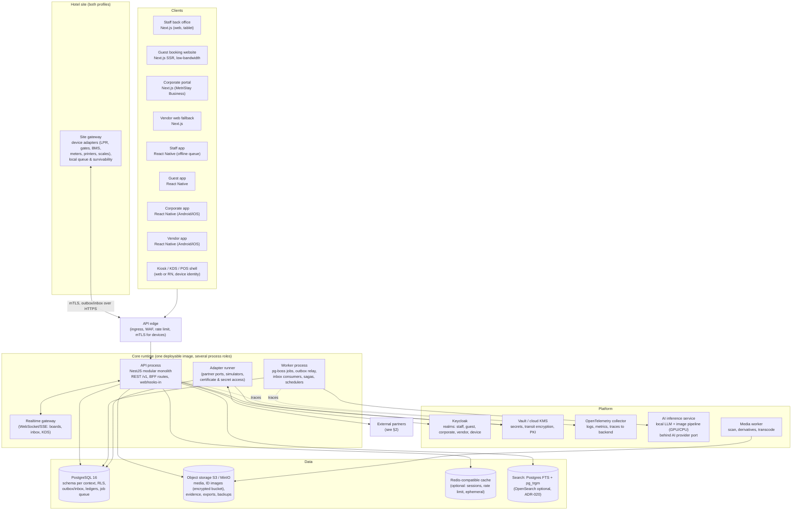

| Container | Technology (README §3.7) | Responsibility | Scaling unit |
|---|---|---|---|
| API process | Node.js LTS, NestJS, TypeScript | All synchronous commands/queries, authorization, validation, writes + outbox rows in the same transaction; inbound webhooks write to inbox only | stateless replicas (SaaS HPA; on-prem 1–2) |
| Worker process | same image, `ROLE=worker` | outbox relay, inbox consumers, projections, pg-boss jobs, schedulers (night audit, purge, reminders), saga/process managers | replicas by queue |
| Adapter runner | same image, `ROLE=adapter` | executes port calls to partners with circuit breakers, rate limits, secret access; isolated network egress policy | per partner pool |
| Realtime gateway | same image, `ROLE=realtime` | pushes board changes (room status, KDS, parking lane, inbox) from projections via LISTEN/NOTIFY | connections |
| Site gateway | small Node service + device drivers on hotel LAN | device protocol translation, local buffering, local gate/LPR decision cache, health | one per site (HA pair optional) |
| PostgreSQL | 16, extensions: `btree_gist`, `pg_trgm`, `pgcrypto`, `citext` | system of record for all contexts | primary + replicas |
| Object storage | S3 API (MinIO on-prem) | binaries; buckets per data class with separate keys | bucket |
| Keycloak | OIDC/SAML, MFA, WebAuthn | identities, sessions, MFA/step-up, federation to corporate IdPs | HA pair |
| Vault / KMS | Transit + KV + PKI | secrets, envelope keys for field encryption, device certificates | HA |
| AI inference | local runtime (e.g. vLLM/llama.cpp class) + non-generative image pipeline | assistant, follow-up drafting, OCR assist, image enhancement | GPU/CPU node pool |

---

## 4. Bounded contexts

### 4.1 Context catalogue and module ownership

Every module M01–M68 has exactly one **owning** context (the context whose schema holds its system-of-record tables). "Owner team" is the Phase 2+ delivery team named in `docs/08`; names are provisional.

| Code | Bounded context | Modules owned | System of record for | Owner team |
|---|---|---|---|---|
| `kernel` | Shared kernel (library, no tables) | — | money/currency, time/business-date types, ids, event envelope, error model | Platform |
| PLT | Platform & Operations | M01, M33, M63, M64 | tenant, property, department, feature flags, device registry, workflow templates/tasks, outbox/inbox, webhooks | Platform |
| IAM | Identity, Access & Consent | M02 | principals, roles, scopes, delegations, **consent** (purpose × channel), retention holds, privileged access log | Platform/Security |
| JUR | Jurisdiction, Tax & Government Exchange | M38, M44 | legal entity, jurisdiction node, **jurisdiction rule pack**, tax rule versions, filing registry & receipts, activation gates | Compliance eng. |
| MED | Media & Content | M39, M51 (content/site config) | **media** asset, rights, derivatives, publication, website pages, knowledge-base articles (for M40) | Guest experience |
| IDV | Identity Verification & Signature | M41 | ID capture sessions, extracted fields, signature envelopes, OTP/QR challenges | Security |
| PTY | Parties: Guests, Corporates, CRM | M10, M18 (profile), M52 | **guest** profile, corporate account/agreement, contacts, segments, campaigns, reviews | Commercial |
| VND | Vendor Registry & Catalog | M46, M48 | **vendor** legal entity, service categories, credentials, catalog items, daily offers/stock snapshots | Procurement |
| LOY | Loyalty & Referral | M30, M31 | **points** ledger, **referral** attribution, commission ledger, referrer agreements | Commercial/Fin |
| INV | Inventory & Pricing | M03, M04, M09 | **room inventory** (type-night counters, physical rooms), **timed resource** & bookings, rate plans, quotes | PMS core |
| FIN | Finance & Payments | M08, M19, M20, M28, M29, M60, M66 | **folio**, invoices, **GL** journals, AP/AR, payment intents/transactions, bill-pay orders, cash shifts, owner statements | Finance |
| STK | Stock, Procurement & Receiving | M14, M21, M25, M49, M50, M56 (linen/minibar stock) | **stock** ledger & lots, requisitions, RFQs, bids, awards, POs, ASN, GRN, cylinder custody, linen custody | Procurement |
| ENG | Engineering, Utilities & Sustainability | M22, M23, M24, M26, M67 | assets, work orders, meters, readings, utility accounts, bill evidence, tariff versions, sustainability baselines | Engineering |
| RES | Reservations, Front Office & Housekeeping | M05, M06, M55, M56 (room board) | **reservation**, stay, room assignment, registration card, housekeeping tasks, service requests/cases | PMS core |
| DST | Distribution & Revenue | M07, M53 | channel mappings, ARI messages, channel booking refs, forecasts, rate recommendations | Commercial |
| COM | Commerce & Events | M11 (backend), M12, M13, M15, M16, M17, M54, M57, M58 | event/BEO, group block contract, POS orders/checks, club memberships, catering orders, parking sessions/permits, offers/vouchers, restaurant bookings, amenity sessions | Commerce |
| TRV | Travel & Mobility | M45, M59 | travel requests, provider offers, travel orders, transport trips, fleet | Commerce |
| WRK | Workforce | M27, M47, M62 | employee, contract, roster, time, leave, **payroll** runs/payslips, chef coverage & callouts, training records | People |
| SAF | Safety, Incident & Risk | M42, M43, M61, M68 | incidents, playbooks, lost items & custody, inspections, nonconformance, insurance policies/claims, continuity plans | Safety |
| AIA | Guest AI Assistant | M40 (M37 AI part later) | conversations, tool-call log, handoffs, evaluation sets | Guest experience |
| BI | Analytics & Data Governance | M32, M65 (and M67 dashboards) | KPI definitions, report versions, snapshots (derived; never SoR for a business fact) | Data |
| CONN | Connected room (Later) | M34, M35, M36 | PBX/HSIA/IPTV entitlements (Phase 7) | Platform (Later) |
| MKT | Marketplace (Later) | M37 | listings, supplier payouts (Phase 8) | Later |

### 4.2 Systems of record (required list)

| Business fact | System of record | Other contexts hold | Update path for others |
|---|---|---|---|
| Guest (person profile, identity uncertainty, merge) | **PTY** `pty.guest` | RES (guest_id refs + snapshot on registration card), LOY (member → guest_id), FIN (payer snapshot on invoice) | events `GuestProfileUpdated`, `GuestMerged`; snapshots are frozen for legal documents |
| Room inventory (physical rooms, room-type-night sellable counts, OOO/OOS) | **INV** `inv.room`, `inv.room_type_night` | RES (assignment refs), DST (ARI projection), ENG (asks for OOO via command) | commands `HoldRoomInventory`, `SetRoomOutOfOrder`; events `InventoryChanged` |
| Timed resource (spaces, tables, parking capacity, kitchen slots, club seats, amenity slots) | **INV** `inv.timed_resource`, `inv.resource_booking` | COM (booking refs), RES (day-use) | command `HoldTimedResources` (composite) |
| Reservation / stay | **RES** `res.reservation`, `res.stay` | FIN (folio → reservation_id), DST (channel ref), COM (group block pickup) | events `ReservationConfirmed/Amended/Cancelled`, `GuestCheckedIn/Out` |
| Folio (charges, payments, windows, routing) | **FIN** `fin.folio`, `fin.folio_entry` | RES (folio_id, balance projection), COM (check → posting ref) | command `PostFolioCharge` (sync, idempotent) |
| Stock (quantities by store/bin/lot/state) | **STK** `stk.stock_ledger` (+ projections) | COM (theoretical depletion requests), FIN (inventory valuation via events) | commands `IssueStock`, `ReserveStock`; events `StockMovementPosted` |
| Vendor (legal entity, categories, credentials, status) | **VND** `vnd.vendor` | STK, ENG, TRV, WRK (vendor_id refs), FIN (supplier master **payment details** are FIN-owned but keyed by vendor_id, see note) | events `VendorApproved/Suspended`, `VendorCredentialExpired` |
| GL (journals, periods, chart of accounts) | **FIN** `fin.journal`, `fin.journal_line`, `fin.period` | BI (projections) | only FIN posting engine writes; all others emit source events |
| Payroll (runs, results, payslips, bank/WPS files) | **WRK** `wrk.payroll_run`, `wrk.payroll_result` | FIN (aggregated salary journal by department only) | event `PayrollRunApproved` (aggregates, no individual pay) |
| Points | **LOY** `loy.points_ledger` | FIN (liability journal), GST app (read) | commands `EarnPoints`, `ReservePointsRedemption` |
| Referral (attribution, commission) | **LOY** `loy.referral_attribution`, `loy.commission_ledger` | FIN (payable) | event `CommissionApproved` → FIN AP payable |
| Jurisdiction rule pack | **JUR** `jur.rule_pack`, `jur.rule_version` | FIN (tax lines reference rule_version_id), WRK (statutory rule version), RES (registration rules) | query `ResolveRules(context)` returns versioned ids; events `RulePackStatusChanged` |
| Media | **MED** `med.asset`, `med.rendition`, `med.publication` | website, CDN, AIA knowledge refs | events `MediaPublished`, `MediaWithdrawn` |
| Consent | **IAM** `iam.consent_record` | PTY (segment eligibility), IDV (ID/biometric consent), AIA (transcript consent), LOY | query `CheckConsent(subject,purpose,channel)`; events `ConsentGranted/Withdrawn` |

*Note on supplier payment details:* bank details are sensitive and change-controlled (SF46.1.4). They live in `fin.payee_bank_account` keyed by `vendor_id`, maker-checker approved; VND shows only masked status. This keeps "who may pay" in FIN while "who the vendor is" stays in VND.

### 4.3 Allowed dependencies (no cycles)

Rules:
1. A **synchronous dependency** (in-process call to another context's published application service or query) is allowed only downward in the layer order below. The resulting graph is a DAG and is enforced in CI by a dependency-cruiser rule on `contexts/*/` imports (§17).
2. **Asynchronous** reactions go through versioned event contracts in `packages/contracts`. Contract packages depend only on `kernel`, so subscribing to an upstream or downstream context's events never creates a code cycle. Consumers must tolerate at-least-once, out-of-order delivery (§9).
3. No context reads another context's tables. Cross-context reporting uses BI projections built from events or read-only views published explicitly by the owning context (`<ctx>_api` schema views).
4. Every cross-context command carries `Idempotency-Key`, `correlation_id`, actor and property scope.

Layer order (a context may call only contexts in lower layers):

| Layer | Contexts | May call synchronously |
|---|---|---|
| 0 | kernel | — |
| 1 | PLT | kernel |
| 2 | IAM | PLT |
| 3 | JUR, MED | IAM, PLT |
| 4 | IDV, PTY, VND | JUR, MED, IAM, PLT |
| 5 | LOY | PTY, JUR, IAM, PLT |
| 6 | FIN | LOY, PTY, VND, JUR, IAM, PLT |
| 7 | INV | PTY (corporate rate eligibility), JUR (tax rules for quotes), IAM, PLT — **not** FIN (see note) |
| 8 | STK | VND, JUR, IAM, PLT, MED (sample photos) |
| 9 | ENG | STK, INV, VND, JUR, IAM, PLT |
| 10 | RES | INV, FIN, LOY, IDV, PTY, JUR, IAM, PLT |
| 11 | DST | RES, INV, PTY, JUR, PLT |
| 11 | COM | RES, INV, STK, FIN, LOY, PTY, JUR, IAM, PLT |
| 12 | TRV | COM, RES, VND, PTY, FIN, JUR, IAM, PLT |
| 12 | WRK | COM (BEO/allergen read for chef handover), VND (external emergency-chef supplier), JUR, IAM, PLT — payroll journals reach FIN by event only |
| 13 | SAF | RES, INV, ENG, PTY, VND, WRK (on-call roster), IDV, IAM, PLT |
| 13 | AIA | DST, RES, INV, COM (read tools), MED, PTY, IAM, PLT |
| 14 | BI | none synchronously (reads projections) |

*Note:* INV does not call FIN; deposits and payment policies are part of the quote policy snapshot resolved from INV rate plans + JUR tax rules. FIN never calls RES/COM/STK/ENG/WRK: it learns about operations only through commands addressed *to* it (`PostFolioCharge`, `CreatePayable`) and events.

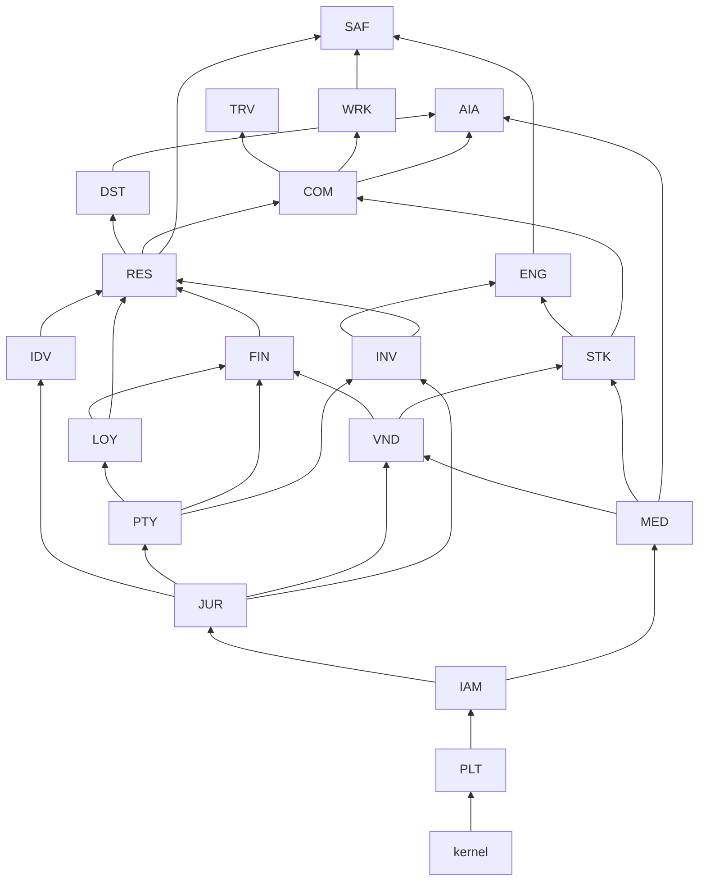
*(Arrow = "is called by / is upstream of". Read bottom-up: a context may call anything below it. BI omitted: it consumes events only.)*

### 4.4 Module-to-context traceability (M01–M68)

| Module | Context | Module | Context | Module | Context | Module | Context |
|---|---|---|---|---|---|---|---|
| M01 | PLT | M18 | PTY (profile) + RES (requests) | M35 | CONN (Later) | M52 | PTY |
| M02 | IAM | M19 | FIN | M36 | CONN (Later) | M53 | DST |
| M03 | INV | M20 | FIN | M37 | MKT/AIA (Later) | M54 | COM (vouchers liability in FIN) |
| M04 | INV | M21 | STK | M38 | JUR (+WRK statutory calc) | M55 | RES |
| M05 | RES | M22 | ENG | M39 | MED | M56 | RES (board) + STK (linen/minibar ledger) |
| M06 | RES | M23 | ENG | M40 | AIA | M57 | COM |
| M07 | DST | M24 | ENG | M41 | IDV | M58 | COM |
| M08 | FIN | M25 | STK | M42 | SAF | M59 | TRV |
| M09 | INV | M26 | ENG | M43 | SAF | M60 | FIN |
| M10 | PTY | M27 | WRK | M44 | JUR | M61 | SAF |
| M11 | COM (+CORP/CAPP apps) | M28 | FIN | M45 | TRV | M62 | WRK |
| M12 | COM | M29 | FIN | M46 | VND | M63 | PLT |
| M13 | COM | M30 | LOY | M47 | WRK | M64 | PLT |
| M14 | STK | M31 | LOY | M48 | VND | M65 | BI |
| M15 | COM | M32 | BI | M49 | STK | M66 | FIN |
| M16 | COM | M33 | PLT | M50 | STK | M67 | ENG (+BI) |
| M17 | COM | M34 | CONN (Later) | M51 | MED (site) + DST (booking engine BFF) | M68 | SAF |

---

## 5. Entity-relationship designs per context

**Conventions for every table (not repeated in diagrams):** `tenant_id uuid NOT NULL`, `property_id uuid NOT NULL` (except tenant-level masters, which carry `property_id NULL` = all properties), `created_at timestamptz`, `created_by uuid` (principal), `updated_at`, `row_version int` (optimistic concurrency, `If-Match` on API). Primary keys are UUIDv7 (time-ordered). Money = `amount_minor bigint` + `currency char(3)`; quantities = `numeric(18,6)` + `uom_id`. Every table has an RLS policy (§11.4). Schema names = context code in lower case (`inv`, `res`, `fin` …). Tables marked **(append-only)** revoke `UPDATE/DELETE` from the application role and carry a `BEFORE UPDATE OR DELETE` trigger raising an exception.

### 5.1 Core PMS — INV (rooms, rates) + RES (reservations, stays, housekeeping) + PTY (guest link)

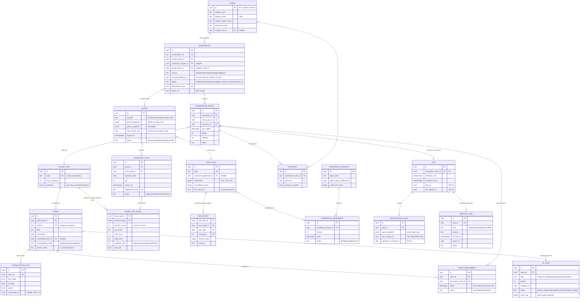

**Key constraints (DDL sketch)**

```sql
-- Room-type-night: the no-ghost-sale invariant (§P.3). Updated only with SELECT ... FOR UPDATE in the hold/convert transaction.
ALTER TABLE inv.room_type_night ADD CONSTRAINT rtn_capacity
  CHECK (sold_count + held_count <= physical_count - ooo_count + overbook_limit
         AND sold_count >= 0 AND held_count >= 0 AND ooo_count >= 0 AND overbook_limit >= 0);

-- Physical room cannot be assigned twice for overlapping nights (room assignment separate from sold inventory, M03).
CREATE EXTENSION IF NOT EXISTS btree_gist;
ALTER TABLE res.room_assignment ADD CONSTRAINT room_assignment_no_overlap
  EXCLUDE USING gist (tenant_id WITH =, room_id WITH =, nights WITH &&) WHERE (status <> 'released');

-- Channel bookings deduplicate on the channel's own reference.
CREATE UNIQUE INDEX reservation_channel_ref_uq ON res.reservation (tenant_id, property_id, channel_id, channel_booking_ref)
  WHERE channel_booking_ref IS NOT NULL;
CREATE UNIQUE INDEX reservation_idem_uq ON res.reservation (tenant_id, idempotency_key);
CREATE UNIQUE INDEX inventory_hold_idem_uq ON inv.inventory_hold (tenant_id, idempotency_key);
```
Hold expiry is a pg-boss job (`inventory.hold.expire`) plus a lazy check on read; `overbook_limit > 0` requires `revenue_manager` approval recorded in `inv.overbook_approval` (maker-checker, SF03 controlled overbooking).

### 5.2 Commerce and events — INV timed resources + COM (events/BEO, POS, club, parking, offers)

```mermaid
erDiagram
  TIMED_RESOURCE ||--o{ RESOURCE_COMPONENT : "atomic parts (partitions)"
  TIMED_RESOURCE ||--o{ CAPACITY_SLOT : "pooled capacity per slot"
  RESOURCE_COMPONENT ||--o{ RESOURCE_BOOKING : "exclusive booking"
  COMPOSITE_HOLD ||--o{ RESOURCE_BOOKING : "groups"
  COMPOSITE_HOLD ||--o{ CAPACITY_CLAIM : "groups"
  CAPACITY_CLAIM }o--|| CAPACITY_SLOT : "consumes"
  EVENT ||--|| COMPOSITE_HOLD : "reserves via"
  EVENT ||--|{ EVENT_VERSION : "BEO revisions"
  EVENT_VERSION ||--o{ BEO_LINE : "F&B, AV, labor, setup"
  EVENT ||--o| GROUP_BLOCK : "rooms block"
  GROUP_BLOCK ||--|{ BLOCK_NIGHT : "per room type and date"
  EVENT ||--o{ CHANGE_ORDER : "post-contract changes"
  POS_OUTLET ||--o{ POS_CHECK : "tabs/tables"
  POS_CHECK ||--|{ POS_LINE : "items/modifiers"
  POS_CHECK ||--o{ POS_TENDER : "settled by"
  CLUB_PLAN ||--o{ CLUB_MEMBERSHIP : "subscribed"
  CLUB_MEMBERSHIP ||--o{ CLUB_ENTRY : "entries/re-entries"
  PARKING_PERMIT }o--|| PLATE : "authorizes"
  PLATE_OBSERVATION }o--o| PLATE : "matched to"
  PLATE_OBSERVATION }o--o| LANE_DECISION : "results in"
  PARKING_SESSION ||--|{ PLATE_OBSERVATION : "entry/exit evidence"
  OFFER ||--o{ OFFER_PURCHASE : "sold as"
  VOUCHER ||--o{ VOUCHER_LEDGER : "issue/redeem/expire"

  TIMED_RESOURCE {
    uuid id PK
    text kind "space|table|parking_zone|kitchen_slot|club_venue|amenity"
    text booking_mode "exclusive|pooled"
    int capacity "pooled mode"
    jsonb layouts "theatre/classroom capacity"
    interval setup_buffer
    interval teardown_buffer
  }
  RESOURCE_COMPONENT {
    uuid id PK
    uuid timed_resource_id FK
    text code "e.g. BALLROOM-A"
  }
  RESOURCE_BOOKING {
    uuid id PK
    uuid component_id FK
    uuid composite_hold_id FK
    tstzrange during "includes buffers; EXCLUDE overlap"
    text status "held|confirmed|released"
    timestamptz hold_expires_at
  }
  CAPACITY_SLOT {
    uuid timed_resource_id PK
    timestamptz slot_start PK
    int capacity
    int used "CHECK used <= capacity"
  }
  CAPACITY_CLAIM {
    uuid id PK
    uuid composite_hold_id FK
    uuid timed_resource_id FK
    timestamptz slot_start
    int qty
  }
  COMPOSITE_HOLD {
    uuid id PK
    text idempotency_key UK
    timestamptz expires_at
    text status "held|confirmed|released|expired"
    uuid inventory_hold_ids "room holds in INV"
  }
  EVENT {
    uuid id PK
    uuid corporate_account_id
    uuid organizer_contact_id
    daterange event_dates
    int attendees
    text status "inquiry|tentative|definite|in_progress|closed|cancelled"
    uuid master_folio_id "FIN"
  }
  EVENT_VERSION {
    uuid id PK
    uuid event_id FK
    int version UK "per event"
    text status "draft|sent|signed|superseded"
    uuid signed_envelope_id
  }
  BEO_LINE {
    uuid id PK
    uuid event_version_id FK
    text department "kitchen|bar|av|setup|parking|club"
    uuid item_ref
    numeric qty
    jsonb allergens
    bigint unit_price_minor
  }
  GROUP_BLOCK {
    uuid id PK
    uuid event_id FK
    date cutoff_date
    text status
  }
  BLOCK_NIGHT {
    uuid group_block_id PK
    uuid room_type_id PK
    date business_date PK
    int blocked
    int picked_up "CHECK picked_up <= blocked"
  }
  CHANGE_ORDER {
    uuid id PK
    uuid event_id FK
    uuid from_version_id
    uuid to_version_id
    bigint delta_minor
    text approval_status
  }
  POS_OUTLET {
    uuid id PK
    text kind "bar|restaurant|club|room_service|retail|spa"
  }
  POS_CHECK {
    uuid id PK
    uuid outlet_id FK
    text client_check_id UK "device-generated, offline dedup"
    text charge_target "cash|card|room|corporate|event"
    uuid folio_posting_ref "FIN idempotent ref"
    text status "open|sent|closed|voided"
  }
  POS_LINE {
    uuid id PK
    uuid check_id FK
    uuid menu_item_id
    numeric qty
    text void_reason
    uuid void_approved_by
  }
  POS_TENDER {
    uuid id PK
    uuid check_id FK
    text tender_type
    bigint amount_minor
    uuid payment_txn_id "FIN"
  }
  CLUB_PLAN {
    uuid id PK
    jsonb benefits
  }
  CLUB_MEMBERSHIP {
    uuid id PK
    uuid plan_id FK
    uuid guest_id
    daterange valid
  }
  CLUB_ENTRY {
    uuid id PK
    uuid membership_id FK
    timestamptz entered_at
    uuid capacity_claim_id "venue capacity"
  }
  PLATE {
    uuid id PK
    text plate_normalized UK "per country/region"
    text region
  }
  PARKING_PERMIT {
    uuid id PK
    uuid plate_id FK
    text holder_type "guest|corporate|staff|event"
    tstzrange valid
    uuid stay_id
  }
  PLATE_OBSERVATION {
    uuid id PK
    text device_event_id UK "camera/LPR event id"
    text plate_read
    numeric confidence
    text lane
    timestamptz observed_at
    uuid evidence_object_key
  }
  LANE_DECISION {
    uuid id PK
    uuid observation_id FK
    text decision "open|deny|review|manual_override"
    uuid decided_by "system or attendant"
    text reason
  }
  PARKING_SESSION {
    uuid id PK
    uuid permit_id
    timestamptz entry_at
    timestamptz exit_at
    bigint tariff_minor
    uuid folio_posting_ref "posts once"
  }
  OFFER {
    uuid id PK
    text kind "upgrade|early_checkin|late_checkout|parking|dining|package"
    uuid capacity_resource_id
  }
  OFFER_PURCHASE {
    uuid id PK
    uuid offer_id FK
    uuid reservation_id
    text status
  }
  VOUCHER {
    uuid id PK
    text code_hash UK
    bigint face_value_minor
    date expires_on
  }
  VOUCHER_LEDGER {
    uuid id PK "append-only"
    uuid voucher_id FK
    text entry_type "issue|redeem|expire|reverse"
    bigint amount_minor
    uuid reverses_id "UK when not null"
  }
```

**Key constraints**

```sql
-- Non-double-sale of exclusive timed resources (M09 invariant). Partitioned rooms book every atomic component,
-- so "Ballroom A+B" and "Ballroom A" cannot overlap.
ALTER TABLE inv.resource_booking ADD CONSTRAINT resource_booking_no_overlap
  EXCLUDE USING gist (tenant_id WITH =, component_id WITH =, during WITH &&)
  WHERE (status IN ('held','confirmed'));

-- Pooled resources (parking zone, club venue, kitchen slot) use slot counters.
ALTER TABLE inv.capacity_slot ADD CONSTRAINT capacity_slot_limit CHECK (used >= 0 AND used <= capacity);

-- A composite hold (rooms + spaces + parking + catering slots) is created in ONE transaction: all rows or none.
-- POS offline dedup and single folio posting:
CREATE UNIQUE INDEX pos_check_client_uq ON com.pos_check (tenant_id, outlet_id, client_check_id);
CREATE UNIQUE INDEX plate_obs_device_uq ON com.plate_observation (tenant_id, device_id, device_event_id);
ALTER TABLE com.block_night ADD CONSTRAINT pickup_le_block CHECK (picked_up <= blocked);
```

### 5.3 Stock and procurement — STK (items, ledger, RFQ→award→PO, receiving, cylinders, linen)

```mermaid
erDiagram
  ITEM ||--o{ UOM_CONVERSION : "pack conversions"
  ITEM ||--o{ LOT : "batches"
  STORE ||--o{ BIN : "locations"
  STOCK_LEDGER }o--|| ITEM : "moves"
  STOCK_LEDGER }o--o| LOT : "lot"
  STOCK_LEDGER }o--|| BIN : "at"
  STOCK_LEDGER }o--o| STOCK_LEDGER : "reverses"
  STOCK_BALANCE }o--|| ITEM : "projection"
  RECIPE ||--|{ RECIPE_LINE : "BOM"
  RECIPE_LINE }o--|| ITEM : "ingredient"
  REQUISITION ||--|{ REQ_LINE : "lines"
  REQUISITION ||--o| RFQ : "tendered by"
  RFQ ||--|{ RFQ_INVITE : "eligible vendors"
  RFQ ||--o{ BID : "responses"
  BID ||--|{ BID_LINE : "priced lines"
  RFQ ||--o{ SAMPLE_IMAGE : "sample photos (90-day)"
  BID ||--o{ SAMPLE_IMAGE : "vendor samples"
  RFQ ||--|| EVAL_POLICY : "weights version (locked at open)"
  RFQ ||--o| AWARD : "decided"
  AWARD ||--|{ PURCHASE_ORDER : "one or split"
  PURCHASE_ORDER ||--|{ PO_VERSION : "versions"
  PO_VERSION ||--|{ PO_LINE : "lines"
  PURCHASE_ORDER ||--o{ PO_MILESTONE : "ack/dispatch/ETA/gate"
  PURCHASE_ORDER ||--o{ ASN : "advance ship notice"
  ASN ||--|{ ASN_LINE : "lot/qty/temp"
  PURCHASE_ORDER ||--o{ RECEIPT : "GRN"
  RECEIPT ||--|{ RECEIPT_LINE : "accepted/rejected"
  RECEIPT_LINE ||--o{ RECEIPT_EVIDENCE : "scan/scale/temp/photo/OCR"
  RECEIPT_LINE ||--o| QUARANTINE_CASE : "discrepancy"
  CYLINDER ||--o{ CYLINDER_CUSTODY : "full/empty/deposit moves"
  LINEN_SKU ||--o{ LINEN_CUSTODY : "clean/soiled/vendor moves"

  ITEM {
    uuid id PK
    text sku UK
    text name
    uuid base_uom_id "canonical UOM"
    text category "food|beverage|amenity|linen|spare|gas"
    bool lot_tracked
    bool food_safety_high_risk
    jsonb allergens
  }
  UOM_CONVERSION {
    uuid item_id PK
    uuid from_uom_id PK
    numeric factor "to base UOM"
  }
  LOT {
    uuid id PK
    uuid item_id FK
    text lot_code
    uuid vendor_id
    date expiry_date
    text gs1_gtin "nullable"
    text recall_status "none|hold|recalled"
  }
  STORE {
    uuid id PK
    text name "main, kitchen, bar, housekeeping"
  }
  BIN {
    uuid id PK
    uuid store_id FK
  }
  STOCK_LEDGER {
    uuid id PK "append-only"
    uuid item_id FK
    uuid lot_id FK
    uuid bin_id FK
    text stock_state "available|reserved|quarantine|waste|in_transit"
    text movement_type "receipt|issue|transfer|return_intact|return_waste|adjust|count|reverse"
    numeric qty_base "signed"
    bigint unit_cost_minor
    text source_type
    uuid source_id
    int source_line
    text idempotency_key UK
    uuid reverses_id "UK when not null"
    date business_date
  }
  STOCK_BALANCE {
    uuid item_id PK
    uuid lot_id PK
    uuid bin_id PK
    text stock_state PK
    numeric qty_base "CHECK >= 0"
    bigint value_minor
  }
  RECIPE {
    uuid id PK
    uuid menu_item_ref
    numeric yield_pct
  }
  RECIPE_LINE {
    uuid recipe_id PK
    uuid item_id PK
    numeric qty_base
  }
  REQUISITION {
    uuid id PK
    uuid department_id
    uuid cost_center_id
    text origin "stock_reorder|maintenance|event|manual|emergency"
    uuid origin_ref "BEO/work order"
    text status "draft|submitted|approved|tendering|ordered|closed|rejected"
  }
  REQ_LINE {
    uuid id PK
    uuid requisition_id FK
    uuid item_id
    numeric qty
    uuid uom_id
    date need_by
    jsonb spec "form, grade, temperature"
  }
  RFQ {
    uuid id PK
    uuid requisition_id FK
    int min_quotes_required "policy by category/value/jurisdiction"
    timestamptz closes_at
    text sealed "sealed|open"
    text status "draft|open|closed|evaluated|awarded|cancelled|waived"
    uuid waiver_id "single-source exception"
  }
  RFQ_INVITE {
    uuid rfq_id PK
    uuid vendor_id PK
    text response "pending|bid|no_bid|late"
  }
  BID {
    uuid id PK
    uuid rfq_id FK
    uuid vendor_id
    int revision
    timestamptz submitted_at
    text status "submitted|withdrawn|disqualified|evaluated"
    text disqualify_reason
  }
  BID_LINE {
    uuid id PK
    uuid bid_id FK
    uuid req_line_id
    bigint unit_price_minor
    uuid uom_id
    bigint landed_unit_cost_base_minor "normalized"
    int lead_time_hours
  }
  SAMPLE_IMAGE {
    uuid id PK
    uuid object_key "MED/object store"
    text retention_start_event "rfq_close|approval"
    timestamptz retention_until "start + 90 days"
    uuid legal_hold_id "nullable"
    timestamptz purged_at
    text purge_proof_hash
  }
  EVAL_POLICY {
    uuid id PK
    int version
    jsonb weights "price, quality, freshness, availability, lead, OTIF, defects, food_safety, history"
    timestamptz locked_at "at bid opening"
  }
  AWARD {
    uuid id PK
    uuid rfq_id FK "UK"
    jsonb scores
    uuid recommended_bid_id
    uuid awarded_bid_ids
    text override_reason
    uuid approved_by "must differ from requester"
  }
  PURCHASE_ORDER {
    uuid id PK
    text po_no UK
    uuid vendor_id
    uuid legal_entity_id
    text status "issued|acknowledged|changed|partially_received|received|closed|cancelled"
  }
  PO_VERSION {
    uuid id PK
    uuid po_id FK
    int version
    bigint encumbered_minor
  }
  PO_LINE {
    uuid id PK
    uuid po_version_id FK
    uuid item_id
    numeric qty
    bigint unit_price_minor
    jsonb quality_temp_spec
  }
  PO_MILESTONE {
    uuid id PK
    uuid po_id FK
    text milestone
    timestamptz due_at
    timestamptz confirmed_at
    text confirmed_by "human|vendor|system; never AI alone"
  }
  ASN {
    uuid id PK
    uuid po_id FK
    text vendor_asn_ref UK "per vendor"
  }
  ASN_LINE {
    uuid id PK
    uuid asn_id FK
    uuid item_id
    numeric qty
    text lot_code
    date expiry
    numeric dispatch_temp_c
  }
  RECEIPT {
    uuid id PK
    uuid po_id FK
    text mode "straight_through|verified"
    uuid attested_by
    text status "draft|posted|reversed"
    text idempotency_key UK
  }
  RECEIPT_LINE {
    uuid id PK
    uuid receipt_id FK
    uuid po_line_id
    numeric accepted_qty
    numeric rejected_qty
    text outcome "accepted|short|over|damaged|substituted|temp_breach"
  }
  RECEIPT_EVIDENCE {
    uuid id PK
    uuid receipt_line_id FK
    text kind "barcode|scale|temp|photo|ocr|signature"
    text raw_value
    uuid object_key
    text scan_dedup_key UK
  }
  QUARANTINE_CASE {
    uuid id PK
    uuid receipt_line_id FK
    text disposition "return_to_vendor|credit|destroy|accept_with_concession"
  }
  CYLINDER {
    uuid id PK
    text serial UK "where used"
    text size_kg
    text safety_status
  }
  CYLINDER_CUSTODY {
    uuid id PK "append-only"
    uuid cylinder_id FK
    text state "full_in_store|in_use|empty|with_vendor|lost"
    bigint deposit_minor
    uuid po_id
    uuid reverses_id
  }
  LINEN_SKU {
    uuid id PK
    uuid item_id
    int par_per_room
  }
  LINEN_CUSTODY {
    uuid id PK "append-only"
    uuid linen_sku_id FK
    text from_location
    text to_location "floor|laundry_vendor|store|loss"
    int qty
    numeric weight_kg
  }
```

**Key constraints**

```sql
-- Allowed state transitions: waste/quarantine can never become available (SF50.3.9, §P.3 "discarded item released").
CREATE TABLE stk.allowed_transition (movement_type text, from_state text, to_state text, PRIMARY KEY (movement_type, from_state, to_state));
-- rows e.g. ('return_intact','issued','available') requires inspector approval id; NO row maps ('*','waste','available').
-- Trigger stk.check_transition() rejects any ledger pair not in allowed_transition.

-- Balance projection updated in same transaction; negative lots impossible.
ALTER TABLE stk.stock_balance ADD CONSTRAINT stock_balance_nonneg CHECK (qty_base >= 0);
-- Idempotency: duplicate scans/webhooks create one movement.
CREATE UNIQUE INDEX stock_ledger_idem_uq ON stk.stock_ledger (tenant_id, idempotency_key);
CREATE UNIQUE INDEX stock_ledger_rev_uq ON stk.stock_ledger (reverses_id) WHERE reverses_id IS NOT NULL;
-- Award segregation of duties.
-- CHECK enforced by trigger: award.approved_by <> requisition.created_by AND approved_by NOT IN (bid evaluators flagged with conflict).
-- Sample image retention: purge job deletes object and sets purged_at + purge_proof_hash when now() > retention_until AND legal_hold_id IS NULL.
```

### 5.4 Finance and payments — FIN (folio, GL, AP/AR, payments, bill-pay, cash)

```mermaid
erDiagram
  ACCOUNT ||--o{ JOURNAL_LINE : "posted to"
  COST_CENTER ||--o{ JOURNAL_LINE : "dimension"
  PERIOD ||--o{ JOURNAL : "belongs to"
  JOURNAL ||--|{ JOURNAL_LINE : "balanced lines"
  JOURNAL }o--o| JOURNAL : "reverses"
  POSTING_RULE ||--o{ JOURNAL : "generated by version"
  FOLIO ||--|{ FOLIO_WINDOW : "payer windows"
  FOLIO_WINDOW ||--o{ FOLIO_ENTRY : "charges/payments"
  FOLIO_ENTRY }o--o| FOLIO_ENTRY : "reverses/transfers"
  FOLIO ||--o{ INVOICE : "fiscal documents"
  INVOICE ||--|{ INVOICE_LINE : "lines incl. tax"
  PAYMENT_INTENT ||--o{ PAYMENT_TXN : "auth/capture/refund"
  PAYMENT_TXN }o--o| FOLIO_ENTRY : "settles"
  PROVIDER_EVENT }o--o| PAYMENT_TXN : "callback"
  SUPPLIER_INVOICE ||--|{ SUPPLIER_INVOICE_LINE : "lines"
  SUPPLIER_INVOICE ||--o| PAYABLE : "approved as"
  PAYABLE }o--o{ PAYMENT_BATCH : "paid in"
  PAYMENT_BATCH ||--o{ DISBURSEMENT : "bank/PSP execution"
  PAYEE_BANK_ACCOUNT ||--o{ DISBURSEMENT : "to"
  BILL_PAY_ORDER ||--o{ BILL_PAY_STATUS_LOG : "provider status"
  BILL_PAY_ORDER }o--|| PAYABLE : "settles"
  BANK_STATEMENT_LINE ||--o{ RECON_MATCH : "matched"
  RECON_MATCH }o--o| DISBURSEMENT : "to"
  RECON_MATCH }o--o| PAYMENT_TXN : "to"
  CASH_SHIFT ||--o{ CASH_MOVEMENT : "float/drop/refund"
  AR_ACCOUNT ||--o{ INVOICE : "city ledger"

  ACCOUNT {
    uuid id PK
    text code UK
    text type "asset|liability|equity|revenue|expense"
    bool is_control "AP, AR, guest ledger, points liability"
  }
  COST_CENTER {
    uuid id PK
    text code UK
    uuid department_id
  }
  PERIOD {
    uuid id PK
    date starts_on
    date ends_on
    text status "open|soft_closed|locked"
  }
  JOURNAL {
    uuid id PK "append-only"
    uuid period_id FK
    date accounting_date
    date business_date
    text source_type
    uuid source_id
    text source_event_id UK "exactly-once posting"
    uuid posting_rule_version_id
    uuid reverses_id "UK when not null"
    text status "posted"
  }
  JOURNAL_LINE {
    uuid id PK "append-only"
    uuid journal_id FK
    uuid account_id FK
    uuid cost_center_id FK
    bigint debit_minor "CHECK >= 0"
    bigint credit_minor "CHECK >= 0"
    text currency
    bigint functional_debit_minor
    bigint functional_credit_minor
    numeric fx_rate
    uuid tax_rule_version_id
  }
  POSTING_RULE {
    uuid id PK
    text event_type
    int version
    jsonb mapping
  }
  FOLIO {
    uuid id PK
    text owner_type "stay|event_master|corporate|walkin"
    uuid owner_id
    text status "open|settled|closed|reopened"
  }
  FOLIO_WINDOW {
    uuid id PK
    uuid folio_id FK
    int window_no
    text payer_type "guest|corporate|event|voucher"
    uuid payer_id
    jsonb routing_rules
  }
  FOLIO_ENTRY {
    uuid id PK "append-only"
    uuid window_id FK
    text entry_type "charge|payment|adjustment|transfer_out|transfer_in|reversal|deposit"
    text revenue_code
    bigint amount_minor "signed"
    text currency
    jsonb tax_lines
    text source_type "room|pos|parking|event|minibar|offer"
    text source_ref UK "idempotent per source"
    uuid reverses_id "UK when not null"
    date business_date
    uuid posted_by
  }
  INVOICE {
    uuid id PK
    text fiscal_no UK "per legal entity series"
    text kind "invoice|credit_note|receipt|proforma"
    uuid legal_entity_id
    uuid rule_version_id "JUR invoice rules"
    uuid credits_invoice_id "for credit notes"
  }
  INVOICE_LINE {
    uuid id PK
    uuid invoice_id FK
    bigint net_minor
    bigint tax_minor
    uuid tax_rule_version_id
  }
  PAYMENT_INTENT {
    uuid id PK
    text purpose "folio|deposit|corporate_invoice|voucher"
    uuid target_id
    bigint amount_minor
    text currency
    text idempotency_key UK
    text status "created|requires_action|authorized|captured|partially_refunded|refunded|failed|cancelled|unknown"
  }
  PAYMENT_TXN {
    uuid id PK
    uuid intent_id FK
    text op "authorize|capture|void|refund|chargeback"
    uuid provider_id
    text provider_txn_id "UK with provider_id"
    bigint amount_minor
    text status "pending|succeeded|failed|unknown"
    text token_ref "PSP token only; never PAN"
  }
  PROVIDER_EVENT {
    uuid id PK
    uuid provider_id
    text provider_event_id "UK with provider_id"
    bool signature_valid
    jsonb payload_redacted
  }
  SUPPLIER_INVOICE {
    uuid id PK
    uuid vendor_id
    text invoice_no_normalized
    date invoice_date
    bigint gross_minor
    text dup_key UK "vendor + normalized no + fiscal year"
    text match_status "unmatched|2way|3way|tolerance_exception|disputed"
    uuid source_evidence_key
  }
  SUPPLIER_INVOICE_LINE {
    uuid id PK
    uuid supplier_invoice_id FK
    uuid po_line_id
    uuid receipt_line_id
  }
  PAYABLE {
    uuid id PK
    uuid supplier_invoice_id FK "UK"
    text category "utility|gas|payroll_net|maintenance|supplier|commission|tax"
    date due_on
    text status "planned|accrued|approved|scheduled|paid|settled|disputed|cancelled"
    uuid approved_by
  }
  PAYMENT_BATCH {
    uuid id PK
    uuid created_by
    uuid approved_by "must differ"
    uuid released_by "payment_releaser, step-up"
    text status
  }
  DISBURSEMENT {
    uuid id PK
    uuid batch_id FK
    uuid payee_bank_account_id FK
    bigint amount_minor
    text idempotency_key UK
    text external_ref
    text status "pending|sent|rejected|confirmed|unknown"
  }
  PAYEE_BANK_ACCOUNT {
    uuid id PK
    uuid vendor_id
    bytea iban_enc "field-encrypted"
    text iban_last4
    text verification_status
    uuid approved_by
  }
  BILL_PAY_ORDER {
    uuid id PK
    uuid provider_id
    text biller_id
    text account_reference
    bigint quoted_minor
    bigint fee_minor
    timestamptz quote_expires_at
    text idempotency_key UK
    text provider_order_ref "UK with provider_id"
    text status "quoted|authorized|submitted|pending|confirmed|failed|disputed|reversed"
  }
  BILL_PAY_STATUS_LOG {
    uuid id PK "append-only"
    uuid order_id FK
    text status
    text source "callback|inquiry|manual_evidence"
  }
  BANK_STATEMENT_LINE {
    uuid id PK
    text bank_ref "UK with account"
    bigint amount_minor
    date value_date
  }
  RECON_MATCH {
    uuid id PK
    uuid statement_line_id FK
    text match_type "auto|manual"
    uuid matched_by
  }
  CASH_SHIFT {
    uuid id PK
    uuid cashier_id
    uuid drawer_id
    bigint opening_float_minor
    bigint counted_minor
    text status "open|closing|closed|variance_review"
  }
  CASH_MOVEMENT {
    uuid id PK "append-only"
    uuid shift_id FK
    text kind "float|sale|refund|drop|payout"
    bigint amount_minor
  }
  AR_ACCOUNT {
    uuid id PK
    uuid corporate_account_id
    bigint credit_limit_minor
  }
```

**Key constraints**

```sql
-- Debit = credit per journal and per currency: deferred constraint trigger evaluated at COMMIT.
CREATE FUNCTION fin.assert_journal_balanced() RETURNS trigger LANGUAGE plpgsql AS $$
BEGIN
  IF EXISTS (SELECT 1 FROM fin.journal_line WHERE journal_id = NEW.journal_id
             GROUP BY currency HAVING sum(debit_minor) <> sum(credit_minor))
     OR EXISTS (SELECT 1 FROM fin.journal_line WHERE journal_id = NEW.journal_id
             HAVING sum(functional_debit_minor) <> sum(functional_credit_minor)) THEN
    RAISE EXCEPTION 'journal % not balanced', NEW.journal_id;
  END IF; RETURN NULL; END $$;
CREATE CONSTRAINT TRIGGER journal_balanced AFTER INSERT ON fin.journal_line
  DEFERRABLE INITIALLY DEFERRED FOR EACH ROW EXECUTE FUNCTION fin.assert_journal_balanced();
ALTER TABLE fin.journal_line ADD CONSTRAINT one_sided
  CHECK ((debit_minor = 0) <> (credit_minor = 0));

-- Period lock: posting into a locked period is rejected; corrections go to the current open period with a reversal link.
-- Trigger fin.assert_period_open() on INSERT INTO fin.journal.
CREATE UNIQUE INDEX journal_source_event_uq ON fin.journal (tenant_id, source_event_id);
CREATE UNIQUE INDEX journal_reversal_uq ON fin.journal (reverses_id) WHERE reverses_id IS NOT NULL;
CREATE UNIQUE INDEX folio_entry_source_uq ON fin.folio_entry (tenant_id, source_type, source_ref);
CREATE UNIQUE INDEX folio_entry_reversal_uq ON fin.folio_entry (reverses_id) WHERE reverses_id IS NOT NULL;
CREATE UNIQUE INDEX payment_txn_provider_uq ON fin.payment_txn (provider_id, provider_txn_id);
CREATE UNIQUE INDEX provider_event_uq ON fin.provider_event (provider_id, provider_event_id);
CREATE UNIQUE INDEX supplier_invoice_dup_uq ON fin.supplier_invoice (tenant_id, dup_key);
-- Refund cap: in the refund command, SELECT ... FOR UPDATE on payment_intent and assert sum(refunds)+new <= sum(captures).
-- Maker-checker: CHECK (approved_by IS DISTINCT FROM created_by) and released_by distinct from both on payment_batch.
```

### 5.5 Workforce — WRK (employees, time, payroll, chef coverage, training)

```mermaid
erDiagram
  EMPLOYEE ||--|| EMPLOYEE_SENSITIVE : "protected fields"
  EMPLOYEE ||--o{ EMPLOYMENT_CONTRACT : "contracts"
  EMPLOYMENT_CONTRACT ||--o{ COMPENSATION : "effective-dated pay"
  EMPLOYEE ||--o{ ROSTER_SHIFT : "scheduled"
  ROSTER_SHIFT ||--o{ TIME_PUNCH : "actuals"
  EMPLOYEE ||--o{ LEAVE_REQUEST : "absence"
  EMPLOYEE ||--o{ OVERTIME_APPROVAL : "approved OT"
  PAYROLL_RUN ||--|{ PAYROLL_RESULT : "per employee"
  PAYROLL_RESULT ||--|{ PAYROLL_LINE : "earnings/deductions"
  PAYROLL_RESULT ||--o| PAYSLIP : "document"
  PAYROLL_RUN ||--o{ BANK_FILE : "WPS/bank file"
  BANK_FILE ||--o{ BANK_FILE_STATUS : "acks/rejections"
  COVERAGE_PLAN ||--|{ COVERAGE_SLOT : "meal service/outlet/event"
  COVERAGE_SLOT ||--o{ CALLOUT : "if uncovered"
  CALLOUT ||--o{ CALLOUT_ATTEMPT : "ordered contacts"
  EMERGENCY_CHEF ||--o{ CALLOUT_ATTEMPT : "contacted"
  CALLOUT ||--o| CHEF_ASSIGNMENT : "one acceptance"
  EMPLOYEE ||--o{ CERTIFICATION : "food safety etc."
  EMPLOYEE ||--o{ TRAINING_RECORD : "SOP sign-off"

  EMPLOYEE {
    uuid id PK
    text employee_no UK
    uuid department_id
    uuid principal_id "IAM link"
    text status "active|leaving|left"
  }
  EMPLOYEE_SENSITIVE {
    uuid employee_id PK
    bytea national_id_enc "SIN/civil ID, Vault transit"
    text national_id_last3
    text national_id_type "CA_SIN|OM_CIVIL|PK_CNIC|SA_IQAMA|PT_NIF|other"
    bytea bank_account_enc
    date dob_enc
  }
  EMPLOYMENT_CONTRACT {
    uuid id PK
    uuid employee_id FK
    uuid work_jurisdiction_id "JUR node e.g. CA-QC"
    daterange valid
  }
  COMPENSATION {
    uuid id PK
    uuid contract_id FK
    daterange valid "EXCLUDE overlap per contract"
    bytea base_amount_enc
    text currency
  }
  ROSTER_SHIFT {
    uuid id PK
    uuid employee_id FK
    tstzrange shift "EXCLUDE overlap per employee"
    uuid role_id
    uuid cost_center_id
    uuid event_id "labor attribution"
  }
  TIME_PUNCH {
    uuid id PK "append-only"
    uuid shift_id FK
    text kind "in|out|break_start|break_end"
    timestamptz at
    text source "device|mobile|manager_correction"
    text client_punch_id UK
  }
  LEAVE_REQUEST {
    uuid id PK
    uuid employee_id FK
    daterange days
    text status
  }
  OVERTIME_APPROVAL {
    uuid id PK
    uuid employee_id FK
    numeric hours
    uuid approved_by
  }
  PAYROLL_RUN {
    uuid id PK
    date period_start
    date period_end
    uuid statutory_rule_version_ids "JUR"
    text status "draft|calculated|exceptions|approved_hr|approved_finance|file_generated|sent|partially_rejected|paid|closed"
    uuid approved_by_1
    uuid approved_by_2 "distinct"
  }
  PAYROLL_RESULT {
    uuid id PK
    uuid run_id FK
    uuid employee_id
    bytea gross_enc
    bytea net_enc
  }
  PAYROLL_LINE {
    uuid id PK
    uuid result_id FK
    text code "BASE|OT|ALLOW|CPP|QPP|EI|QPIP|FIT|PIT|SOCSEC|ADVANCE"
    bytea amount_enc
  }
  PAYSLIP {
    uuid id PK
    uuid result_id FK
    uuid object_key "encrypted bucket"
  }
  BANK_FILE {
    uuid id PK
    uuid run_id FK
    text format "OM_WPS_SIF|bank_csv|..."
    text sha256
    text idempotency_key UK
  }
  BANK_FILE_STATUS {
    uuid id PK "append-only"
    uuid bank_file_id FK
    text status
    jsonb rejected_employee_refs
  }
  COVERAGE_PLAN {
    uuid id PK
    uuid outlet_id
    date service_date
  }
  COVERAGE_SLOT {
    uuid id PK
    uuid plan_id FK
    text meal_service
    uuid primary_chef_id
    uuid backup_chef_id
    tstzrange window
    text status "covered|at_risk|uncovered|filled_emergency|contingency"
  }
  CALLOUT {
    uuid id PK
    uuid slot_id FK
    timestamptz deadline_at
    text status "open|accepted|escalated|failed|cancelled"
  }
  CALLOUT_ATTEMPT {
    uuid id PK
    uuid callout_id FK
    uuid emergency_chef_id FK
    text channel "push|sms|whatsapp|voice"
    text reply "none|accept|decline"
  }
  EMERGENCY_CHEF {
    uuid id PK
    uuid vendor_id "nullable, VND"
    uuid employee_id "nullable"
    numeric response_minutes
    bool food_safety_valid
  }
  CHEF_ASSIGNMENT {
    uuid id PK
    uuid callout_id FK "UK"
    uuid person_ref
    tstzrange shift "EXCLUDE overlap per person"
    uuid approved_by "manager for paid external"
  }
  CERTIFICATION {
    uuid id PK
    uuid employee_id FK
    text kind
    date expires_on
  }
  TRAINING_RECORD {
    uuid id PK
    uuid employee_id FK
    uuid sop_version_id
    timestamptz attested_at
  }
```

**Key constraints:** `EXCLUDE USING gist (employee_id WITH =, shift WITH &&)` on roster; `EXCLUDE USING gist (person_ref WITH =, shift WITH &&)` on chef assignments (prevents simultaneous double assignment, G.15); `UNIQUE (callout_id)` on `chef_assignment` so the **first** authenticated acceptance wins (the accept command does `INSERT ... ON CONFLICT DO NOTHING` and reports "already filled" to later acceptors); compensation effective ranges exclusion; payroll approvals `approved_by_2 <> approved_by_1`. Individual pay columns are encrypted (§11.6); the FIN salary journal receives **department aggregates only** (§D, F27.4).

### 5.6 Vendor and travel — VND (registry, catalog, daily offers) + TRV (requests, offers, orders, transport)

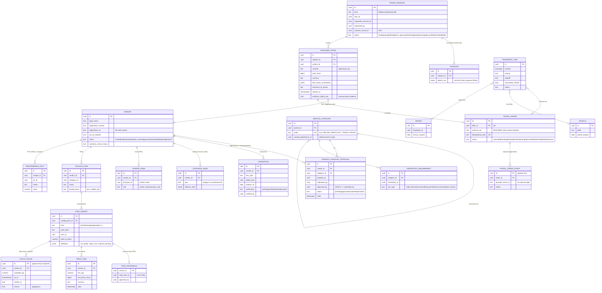

**Key constraints:** `CHECK (status <> 'booked' OR external_ref IS NOT NULL)` on `travel_order` (no unconfirmed travel shown as booked, §P.3); `UNIQUE (vendor_id, provider_order_ref)`; `CHECK (approved_by <> submitted_by)` on category approval; department search = view `vnd_api.eligible_vendor` joining approval `status='approved'`, `valid @> today`, all required credentials `verified` and not expired, coverage intersects property — **unapproved/expired vendors are excluded from ordering but retained for audit (SF46.2.7)**; `STOCK_OFFER` exposes `as_of` and the UI derives a *stale* badge (default > 24 h, configurable); competitor bid data is never exposed through vendor-realm APIs (RLS on `vendor_id`, §11.4).

### 5.7 Jurisdiction and compliance — JUR + IAM consent/retention

```mermaid
erDiagram
  JURISDICTION_NODE ||--o{ JURISDICTION_NODE : "country > region > municipality"
  LEGAL_ENTITY }o--|| JURISDICTION_NODE : "domicile"
  PROPERTY_SITE }o--|| JURISDICTION_NODE : "physical location"
  PROPERTY_SITE }o--|| LEGAL_ENTITY : "operated by"
  RULE_PACK }o--|| JURISDICTION_NODE : "applies to"
  RULE_PACK ||--|{ RULE_VERSION : "effective-dated"
  RULE_VERSION ||--o{ RULE : "tax/payroll/registration/ID/privacy/travel"
  RULE_VERSION ||--o{ EVIDENCE_SOURCE : "cited sources"
  RULE_VERSION ||--o{ REVIEW : "reviewer/counsel sign-off"
  OBLIGATION }o--|| RULE_PACK : "defined in"
  ACTIVATION_GATE }o--|| OBLIGATION : "guards feature"
  CLASSIFICATION_DECISION }o--|| RULE_VERSION : "resolved to"
  FILING_OBLIGATION }o--|| OBLIGATION : "periodic filing"
  FILING_OBLIGATION ||--o{ FILING_SUBMISSION : "submitted"
  FILING_SUBMISSION ||--o| SUBMISSION_RECEIPT : "receipt or manual evidence"
  GOV_CONNECTOR ||--o{ FILING_SUBMISSION : "via"
  CONSENT_RECORD }o--|| CONSENT_PURPOSE : "purpose"
  RETENTION_POLICY }o--|| RULE_VERSION : "derived from"
  LEGAL_HOLD }o--o{ RETENTION_POLICY : "overrides"

  JURISDICTION_NODE {
    uuid id PK
    uuid parent_id FK
    text level "country|subnational|municipality|special_zone"
    text iso_code "ISO 3166-1/2"
    text name_en
    text name_ar
  }
  LEGAL_ENTITY {
    uuid id PK
    text legal_name
    text tax_registration_masked
    text functional_currency
  }
  PROPERTY_SITE {
    uuid property_id PK
    uuid legal_entity_id FK
    uuid jurisdiction_id FK
    text iana_tz
  }
  RULE_PACK {
    uuid id PK
    text country "CA|OM|PK|SA|PT"
    text category "tax|payroll|invoice|guest_registration|id_consent|privacy|payment|travel|tourism|food_safety|retention|marketing"
  }
  RULE_VERSION {
    uuid id PK
    uuid rule_pack_id FK
    daterange effective "EXCLUDE overlap when verified"
    text status "draft|verified|expired|rejected"
    text honesty_label "README 3.6"
    text confidence "low|medium|high"
  }
  RULE {
    uuid id PK
    uuid rule_version_id FK
    text rule_type "tax_rate|levy|rounding|invoice_field|registration_field|deduction|retention_period"
    jsonb definition "declarative, tested by fixtures"
  }
  EVIDENCE_SOURCE {
    uuid id PK
    uuid rule_version_id FK
    text url
    date accessed_on
    text excerpt_hash
  }
  REVIEW {
    uuid id PK
    uuid rule_version_id FK
    text reviewer_role "compliance_officer|counsel|tax_adviser"
    text outcome
    timestamptz reviewed_at
  }
  OBLIGATION {
    uuid id PK
    uuid rule_pack_id FK
    text code
    text submission_mode "api|file|portal|manual|unknown"
  }
  ACTIVATION_GATE {
    uuid id PK
    uuid obligation_id FK
    text feature_key "e.g. referral.payout, filing.gst_hst, travel.issue_ticket"
    uuid property_id
    text state "blocked|manual_only|enabled"
    uuid exception_approved_by
  }
  CLASSIFICATION_DECISION {
    uuid id PK "append-only"
    jsonb inputs "entity, site, service, guest residency, tax date"
    uuid rule_version_id FK
    text precedence_trace
    uuid override_by "nullable, with reason"
  }
  FILING_OBLIGATION {
    uuid id PK
    uuid obligation_id FK
    daterange period
    date due_on
  }
  FILING_SUBMISSION {
    uuid id PK
    uuid filing_obligation_id FK
    text idempotency_key UK
    text status "prepared|approved|submitted|accepted|rejected|manual_filed"
    text artifact_sha256
  }
  SUBMISSION_RECEIPT {
    uuid id PK
    uuid submission_id FK "UK"
    text receipt_no
    uuid evidence_object_key
  }
  GOV_CONNECTOR {
    uuid id PK
    text agency
    text protocol "oauth|mtls|file|portal"
    text honesty_label
  }
  CONSENT_PURPOSE {
    uuid id PK
    text code "marketing_email|whatsapp_otp|id_ocr|biometric_match|ai_transcript|analytics_cookies|referral_tracking"
  }
  CONSENT_RECORD {
    uuid id PK "append-only"
    uuid subject_id
    uuid purpose_id FK
    text channel
    text action "grant|withdraw"
    text wording_version
    text evidence "ip/device/signature ref"
  }
  RETENTION_POLICY {
    uuid id PK
    text record_class "id_image|sample_photo|folio|payroll|cctv_pointer|transcript"
    interval keep_for
    text start_event
  }
  LEGAL_HOLD {
    uuid id PK
    text scope
    uuid approved_by
    timestamptz released_at
  }
```

**Key constraints:** `EXCLUDE USING gist (rule_pack_id WITH =, effective WITH &&) WHERE (status = 'verified')` (one verified version at any instant); `CHECK (status NOT IN ('submitted','accepted') OR <receipt exists>)` enforced in the submission command (unverified tax filing never shown as submitted); there is **no global fallback row** — `ResolveRules` returns `unknown` when no verified version matches, and callers must treat `unknown` as blocked (SF44.1.6).

### 5.8 Guest engagement and loyalty — PTY (CRM) + LOY (points, referral)

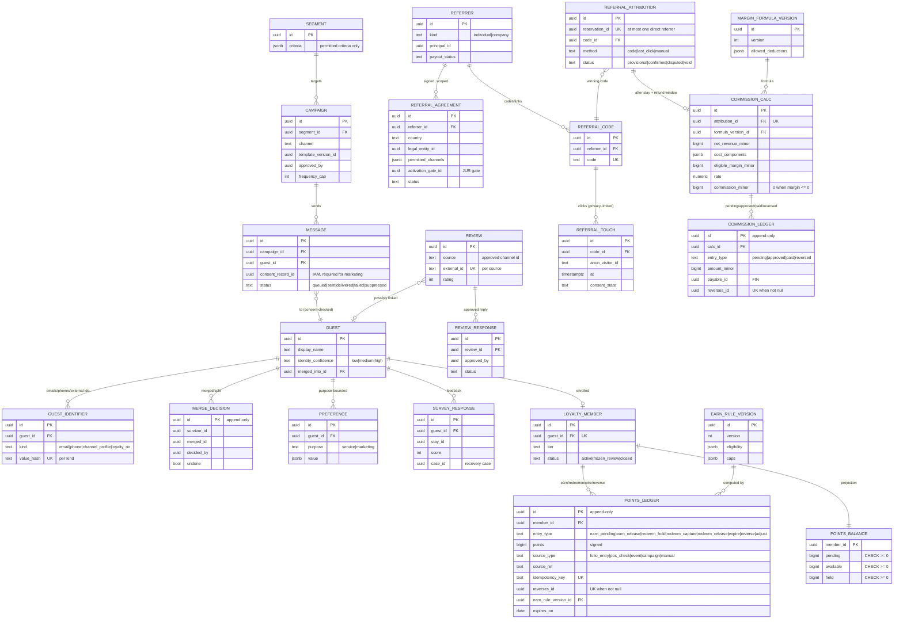

**Key constraints:** `UNIQUE (reservation_id)` on `referral_attribution` — two referrers can never both be attributed (G.7, §E tests); **there is intentionally no `parent_referrer_id`, upline, downline, team or rank column anywhere in the schema**, and a CI schema lint fails if one appears (§E "No recursive graph"); `CHECK (commission_minor = 0 OR eligible_margin_minor > 0)`; payout command re-evaluates the JUR activation gate server-side (disabled jurisdiction rejects payout regardless of UI); points balance non-negative; redemptions use hold → capture/release so a folio failure never loses points.

### 5.9 Safety — SAF (incidents, lost & found, inspections, risk) + IDV (ID, signature, OTP)

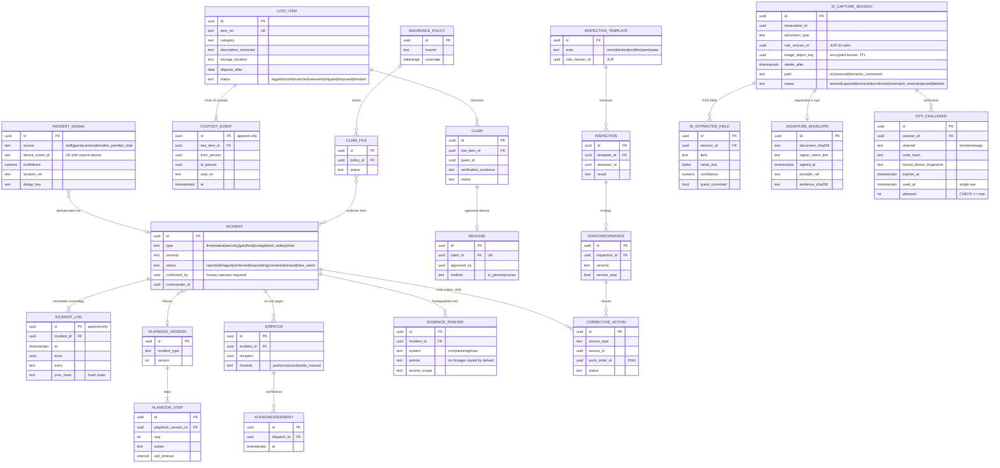

**Key constraints:** incident `status='confirmed'` requires `confirmed_by` (human; AI or sensor alone cannot confirm — SF42.2.1, "critical safety alerts do not rely solely on AI"); `incident_log` and `custody_event` append-only with hash chain; OTP `UNIQUE (id) WHERE used_at IS NOT NULL` + atomic `UPDATE ... SET used_at=now() WHERE used_at IS NULL AND expires_at > now()` (anti-replay); a QR hand-off token only resumes a session and still requires the OTP or staff verification (SF41.2.6); ID images live in a separate bucket with its own KMS key, `delete_after` enforced by a purge job, never replicated into analytics or AI training (SF41.1.7).

### 5.10 Engineering, utilities and media (supporting ERDs)

```mermaid
erDiagram
  ASSET ||--o{ ASSET : "hierarchy"
  ASSET ||--o{ WORK_ORDER : "maintenance"
  WORK_ORDER ||--o{ WO_EVIDENCE : "photos, parts, labor"
  WORK_ORDER }o--o| VENDOR_JOB : "contractor assignment"
  METER ||--o{ METER_READING : "interval/cumulative"
  UTILITY_ACCOUNT ||--o{ METER : "serves"
  UTILITY_ACCOUNT ||--o{ UTILITY_BILL : "bills"
  UTILITY_BILL ||--|{ BILL_LINE : "supply, sewage, standing"
  TARIFF_VERSION ||--o{ UTILITY_BILL : "expected cost"
  ALLOCATION_RULE_VERSION ||--o{ ALLOCATION_RESULT : "department split"
  MEDIA_ASSET ||--o{ RENDITION : "derivatives"
  MEDIA_ASSET ||--o{ ENHANCEMENT_JOB : "local AI copy"
  MEDIA_ASSET ||--|| MEDIA_RIGHTS : "usage rights"
  MEDIA_ASSET ||--o{ PUBLICATION : "channels"

  ASSET {
    uuid id PK
    uuid parent_id FK
    text criticality
    uuid room_id "nullable"
  }
  WORK_ORDER {
    uuid id PK
    uuid asset_id FK
    text origin "guest|preventive|iot|meter_anomaly|inspection"
    timestamptz sla_due_at
    bool room_ooo_requested
    text status "open|assigned|in_progress|awaiting_parts|done|inspected|closed"
  }
  WO_EVIDENCE {
    uuid id PK
    uuid work_order_id FK
    text kind
    uuid object_key
  }
  VENDOR_JOB {
    uuid id PK
    uuid work_order_id FK
    uuid vendor_id
    uuid po_id
  }
  METER {
    uuid id PK
    text utility "electricity|water|gas"
    text kind "master|sub"
    text unit "kWh|m3"
  }
  METER_READING {
    uuid meter_id PK
    timestamptz read_at PK
    numeric value
    text quality "actual|estimated|reset|gap"
    text source "bms|api|csv|manual"
  }
  UTILITY_ACCOUNT {
    uuid id PK
    text provider
    text account_no_masked
  }
  UTILITY_BILL {
    uuid id PK
    uuid account_id FK
    daterange period
    bigint total_minor
    date due_on
    text dup_key UK
    numeric usage_variance_pct
    text status "captured|validated|variance_review|sent_to_ap|paid|settled"
  }
  BILL_LINE {
    uuid id PK
    uuid bill_id FK
    text component
    bigint amount_minor
  }
  TARIFF_VERSION {
    uuid id PK
    daterange valid
    jsonb bands
  }
  ALLOCATION_RULE_VERSION {
    uuid id PK
    text driver "submeter|occupied_rooms|covers|kg_laundry|sqm"
  }
  ALLOCATION_RESULT {
    uuid id PK
    uuid cost_center_id
    bigint amount_minor
    text basis "metered|estimated"
  }
  MEDIA_ASSET {
    uuid id PK
    uuid original_object_key "immutable"
    text kind "image|video"
    text status "uploaded|scanned|tagged|in_review|approved|published|withdrawn"
    text alt_text_en
    text alt_text_ar
  }
  RENDITION {
    uuid id PK
    uuid asset_id FK
    text profile "webp_640|avif_1280|hls_720"
  }
  ENHANCEMENT_JOB {
    uuid id PK
    uuid asset_id FK
    text preset
    text model_id_version
    text licence_ref
    uuid output_object_key
    text approval "pending|approved|rejected"
  }
  MEDIA_RIGHTS {
    uuid asset_id PK
    text owner
    date expires_on
    bool model_release
  }
  PUBLICATION {
    uuid id PK
    uuid asset_id FK
    text channel "website|channel_manager|app|ai_kb"
    text status
  }
```

`UNIQUE (meter_id, read_at)` prevents duplicate interval import; readings are never overwritten — a corrected reading is a new row with `quality='actual'` superseding an `estimated` one in the projection. Utility bills flow to FIN via `UtilityBillValidated` → `CreatePayable` (the payable is FIN-owned).

---

## 6. Architecture Decision Records

Status values: `accepted-for-planning` (baseline, may be revisited at the Phase 2 gate with evidence), `proposed` (needs owner confirmation), `superseded`. README §3.7 lists the baseline; the ADRs below elaborate and do not contradict it. The README pointer "ADR-001..ADR-012" refers to the first twelve; ADR-013..ADR-021 extend the set.

| ADR | Title | Status |
|---|---|---|
| ADR-001 | Modular monolith in TypeScript/NestJS with bounded-context packages | accepted-for-planning |
| ADR-002 | PostgreSQL 16 as single system of record, schema per context, RLS | accepted-for-planning |
| ADR-003 | Transactional outbox and idempotent inbox | accepted-for-planning |
| ADR-004 | Append-only ledgers with reversal links; balances as projections | accepted-for-planning |
| ADR-005 | Event envelope, contract packages and versioning | accepted-for-planning |
| ADR-006 | Postgres job queue (pg-boss) and process-manager sagas; Temporal deferred | accepted-for-planning |
| ADR-007 | Keycloak as identity provider with per-audience realms | accepted-for-planning |
| ADR-008 | Offline strategy: server-authoritative command queue, not replicated database | accepted-for-planning |
| ADR-009 | React Native (Expo) for staff, guest, corporate and vendor apps | accepted-for-planning |
| ADR-010 | Next.js web applications and BFF routes | accepted-for-planning |
| ADR-011 | AI provider port with local inference first | accepted-for-planning |
| ADR-012 | S3-compatible object storage and media pipeline | accepted-for-planning |
| ADR-013 | Deployment profiles: SaaS multi-tenant and on-prem single hotel | accepted-for-planning |
| ADR-014 | Money, multi-currency, time zones and hotel business date | accepted-for-planning |
| ADR-015 | Secrets, keys and field-level encryption | accepted-for-planning |
| ADR-016 | Observability with OpenTelemetry and business SLOs | accepted-for-planning |
| ADR-017 | Ports and adapters with capability flags and simulators | accepted-for-planning |
| ADR-018 | API versioning and deprecation policy | accepted-for-planning |
| ADR-019 | Localization, RTL, ICU messages and Hijri display | proposed (Hijri scope D-938) |
| ADR-020 | Search: PostgreSQL FTS + trigram first, OpenSearch optional | accepted-for-planning |
| ADR-021 | Monorepo with pnpm workspaces and Turborepo | accepted-for-planning |

### ADR-001 — Modular monolith (TypeScript, Node.js LTS, NestJS)
- **Context.** 68 modules share one guest, room, stock, vendor and finance model (AD-1). Team size in Phases 2–6 is bounded (see `docs/00`). Most invariants (composite holds, folio posting, stock + GL) need ACID across modules. The repository is empty.
- **Decision.** One deployable codebase organised as bounded-context packages (`contexts/<ctx>`), each with `domain/`, `application/`, `infrastructure/`, `api/` layers. Contexts communicate through published application-service interfaces (sync, downward only, §4.3) and events (async). One Docker image runs in process roles `api`, `worker`, `adapter`, `realtime`. TypeScript strict mode end to end (shared types with web/mobile).
- **Consequences.** + single transaction for cross-context invariants where the layering allows; + one CI/CD, one on-prem artefact; + extraction path: a context with its own schema, events and API can become a service later. − Discipline required (dependency rules enforced in CI); − a hot context scales with the whole image (mitigated by process roles and replica counts); − Node single-threaded CPU work (media, OCR, AI) is pushed to dedicated workers/services.
- **Alternatives.** Microservices from day one (rejected: distributed transactions for every booking, heavy ops for on-prem single hotel); Java/Spring or .NET monolith (viable; rejected for shared TS types across web/mobile and hiring pool assumption D-921); Go (weaker ORM/validation ecosystem for heavy CRUD+workflow).

### ADR-002 — PostgreSQL 16, schema per context, row-level security
- **Context.** Need ACID, exclusion constraints (timed resources), ranges, JSONB for rule definitions, strong on-prem story, and defence-in-depth tenant isolation (OWASP API1 BOLA).
- **Decision.** PostgreSQL 16 is the single system of record. One schema per context; application roles per context have `USAGE` only on their own schema plus read-only `<ctx>_api` views of others. Every tenant table carries `tenant_id` and `property_id`; RLS policies use session settings `app.tenant_id`, `app.property_ids`, `app.principal_id` set by the request middleware in `SET LOCAL` within each transaction (§11.4). Extensions: `btree_gist`, `pg_trgm`, `pgcrypto`, `citext`. Migrations via a versioned SQL-first tool (e.g. `node-pg-migrate`/Atlas; D-922) with expand/contract discipline.
- **Consequences.** + invariants in the database, not only in code; + one backup/PITR story. − RLS adds planning overhead (indexes lead with `tenant_id, property_id`); − cross-tenant jobs must run under an explicit `BYPASSRLS` maintenance role with audit; − large SaaS tenants may need partitioning (by `tenant_id` hash or time for ledgers) — designed in from Phase 2 for ledgers and observations.
- **Alternatives.** Database-per-tenant (strong isolation, heavy ops at SaaS scale; kept as an option for premium tenants — the on-prem profile is effectively this); MySQL (no exclusion constraints/range types); document store (no multi-row invariants).

### ADR-003 — Transactional outbox and idempotent inbox
- **Context.** State changes must reliably notify other contexts, partners and devices without dual-write loss; external callbacks arrive duplicated and out of order.
- **Decision.** Every command writes domain rows and `plt.outbox` rows in the same transaction. A relay (worker) publishes to in-process subscribers (inbox tables) and to external webhooks/adapters, marking `published_at`. Every consumer records `(consumer, event_id)` in `plt.inbox` before handling, in the same transaction as its side effects. Partner callbacks land first in `plt.inbound_webhook` (signature verified, raw payload stored redacted) and then in the inbox. Full DDL in §9.
- **Consequences.** + exactly-once *effects* over at-least-once delivery; + replay from outbox for rebuilds and partner resend; − table growth (partition by month, retention job); − eventual consistency between contexts (UI shows "processing" states).
- **Alternatives.** Kafka/RabbitMQ as primary bus (adds infra to on-prem; may be added later as a relay target, not a replacement); CDC via Debezium (powerful, heavier ops; possible later for BI).

### ADR-004 — Append-only ledgers with reversal links
- **Context.** Financial, stock, points, commission, voucher, custody (cylinder, linen, lost item) and cash records must be auditable and corrections must be reversals (§A, §P.3).
- **Decision.** Ledger tables are INSERT-only (privilege revoke + trigger). A correction is a new entry with `reverses_id` (unique — an entry can be reversed at most once) followed, if needed, by a new correct entry. Balances are projections maintained in the same transaction (for hard invariants: stock non-negative, points non-negative) or asynchronously (reporting). Every entry has `source_type/source_id/source_line` and an `idempotency_key`. Period locks for GL; business-date locks for folio after night audit. Details §10.
- **Consequences.** + replayable history, deterministic rebuild of balances; + natural idempotency; − storage growth; − UI must present "void" as reversal pairs; − projection rebuild tooling required.
- **Alternatives.** Mutable rows with audit log (audit becomes secondary, weaker); event-sourcing everything (too broad; we event-source only ledgers).

### ADR-005 — Event envelope, contracts and versioning
- **Context.** README §3.5 fixes the envelope. Events feed other contexts, BI, webhooks to partners and the developer platform (M33).
- **Decision.** Envelope `{event_id (uuidv7), type, version, tenant_id, property_id, occurred_at, business_date, actor{type,id}, correlation_id, causation_id, payload}` plus `schema` URI and `data_class` (public|internal|confidential|restricted) for redaction. Payload schemas are JSON Schema generated from TypeScript types in `packages/contracts/<ctx>/<Event>.v<n>.ts`. Rules: additive changes keep the version; breaking changes create `vN+1`, published **in parallel** with `vN` for the deprecation window (§13); consumers declare the versions they accept; a contract test suite validates producers against consumer fixtures. Restricted payloads (salary, ID, card) never appear in events — they carry references only.
- **Consequences.** + safe evolution, external webhook stability; − double publishing during migrations.
- **Alternatives.** Avro + schema registry (heavier on-prem); unversioned events (rejected).

### ADR-006 — Job queue and sagas
- **Context.** Long-running flows: composite event booking, RFQ→award→PO, delivery follow-up, payroll → bank file → ack, bill-pay inquiry, travel orders, chef callout with deadlines, night audit, purges.
- **Decision.** pg-boss (Postgres-backed) for jobs, schedules, retries with backoff, singleton keys and dead-letter queues. Sagas are **process managers** persisted as state-machine rows (`<ctx>.saga_instance {id, type, state, data, deadline_at, version}`) driven by events and timers; every step is an idempotent command; compensations are explicit (release hold, reverse ledger). State machines are those in `docs/02`. Temporal is re-evaluated at the Phase 3 gate if saga count/complexity warrants (D-923).
- **Consequences.** + no extra infrastructure for on-prem; + saga state is queryable and joins with domain data; − we write our own saga runtime conventions (timeouts, visibility, admin re-drive screen SCR-ADM-job-monitor).
- **Alternatives.** Temporal now (excellent durability, extra cluster to run on-prem); BullMQ/Redis (Redis becomes durable-state dependency).

### ADR-007 — Identity provider: Keycloak with per-audience realms
- **Context.** Staff SSO/MFA, corporate SSO federation (SAML/OIDC), guest passwordless/social, vendor team accounts with MFA, device identities; same product in SaaS and on-prem.
- **Decision.** Keycloak (self-hosted in both profiles). Realms: `staff` (per tenant organisation; MFA mandatory for privileged roles, WebAuthn preferred), `guest` (email/phone OTP passwordless, optional social), `corporate` (per corporate account IdP brokering), `vendor` (MFA mandatory for vendor_admin; team roles), `device` (client-credentials + mTLS certs for POS/KDS/site gateway/LPR). Authorization is **not** in Keycloak roles alone: tokens carry principal id and realm; fine-grained scopes (property/department/record/field) are evaluated by the in-app policy engine (§11). Step-up via `acr` levels (`acr=2` = recent MFA ≤ 5 min).
- **Consequences.** + separation of guest/corporate/vendor/staff identities (§P.4); + open standards; − Keycloak ops and upgrades (on-prem runbook); − theming for EN/AR login pages.
- **Alternatives.** Auth0/Entra/Cognito (SaaS-only, blocks on-prem); custom auth (rejected).

### ADR-008 — Offline sync strategy
- **Context.** Staff work in basements, kitchens, parking and during outages (M06, M13, M56, M64). Some actions are unsafe without the server (money, inventory sale).
- **Decision.** The server remains authoritative. Clients keep a **read cache** (scoped snapshot per role: today's room board, assigned tasks, menus) and an **outbound command queue** of intent commands with client-generated ids (`client_command_id` = idempotency key) and `base_version`. On reconnect, commands replay in order; the server applies per-entity conflict rules (§8.3) and returns accepted / merged / rejected-with-reason. A defined "never offline" list is enforced in the client and server (§8.2). POS offline uses a local store-and-forward mode with pre-authorised limits only. No bidirectional database replication (no CRDT/PouchDB) in Release 1.
- **Consequences.** + simple, auditable conflict handling; + no split-brain financial state; − users see "queued" states and must resolve rejected commands (SCR-OPS-sync-queue).
- **Alternatives.** Full offline-first replicated DB (complex conflict semantics for ledgers); online-only (fails M64 outage requirement).

### ADR-009 — Mobile framework: React Native (Expo)
- **Context.** Staff (offline), guest, corporate and vendor apps on Android/iOS; signed downloadable builds; shared TS types; limited team.
- **Decision.** React Native with Expo (bare workflow allowed for device SDKs such as scanners/printers), EAS Build for signed builds, OTA updates only for JS bundles that do not change native permissions and never for payment/ID flows without store review where store policy requires. SQLite (expo-sqlite) for offline cache/queue with SQLCipher encryption on staff/vendor apps. One shared design system package (`packages/ui-native`) with RTL support (`I18nManager`).
- **Consequences.** + one codebase per app family, shared validation/contracts; − some native modules (card terminals, camera ML) need native bridges; − app store review timelines are a release dependency (`docs/04` §11).
- **Alternatives.** Flutter (strong UI, separate Dart types); native Swift/Kotlin ×4 apps (cost); PWA-only (insufficient for signed distribution, background push, camera/scanner reliability on iOS).

### ADR-010 — Web: Next.js applications and BFF routes
- **Context.** Staff back office (dense grids), guest website (SEO, SSR, low bandwidth), corporate portal, vendor fallback.
- **Decision.** Next.js (App Router) apps per audience; guest site uses SSR/static generation with islands of interactivity and a page-weight budget (`docs/04` §9); BFF route handlers only aggregate and shape — business rules stay in the core API. Shared `packages/ui-web` (tokens, accessible components, RTL logical properties).
- **Consequences.** + SEO and performance for acquisition (M51); − two UI stacks (web/native) share tokens and logic packages but not components.
- **Alternatives.** SPA-only (poor SEO/low-bandwidth), Remix (comparable; Next chosen for ecosystem).

### ADR-011 — AI provider port and local inference
- **Context.** Uses: guest assistant (M40), vendor follow-up drafting and reply parsing (M50), procurement evidence summaries (SF49.2.6), OCR assist (M41, invoice OCR), image enhancement (M39), anomaly flags. Constraints: privacy, cost, on-prem, no fabricated facts, bounded tools.
- **Decision.** `AiPort` with capabilities `chat`, `embed`, `extract`, `classify`, `image.enhance` and adapters `local-llm` (open-weight model after licence review, served on hotel/SaaS GPU/CPU), `local-image` (non-generative pipeline: exposure, colour, denoise, sharpen, upscale — SF39.2.1), and optional `remote-llm` (enabled per tenant, DPA required). Guardrails: retrieval only from approved KB (MED); tool allow-list per use (read tools: availability/quote/policy; write tools produce **drafts** only); PII redaction before prompt; prompt-injection test suite; every AI output labelled and logged with model id/version; AI cannot award, confirm delivery, confirm incidents, book or pay (enforced by domain commands requiring human/deterministic actors). Cost metering per tenant.
- **Consequences.** + data can stay on-prem; + swappable models; − GPU capacity planning (§15); − quality varies by model — evaluation sets per language (EN/AR) are acceptance gates.
- **Alternatives.** Single hosted LLM vendor (lock-in, data residency questions); no AI (fails M40/M50 requirements).

### ADR-012 — Object storage and media pipeline
- **Context.** Property media, sample photos (90-day), ID images (short-lived, restricted), evidence (receiving, incidents), documents, exports, backups.
- **Decision.** S3 API (cloud S3 in SaaS, MinIO on-prem). Buckets per data class with separate KMS keys and lifecycle rules: `media-public` (derivatives only, CDN origin), `media-original` (immutable originals, object lock), `evidence` (object lock, legal hold capable), `restricted-id` (ID images, 30-day max lifecycle default subject to JUR rule, no CDN, no replication to analytics), `samples` (lifecycle aligned with `retention_until`, deletion proof), `exports` (short TTL), `backups`. Upload flow: pre-signed PUT → quarantine prefix → malware scan (ClamAV class) → type sniffing → derivatives (sharp/libvips; ffmpeg HLS for video) → approval → publish. Metadata and rights in MED tables.
- **Consequences.** + consistent lifecycle and deletion proofs; − object lock requires compatible storage (MinIO supports it).
- **Alternatives.** DB blobs (bloat), third-party DAM (licence, on-prem).

### ADR-013 — Deployment profiles
- **Context.** §A requires SaaS and hotel on-premises; single-hotel Release 1.
- **Decision.** Profiles `saas` (multi-tenant Kubernetes, managed Postgres HA) and `onprem-single-hotel` (single tenant, k3s or Docker Compose on 1–2 hotel servers, offsite encrypted backup). Same image and migrations; profile flags switch storage/IdP endpoints and enable the local site gateway in both. Topologies in §7.
- **Consequences.** + no fork; − test matrix doubles for infra paths (restore drills per profile).
- **Alternatives.** SaaS-only (fails requirement and data-residency cases), on-prem-only (fails scale economics).

### ADR-014 — Money, multi-currency, time and business date
- **Context.** OMR has 3 decimals; CAD/EUR/PKR/SAR 2; FX for corporate/travel; hotel business date differs from calendar and accounting period (README §3.8).
- **Decision.** Money is `bigint amount_minor + currency`; exponent from ISO 4217 table in `kernel`; arithmetic via a decimal library with banker's or jurisdiction-specified rounding supplied by JUR rule (`rounding` rule type). Each legal entity has a functional currency; foreign-currency lines store transaction currency, functional amount and the `fx_rate` + source + timestamp used. All timestamps UTC `timestamptz`; property IANA zone for display and business rules; **business date** is a per-property counter advanced only by night audit (SM-night-audit) and stamped on every folio entry, stock movement and journal; accounting date/period derived by FIN mapping (SF19.1.3). DST transitions: roster and timed resources store `tstzrange` so a 23/25-hour day is correct.
- **Consequences.** + no float rounding; + reproducible reports by business date; − UI must show both business date and wall clock where they differ (SCR-FO-night-audit).
- **Alternatives.** `numeric` money (acceptable but mixes currencies' scales; rejected for uniformity with minor units).

### ADR-015 — Secrets, keys and field-level encryption
- **Context.** Partner credentials, government certificates, webhook signing keys, device certs, and restricted fields (SIN/national ID, bank accounts, salary, ID images, traveler passport data).
- **Decision.** HashiCorp Vault (on-prem and SaaS) or cloud KMS + Vault in SaaS: KV for partner secrets (adapter role only), Transit for **envelope encryption** of restricted columns (`bytea *_enc` + `*_last4`/masked companion), PKI for device mTLS certs with 90-day rotation. Keys scoped per tenant (and per data class). Application code never logs decrypted values; decryption requires a policy-engine grant **and** an access-log row (`iam.sensitive_access_log`). Rotation runbooks and automated expiry alerts (SCR-ADM-secrets-certs).
- **Consequences.** + blast radius per tenant/data class; − search on encrypted fields needs blind indexes (HMAC) for equality only.
- **Alternatives.** DB-level TDE only (does not protect from over-privileged app queries), pgcrypto with app-held keys (key sprawl).

### ADR-016 — Observability
- **Context.** Many partners, devices and background flows; honest status for users and operators.
- **Decision.** OpenTelemetry SDK for traces/metrics/logs; `correlation_id` from API edge through outbox/inbox, jobs and adapters; structured JSON logs with PII redaction. Backend: Grafana stack (Loki/Tempo/Prometheus/Mimir) on-prem or managed equivalent in SaaS (D-924). Business SLO metrics: booking commit latency, outbox lag, inbox dead letters, adapter error rates, hold-expiry backlog, night-audit duration, device heartbeat. User-facing status in SCR-ADM-integration-health and SCR-OPS-exception-queue.
- **Consequences.** + one trace per booking across adapters; − log volume costs; retention per data class.
- **Alternatives.** Vendor APM (SaaS-only cost/lock-in).

### ADR-017 — Ports and adapters with capability flags and simulators
- **Decision.** Each external domain has a port interface in `packages/ports` and adapters in `adapters/<partner>`; each adapter declares a capability manifest and honesty label; unsupported capabilities are *unavailable* in UI and API (HTTP 409 `capability_unavailable`). Every port ships a **simulator adapter** with deterministic fixtures and fault injection (timeouts, duplicates, out-of-order callbacks) used by tests and demos. Detail §12.
- **Alternatives.** Direct SDK calls from domain code (rejected: untestable, dishonest capability).

### ADR-018 — API versioning and deprecation
- **Decision.** URI major version `/v1`; additive changes within a major; breaking changes → `/v2` routes side by side; `Deprecation` and `Sunset` headers; minimum support windows (§13). Webhook/event versions follow ADR-005.

### ADR-019 — Localization and Hijri display
- **Decision.** EN and AR (RTL) at launch; ICU MessageFormat; CLDR number/date/currency formats; Gregorian is the **storage and legal** calendar; Hijri (Umm al-Qura) offered as a **display option** per user/property for dates in AR locale and guest-facing documents where configured, never as the stored value; legal documents follow the JUR invoice rules for which calendar must appear (D-938 to confirm with SA/OM counsel). Detail §14.

### ADR-020 — Search
- **Decision.** PostgreSQL full-text search (simple/english/arabic configurations with unaccent and Arabic normalisation) plus `pg_trgm` for fuzzy names/plates/SKUs; per-context search views; global search federates per-context queries with permission filters. OpenSearch is an optional adapter for large SaaS tenants (D-925). Search indexes never include restricted fields (ID numbers, salary).

### ADR-021 — Monorepo tooling
- **Decision.** Single repository, pnpm workspaces + Turborepo task graph, dependency-cruiser rules for context layering, Changesets for package versions of public SDK/contracts, one lint/type/test pipeline. Layout §16.

---

## 7. Deployment topologies, HA, backup and recovery

### 7.1 SaaS profile (`saas`)

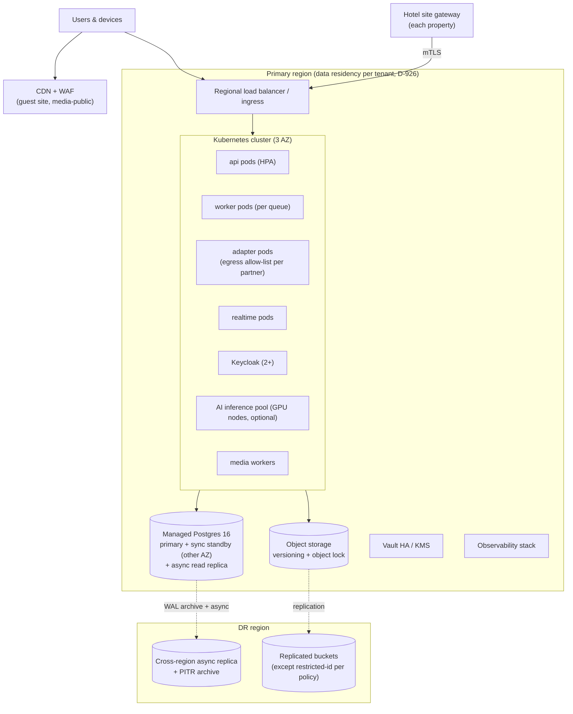

### 7.2 On-prem single-hotel profile (`onprem-single-hotel`)

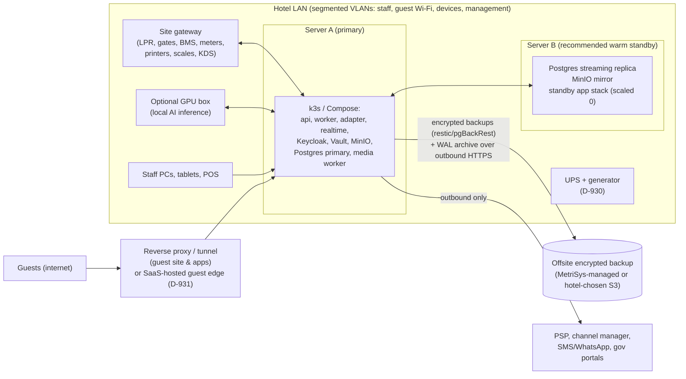

Notes: public guest booking for an on-prem hotel either traverses a hardened reverse proxy/tunnel into the hotel, or (recommended, D-931) the guest website and booking API edge run in the SaaS edge with a secure link to the hotel stack. Internet loss on-prem keeps all internal operations running; partner calls queue in the outbox.

### 7.3 HA, backup, restore — targets (assumptions to confirm)

| Item | SaaS target | On-prem target | Mechanism | Decision |
|---|---|---|---|---|
| Availability (core staff API, monthly) | 99.9 % | 99.5 % with warm standby; 99.0 % single server | multi-AZ; standby promotion runbook | D-927 |
| RPO — transactional data | ≤ 5 min (cross-region), 0 within region (sync standby) | ≤ 15 min offsite (WAL archive), ≤ 1 min to standby | PITR WAL archiving; streaming replica | D-928 |
| RTO — core operations | ≤ 1 h regional failover; ≤ 15 min AZ | ≤ 2 h hardware failure with standby; ≤ 8 h rebuild from offsite | runbooks, IaC, rehearsed | D-929 |
| Object storage RPO | ≤ 15 min (replication) | ≤ 24 h offsite sync (evidence ≤ 1 h) | bucket replication / mirror | D-928 |
| Backup retention | 35 days PITR; monthly 12 months; yearly per JUR retention | same, capacity-sized | pgBackRest/restic, immutable copies | D-932 |
| Restore test | monthly automated restore to isolated env + checksum and ledger-balance verification | quarterly site drill + monthly automated offsite restore test | SCR-ADM-backup-restore records evidence | D-933 |
| Encryption | at rest (KMS), in transit TLS 1.2+ | LUKS disks, TLS, backup encryption keys held offsite (escrow) | — | D-934 |

**Restore verification** (runs after every test restore): row counts per schema, `fin` trial balance equals pre-backup snapshot, stock balance projection equals ledger replay, outbox relay restarted without duplicate external effects (inbox dedup proves idempotency), RLS isolation probe passes.

**Site survivability during WAN outage (both profiles):** site gateway caches parking permits/plates (valid next 24 h) to keep gates working; KDS and printers are fed from the site gateway queue; staff apps fall to offline mode (§8). For SaaS hotels a WAN outage means the property relies on staff offline queues + manual paths (key cards via lock system, paper registration fallback) — the continuity runbook in `docs/12` defines this.

---

## 8. Sync and offline strategy (ADR-008)

### 8.1 Client capabilities by app

| App | Offline read cache | Offline command queue | Local authority |
|---|---|---|---|
| Staff app (housekeeping, engineering, receiving, security, F&B) | role snapshot: today's rooms/tasks, assigned WOs, open POs/ASNs for today, menus, incident playbooks | yes (§8.3) | none |
| POS / bar terminal | menu, prices, open checks for the device, pre-authorised offline limits | yes (store-and-forward) | limited: may accept cash and local-terminal card auths per PSP offline rules only if the PSP adapter declares `offline_auth`; else "card unavailable" |
| KDS | tickets fed via site gateway | bump/acknowledge queued | none |
| Site gateway (LPR/gates) | permits, plates, tariffs, allow-lists | observations & decisions queued | **yes, bounded**: may open gate for cached valid permit; low-confidence reads go to attendant (SCR-PRK-lane-review) |
| Vendor app | own catalog, drafts, assigned POs | drafts only (no submit of binding acts) | none |
| Guest / corporate apps | booking details, receipts, digital pass | none for commerce (read-only when offline) | none |
| Staff web back office | none (online) | none | none |

### 8.2 Never offline (must have server acknowledgement)

The client disables these actions and shows the reason; the server rejects any queued attempt that bypasses the client.

1. Confirm a room/space/parking/club **sale** or composite hold; convert a hold; accept a quote (inventory invariant).
2. **Capture, refund, void or pay out money**; create a payment link; release a payment batch; bill-pay submit (card-present auth only through PSP-declared offline capability).
3. Check-in completion (requires server ack of room assignment, payment guarantee and registration/ID rule evaluation); checkout with settlement.
4. Vendor: submit a bid, accept a PO, confirm a sale/stock reservation, submit invoice (SF48.1.5 "offline draft that cannot confirm a sale without server acknowledgment").
5. Award an RFQ, approve a payable, approve payroll, any maker-checker approval or step-up action.
6. Post a GL journal, close a period, run night audit.
7. Accept an emergency-chef callout (atomic lock needs server).
8. Release a lost item to a claimant; confirm an incident (the incident *report* may be queued, and the app also offers a phone call path).
9. Verify OTP / sign registration (bound to server challenge).
10. Mark travel booked (needs provider reference).

### 8.3 Conflict rules per entity (for queued commands)

| Entity / command | Offline allowed | Conflict detection | Resolution rule |
|---|---|---|---|
| Room housekeeping state (dirty→clean→inspected) | yes | `base_version` of room HK state | state machine precedence: `inspected` by supervisor wins over attendant `clean`; `occupied/checked-in` from server wins over any HK state (task converted to stayover); rejected transitions surface in SCR-OPS-sync-queue |
| HK task start/complete, minibar count | yes | task version; minibar `count_id` | task complete is idempotent; minibar consumption posts **once** keyed by `(room, count_id)`; if the guest already checked out, charge goes to late-charge review, not auto-post |
| Linen custody movement | yes | none (ledger append) | appended with client time + server receive time; negative custody projection → exception case |
| Service case note / status | yes | case version | notes always merge (append); status: server `closed` wins, client update becomes a reopen request |
| Work order progress, photos, parts used | yes | WO version | append evidence; status regression rejected; parts issue creates stock movement only on sync (may fail if stock insufficient → exception) |
| Receiving draft (scan, weight, temperature, photos) | yes (draft) | PO version; ASN | draft merges; **posting the GRN requires server** (8.2 #5 analogue); duplicate scans deduped by `scan_dedup_key` |
| Stock count lines | yes | count session version | last-write per `(count_session, bin, item, lot)` with both values audit-logged; variance approval online |
| Store issue to kitchen/bar (barcode) | queued as request | stock availability at sync | applied if available; if insufficient → partial + exception; never negative |
| POS order lines, tabs | yes | `client_check_id` | server dedups; price changes after offline sale: offline price honoured if within configured tolerance, else manager review; room charge from offline POS → **pending folio charge** requiring online validation of in-house status |
| Time punches | yes | `client_punch_id` | accepted with device time + trust flag; > 15 min skew → manager review |
| Incident report | yes (and call prompt) | dedup key | always accepted; confirmation online |
| Lost-item intake | yes | item_no generated server-side on sync (temp id locally) | custody chain starts at intake time |
| Parking observation/decision at gateway | yes | `device_event_id` | observations upsert; session built server-side; tariff posts once |
| Guest profile edits by staff | no (online) | — | — |

### 8.4 Sync protocol

`POST /v1/sync/commands` with batch `[ {client_command_id, command_type, entity_ref, base_version, payload, client_time} ]` in causal order; response per command `accepted|merged|rejected{code, server_state}`; `GET /v1/sync/snapshot?scope=hk_board&since=<cursor>` returns deltas from the owning context's change feed (outbox-driven projection with monotonic cursor). Devices are enrolled (device realm) and a stolen device is revoked remotely; offline caches are encrypted and expire (default 72 h for staff, configurable).

---

## 9. Transactional outbox / inbox

### 9.1 Tables

```sql
CREATE SCHEMA IF NOT EXISTS plt;

-- Outbox: written in the same transaction as the domain change.
CREATE TABLE plt.outbox (
  id              bigint GENERATED ALWAYS AS IDENTITY,
  event_id        uuid        NOT NULL,           -- uuidv7, envelope id
  tenant_id       uuid        NOT NULL,
  property_id     uuid,
  aggregate_type  text        NOT NULL,           -- e.g. 'res.reservation'
  aggregate_id    uuid        NOT NULL,
  event_type      text        NOT NULL,           -- 'ReservationConfirmed'
  event_version   int         NOT NULL,
  data_class      text        NOT NULL CHECK (data_class IN ('public','internal','confidential','restricted')),
  occurred_at     timestamptz NOT NULL DEFAULT now(),
  business_date   date,
  correlation_id  uuid        NOT NULL,
  causation_id    uuid,
  actor           jsonb       NOT NULL,           -- {type:'staff'|'guest'|'system', id}
  payload         jsonb       NOT NULL,
  published_at    timestamptz,
  publish_attempts int        NOT NULL DEFAULT 0,
  last_error      text,
  PRIMARY KEY (id, occurred_at)
) PARTITION BY RANGE (occurred_at);
CREATE UNIQUE INDEX outbox_event_id_uq ON plt.outbox (event_id, occurred_at);
CREATE INDEX outbox_unpublished ON plt.outbox (id) WHERE published_at IS NULL;
-- Ordering guarantee: per aggregate by id; relay uses SELECT ... FOR UPDATE SKIP LOCKED in id order,
-- and never publishes event N+1 of an aggregate while N is unpublished (aggregate-ordered relay).

-- Subscriptions (internal consumers and external webhooks).
CREATE TABLE plt.subscription (
  id              uuid PRIMARY KEY,
  tenant_id       uuid,                           -- NULL = platform-internal consumer
  consumer        text NOT NULL,                  -- 'fin.posting', 'webhook:partner-x'
  event_type      text NOT NULL,
  accepted_versions int[] NOT NULL,
  target          jsonb NOT NULL,                 -- internal handler or {url, secret_ref}
  active          boolean NOT NULL DEFAULT true,
  UNIQUE (tenant_id, consumer, event_type)
);

-- Inbox: consumer-side dedup; inserted in the same transaction as the consumer's effects.
CREATE TABLE plt.inbox (
  consumer        text        NOT NULL,
  event_id        uuid        NOT NULL,
  tenant_id       uuid        NOT NULL,
  event_type      text        NOT NULL,
  received_at     timestamptz NOT NULL DEFAULT now(),
  processed_at    timestamptz,
  status          text        NOT NULL DEFAULT 'received'
                  CHECK (status IN ('received','processed','failed','dead','skipped_version')),
  attempts        int         NOT NULL DEFAULT 0,
  last_error      text,
  PRIMARY KEY (consumer, event_id)
);

-- Inbound partner webhooks: verified first, then routed to inbox/handlers.
CREATE TABLE plt.inbound_webhook (
  id                 uuid PRIMARY KEY,
  tenant_id          uuid,
  provider           text        NOT NULL,        -- 'psp:x', 'channel:y', 'billpay:khedmah'
  provider_event_id  text        NOT NULL,
  signature_valid    boolean     NOT NULL,
  received_at        timestamptz NOT NULL DEFAULT now(),
  headers_redacted   jsonb       NOT NULL,
  body_redacted      jsonb       NOT NULL,        -- PAN/CVV never present; tokens only
  body_sha256        text        NOT NULL,
  status             text        NOT NULL DEFAULT 'accepted'
                     CHECK (status IN ('accepted','rejected_signature','duplicate','processed','failed','dead')),
  UNIQUE (provider, provider_event_id)
);

-- Outbound delivery attempts to external subscribers (developer platform M33).
CREATE TABLE plt.webhook_delivery (
  id              bigint GENERATED ALWAYS AS IDENTITY PRIMARY KEY,
  subscription_id uuid   NOT NULL REFERENCES plt.subscription(id),
  event_id        uuid   NOT NULL,
  attempt         int    NOT NULL,
  status_code     int,
  next_attempt_at timestamptz,
  outcome         text   CHECK (outcome IN ('delivered','retrying','dead')),
  UNIQUE (subscription_id, event_id, attempt)
);

-- Idempotency for synchronous API commands (Idempotency-Key header).
CREATE TABLE plt.idempotency_key (
  tenant_id       uuid NOT NULL,
  principal_id    uuid NOT NULL,
  key             text NOT NULL,
  request_hash    text NOT NULL,                  -- same key + different body => 422
  status          text NOT NULL CHECK (status IN ('in_progress','completed','failed')),
  response_code   int,
  response_body   jsonb,
  created_at      timestamptz NOT NULL DEFAULT now(),
  expires_at      timestamptz NOT NULL,           -- >= 24h; money/stock keys 30 days
  PRIMARY KEY (tenant_id, principal_id, key)
);
```

### 9.2 Behaviour

1. **Publish:** relay polls (`LISTEN outbox_new` wake-up + 1 s poll), locks a batch with `SKIP LOCKED`, dispatches, sets `published_at`. Internal consumer dispatch = enqueue pg-boss job per (consumer, event); the consumer handler inserts into `plt.inbox` first (`ON CONFLICT DO NOTHING` → if no row inserted, it is a duplicate: ack and exit).
2. **Retry/dead letter:** exponential backoff (1 s → 1 h, 12 attempts default, per-consumer policy); then `status='dead'` and an exception item (SCR-ADM-dead-letters) with replay/skip actions (replay requires `integration_admin`; skip requires reason + second approver for money/stock consumers).
3. **Ordering:** consumers must be commutative or check aggregate version; ledger consumers use source ids and idempotency keys so reordering cannot double-post.
4. **Inbound ambiguous outcomes (payments, bill-pay, travel, disbursement):** on timeout the local record goes to `unknown`/`pending`; a scheduled **inquiry job** calls the provider's status endpoint; **no second submission is ever made until inquiry proves the first failed** (§E, §K cross-utility guard). If the provider has no inquiry capability, the item is routed to manual evidence review.
5. **Replay:** outbox rows are retained ≥ 90 days (partitions dropped after archive); partner resend and projection rebuild read from outbox archive.
6. **Retention of payloads:** `restricted` data class never stored in payload (reference only); `confidential` payloads redacted in webhook deliveries unless the subscription is scoped for them.

---

## 10. Financial and stock ledger design

### 10.1 Ledgers in the system

| Ledger | Table | Unit | Owner | Balance projection | Reversal rule |
|---|---|---|---|---|---|
| General ledger | `fin.journal` + `fin.journal_line` | money (txn + functional) | FIN | `fin.account_balance(period, account, cost_center)`; trial balance | reversing journal in open period; original untouched |
| Guest/event/corporate folio | `fin.folio_entry` | money | FIN | `fin.folio_balance(window)` | `reversal` entry with `reverses_id`; transfers are paired out/in entries |
| Payments | `fin.payment_txn` (+ provider status log) | money | FIN | intent status projection | refund/void are new txns; chargeback new txn |
| Cash drawer | `fin.cash_movement` | money | FIN | shift expected cash | correction movement with reason + approver |
| Payables/receivables | `fin.payable` state + `fin.ap_ledger`/`fin.ar_ledger` entries | money | FIN | aging projections | credit notes, reversal entries |
| Stock | `stk.stock_ledger` | base UOM qty + cost | STK | `stk.stock_balance` (item/lot/bin/state) — synchronous | `reverse` movement; waste never back to available |
| Cylinder custody | `stk.cylinder_custody` | units + deposit | STK | custody by state/location | reversal entry |
| Linen custody | `stk.linen_custody` | units/kg | STK | par/location | reversal entry |
| Points | `loy.points_ledger` | points | LOY | `loy.points_balance` — synchronous | `reverse` entry once per original |
| Referral commission | `loy.commission_ledger` | money | LOY | referrer statement | `reversed` entry (clawback) |
| Vouchers | `com.voucher_ledger` | money | COM (liability GL in FIN) | voucher remaining value | reversal entry |
| Lost-item custody, incident log | `saf.custody_event`, `saf.incident_log` | events | SAF | current holder/status | correction entry; hash chain |

### 10.2 Posting pipeline to GL

```
operational ledger entry (folio_entry / stock_ledger / payroll run / payable / points / commission)
   └─ outbox event (e.g. FolioChargePosted v1, StockMovementPosted v1, PayrollRunApproved v1)
        └─ FIN posting consumer (inbox dedup on event_id)
             └─ resolve posting_rule(event_type, version, property, effective business_date)
                  └─ build balanced journal (debit=credit per currency and functional)
                       └─ assert period open (else post to current open period with 'late' flag + reference)
                            └─ INSERT journal (+ source_event_id UNIQUE) → journal lines → COMMIT
```
- Missing posting rule → event goes to `fin.unposted_queue` (visible in SCR-FIN-posting-exceptions); nothing is silently dropped; flash reports show **incomplete** until cleared (§G.8).
- Estimated vs actual: accruals (utilities, payroll, invoices not yet received) post with `basis='estimate'` and auto-reverse on the first day of next period or on actual invoice match; reports label them (README §3.6).
- Payroll: one journal per run per department/cost center with aggregate salary expense/liabilities; individual pay never enters GL lines.

### 10.3 Period and business-date locks

- **Business date lock:** night audit closes business date D: no folio entry with `business_date = D` can be inserted afterwards; late charges post to D+1 with reference to D. Reopen requires `financial_controller` + step-up and creates a reopen record (SM-night-audit).
- **Accounting period lock:** `fin.period.status` `open → soft_closed` (only finance adjustments) `→ locked` (nothing). Locked-period corrections are reversing entries in the current period with a `restates_period_id` reference; BI can show restated views (SF32.3.5).
- **Stock count lock:** during a blind count session for a store, issues from that store queue or require supervisor override; count variance posts as `count` movements with approval.

### 10.4 Idempotency keys (standard formats)

| Operation | Key |
|---|---|
| Folio charge from source | `folio:{source_type}:{source_ref}` e.g. `folio:parking:{session_id}`, `folio:pos:{check_id}:{line_id}` |
| Stock receipt line | `grn:{receipt_id}:{receipt_line_id}` |
| Stock issue by scan | `issue:{device_id}:{scan_uuid}` |
| Payment op | client/API `Idempotency-Key` + `(intent_id, op, amount)` uniqueness |
| GL journal | `source_event_id` |
| Points earn | `earn:{source_type}:{source_ref}:{rule_version}` |
| Disbursement | `disb:{batch_id}:{payable_id}` |
| Bill-pay | `billpay:{payable_id}:{attempt_group}` — attempt group only changes after inquiry proved failure |

### 10.5 Invariant tests (seed for `docs/09`)

Replay the same event/scan/callback N times → one ledger effect; reversing twice → second rejected; period locked → insert rejected; waste → available movement → rejected; refund > captured → rejected; journal unbalanced → commit fails; negative stock/points → rejected.

---

## 11. Access scoping and authorization

### 11.1 Scope model

A permission grant = `(principal, role, scope)`, where scope ⊆ `tenant → property → department → record set`, plus **field policies**. Permission strings: `<ctx>.<resource>.<action>` (e.g. `fin.payable.approve`, `res.reservation.write`, `wrk.payroll.view_individual`). Grants may carry limits (e.g. `fin.refund.create` up to 500.000 OMR; comp/void limits for POS).

| Level | Mechanism |
|---|---|
| Tenant | RLS `tenant_id = current_setting('app.tenant_id')::uuid`; IdP realm/org; separate keys |
| Property | RLS `property_id = ANY(current_setting('app.property_ids')::uuid[])` |
| Department | policy engine filter (department_id in grant) applied in repositories + RLS for high-risk tables (payroll, HR, incidents) |
| Record | ownership/assignment predicates (vendor sees own jobs/POs/bids; housekeeper sees assigned rooms; corporate booker sees own company's bookings; guest sees own) — enforced by RLS on vendor/guest/corporate realms and by application policy for staff |
| Field | field policies: `mask` / `hide` / `decrypt-with-log` (SIN, national ID, passport, bank account, salary, DOB, ID image, card token metadata, guest health/accessibility notes) |

### 11.2 Identity realm separation

`staff`, `guest`, `corporate`, `vendor`, `device` realms (ADR-007). API gateways route realms to distinct route groups (`/v1/...` staff, `/v1/guest/...`, `/v1/corporate/...`, `/v1/vendor/...`, `/v1/device/...`). A token from one realm is rejected by other route groups. Vendor and corporate principals are always bound to their `vendor_id` / `corporate_account_id`, injected into `app.party_id` for RLS. Internal employee directory and corporate/vendor portals never share a principal (SF46.3.6).

### 11.3 Maker-checker, step-up, segregation of duties

| Action class | Maker | Checker | Step-up (`acr=2`, ≤5 min) | SoD rule |
|---|---|---|---|---|
| Payment batch / disbursement release | ap_clerk | finance_approver → payment_releaser | release | three distinct principals |
| Refund above limit, folio reopen, business-date reopen | cashier / FO manager | financial_controller | yes | maker ≠ checker |
| Payroll run | payroll_officer | payroll_approver (+ finance_approver for release) | yes | distinct |
| Vendor approval, vendor bank detail change | procurement_officer | procurement_approver / finance_approver (bank) | bank change yes | distinct; bank change freezes payouts 24 h (configurable) and notifies vendor admin out-of-band |
| RFQ waiver, award override | procurement_officer | procurement_approver (higher threshold) | override yes | requester ≠ awarder; conflict declaration |
| Rule pack verification, activation gate enable | compliance_officer | counsel/second compliance reviewer | yes | distinct |
| Role grants with privileged permissions | property_admin | tenant_admin | yes | distinct; time-boxed optional |
| Overbooking limit, rate guardrail override | revenue_manager | gm | no/yes by value | distinct |
| Referral payout (per market) | referral_program_admin | finance_approver + compliance_officer (gate) | yes | distinct |
| Emergency (break-glass) access | any privileged | post-hoc review by dpo/tenant_admin | yes | auto-expire 4 h, alert |

### 11.4 RLS policy sketch

```sql
-- Session context set per transaction by the API middleware (never by client input):
--   SET LOCAL app.tenant_id = '...'; SET LOCAL app.property_ids = '{...}';
--   SET LOCAL app.realm = 'staff|guest|corporate|vendor|device'; SET LOCAL app.party_id = '...';
ALTER TABLE res.reservation ENABLE ROW LEVEL SECURITY;
ALTER TABLE res.reservation FORCE ROW LEVEL SECURITY;

CREATE POLICY tenant_property_isolation ON res.reservation
  USING (tenant_id = current_setting('app.tenant_id')::uuid
         AND property_id = ANY (current_setting('app.property_ids')::uuid[]));

-- Realm restriction: corporate principals see only their company's reservations.
CREATE POLICY corporate_own ON res.reservation AS RESTRICTIVE
  USING (current_setting('app.realm') <> 'corporate'
         OR corporate_account_id = current_setting('app.party_id')::uuid);

-- Guests see only reservations where they are booker or occupant.
CREATE POLICY guest_own ON res.reservation AS RESTRICTIVE
  USING (current_setting('app.realm') <> 'guest'
         OR booker_guest_id = current_setting('app.party_id')::uuid
         OR EXISTS (SELECT 1 FROM res.occupant o JOIN res.reservation_room rr ON rr.id = o.reservation_room_id
                    WHERE rr.reservation_id = reservation.id AND o.guest_id = current_setting('app.party_id')::uuid));

-- Vendors: bids visible only to the bidding vendor (competitors' bids never visible, SF48.3.7).
CREATE POLICY vendor_own_bids ON stk.bid AS RESTRICTIVE
  USING (current_setting('app.realm') <> 'vendor' OR vendor_id = current_setting('app.party_id')::uuid);

-- Payroll: department-restricted and role-restricted even for staff realm.
CREATE POLICY payroll_restricted ON wrk.payroll_result AS RESTRICTIVE
  USING (current_setting('app.realm') = 'staff'
         AND pg_has_role(current_user, 'wrk_payroll_reader', 'MEMBER'));
```
Application DB roles: `app_<ctx>` (owner of nothing; DML on own schema), `app_readonly_bi`, `maintenance_bypass` (BYPASSRLS, used only by audited ops jobs). Tests include cross-tenant and cross-realm probes on every endpoint (OWASP API1/API3/API5), automated in CI (`docs/09`).

### 11.5 Audit

`iam.audit_event` (append-only, hash-chained per tenant/day): who, realm, acr, action, resource, before/after digest (field-level diff for non-restricted fields), reason, approval ids, correlation id, IP/device. `iam.sensitive_access_log` for every decrypt/view of restricted fields (SIN, ID images, salary, bank). Privileged sessions (tenant_admin, maintenance) are recorded with reason codes. Audit exports for regulators via SCR-ADM-audit-log.

### 11.6 Protected fields

| Field class | Storage | Default display | Who can reveal | Extra |
|---|---|---|---|---|
| SIN / national ID / passport (employee) | Vault transit envelope, blind index for equality | `•••-•••-123` | hr_officer, payroll_officer (reason + log) | never exported except statutory files |
| Guest ID document number & image | IDV restricted bucket + encrypted column; TTL | masked; image hidden | front_desk_agent during check-in session only; dpo | auto-delete per JUR retention |
| Salary / compensation / payroll lines | encrypted columns | hidden (aggregates only for managers) | payroll roles, employee (own) | independent retention/export controls (F27.4) |
| Bank accounts (employees, vendors) | encrypted + last4 | last 4 | payroll/AP approvers | change = maker-checker + freeze |
| Card data | **not stored**: PSP token + brand/last4/expiry month only | last 4 | — | PCI scope limited to PSP-hosted fields/terminals (`docs/07`) |
| Health/accessibility notes | encrypted column | "has accessibility needs" flag | assigned staff per task | purpose-limited |

---

## 12. Adapter/port pattern, capability flags and simulators

```
contexts/fin/application ── uses ──> packages/ports/payment-gateway (interface + capability types)
                                              ▲
adapters/psp-<vendor>/ ── implements ─────────┤
adapters/sim-payment/  ── implements ─────────┘  (deterministic fixtures + fault injection)
```

- **Port interface** per external domain: `PaymentGatewayPort`, `BillProviderPort`, `ChannelManagerPort`, `LprPort`, `GateControllerPort`, `BmsPort`, `MeterPort`, `MessagingPort` (sms/whatsapp/email/push), `IdOcrPort`, `ESignaturePort`, `GovFilingPort`, `BankFilePort`, `TravelProviderPort` (flight/cruise/taxi), `VendorVerificationPort`, `InvoiceOcrPort`, `EdiAsnPort`, `ScalePort`, `CdnPort`, `AiPort`, `AccountingExportPort`, `LockPort` (optional), `KioskPort` (optional).
- **Capability manifest** (stored in `plt.adapter_instance`, shown in SCR-ADM-connector-detail):

```json
{
  "adapter": "billpay-khedmah",
  "port": "BillProviderPort@1",
  "honesty_label": "blocked",
  "capabilities": {
    "biller_lookup": false, "account_validate": false, "bill_inquiry": false,
    "quote": false, "pay": false, "status_inquiry": false, "reverse": false,
    "settlement_file": false, "webhook_signed": false
  },
  "limits": {"rps": null},
  "contract_ref": null, "sandbox_tested_at": null, "certified_at": null,
  "manual_fallback": "SCR-FIN-bill-payment-detail#manual-evidence"
}
```

- **Rules:** the application checks `capability(x)` before offering an action; UI hides or disables with the reason and the manual path; API returns `409 capability_unavailable` with `manual_path`. Honesty label below `sandbox-tested` cannot be enabled in production for money-moving capabilities (feature gate). Label changes are audited and maker-checker.
- **Simulator adapters** (`adapters/sim-*`) exist for every port from Phase 2; configurable scenarios: success, decline, timeout-then-success, duplicate callback, out-of-order callback, partial settlement, provider outage, low-confidence LPR read, OCR misread, bank partial rejection, flight cancellation. They power `docs/09` G20 and demos, and are labelled "SIMULATOR" in every UI where their data appears (never mistaken for release functionality).
- **Resilience:** per-adapter circuit breaker, timeout, rate limit, bulkhead (adapter worker pool), and secret access only through Vault role `adapter-<name>`.

---

## 13. API versioning and deprecation

| Topic | Policy |
|---|---|
| Style | REST JSON, OpenAPI 3.1 source of truth in `packages/contracts/openapi`, property paths `/v1/properties/{pid}/...` (README §3.5) |
| Versions | major in path; minor changes additive only (new fields/endpoints/enum values documented as extensible) |
| Breaking change | new major (`/v2/...`) served in parallel; codegen SDKs versioned via Changesets |
| Deprecation notice | `Deprecation: @<epoch>` and `Sunset: <date>` headers + developer portal notice + email to registered integrators |
| Support windows | public/partner APIs & webhooks: ≥ 12 months after successor GA; internal first-party apps: ≥ 2 released mobile app versions (forced upgrade screen after) ; on-prem: deprecations only removed in a major platform release |
| Mobile compatibility | server supports current and previous 2 app versions; `min_supported_version` endpoint drives SCR-OPS-app-update-required |
| Errors | RFC 9457 problem+json with `code`, `correlation_id`, `manual_path` when relevant |
| Concurrency | `ETag`/`If-Match` on mutable resources (row_version) |
| Idempotency | `Idempotency-Key` required on mutating money/stock/inventory/external-order calls (README §3.5); `plt.idempotency_key` |
| Pagination | cursor-based; `limit` ≤ 200 |
| Webhooks out | signed (HMAC-SHA256 with rotating secret; timestamp tolerance 5 min), versioned by event version, retries per §9.2 |
| Sandbox | per-tenant sandbox with simulator adapters (M33) |

---

## 14. Localization

| Aspect | Decision |
|---|---|
| Launch languages | English (`en`), Arabic (`ar`, RTL). Jurisdiction language packs planned: French (`fr-CA` — Québec requirements to confirm, D-935), Portuguese (`pt-PT`), Urdu (`ur`, RTL, D-936) — requirements specified in Phase 1, activation per market |
| Message format | ICU MessageFormat (plural/select/gender), keys namespaced by app/context; no string concatenation; translation memory; pseudo-localisation and RTL pseudo-locale in CI |
| Content translation | property content, KB articles, menus, room names stored as translatable fields `{en, ar, ...}` with per-language approval status (MED) |
| Numbers | CLDR per locale; Arabic UI default **Latin digits (0-9)** with user option for Arabic-Indic digits (D-937) — IDs, confirmation numbers, plates, phone numbers, IBAN always Latin digits, `dir="ltr"` isolated |
| Currency | CLDR symbol/placement; minor units from ISO 4217 (OMR 3 decimals); amounts in Arabic UI keep currency code where ambiguity exists (e.g. "ر.ع. 12.500" / "OMR 12.500") |
| Dates/times | CLDR formats; property time zone shown; business date labelled separately; week start per locale |
| Hijri | Display-only option (Umm al-Qura) alongside Gregorian in AR locale, per property/user; storage and legal calendar Gregorian; invoices show Hijri only where the JUR invoice rule requires/permits (D-938) |
| Names/addresses | free-form + structured by country; Arabic names with optional Latin transliteration field; no forced first/last split |
| Bidi | `dir` at root, logical CSS properties (`margin-inline-start`), mirrored icons only for directional meaning; Unicode isolates for mixed content |
| Documents | invoices/registration cards/BEOs rendered per locale and per JUR rule (bilingual invoices where required) |
| Search | Arabic normalisation (alef/hamza/ta marbuta/diacritics) in FTS config |

---

## 15. Performance and capacity assumptions (to confirm, D-939)

| Dimension | Release 1 design point (single hotel) | SaaS planning point |
|---|---|---|
| Rooms | up to 600 rooms; 25 room types | 500 properties, 60 000 rooms total |
| Timed resources | 40 spaces/partitions, 60 tables, 3 parking zones × 500 spaces | ×500 |
| Reservations | 150 k/year; 5 k active future | 50 M total rows in 3 years |
| Concurrent staff users | 150 | 25 000 |
| Guest booking searches | 30 req/s peak (bot-filtered), availability p95 < 500 ms server-side | 1 500 req/s aggregated, cached ARI |
| Booking commit | p95 < 800 ms excluding PSP; zero oversell under 50 concurrent attempts on the last room (test) | — |
| POS | 20 terminals; order-to-KDS p95 < 1 s on LAN | — |
| LPR | 4 lanes; observation to gate decision p95 < 1.5 s (local gateway) | — |
| Events/outbox | 200 k events/day, relay lag p95 < 2 s | 20 M/day, partitioned |
| Stock | 5 000 SKUs, 3 000 movements/day | — |
| Payroll | 400 employees; run < 5 min | — |
| Media | 5 000 assets; enhancement batch 200 images/h on 1 mid GPU (assumption; CPU fallback ~20/h) | GPU pool autoscaled |
| Guest AI | 200 conversations/day; first token < 2 s (local model sizing D-940) | per-tenant quotas |
| Night audit | < 10 min for 600 rooms | parallel by property |
| Hardware (on-prem) | Server A: 16 vCPU, 64 GB RAM, 2×1.92 TB NVMe RAID1; Server B same; optional GPU 24 GB VRAM | — |

---

## 16. Repository and monorepo layout (Phase 2 proposal)

```
/ (pnpm workspace, Turborepo)
├─ apps/
│  ├─ api/                    # NestJS bootstrap; process roles api|worker|adapter|realtime
│  ├─ web-staff/              # Next.js back office (FO, FIN, HR, ENG, PRC, FNB, GM, ADM, MED, SAF, OPS)
│  ├─ web-guest/              # Next.js SSR guest website & booking (GST), low-bandwidth budget
│  ├─ web-corporate/          # Next.js MetriStay Business portal (CORP)
│  ├─ web-vendor/             # Next.js vendor fallback (VEN)
│  ├─ web-partner-hub/        # referrer dashboard (GST partner hub), gated
│  ├─ mobile-staff/           # Expo RN staff app (offline queue)
│  ├─ mobile-guest/           # Expo RN guest app
│  ├─ mobile-corporate/       # Expo RN corporate app (CAPP)
│  ├─ mobile-vendor/          # Expo RN vendor app (VAPP)
│  ├─ kiosk-pos-shell/        # POS/KDS/kiosk shell with device identity
│  └─ site-gateway/           # on-site device gateway (LPR, gates, BMS, meters, printers, scales)
├─ contexts/                  # bounded contexts (domain + application + infrastructure + api)
│  ├─ plt/ iam/ jur/ med/ idv/ pty/ vnd/ loy/ fin/ inv/ stk/ eng/ res/ dst/ com/ trv/ wrk/ saf/ aia/ bi/
│  └─ <ctx>/{domain,application,infrastructure,api,test}/
├─ packages/
│  ├─ kernel/                 # money, time/business-date, ids, result/error types, envelope
│  ├─ contracts/              # OpenAPI 3.1, event schemas (versioned), generated clients
│  ├─ ports/                  # port interfaces + capability types
│  ├─ policy/                 # authorization policy engine + field policies
│  ├─ i18n/                   # ICU catalogs en/ar (+ packs), formatters, Hijri display helper
│  ├─ ui-tokens/              # design tokens (docs/04 §11) → CSS vars + RN theme
│  ├─ ui-web/ ui-native/      # accessible component libraries (RTL-aware)
│  ├─ offline/                # client command queue, snapshot cache, conflict UI helpers
│  ├─ testing/                # fixtures, fake clock, tenant factories, contract test harness
│  └─ sdk/                    # public TS SDK for integrators (M33)
├─ adapters/
│  ├─ sim-*/                  # simulator per port (mandatory)
│  └─ <partner>/              # real adapters (added only with contract/sandbox)
├─ migrations/
│  ├─ <ctx>/NNNN_<name>.sql   # SQL-first, per schema, expand/contract; RLS policies alongside
│  └─ seed/                   # reference data: ISO currencies, jurisdiction tree, CoA templates, rule-pack fixtures
├─ infra/
│  ├─ helm/                   # SaaS charts
│  ├─ k3s-onprem/ compose/    # on-prem profile
│  ├─ terraform/              # SaaS cloud resources
│  ├─ keycloak/               # realm exports (themes EN/AR)
│  ├─ vault/                  # policies
│  ├─ observability/          # OTel collector, dashboards, alerts
│  └─ backup/                 # pgBackRest/restic configs, restore-verification scripts
├─ tests/
│  ├─ e2e/                    # G1–G20 scenarios (docs/09)
│  ├─ perf/                   # k6 scripts for §15 targets
│  ├─ security/               # tenant/realm isolation probes, OWASP API
│  └─ a11y/                   # axe + screen-reader scripts (docs/04 §8)
├─ docs/                      # this planning pack (+ runbooks, ADRs as they evolve)
└─ tools/                     # dependency-cruiser rules, schema lints (no-upline lint), codegen
```

---

## 17. Architecture fitness functions (CI gates from Phase 2)

1. Dependency-cruiser: context imports follow §4.3 layer order; no import of another context's `domain/` or `infrastructure/`.
2. Schema lint: every table has `tenant_id`, RLS enabled + forced; ledger tables have no UPDATE/DELETE grants; money columns are `bigint` + currency; **no referral hierarchy columns** (`parent_referrer`, `upline`, `downline`, `sponsor`, `rank`) in `loy`.
3. Contract tests: producers vs consumer fixtures for each event version; OpenAPI diff blocks breaking changes in same major.
4. Invariant tests (§10.5), concurrency tests for last-room/last-slot, exclusion constraints.
5. Isolation probes: cross-tenant, cross-realm, cross-property, vendor-sees-competitor-bid attempts must return 404/403.
6. i18n: no hard-coded user strings; RTL snapshot tests; pseudo-locale overflow check.
7. Accessibility: axe-core zero serious/critical violations on changed screens (`docs/04` §8).
8. Honesty: adapters below `sandbox-tested` cannot have production money capabilities enabled.

---

## 18. Architecture decisions requiring owners (registered in `docs/13`)

| Id | Decision | Default assumption used in this pack | Owner |
|---|---|---|---|
| D-921 | Confirm TypeScript/NestJS stack vs team skills | TS/NestJS per README §3.7 | CTO / lead architect |
| D-922 | Migration tool | SQL-first (node-pg-migrate or Atlas) | Lead architect |
| D-923 | Temporal adoption for sagas | re-evaluate at Phase 3 gate | Lead architect |
| D-924 | Observability backend (self-hosted vs managed) | Grafana stack | Platform lead |
| D-925 | OpenSearch for large tenants | not in R1 | Platform lead |
| D-926 | SaaS hosting region(s) and data residency per market (OM/SA/CA/PT/PK) | per-tenant region selection; residency confirmed by counsel | Compliance + CTO |
| D-927 | Availability targets | 99.9 % SaaS / 99.5 % on-prem with standby | Product owner + pilot hotel |
| D-928 | RPO targets | §7.3 | Product owner + pilot hotel |
| D-929 | RTO targets | §7.3 | Product owner + pilot hotel |
| D-930 | On-prem power/UPS/network profile | UPS ≥ 30 min + generator | Pilot hotel IT |
| D-931 | On-prem guest-facing edge (tunnel vs SaaS edge) | SaaS-hosted guest edge | CTO |
| D-932 | Backup retention schedule by market | §7.3 + JUR retention | Compliance |
| D-933 | Restore drill frequency | monthly automated / quarterly site | Platform lead |
| D-934 | Backup key escrow holder | MetriSys ops + hotel sealed copy | Security lead |
| D-935 | French (Canada) language pack scope | spec in Phase 1, build if Québec pilot | Product owner |
| D-936 | Urdu language pack scope | spec in Phase 1, activation later | Product owner |
| D-937 | Arabic digits default | Latin digits default, user option | UX lead + pilot hotel |
| D-938 | Hijri display scope and invoice calendar | display option; legal per JUR | UX lead + counsel (SA/OM) |
| D-939 | Capacity design point | §15 | Product owner + pilot hotel |
| D-940 | Local LLM model and GPU sizing (licence review) | open-weight model, 24 GB GPU | AI lead + counsel |
