# 08 — Phase 2–8 Backlog, Dependencies, Critical Path and Release Gates

**Pack:** MetriStay Hospitality Suite Phase 1 planning pack v0.1 (draft for review) • **Date:** 2026-09-28
**Governing source:** master prompt v3.0 Sections B (phase plan/gates), C (module build phases), G (integrated acceptance), I (vertical-slice definition of done), J (decisions), K/Q (feature ids), P.5 (reality-based rollout).
**Companion documents:** decisions `D-nnn` and risks `R-nnn` are defined in `00-executive-scope.md` §10–§11; acceptance tests `AT-Gnn.x` are specified in `09-acceptance-and-migration.md` (the sub-id map in §A1 below is the provisional numbering this backlog relies on — `docs/09` is authoritative if it renumbers); module/feature/subfeature ids are catalogued in `01-module-catalogue.md`.

> **Status honesty.** Every work package (WP) below is a plan. No WP is "done" because a screen exists. A WP that depends on a partner, device or regulator without a contract/certification delivers a **mock adapter + honest manual path**, and its partner item stays in the blocker table (§11) until evidence exists. Phases 2–5 exits are **internal milestones only**; only Phase 6 exit is Customer Release 1.

---

## 1. How to read this backlog

### 1.1 Vertical-slice definition of done (applies to every WP)

Section I: "Each slice includes UI, API, migration, permission, events, tests, reports and runbook." A WP is complete only when **all eight** exist for every feature it claims:

| # | Element | Minimum evidence |
|---|---|---|
| V1 | **UI** | Staff/guest/corporate/vendor screens listed in `docs/04` implemented in EN + AR/RTL, empty/loading/error states, keyboard + screen-reader path (WCAG 2.2 AA target), mobile layout. |
| V2 | **API** | OpenAPI 3.1 contract merged; property-scoped paths; `Idempotency-Key` on money/stock/inventory/external-order mutations; contract tests. |
| V3 | **Migrations** | Forward migration + documented rollback/forward-fix; seed/fixture data; RLS policies for `tenant_id`/`property_id`. |
| V4 | **Permissions** | Role/scope matrix rows (README §3.3 roles), field-level masking where specified, step-up for privileged actions, negative authorization tests (OWASP API BOLA/BFLA). |
| V5 | **Events** | Domain events via transactional outbox, inbox dedup on `event_id`, schema versioned in registry, replay test. |
| V6 | **Tests** | Unit + integration + contract + the listed `AT-Gnn.x` acceptance cases green in CI against Postgres; failure-injection cases for every external adapter. |
| V7 | **Reports** | KPI/report effects registered in M32/M65 dictionary with source/freshness and `estimate` vs `reconciled` vs `certified` label. |
| V8 | **Runbook** | Operator runbook (configuration, manual fallback path, reconciliation, alert response, restore) in `docs/runbooks/` (created in Phase 2). |

Partner-dependent WPs additionally need: **adapter capability flags**, **simulator** (deterministic fixtures incl. timeout, duplicate callback, outage), and a blocker-table entry until `partner-contracted` → `sandbox-tested` → `certified` honesty labels are earned (README §3.6).

### 1.2 Estimate convention
- Unit: **person-weeks (pw)** of delivery-team effort (engineering + embedded QA + embedded UX for that slice), shown **low / likely / high**.
- Excludes cross-team overhead (product management, architecture, SRE on-call, security programme, partner management, compliance coordination, release management), added at **+25–35 %** in `00-executive-scope.md` §13.
- Confidence: **low** (planning-grade, ±40 %) until D-001 (blueprints), D-002 (pilot hotel) and D-023 (incumbent systems) are resolved; re-estimate at each phase gate.

### 1.3 Phase totals (sum of WPs below)

| Phase | WPs | Low pw | Likely pw | High pw | Likely person-months (÷4.33) | Incl. overhead ×1.3 (PM) |
|---|---|---|---|---|---|---|
| 2 Platform & PMS foundation | 20 | 300 | 449 | 690 | 104 | 90 / **135** / 207 |
| 3 Property commerce & corporate ops | 25 | 483 | 713 | 1,080 | 165 | 145 / **214** / 324 |
| 4 Unified hotel ERP & operating costs | 20 | 345 | 514 | 789 | 119 | 104 / **154** / 237 |
| 5 Payments, loyalty & ecosystem | 13 | 231 | 344 | 543 | 79 | 69 / **103** / 163 |
| 6 Release 1 hardening & launch | 13 | 167 | 259 | 404 | 60 | 50 / **78** / 121 |
| **Release 1 (Phases 2–6)** | **91** | **1,526** | **2,279** | **3,506** | **526** | **458 / 684 / 1,053** |
| 7 Connected & multi-property | 11 | 183 | 277 | 435 | 64 | 55 / **83** / 131 |
| 8 Marketplace & jurisdiction-gated growth | 7 | 138 | 206 | 321 | 48 | 41 / **62** / 96 |
| **All (Phases 2–8)** | **109** | 1,847 | 2,762 | 4,262 | 638 | 554 / 829 / 1,280 |

---

## 2. Phase 2 — Platform and PMS foundation (internal milestone)

Section B scope: identity/property/roles, business date, room and timed-resource inventory, guest profile, prices/quotes, reservation/stay, front desk, housekeeping, folio, payment abstraction, accessible direct-booking website and attribution, media publishing, ID-assisted reservation/check-in, lost-and-found, vendor identity/service taxonomy and search foundation, product/UOM/lot registry and kitchen roster, jurisdiction classifier, audit/reporting foundation, mobile accessible booking website, commercial attribution and deployment.
Section C build-phase-2 modules: M01, M02, M03, M04, M05 (core), M06 (core), M07 (direct web), M08, M09 (core), M28 (abstraction), M32/M33/M38/M44/M64/M65 (foundation), M39 (F39.1), M41 (intake/sign core), M43, M46 (identity/taxonomy), M47 (roster basis), M51 (booking website), M55 (guest desk basics), M56 (room board), M60 (core cash/night audit), M63 (engine).

| WP | Title | Modules / features | Deliverables (V1–V8 specifics) | Depends on | pw L/M/H | Exit tests |
|---|---|---|---|---|---|---|
| WP-2.1 | Engineering foundation & walking skeleton | M01, M64 F64.1 (foundation), M33 (foundation) | Monorepo (pnpm/Turborepo): `apps/api` (NestJS), `apps/admin-web` (Next.js), `apps/booking-web`, `apps/staff-mobile` (Expo), `packages/domain-*`, `packages/contracts` (OpenAPI 3.1 + event schemas); CI (lint, typecheck, unit, integration on Postgres 16, OpenAPI diff, SBOM, SAST, secret scan); environments dev/test/staging; OpenTelemetry; Keycloak dev realm; Docker Compose on-prem profile skeleton; ADR log; runbook template. | Planning gate (docs/13); D-034 (interim: both profiles built from same images) | 12/18/27 | AT-G20.9 (skeleton outage/restart smoke) |
| WP-2.2 | Tenancy, property, configuration, business date, i18n shell | M01 (tenant/property/department, time zone, business date, flags, EN/AR/RTL, a11y shell) | UI: SCR-ADM tenant/property/department setup, property profile (limited/full service, enabled outlets), feature flags; business-date panel. API `/v1/tenants`, `/v1/properties/{pid}/config`, `/business-date`. Mig: tenant, property, legal_entity stub, department, config_version, business_date. Perm: tenant_admin, property_admin. Evt: PropertyConfigured, BusinessDateRolled. RTL layout primitives, locale formatting (OMR 3-decimals). RB: property onboarding. | WP-2.1 | 12/18/27 | AT-G08.1 (date roll), AT-G09.1 (fixture properties) |
| WP-2.3 | IAM, scopes and consent registry | M02 (F: identities, SSO/MFA, property/department/role/record scopes, delegated approvals, privileged audit, consent by purpose/channel, retention/export/deletion/legal hold, employee/vendor boundaries) | Keycloak realms (staff, guest, corporate, vendor separated); RBAC+ABAC policy engine; Postgres RLS; step-up MFA; delegation with expiry; consent ledger (purpose, channel, jurisdiction, evidence); DSAR export/delete job honoring legal hold; privileged-access audit log. UI: user/role admin, my-consents (guest). Tests: BOLA/BFLA suite, tenant/property isolation suite. RB: access review, break-glass. | WP-2.2; D-021 (interim: purpose list from docs/07) | 18/27/42 | AT-G05.4 (confidential scope pattern), AT-G10.5 (vendor boundary), AT-G20.1 (isolation under concurrency) |
| WP-2.4 | Audit, outbox/inbox, workflow engine foundation | M63 (engine F63.1), M33 (event contracts), M65 (definitions F65.1.2/4) | Outbox table + relay worker (pg-boss), inbox dedup, event registry + versioning, dead-letter queue UI, replay tool; immutable audit trail service; task/SLA/escalation engine (M63 F63.1.1–5) with dry-run; KPI dictionary schema. UI: SCR-OPS exception queue, dead letters. RB: replay, DLQ triage. | WP-2.1, WP-2.3 | 15/21/33 | AT-G20.2 (duplicate event), AT-G08.4 (lineage stub) |
| WP-2.5 | Room inventory & timed-resource core | M03 (all features), M09 (core: resource, slot, composite hold, non-double-sale invariant) | Buildings/floors/room types/attributes/accessible & connecting rooms; room-type-by-night stock ledger; OOO/OOS; holds with expiry; stop-sell/allotment; controlled overbooking limit; assignment separate from sold inventory; generic timed resource + composite hold with serializable invariant. UI: inventory grid, OOO scheduler. Evt: InventoryHeld/Released, RoomOutOfOrder. Tests: property-based concurrency (no oversell). RB: overbooking policy. | WP-2.2, WP-2.4 | 18/27/39 | AT-G20.1, AT-G02.2 (engine-level) |
| WP-2.6 | Rates and quote engine | M04 (rate plans/negotiated, occupancy/child/LOS, packages/promotions, taxes/fees/rounding/currency, restrictions, quote expiry/policy snapshot, amendment/repricing, override audit) | Rate plan & restriction model; derived rates; quote service with immutable policy+tax snapshot and expiry; override with reason/approval; tax calculation via M38 port (draft rule packs flagged `unverified-assumption`). UI: rate grid, restriction calendar, quote view. Evt: QuoteIssued/Expired, RateChanged. Tests: rounding (OMR 3dp, CAD), expiry. | WP-2.5, WP-2.7 | 21/30/45 | AT-G19.2 (total price), AT-G12.1 (tax path, draft pack) |
| WP-2.7 | Jurisdiction classifier & tax engine foundation | M44 F44.1 (all), F44.2.1–2.4, F44.2.6, F44.2.8 (dashboard stub); M38 F38.1.1–1.4 (foundation) | Administrative-division model (ISO country + configurable subdivisions/municipalities); legal entity ↔ jurisdiction; rule-pack registry (CA/OM/PK/SA/PT) in `draft` with source/reviewer/status; deterministic precedence; **no global fallback** for sensitive rules; activation gates block dependent automation; effective-dated tax components; coverage/unknowns dashboard. UI: SCR-ADM jurisdiction & rule-pack registry. RB: rule-pack change control. | WP-2.2; D-019, D-020 (interim: packs stay `draft`, automation blocked) | 15/24/39 | AT-G09.1, AT-G09.2 (draft packs differ), AT-G09.4 (unknown blocks) |
| WP-2.8 | Guest profile, reservations and stays (core) | M05 (direct/walk-in bookings, amend/cancel/no-show/walk/waitlist, booker vs occupants vs payer, arrival/registration/ID policy, room move/extension/checkout); M52 F52.1.1 (profile basics, dedup candidate) | Reservation aggregate + state machine SM-reservation (docs/02); guest profile with duplicate-candidate review; idempotent create; policy snapshot; cancellation/no-show fees to folio; walk/relocation. UI: availability search, reservation form, guest profile, arrivals list. Evt: ReservationConfirmed/Amended/Cancelled/NoShow, StayCheckedIn/Out. Tests: concurrency, amendment repricing. | WP-2.5, WP-2.6, WP-2.3 | 24/36/54 | AT-G20.1, AT-G20.10 (cancel), AT-G19.2 |
| WP-2.9 | Front desk and housekeeping room board | M06 (arrivals/departures, room vs cleaning state, tasks, inspections, DND, room-ready ETA, offline conflict); M56 F56.1 (room turnaround); M55 F55.1.2 (assisted check-in basics) | Front desk dashboard (arrivals, in-house, departures), room assignment/move, check-in/out wizard (ID/policy/payment readiness checklist); housekeeping board (priority, assignment, inspection, reclean), DND/privacy; staff-mobile offline task queue with conflict rules. Evt: RoomStatusChanged, HousekeepingTaskCompleted. RB: offline mode. | WP-2.8, WP-2.19 | 18/27/39 | AT-G03.1, AT-G20.9 (offline HK) |
| WP-2.10 | Folio, cashiering, cash shifts and night audit | M08 (append-only charge/reversal/transfer, windows/payers, routing, deposits/preauth, invoice/credit note/receipt, cash shifts/refunds, night audit/reopen, finance export); M60 F60.1 (till/float, drops, shift close, night audit difference queue, immutable correction) | Folio ledger (double-entry style, minor units), routing rules, invoice numbering per legal entity (rule-pack driven), credit notes; cashier shift open/close, blind drop; night audit worker: post room/tax, no-show processing, business-date roll, audit reports, difference queue, controlled reopen; finance export file (pre-GL). UI: folio, cashier shift, night audit console. Evt: ChargePosted, FolioSettled, NightAuditCompleted. RB: night audit, reopen. | WP-2.8, WP-2.11, WP-2.7 | 24/36/54 | AT-G08.1, AT-G03.3 (post once), AT-G20.2 |
| WP-2.11 | Payment abstraction & PSP simulator | M28 F28.1.1–1.5 (abstraction, not certified) | Provider-neutral port (intent/auth/capture/void/refund/link/token/webhook/settlement), capability flags, signed-webhook verifier, idempotency store, **PSP simulator** (declines, timeouts, duplicate webhooks); cash/bank-transfer tenders; no PAN/CVV storage (hosted fields/redirect design). UI labels "simulated" on non-certified providers. | WP-2.4; D-024 (interim: simulator) | 12/18/27 | AT-G06.1 (sim), AT-G20.2 |
| WP-2.12 | Direct booking website & attribution | M51 F51.1.1–1.5, F51.2.1–2.2, F51.2.4–2.6 (basic); M07 (direct web channel) | SSR low-bandwidth booking site (EN/AR), live search with true sellable inventory, accessible room filter, total price incl. taxes/fees, policy disclosure, pay via M28 port (sim), cookie/consent banner, UTM/referrer attribution, bot filter, structured data/sitemap. Perf budget (e.g. LCP target in docs/09). Evt: QuoteViewed, BookingAttributed. | WP-2.6, WP-2.8, WP-2.13; D-004 | 18/27/42 | AT-G19.1, AT-G19.2 |
| WP-2.13 | Property media publishing (core) | M39 F39.1.1–1.7 | Upload with malware scan, rights/expiry metadata, room/venue tags, alt text/captions (EN/AR), derivatives/transcode, approval/version/rollback, CDN/MinIO publish, takedown, access log. UI: SCR-CNT media library, approval. Perm: content_editor/approver. | WP-2.3, WP-2.4 | 12/18/27 | AT-G13.1, AT-G13.3 |
| WP-2.14 | ID-assisted reservation/check-in and registration e-sign (core) | M41 F41.1.1–1.5, F41.1.7; F41.2.1–2.4, F41.2.6–2.8 (OTP via simulator) | Jurisdiction document-type rules from M44; short-lived encrypted upload; OCR via pluggable port (local engine candidate, D-037); field-by-field confirmation; registration card render + e-sign with document hash & tamper-evident receipt; QR handoff bound to session/device challenge, expiry, anti-replay; manual/in-person path; timed deletion job. **No biometric** (gated F41.1.6). | WP-2.8, WP-2.7, WP-2.3; D-021, D-037 | 15/22/36 | AT-G13.5, AT-G13.6, AT-G20.3 |
| WP-2.15 | Lost and found (core) | M43 F43.1.1–1.8 | Item intake/photo/barcode, custody transfers, privacy-limited matching, claimant verification, release/shipping, retention/disposal per jurisdiction pack, audit. Staff mobile intake. | WP-2.9, WP-2.19 | 6/9/15 | AT-G14.3 |
| WP-2.16 | Vendor identity & service taxonomy/search foundation | M46 F46.1.1–1.2, F46.1.7 (model), F46.2.1 (search index) | Vendor legal entity, contacts, category/subcategory taxonomy (seed per D-013), service radius, maker-checker approval model, search index (Postgres FTS) with department scoping. No external portal yet. | WP-2.3; D-013 | 9/15/24 | AT-G10.1 (model), AT-G10.3 (scoped search) |
| WP-2.17 | Product/UOM/lot registry & kitchen roster basis | M14 (item/SKU/UOM conversion master), M50 F50.3.1 (lot model), M47 F47.1.1–1.2 (roster basis) | Hotel master item, canonical UOM + conversion table (KG/g/packet/case), lot/expiry entity, store/bin model; chef/backup designation per outlet/meal service, skills matrix skeleton. | WP-2.2 | 9/15/24 | AT-G16.1 (UOM conversion), AT-G15.1 (roster data) |
| WP-2.18 | Reporting & BI foundation | M32 (foundation: occupancy/ADR/RevPAR daily flash), M65 F65.1.2–1.5, F65.2.1–2.3 (foundation) | Reporting read models fed by events, KPI dictionary with denominators, freshness badges, daily flash (GM), night-audit reports, export CSV/XLSX, role/row filters. | WP-2.4, WP-2.10 | 12/18/27 | AT-G08.2, AT-G08.5 |
| WP-2.19 | Staff mobile shell & offline sync | M01, M06, M64 F64.2.2 | Expo staff app: SSO, device registration/identity, offline queue with server-acknowledged commits, conflict policy, push; signed internal builds (EAS). Guest-facing mobile booking = responsive WP-2.12. | WP-2.3; D-031 (interim: internal distribution) | 15/22/36 | AT-G20.9 |
| WP-2.20 | Phase 2 hardening, isolation, recovery & on-prem install | M01 (backup/restore, migrations), M64 F64.2.1, F64.2.4 | Backup/PITR, restore to clean env drill, on-prem Compose/k3s install script, isolation pen-test (internal), load smoke, reservation-to-checkout E2E automation, Phase 2 gate evidence pack. | All WP-2.x | 15/21/33 | Phase 2 gate set (§10.1) |

---

## 3. Phase 3 — Property commerce and corporate operations (internal milestone)

Section B scope: certified channel adapter; group/corporate contracts, facility scheduling, corporate web/mobile apps, event/BEO, bar POS and inventory, club, catering, parking camera/server and gate, service requests, approved vendor self-registration and department-specific search, signed vendor Android/iOS applications, daily offer/stock publishing, chef coverage and emergency replacement, department requisition/RFQ/award and PO, concierge travel request desk, property media/video workflows and guest AI chat with human handoff, CRM consent/guest recovery, retail/facility reservations, linen/laundry and shift SOPs.

| WP | Title | Modules / features | Deliverables (V1–V8 specifics) | Depends on | pw L/M/H | Exit tests |
|---|---|---|---|---|---|---|
| WP-3.1 | Certified channel-manager adapter | M07 (room/rate mapping, ARI push, bookings/mods/cancels, source/commission, retries/DLQ, reconciliation, oversell exposure) | Channel port + adapter for selected provider; mapping UI; ARI outbox with acknowledgments; inbound booking idempotency; reconciliation job & oversell exposure report; commission capture. Simulator for CI. Certification evidence pack. | WP-2.5, WP-2.6, WP-2.8; **D-006**; partner sandbox | 21/30/48 | AT-G19.5 (channel ack), AT-G20.1 |
| WP-3.2 | Corporate accounts & negotiated contracts | M10 (legal entities/branches, contacts, cost centers, agreements, rate eligibility, credit/PO, approvals/budgets, pipeline, RFQ/proposals/contract versions) | Corporate account model, contract versioning, rate eligibility binding to M04, credit limit/PO rules, sales pipeline board. Evt: CorporateAgreementActivated. | WP-2.6, WP-2.3 | 15/22/33 | AT-G01.2 (two corporations, two rates) |
| WP-3.3 | Corporate portal web + signed Android/iOS apps (MetriStay Business) | M11 (SSO, facility/attendee/date/rate search, block/package comparison, quote/hold/approval/booking, rooming list, itinerary, messaging, invoices/analytics) | Next.js corporate portal + Expo apps with parity on core journey; corporate SSO federation (SAML/OIDC); approval chain; rooming-list import; signed builds via EAS; store submission prepared (publication in WP-6.12). | WP-3.2, WP-3.4, WP-3.5; D-031, D-042 | 30/45/66 | AT-G01.1, AT-G01.3, AT-G02.1 |
| WP-3.4 | Timed facility inventory (full) | M09 (meeting/banquet rooms, partitions/layouts, setup/teardown, equipment/labor, tables, day use, parking capacity, kitchen slots; composite holds) | Layout capacity matrix, partition combos, buffer times, equipment pools, composite hold spanning rooms+space+parking+kitchen with atomic confirm/expire. UI: function diary. | WP-2.5 | 18/27/42 | AT-G01.1, AT-G02.2 |
| WP-3.5 | Groups, events & MICE with BEO | M12 (blocks/pickup/cutoff, function diary, proposals, BEO revisions, AV/staff reservation, attendee check-in, change orders, master/individual billing, post-event reconciliation) | Group block wash/cutoff jobs, proposal→contract, BEO versioning with propagation events to kitchen/bar/KDS, change orders, event master folio routing, post-event reconciliation. | WP-3.2, WP-3.4, WP-2.10 | 27/39/57 | AT-G02.1, AT-G02.3, AT-G02.4 |
| WP-3.6 | Bar/F&B POS & restaurant/room-service ordering | M13 (all); M57 F57.1.1–1.5 | Multi-outlet menus/modifiers/happy hour, tabs/tables, room/corporate/event charge (folio routing), KDS, split tender/tips/service charge, void/comp approvals, shift close, offline queue; table reservations, in-room dining, allergen disclosure/kitchen ack, age/licence gates per rule pack. POS payment via M28 port (sim until WP-5.1). | WP-2.10, WP-2.11, WP-2.17, WP-2.19 | 30/45/66 | AT-G03.4, AT-G19.3 (room service) |
| WP-3.7 | Bar/kitchen inventory core | M14 (recipes/BOM/yield, store transfer/issue, quarantine return, theoretical POS depletion, blind count, waste; no discarded food to sellable) | Stock ledger v1 (append-only quantities by store/bin/lot), recipe depletion from POS/BEO events, blind count, waste/quarantine transactions. Valuation/GL in WP-4.4. | WP-2.17, WP-3.6 | 21/30/45 | AT-G03.4, AT-G18.5 (quantity side) |
| WP-3.8 | Club/membership & simple amenity bookings | M15 (all); M58 F58.1.1–1.4 (simple timed bookings) | Venue capacity/entry/re-entry, member plans/benefits/renewals, passes, hosted bar/minimum spend billing; amenity modules enabled per property (D-007) with time-slot capacity; unavailable amenity never sold. | WP-3.4, WP-3.6; D-007 | 12/18/27 | AT-G03.5 |
| WP-3.9 | Catering (operations) | M16 (menus/packages, guaranteed covers/cutoffs, allergens, BEO versions, prep/production, ingredient reservation, staff/equipment/vehicle, dispatch/returns, actual vs contracted invoice) | Catering order linked to BEO, production plan, ingredient reservation against stock, dispatch/return checklist, actual-vs-contract invoice. | WP-3.5, WP-3.7 | 15/22/33 | AT-G02.3, AT-G18.5 |
| WP-3.10 | Parking / ANPR / gate | M17 (all); M64 F64.1.1–1.5 (edge device) | Zones/capacity, permits (guest/corporate/staff), plate registry, **edge connector** (on-prem container) for camera/LPR server, observation confidence & low-confidence review, gate decision, sessions, tariffs, folio posting, manual override with audit; simulator + one real device pilot path. | WP-2.8, WP-2.10, WP-2.19; **D-028**, D-009 | 21/30/48 | AT-G03.2, AT-G03.3, AT-G20.9 |
| WP-3.11 | Guest engagement app, service requests & stay extensions | M18 (guest app/web, profile/preferences, requests, messaging); M05 (linked device entitlement events); M06 (mobile offline); M55 F55.1.1, F55.1.3–1.5 | Expo guest app + web (MetriStay guest), request routing to owning team via M63, omnichannel inbox (email/web; messaging via sim until WP-5.10), departure/receipt. | WP-2.8, WP-2.4, WP-2.19 | 24/36/54 | AT-G19.3 |
| WP-3.12 | Vendor self-registration, portal & departmental search | M46 F46.1.3–1.6, F46.2.1–2.7, F46.3.1–3.6 | Vendor web portal, document upload/expiry, sanctions/duplicate/bank-change review queue, maker-checker approval, suspension, department-scoped search/shortlist, provider workspace (own jobs only). | WP-2.16, WP-2.3; D-013 | 18/27/39 | AT-G10.1, AT-G10.2, AT-G10.3, AT-G10.5 |
| WP-3.13 | Vendor Android/iOS apps, catalog & daily stock | M48 F48.1–F48.3 (all) | Expo vendor app + web fallback; SKU/service schema (vegetable forms, meat, linen/amenities, printing/custom packing, per-job maintenance); vendor SKU↔hotel item crosswalk; as-of stock with stale badge; UOM price tiers; CSV/API sync; no competitor bid visibility. | WP-3.12, WP-2.17; D-031 | 24/36/54 | AT-G16.1–AT-G16.4 |
| WP-3.14 | Chef coverage & emergency replacement | M47 F47.1.3–1.6, F47.2.1–2.6 | Uncovered-service detection before cutoff, ordered multi-channel callout (push/SMS sim), atomic acceptance lock, eligibility (food-safety credential), manager approval, scoped BEO/allergen handover, contingency workflow. Payroll/AP posting in WP-4.14. | WP-2.17, WP-3.5, WP-2.4; D-014 | 12/18/27 | AT-G15.1–AT-G15.4 |
| WP-3.15 | Requisition → RFQ → weighted award → PO | M49 F49.1–F49.3 (ops); M21 F21.1.1–1.6 | Department requisition, sample photo upload with 90-day retention clock (start event per D-016) and purge proof, min-quote rule + waiver, sealed bids, normalized landed-cost comparison, versioned weights, AI summary (no autonomous award), SoD override audit, award notices, versioned PO, vendor acknowledgment. Encumbrance/accounting in WP-4.3. | WP-3.12, WP-3.13, WP-2.4; D-016, D-017 | 24/36/54 | AT-G17.1–AT-G17.5, AT-G10.4 |
| WP-3.16 | Fulfillment dispatch & scan pilots | M50 F50.1.1–1.7, F50.2.1–2.3 (pilot) | PO milestones, ASN with lot/expiry/cold-chain fields, rule-driven reminders + AI-drafted follow-ups (human-confirmed ETA changes), exception queue, barcode/QR scan pilot at dock (staff mobile), draft GRN. Ledgers/finance in WP-4.4. | WP-3.15; D-015 | 15/22/36 | AT-G18.1, AT-G18.2 |
| WP-3.17 | Maintenance, assets & vendor job portal | M26 F26.1.1–1.6, F26.2.1–2.4 | Asset hierarchy/criticality, PM schedules, reactive work orders from guest/HK/meter alerts, SLA dispatch, room OOO link to M03, return-to-service inspection, vendor assigned-job view, site arrival, photos/labor/parts. | WP-2.5, WP-3.12 | 18/27/39 | AT-G04.2 (ops side) |
| WP-3.18 | Concierge travel desk (request/case) & taxi/transport | M45 F45.1 (all), F45.2.3–2.4 (manual RFQ), F45.3.1, F45.3.6; M59 F59.1 (concierge dispatch) | Travel request with purpose-limited traveler data and consent, manual RFQ with evidence, offer expiry, "booked" only with external reference, taxi/transfer request, shuttle manifest if hotel fleet; order/payment controls hidden until authorized. | WP-2.8, WP-3.12; D-011, D-012 | 15/22/36 | AT-G11.1, AT-G11.3, AT-G11.5 |
| WP-3.19 | Media/video workflows & local AI enhancement | M39 F39.2.1–2.6; F39.1.6 syndication | Local non-generative/permissively licensed enhancement pipeline (per D-038), presets, original preserved, before/after approval, no fabricated features, GPU/CPU queue & cost metering, provenance metadata; syndication status. | WP-2.13; D-038 | 15/22/36 | AT-G13.2 |
| WP-3.20 | Guest AI chat with human handoff | M40 F40.1.1–1.6, F40.2.1–2.6 | Approved knowledge base (EN/AR) with owners/review dates, RAG with citations, assistant disclosure, bounded tools (availability/quote, draft booking only), PII masking, handoff with context, emergency escalation to human, prompt-injection/hallucination test suite, transcript retention per consent. Provider port (local or hosted per D-038). | WP-2.6, WP-2.8, WP-3.11; D-038, D-021 | 21/30/48 | AT-G13.4 |
| WP-3.21 | CRM consent, messaging, reviews & guest recovery | M52 F52.1.1–1.5, F52.2.1–2.5; M55 F55.2.1–2.4 | Merged guest with uncertainty/correction, consent/suppression per country/channel, segments with frequency caps, template approval, post-stay survey → case, review ingestion via approved channel, response approval, complaint SLA & compensation approval (folio reversal/voucher). | WP-3.11, WP-2.3 | 18/27/39 | AT-G19.3 |
| WP-3.22 | Linen/laundry/minibar, shift SOPs & food/room checks | M56 F56.2.1–2.4 (ops); M62 F62.1.1, F62.2.1 (SOP/handover); M61 F61.1.1–1.3 (food/room checks) | Linen par/custody by floor/vendor, external laundry pickup/return weights, damage/loss; minibar count → one-time folio post; SOP library & shift handover; checklist engine with evidence. | WP-2.9, WP-2.17, WP-2.19; D-007 | 18/27/39 | AT-G19.3 (linen), AT-G03.3 (minibar post once) |
| WP-3.23 | Incident response (detect/respond) & lost-found completion | M42 F42.1.1–1.5, F42.2.1–2.6; M43 notifications | Incident intake (staff/guest/security), approved sensor adapter port + simulator (camera/BMS/fire), dedup/confidence, operator confirmation, playbooks, on-call paging with ack/timeout, immutable chronology, outage fallback. Life-safety systems remain independent. | WP-2.4, WP-2.19; D-029 | 15/21/33 | AT-G14.1, AT-G14.2 |
| WP-3.24 | Revenue baseline, upsells & marketing integrations | M53 F53.1.1–1.3, F53.1.5 (baseline); M54 F54.1.1–1.5; M51 F51.2.3, F51.2.5 | Pickup/pace reports, segment/channel contribution after fees, upgrade/early-late/parking/dining offers with capacity checks and folio allocation; metasearch/maps referral tags; quote→paid-stay attribution. | WP-2.12, WP-2.18, WP-3.1; D-003 | 18/27/42 | AT-G19.1, AT-G19.2, AT-G19.4 |
| WP-3.25 | Workflow templates, device registry & Phase 3 integration | M63 (templates), M64 F64.1.1–1.4, F64.1.6 (profiles); Phase 3 E2E | Cross-department templates (arrival, BEO change, chef callout, delivery exception), device/firmware/cert registry, degraded-mode queues; automated G01–G03 corporate event scenario; device/partner evidence pack. | WP-3.1…3.24 | 18/27/39 | Phase 3 gate set (§10.2) |

---

## 4. Phase 4 — Unified hotel ERP and operating costs (internal milestone)

Section B scope: Finance/GL/AP/AR, supplier and maintenance purchasing, electricity/water/pipeline gas bills, cylinder replenishment, meters and cost allocation, asset maintenance/vendor portal, staff HR/time/roster/payroll/WPS and Canadian payroll configurations, inventory and procurement across departments, vendor screening/contracts/service approvals, maintenance and hygiene audits, linen/laundry, minibar and staff learning, document-light receiving, batch/lot and food safety checks, kitchen/housekeeping issue/return/waste ledgers, AI delivery monitoring, emergency and incident command.

| WP | Title | Modules / features | Deliverables (V1–V8 specifics) | Depends on | pw L/M/H | Exit tests |
|---|---|---|---|---|---|---|
| WP-4.1 | General ledger, periods & journals | M19 F19.1.1–1.5, F19.2.1–2.5 | Chart of accounts per D-040 (USALI-style departmental template, configurable), event→GL mapping registry, business date vs accounting period, accrual/prepayment schedules, immutable journals with reversing corrections, FX/tax lines, trial balance, period lock, export. | WP-2.10, WP-2.4; D-040 | 24/36/54 | AT-G08.3, AT-G08.4 |
| WP-4.2 | AP, AR and treasury | M20 F20.1.1–1.6, F20.2.1–2.5, F20.3.1–3.5 | Supplier invoice capture (manual/import/OCR port), duplicate key detection, 2/3-way match with tolerances, hold/dispute, approvals, payment batches (status only; execution via WP-5.2), corporate AR/aging/credit/write-off, bank statement import & matching, cash forecast; reconciliation dashboard planned/accrued/invoiced/approved/paid/settled. | WP-4.1, WP-3.2 | 27/39/60 | AT-G02.4, AT-G04.1, AT-G20.7 |
| WP-4.3 | Procurement accounting & audit integration | M21 F21.2.1–2.5; M49 (encumbrance, invoice matching, audit); M46 F46.2.5 | Budget encumbrance at award/PO, PO→GRN→invoice matching into AP, stock vs asset capitalization decision, emergency retrospective approval, procurement audit trail/export. | WP-3.15, WP-4.2 | 15/22/33 | AT-G17.4, AT-G10.4 |
| WP-4.4 | Receiving, stock ledgers & inventory finance | M50 F50.2.4–2.10, F50.3.1–3.9, F50.4.1–4.5; M14 (valuation, COGS, shrinkage, margin) | Low-touch GRN with scale/scan/OCR evidence, risk-based physical verification, quarantine & vendor claim, single stock-ledger entry + payable match (idempotent), return-to-vendor/credit memo, FEFO issue to BEO/outlet, intact return vs waste/quarantine, variance & COGS GL, recall lookup. | WP-3.7, WP-3.16, WP-4.1, WP-4.2; D-015 | 21/30/45 | AT-G18.2–AT-G18.6, AT-G20.6 |
| WP-4.5 | Food controls & hygiene risk workflows | M57 F57.2.1–2.6; M61 F61.1.4–1.5, F61.2.1–2.5 | Recipe lot linkage, cold-chain/holding checks per verified rule pack, allergen impact on substitution, lot→event/guest trace, recall hold, nonconformance/corrective action, inspector export. | WP-4.4, WP-3.22, WP-2.7 | 15/21/33 | AT-G18.6, AT-G15.3 |
| WP-4.6 | Electricity | M22 F22.1.1–1.6, F22.2.1–2.4, F22.2.6 | Utility accounts, master/submeters, BMS/API/CSV import adapter, interval/cumulative handling, resets/gaps/time zones, tariff versions, bill capture, usage-vs-bill variance, accrual, allocation, AP approval. Bill-pay in WP-5.3/5.12. | WP-4.1, WP-4.2; D-025 | 15/22/36 | AT-G04.4, AT-G20.4, AT-G20.5 |
| WP-4.7 | Water | M23 F23.1.1–1.6 (payment status only) | Accounts, meter/manual/bill, supply vs wastewater components, leak anomaly → work order, estimate/actual reconciliation, allocation, payable. | WP-4.6 | 9/14/21 | AT-G04.5 |
| WP-4.8 | Pipeline gas & cylinders | M24 F24.1.1–1.6; M25 F25.1.1–1.6 | Gas supplier/meter/billed consumption, tariff/standing fees, variance, kitchen/laundry allocation; cylinder identity/safety status, full/empty/deposit custody ledger, par → requisition → PO, exchange/return/loss, refill invoice match, usage by outlet/event. | WP-4.3, WP-4.4, WP-4.6; D-026 | 15/21/33 | AT-G04.1, AT-G04.3 |
| WP-4.9 | Maintenance procurement, vendor contracts & scorecards | M26 F26.2.5–2.7; M46 F46.2.3, F46.2.6 (contracts/performance) | Vendor quotes & invoices on jobs, warranty/callbacks/disputes, contract/rate cards/SLA validity, scorecard with fair-review process, payment visibility in portal. | WP-3.17, WP-4.3 | 12/18/27 | AT-G04.2, AT-G10.4 |
| WP-4.10 | HR master, time, roster & staff learning | M27 F27.1.1–1.5, F27.2.1–2.5; M62 F62.1.2–1.5, F62.2.2–2.5 | Employee master with protected identity/bank fields, contracts/compensation effective dating, roster/shift swap, punch capture, leave, overtime/holiday approval, event labor attribution, training/certification expiry and revocation, labor forecast vs roster. | WP-2.3, WP-2.17 | 24/36/54 | AT-G05.1, AT-G15.3 |
| WP-4.11 | Payroll gross-to-net, confidentiality & WPS/bank file | M27 F27.3.1–3.8, F27.4 | Payroll engine with configurable statutory components (rule packs, `draft` until verified), preview/exceptions, maker-checker, Oman WPS salary information file per bank spec (D-027), bank rejection/resubmission, payslips, salary cost journal to departments; independent encryption & field-level access. | WP-4.10, WP-4.1, WP-2.7; **D-027** | 27/39/60 | AT-G05.1–AT-G05.5, AT-G20.8 |
| WP-4.12 | Canadian payroll configuration | M38 F38.2.1–2.6 | SIN validation/encryption/masking, federal/provincial tax, CPP/EI yearly parameters, Québec QPP/QPIP, T4/RL slips export, remittance liability; or certified payroll-provider adapter if D-022 = provider. Parameters `draft` until adviser sign-off. | WP-4.11; **D-018, D-022**, D-020 | 21/33/54 | AT-G12.2, AT-G12.3 |
| WP-4.13 | Tax engine certified workflows & five-market rule verification | M38 F38.1.1–1.6; M44 F44.2.3–2.7 | Product-specific treatment (room, F&B, catering, parking), tax invoices/credit notes per market, filing/remittance calendar & reconciliation, adviser sign-off workflow moving packs `draft`→`verified`, retroactive adjustment, change alerts. | WP-2.7, WP-4.1; D-019, **D-020** | 21/33/54 | AT-G09.2, AT-G09.3, AT-G12.1 |
| WP-4.14 | Chef, catering & fleet financial integration | M47 F47.2.7; M16 (ingredient purchasing, actuals); M59 F59.1 (fleet), F59.2.1–2.5 | Emergency chef time → payroll or supplier invoice, catering ingredient purchase and actual cost, owned-fleet driver/vehicle/permit/cost and external transfer settlement. | WP-3.14, WP-3.9, WP-4.2, WP-4.10 | 15/22/33 | AT-G15.4, AT-G02.4 |
| WP-4.15 | Linen/minibar & ancillary accounting | M56 F56.2.5–2.6; M54 F54.2.1–2.5 (accounting) | Linen/consumable cost allocation & reorder, disputed minibar charges; gift voucher liability/redemption, package component allocation, chargeback reconciliation. | WP-3.22, WP-3.24, WP-4.1 | 9/14/21 | AT-G19.2, AT-G03.3 |
| WP-4.16 | Incident command, risk/insurance & revenue-protection controls | M42 F42.2.7; M68 F68.1.1–1.5, F68.2.1–2.3; M60 F60.2.1–2.6 | Post-incident review & corrective work orders, insurance register/premium accruals/claim evidence packet, crisis role tree; duplicate booking/invoice/payment detection, void/discount outliers, commission match, split-order alerts, investigation cases with privacy controls. | WP-3.23, WP-4.2 | 18/27/39 | AT-G14.2, AT-G20.7 |
| WP-4.17 | Management BI, governed analytics, owner & sustainability | M32 F32.1–F32.4 (core); M65 F65.1–F65.2; M66 F66.1.1–1.5, F66.2.1–2.4; M67 F67.1.1–1.4 | Departmental P&L, allocation versions, operating result vs net income, actual/estimate/budget/prior year, drill-through to source events, owner statement with restricted access, capex/depreciation, utility & waste intensity per occupied room. | WP-4.1–WP-4.11 | 24/36/54 | AT-G08.3, AT-G08.4, AT-G08.5 |
| WP-4.18 | Guest service recovery (complete) | M55 F55.2.5–2.6, F55.1.6 | Repeat-issue and recovery cost/outcome reporting, vulnerable-guest/accessibility escalation, outage-assisted fallback. | WP-3.21, WP-4.15 | 9/14/21 | AT-G19.3 |
| WP-4.19 | Amenity-specific activation (pilot-enabled only) | M58 F58.2.1–2.6 | Spa/pool/gym/retail as enabled for pilot (D-007): POS/stock, intake/consent where lawful, practitioner qualification, commissions/tips, contribution. Specified + fixture-tested even if not enabled. | WP-3.8, WP-4.4; D-007 | 9/15/24 | AT-G03.5 (fixture) |
| WP-4.20 | Phase 4 integration: every expense to P&L | Cross-module | Automated scenario: cylinder, maintenance, utilities, payroll, supplier invoices through approval→payable→(status)→GL→departmental P&L; payroll and utility reconciliation evidence; month-end close rehearsal #1. | WP-4.1…4.19 | 15/22/33 | Phase 4 gate set (§10.3) |

---

## 5. Phase 5 — Payments, loyalty and ecosystem (internal milestone)

Section B scope: guest/corporate payment gateway, cash/POS/PSP/bank reconciliation, approved payouts, provider-neutral bill-pay API and Khedmah/ONEIC pilots subject to contract, non-cash rewards wallet, one-tier direct-booking referral and corporate collaboration reporting with market-specific activation controls; permitted five-market government filing adapters and tax/reporting exports; authorized airline/cruise/taxi adapters and travel-order reconciliation where contracted; demand forecast and guarded revenue-rule recommendations, search/reputation and campaign measurement; SMS/WhatsApp verification and signature provider integrations.

| WP | Title | Modules / features | Deliverables (V1–V8 specifics) | Depends on | pw L/M/H | Exit tests |
|---|---|---|---|---|---|---|
| WP-5.1 | Certified payment gateway (one PSP) | M28 F28.1.1–1.7 (certified) | Production adapter for selected PSP: hosted fields/terminal/pay-by-link, tokenization with consent, auth/capture/void/refund, webhook signature/replay, chargebacks, settlement file ingestion; PCI scope confirmation (SAQ type documented in docs/07). | WP-2.11; **D-024**; PSP contract & sandbox | 21/30/48 | AT-G06.1, AT-G06.2, AT-G20.2 |
| WP-5.2 | Reconciliation (cash/POS/PSP/bank) & approved payouts | M28 F28.2.1–2.5; M20 F20.3 (full); M60 F60.2.3 | Settlement ↔ folio/AR/AP matching, fee accounting, unmatched queue; payable batch with dual approval, execution via authorized bank/PSP channel (file or API), status/failure/retry, supplier confirmation. | WP-5.1, WP-4.2; D-024 | 21/30/45 | AT-G06.2, AT-G20.2, AT-G20.7 |
| WP-5.3 | Provider-neutral bill-pay gateway & Khedmah/ONEIC pilots | M29 F29.1.1–1.9, F29.2.1–2.7; M22 F22.2.5; M23 payment | Bill-provider port, simulator, inquiry-before-retry, pending state machine, receipts/settlement, dispute; Khedmah/ONEIC adapters **only if contract+sandbox (D-030)**, else automatic pay marked `blocked` + manual/bank path reconciled. | WP-4.6, WP-4.7, WP-5.2; **D-030** | 18/27/45 | AT-G06.3, AT-G06.4 |
| WP-5.4 | MetriStay Rewards points wallet | M30 F30.1.1–1.7, F30.2.1–2.5; SF30.2.6 boundary (no cash wallet) | Append-only points ledger, earn/pending/available/expiry, redemption as partial tender on eligible purchases, refund reversal once, velocity fraud review, liability/breakage report per D-032, guest history UI. | WP-2.10, WP-3.6, WP-4.1; D-032 | 18/27/39 | AT-G07.1–AT-G07.3 |
| WP-5.5 | Single-tier referral & MetriStay Partner Hub (build + test; activation gated) | M31 F31.1.1–1.7, F31.2.1–2.7 | Referrer agreement (no fee), code/link with disclosure, deterministic one-owner attribution, margin formula versions, pending/approved/paid/reversed ledger, clawback, payout via WP-5.2 channel, jurisdiction kill switch enforced server-side; **no recursive graph table**; corporate collaboration reporting. Activation per market is WP-6.6. | WP-5.2, WP-3.24, WP-2.7; **D-033** | 18/27/42 | AT-G07.4, AT-G07.5 |
| WP-5.6 | Government filing adapters & tax/reporting exports | M38 F38.3.1–3.8; M44 F44.2.5 | Connector registry; per obligation: authorized API/file/portal/manual path; credentials in vault, mTLS/OAuth as prescribed; payload minimization; submission status/receipt; manual handoff labelled; **no scraping/CAPTCHA bypass**. Scope = pilot market obligations first, other four markets = export files + manual path unless authorized. | WP-4.12, WP-4.13; **D-019**, D-020 | 27/42/72 | AT-G09.4, AT-G12.3, AT-G12.4 |
| WP-5.7 | Travel provider adapters (airline/cruise/taxi) & reconciliation | M45 F45.2.1–2.8, F45.3.2–3.5; M46 (travel-provider adapters) | Provider-neutral travel port with capability flags; adapters only for contracted providers (D-012); ticketing only under verified authority (D-011); receivable/payable and margin reconciliation; duplicate/timeout handling. | WP-3.18, WP-5.2; **D-011, D-012** | 21/33/54 | AT-G11.2, AT-G11.4 |
| WP-5.8 | Demand forecast & guarded rate recommendations | M53 F53.1.4, F53.2.1–2.6 | Forecast with confidence and coverage, candidate restrictions/rates with rationale, guardrails per D-005, role approval, simulation, publish via rate engine/channel with ack, rollback, backtest; no asserted uplift. | WP-3.24, WP-3.1; D-005 | 21/30/48 | AT-G19.5 |
| WP-5.9 | Search, reputation & campaign measurement | M52 F52.1.6, F52.2.5–2.6 (advanced); M51 F51.2.3, F51.2.5–2.6 (complete) | Campaign cost & conversion, review trends, net acquisition cost per completed stay by channel, approved metasearch/maps integrations. | WP-3.21, WP-3.24; D-003 | 15/22/33 | AT-G19.4 |
| WP-5.10 | SMS/WhatsApp verification & e-signature provider integrations | M41 F41.2.5–2.7 (providers); M47 callout channels | Messaging adapters (SMS aggregator, WhatsApp Business templates) with delivery/failure recovery, sender-ID registration per country; e-signature provider adapter or self-hosted evidence service per D-037. | WP-2.14, WP-3.14; **D-036**, D-037 | 12/18/30 | AT-G13.7, AT-G15.2 |
| WP-5.11 | Guest AI via messaging channels & loyalty linkage | M40 F40.2.7, channel availability; M18 (loyalty linkage) | AI on approved messaging channels with throttling/cost/outage handling; points visible in guest app; quality audit. | WP-3.20, WP-5.4, WP-5.10 | 12/18/27 | AT-G13.4, AT-G07.1 |
| WP-5.12 | Utility bill-pay operations, sustainability dashboards & developer platform | M22/M23 (bill-pay ops), M67 F67.2.1–2.5, M33 (sandbox, SDK docs, scopes, replay) | Utility payment workflow end-to-end via WP-5.3 or bank; sustainability targets/baselines, anomaly→work order; public API docs/sandbox/webhook replay. | WP-5.3, WP-4.17 | 15/22/33 | AT-G06.3, AT-G08.5 |
| WP-5.13 | Phase 5 integration & gate | Cross-module | Payment replay/failure suite, points earn/redeem/refund, bill-pay (partner or blocked+manual), referral non-negotiable tests, government adapter outage tests; evidence pack. | WP-5.1…5.12 | 12/18/27 | Phase 5 gate set (§10.4) |

## 6. Phase 6 — Release 1 hardening and launch (Customer Release 1: Single Hotel)

| WP | Title | Modules / features | Deliverables (V1–V8 specifics) | Depends on | pw L/M/H | Exit tests |
|---|---|---|---|---|---|---|
| WP-6.1 | Full integration & AT-G01…G20 automation | All R1 modules | Complete automated + scripted-manual suite for Section G, synthetic fixtures (docs/09), production-like staging with pilot configuration. | Phases 2–5 gates | 24/36/54 | AT-G01…AT-G20 (all) |
| WP-6.2 | Data migration & rollback | M01; M65; D-023 sources | Import tooling for profiles, future reservations, rates, corporate accounts, AR, stock, employees, open POs; rehearsals ×2; reconciliation reports; rollback/cut-over runbook. | WP-6.1; **D-023** | 15/24/42 | docs/09 migration tests |
| WP-6.3 | Performance & capacity | All | Load profiles (arrival peak, night audit, channel ARI bursts, POS rush), SLOs, on-prem hardware sizing validation. | WP-6.1 | 12/18/27 | AT-G20.1 (at load) |
| WP-6.4 | Security & privacy assurance | M02, M28, M41, M64 | External pen test (web/API/mobile), OWASP API top-10, tenant isolation, PCI scope validation, DPIA per market, retention/deletion tests, secrets rotation. | WP-6.1; D-021 | 15/22/33 | docs/09 security suite, AT-G05.4 |
| WP-6.5 | Bilingual UX & accessibility | All UIs | EN/AR/RTL review by native speakers, WCAG 2.2 AA audit (booking site, guest app, staff critical flows), low-bandwidth tests, assisted paths. | WP-6.1 | 15/22/33 | AT-G19.2 (a11y), docs/09 a11y suite |
| WP-6.6 | Five-market classifier coverage & activation-specific compliance validation | M44, M38, M31 (market activation gate), M45 F45.3 | Coverage dashboard complete for CA/OM/PK/SA/PT; each activated feature per pilot property has `counsel-reviewed` or higher evidence; referral payout activation only with D-033 opinion; unknowns block. | WP-4.13, WP-5.5, WP-5.6; D-020, D-033 | 15/24/39 | AT-G09.1–AT-G09.4, AT-G07.5 |
| WP-6.7 | Site hardware pilots & receiving site acceptance | M17, M42 sensors, M50 (site acceptance), M64 | LPR/gate, scanners/scales/temperature probes, BMS signal test at pilot site; manual fallbacks drilled; device evidence. | WP-3.10, WP-4.4; **D-028, D-015, D-029, D-009** | 15/24/39 | AT-G03.2, AT-G14.1, AT-G18.2 |
| WP-6.8 | Accounting reconciliation & close rehearsal | M19, M20, M28, M32 complete | Two consecutive month-end closes on pilot-like data; folio↔PSP↔bank↔GL; AP/AR aging; departmental P&L sign-off by financial controller. | WP-6.1 | 12/18/27 | AT-G08.1–AT-G08.5 |
| WP-6.9 | Cyber/physical continuity, backup/restore & DR | M64 F64.2, M68 F68.2.4–2.5 | Restore drill to isolated env with measured RPO/RTO, internet-outage drill (on-prem & SaaS), cyber tabletop, crisis drill, evidence. | WP-6.1 | 12/18/27 | AT-G20.9, docs/09 restore suite |
| WP-6.10 | Travel pilot certification | M45 (phase 6) | Contracted provider(s) end-to-end in pilot market or explicit referral-only mode with blocker recorded. | WP-5.7; D-011, D-012 | 6/10/18 | AT-G11.1–AT-G11.5 |
| WP-6.11 | Training, runbooks, support & go-live/hypercare | All | Role-based training (EN/AR), admin guides, runbook completeness review, L1/L2 support model, go-live checklist, 4–6 weeks hypercare. | WP-6.1…6.9 | 18/27/39 | Pilot readiness checklist (docs/09) |
| WP-6.12 | Signed app distribution & store publication | M11, M18, M48 apps, staff app | Apple/Google store submissions (or private/MDM distribution per D-031), privacy labels, review responses. | WP-3.3, WP-3.11, WP-3.13; **D-031** | 4/8/14 | Store approval evidence |
| WP-6.13 | Release 1 gate & per-property blocker assessment | — | Release readiness review; per-property matrix (00 §6.3) showing each required real workflow as certified or **blocker**; sign-off record. | All WP-6.x | 4/8/12 | Release 1 gate (§10.5) |

---

## 7. Phases 7–8 — Later expansions

| WP | Title | Modules / features | Deliverables | Depends on | pw L/M/H | Exit tests (proposed later-phase scenarios, to be added to docs/09) |
|---|---|---|---|---|---|---|
| WP-7.1 | Centralized chains & multi-property | M01 (multi-property), M66 (portfolio), M32 cross-property | Portfolio hierarchy, central rate/content config, cross-property reporting, data-locality controls per market. | R1 released; D-034 | 30/45/69 | AT-G21.1–AT-G21.3 |
| WP-7.2 | Cross-property guest/profile governance | M52, M65, M02 | Shared guest identity with per-property consent, merge governance, locality controls. | WP-7.1; D-021 | 15/22/36 | AT-G21.4 |
| WP-7.3 | UC / wake-up | M34 (all) | PBX adapter, extension/guest status, DND, call charges, wake-up with escalation, emergency calling local survivability. | R1; named PBX vendor certification | 18/27/42 | AT-G22.1 |
| WP-7.4 | HSIA | M35 (all) | Captive portal, entitlements, premium tiers, checkout revocation, billable usage. | R1; named network vendor | 15/22/36 | AT-G22.2 |
| WP-7.5 | IPTV | M36 (all) | Device pairing, licensed EPG, casting isolation, purchase posting, checkout reset. | R1; named IPTV vendor & content licence | 15/24/39 | AT-G22.3 |
| WP-7.6 | Smart locks, digital key & kiosk | M55 (key/kiosk), M64 | Lock vendor adapter, mobile key issuance/revocation on move/checkout, kiosk authorized adapter. | R1; named lock vendor certification | 18/27/42 | AT-G22.4 |
| WP-7.7 | Advanced revenue optimization | M53 (phase 7) | Automated rule execution within guardrails, licensed compset data, multi-property demand. | WP-5.8; D-005 | 21/33/51 | AT-G23.1 |
| WP-7.8 | Extended bounded AI automations | M37 (AI), M40, M63 | Supervised AI tool permissions and approvals beyond guest chat (e.g. staff copilots), evaluation harness. | WP-3.20; D-038 | 18/27/42 | AT-G23.2 |
| WP-7.9 | Developer platform maturity & vendor certification kit | M33 (phase 7) | Partner certification kit, deprecation policy, SDKs, replay monitoring. | WP-5.12 | 12/18/27 | AT-G23.3 |
| WP-7.10 | Remaining amenity businesses | M58 (golf/beach/etc.) | Amenity-specific modules for portfolio hotels. | WP-4.19 | 12/18/30 | AT-G21.5 |
| WP-7.11 | Phase 7 gate | — | Named vendor certifications, locality/data controls, cross-property reporting, operational acceptance. | WP-7.1…7.10 | 9/14/21 | Phase 7 gate (§10.6) |
| WP-8.1 | Multi-supplier hotel/experience marketplace listings | M37 (marketplace) | Supplier listing onboarding (reuses M46), content moderation, availability contracts. | Phase 7 gate; counsel per market | 27/39/60 | AT-G24.1 |
| WP-8.2 | Supplier payouts & disputes via licensed PSP | M37, M28 F28.2 | Marketplace payouts only through licensed PSP/marketplace-payments product, KYC by partner, dispute workflow. | WP-8.1; licensed PSP contract | 24/36/57 | AT-G24.2 |
| WP-8.3 | OTA-like search & dynamic packages | M37, M51, M54 | Multi-property search, packages with component tax/commission allocation, package-travel law review per market. | WP-8.1, WP-7.1; D-011 | 30/45/69 | AT-G24.3 |
| WP-8.4 | Cross-hotel supplier marketplace & provider discovery | M46, M48 (multi-property) | Shared supplier discovery across hotels with confidentiality boundaries. | WP-7.1 | 18/27/42 | AT-G24.4 |
| WP-8.5 | Direct commercial referral expansion (legally reviewed only) | M31 (phase 8) | Partner distribution expansion per market after new legal opinion; **still single-tier, no multi-level payouts**. | WP-5.5; D-033 extended per market | 12/18/30 | AT-G25.1 |
| WP-8.6 | Fraud, dispute & supplier/traveller/payment compliance | M37, M60 | Fraud scoring, dispute resolution, compliance evidence. | WP-8.2 | 18/27/42 | AT-G24.5 |
| WP-8.7 | Lawful marketing model, unit economics & Phase 8 gate | M32, M37 | Independent profitability model, lawful marketing review record, gate evidence. | WP-8.1…8.6 | 9/14/21 | Phase 8 gate (§10.7) |

---

## 8. Dependency graph

WP-level (key edges; every WP also depends on its phase's gate predecessor). External blockers shown as hexagons.

```mermaid
flowchart LR
  PG([Planning gate docs/13]) --> W21[WP-2.1 Skeleton]
  W21 --> W22[WP-2.2 Tenancy/business date] --> W23[WP-2.3 IAM/consent] --> W24[WP-2.4 Outbox/audit/workflow]
  W22 --> W27[WP-2.7 Jurisdiction/tax fdn]
  W24 --> W25[WP-2.5 Room+timed inventory] --> W26[WP-2.6 Rates/quote]
  W27 --> W26
  W26 --> W28[WP-2.8 Reservations] --> W29[WP-2.9 Front desk/HK]
  W28 --> W210[WP-2.10 Folio/night audit]
  W24 --> W211[WP-2.11 Payment port+sim] --> W210
  W28 --> W212[WP-2.12 Booking website]
  W28 --> W214[WP-2.14 ID/e-sign]
  W210 --> W218[WP-2.18 BI fdn]
  W210 --> W220[WP-2.20 P2 gate]
  W220 --> W31[WP-3.1 Channel adapter]
  W220 --> W34[WP-3.4 Timed facilities] --> W35[WP-3.5 MICE/BEO]
  W32[WP-3.2 Corporate] --> W35 --> W33[WP-3.3 Corporate portal/apps]
  W35 --> W36[WP-3.6 POS] --> W37[WP-3.7 Inventory core] --> W39[WP-3.9 Catering]
  W220 --> W310[WP-3.10 Parking/LPR]
  W220 --> W312[WP-3.12 Vendor reg] --> W313[WP-3.13 Vendor apps] --> W315[WP-3.15 RFQ/PO] --> W316[WP-3.16 Dispatch/scan]
  W35 --> W314[WP-3.14 Chef coverage]
  W31 & W33 & W39 & W310 & W316 --> W325[WP-3.25 P3 gate]
  W325 --> W41[WP-4.1 GL] --> W42[WP-4.2 AP/AR/treasury]
  W42 --> W43[WP-4.3 Proc. accounting] --> W44[WP-4.4 Stock ledgers/receiving]
  W42 --> W46[WP-4.6 Electricity] --> W48[WP-4.8 Gas/cylinders]
  W410[WP-4.10 HR/time] --> W411[WP-4.11 Payroll/WPS] --> W412[WP-4.12 Canada payroll]
  W41 --> W413[WP-4.13 Tax certified]
  W44 & W48 & W411 & W413 --> W417[WP-4.17 BI/P&L] --> W420[WP-4.20 P4 gate]
  W420 --> W51[WP-5.1 PSP certified] --> W52[WP-5.2 Recon/payouts]
  W52 --> W53[WP-5.3 Bill-pay] & W55[WP-5.5 Referral] & W57[WP-5.7 Travel adapters]
  W412 & W413 --> W56[WP-5.6 Gov filing]
  W52 --> W54[WP-5.4 Points]
  W53 & W54 & W55 & W56 & W57 --> W513[WP-5.13 P5 gate]
  W513 --> W61[WP-6.1 E2E G01-G20] --> W68[WP-6.8 Close rehearsal] --> W613[WP-6.13 Release 1 gate]
  W61 --> W62[WP-6.2 Migration] & W64[WP-6.4 Security] & W67[WP-6.7 Site pilots] & W69[WP-6.9 DR] --> W613
  W613 --> W71[WP-7.1 Multi-property] --> W711[WP-7.11 P7 gate] --> W81[WP-8.1 Marketplace] --> W87[WP-8.7 P8 gate]

  X1{{Channel mgr contract D-006}} -.-> W31
  X2{{PSP contract D-024}} -.-> W51
  X3{{WPS bank spec D-027}} -.-> W411
  X4{{Khedmah/ONEIC D-030}} -.-> W53
  X5{{LPR/gate models D-028}} -.-> W310
  X6{{Gov filing method D-019/D-020}} -.-> W56
  X7{{Travel contracts D-011/D-012}} -.-> W57
  X8{{App-store accounts D-031}} -.-> W612[WP-6.12 Store publication] --> W613
  X9{{Pilot hotel D-002}} -.-> W67
  X10{{Referral opinion D-033}} -.-> W66[WP-6.6 Market activation] --> W613
```

## 9. Critical path narrative

1. **Core ledger spine (longest internal chain, ~70 % of calendar):** Planning gate → WP-2.1 → 2.2 → 2.3 → 2.4 → 2.5 → 2.6 → 2.8 → 2.10 → 2.20 (P2 gate) → 3.4 → 3.5 → 3.6 → 3.7 → 3.9 → 3.25 (P3 gate) → 4.1 → 4.2 → 4.3 → 4.4 → 4.17 → 4.20 (P4 gate) → 5.1 → 5.2 → 5.4/5.5 → 5.13 (P5 gate) → 6.1 → 6.8 → 6.13. Every financial feature (POS, BEO billing, AP, payroll journals, payments, points, referral commission) posts through the folio → GL spine, so any slip in WP-2.10 or WP-4.1/4.2 moves Release 1 one-for-one. Mitigation: GL posting contract (event→journal mapping) is frozen at end of Phase 2 so Phase 3 modules emit journal-ready events before WP-4.1 exists.
2. **Near-critical external chains (lead time outside our control; start in Phase 1–2, not in their build phase):**
   - PSP: selection/contract (D-024) → sandbox (Phase 2, used by WP-2.11 simulator parity) → certification (WP-5.1). Typical onboarding + certification is multi-month; start commercial talks immediately.
   - Channel manager: D-006 → partner certification queue → WP-3.1. If certification slips, Phase 3 gate passes on sandbox evidence only and the pilot property is **blocked** for channel sales at Release 1 (§10.5, §11 B-01).
   - WPS bank file spec (D-027) and Canadian payroll decision (D-018/D-022) → WP-4.11/4.12. Payroll correctness needs adviser sign-off on statutory parameters (WP-4.13).
   - Government filing authorization (D-019/D-020) → WP-5.6; the most uncertain item; default outcome for non-pilot markets is export + manual path.
   - Khedmah/ONEIC (D-030) → WP-5.3. Release 1 does not wait for it; bill-pay automation is marked blocked with manual/bank path if absent.
   - Hardware (D-028/D-029/D-015) → WP-3.10, WP-6.7 site pilots; needs pilot-site installation windows and vendor engineers.
   - App-store accounts (D-031) → WP-6.12; apply during Phase 2 to avoid review surprises.
3. **Parallelism assumption:** Phase 4 finance teams start WP-4.1/4.10 during the last 1–3 months of Phase 3 (their Phase 2–3 inputs exist); Phase 5 PSP work begins as soon as D-024 is signed. Phase exits remain sequential gates; WP work may overlap.
4. **Float:** Phase 3 breadth WPs (3.8 club, 3.19 media AI, 3.20 guest AI, 3.22 linen/SOP, 3.24 upsells) carry 1–3 months float relative to the spine if the Commerce and Guest teams are staffed per `00` §12.

---

## 10. Release gates per phase (Section B exit deliverables)

### 10.1 Phase 2 gate — "End-to-end reservation-to-checkout with financial close, isolation and recovery tests" (internal milestone)
| # | Gate criterion | Evidence |
|---|---|---|
| G2-1 | Direct/walk-in reservation → quote → hold → confirm → check-in (ID-assisted + e-sign) → charges → payment (simulator, labelled) → checkout → night audit closes business date with balanced folio & audit reports | AT-G19.2, AT-G13.5, AT-G13.6, AT-G03.1, AT-G08.1 |
| G2-2 | No oversell under concurrent booking; idempotent retries | AT-G20.1, AT-G20.2 |
| G2-3 | Tenant/property isolation + BOLA/BFLA suite green | WP-2.3 isolation suite |
| G2-4 | Backup + restore to clean environment; on-prem install from scratch | WP-2.20 drill record |
| G2-5 | Five draft rule packs load; unknown obligations block automation | AT-G09.1, AT-G09.4 |
| G2-6 | Media publish, lost-and-found, vendor taxonomy, UOM/lot, roster basis demonstrable | AT-G13.1, AT-G14.3, AT-G10.1, AT-G16.1 |
| G2-7 | Payments shown as **simulated**, rule packs as **draft** everywhere in UI/reports | UI review checklist |

### 10.2 Phase 3 gate — "Two corporations at different rates; integrated 80-person event with hotel rooms, F&B, club, parking and billing; device/partner evidence" (internal milestone)
| # | Criterion | Evidence |
|---|---|---|
| G3-1 | Two corporate accounts see different contracted rates; 80-attendee search returns only feasible configurations | AT-G01.1–AT-G01.3 |
| G3-2 | Composite booking (rooms+space+catering+parking+AV) confirms atomically; BEO revisions reach kitchen/bar; event billing master/individual | AT-G02.1–AT-G02.4 |
| G3-3 | Check-in, LPR/gate (real device or documented simulator + scheduled pilot), POS/catering depletion, club capacity | AT-G03.1–AT-G03.5 |
| G3-4 | Channel adapter: sandbox-tested minimum; certification status recorded | WP-3.1 evidence pack |
| G3-5 | Vendor registration → search → RFQ → award → PO; vendor app catalog; chef callout | AT-G10.1–G10.3, AT-G16.x, AT-G17.x, AT-G15.x |
| G3-6 | Guest AI handoff, media enhancement approval, travel request with manual RFQ | AT-G13.2, AT-G13.4, AT-G11.1, AT-G11.3 |

### 10.3 Phase 4 gate — "Every hotel expense enters approved payable/accrual/payment workflow and departmental/property P&L; payroll and utility reconciliation" (internal milestone)
| # | Criterion | Evidence |
|---|---|---|
| G4-1 | Cylinder, maintenance, supplier, electricity, water, pipeline gas → payable/accrual → GL → departmental P&L | AT-G04.1–AT-G04.5 |
| G4-2 | Payroll gross-to-net → WPS/bank file (tested exchange) → rejection path → salary journal; confidentiality | AT-G05.1–AT-G05.5, AT-G20.8 |
| G4-3 | Receiving/stock ledger/3-way match once; quarantine; recall | AT-G18.2–AT-G18.6 |
| G4-4 | Month-end close rehearsal; missing sources shown as estimate | AT-G08.3–AT-G08.5 |
| G4-5 | Canadian payroll parameters present with status (`draft` until adviser sign-off) | AT-G12.2 |

### 10.4 Phase 5 gate — "Payment replay/failure tests, one certified gateway, bill inquiry/pay/reconcile on an approved provider if partner access granted, points earn/redeem/refund ledger, secure wallet boundaries" (internal milestone)
| # | Criterion | Evidence |
|---|---|---|
| G5-1 | One PSP `certified`; replay/duplicate/timeout suite green | AT-G06.1, AT-G06.2, AT-G20.2 |
| G5-2 | Bill-pay: approved provider end-to-end **or** `blocked` + reconciled manual/bank path | AT-G06.3, AT-G06.4 |
| G5-3 | Points earn/redeem/refund exactly once; no cash wallet | AT-G07.1–AT-G07.3 |
| G5-4 | Referral non-negotiable tests; disabled jurisdiction rejects payout | AT-G07.4, AT-G07.5 |
| G5-5 | Government adapters: authorized path tested or manual handoff labelled; outage behavior | AT-G12.3, AT-G12.4 |
| G5-6 | Travel adapters for contracted providers; otherwise manual RFQ remains | AT-G11.2, AT-G11.4 |

### 10.5 Phase 6 gate — **Customer Release 1: Single Hotel**
Passes the end-to-end scenario (AT-G01…AT-G20) and vendor-app/catalog, procurement, delivery, receiving and kitchen continuity tests (AT-G15–G18) on production-like environment with pilot configuration; plus security, a11y, performance, restore and two close rehearsals. **Gaps in partner contracts/hardware are explicit release blockers for hotels that require them** (per-property matrix in `00` §6.3).

### 10.6 Phase 7 gate — named vendor certifications, locality/data controls, cross-property reporting, operational acceptance.
### 10.7 Phase 8 gate — supplier/traveller/payment compliance, fraud/dispute resolution, lawful marketing model, independent profitability.

---

## 11. Partner / external blocker register

All statuses **not started** as of 2026-09-28. Honesty label for all: `unverified-assumption`. Owner = accountable role on the MetriStay side.

| # | External dependency | Needed by WP | Decision | Owner | Evidence required to unblock | Fallback if absent | Status |
|---|---|---|---|---|---|---|---|
| B-01 | Channel manager (room/rate mapping, ARI, bookings) | WP-3.1, WP-5.8 | D-006 | revenue_manager + Partner Manager | Contract, sandbox, certification | Direct + manual extranet; property **blocked** for channel sales if required | not started |
| B-02 | PSP / acquirer / terminals / pay-by-link | WP-2.11 (sim), WP-5.1, WP-5.2 | D-024 | financial_controller | Merchant agreement, sandbox, certification, PCI SAQ determination | Simulator only → property **blocked** for card acceptance in-app; external terminal with manual folio post | not started |
| B-03 | Bank: statement import, payout file/API | WP-4.2, WP-5.2 | D-024 | financial_controller | Bank file specs/API access, test files | Manual statement upload & manual payment with reconciliation | not started |
| B-04 | Payroll/WPS bank & Oman MoL WPS file format | WP-4.11 | D-027 | payroll_officer | Current WPS spec from bank, test submission | Bank-portal manual upload of generated file; property **blocked** if automated WPS required | not started |
| B-05 | Khedmah / ONEIC bill-pay | WP-5.3 | D-030 | Partner Manager + financial_controller | Private API spec, commercial terms, sandbox, biller list, settlement rules, DSA | Mock adapter + manual/bank payment; automatic provider payment `blocked` | not started |
| B-06 | Camera / LPR server / gate controller | WP-3.10, WP-6.7 | D-028 | chief_engineer | Models, SDK/API, test unit, site install | Attendant manual entry + ticket/permit list | not started |
| B-07 | BMS / fire / alarm signal ingest | WP-3.23, WP-4.6, WP-6.7 | D-029, D-025 | chief_engineer | Integration protocol (e.g. BACnet/Modbus/API) confirmation, read-only access | Manual meter reads, staff-reported incidents; life-safety systems independent | not started |
| B-08 | SMS aggregator & WhatsApp Business (templates, sender IDs per country) | WP-5.10, WP-3.14 | D-036 | integration_admin | Accounts, sender registration, template approvals | Email + in-person verification; staff phone callout | not started |
| B-09 | ID OCR / document authenticity provider (or local engine) | WP-2.14 | D-037, D-021 | dpo | Licence, DPA, accuracy test on market documents | Manual entry with document sighted | not started |
| B-10 | E-signature provider (or self-hosted evidence) | WP-2.14, WP-5.10 | D-037, D-021 | dpo | Legal-effect opinion per market, provider contract | Paper registration card scanned | not started |
| B-11 | Government filing — Canada (CRA; Revenu Québec where applicable) | WP-4.12, WP-5.6 | D-018, D-019, D-020, D-022 | compliance_officer | Authorized filing route (certified software/file format/portal), credentials | Export files + labelled manual handoff | not started |
| B-12 | Government filing — Oman (Tax Authority; Ministry of Labour WPS; guest-reporting authority to identify) | WP-4.13, WP-5.6 | D-019, D-020 | compliance_officer | Authorized interfaces and credentials; counsel register | Manual handoff | not started |
| B-13 | Government filing — Pakistan (FBR; provincial revenue authorities; guest-reporting authority to identify) | WP-5.6 | D-019, D-020 | compliance_officer | As above | Manual handoff | not started |
| B-14 | Government filing — Saudi Arabia (ZATCA e-invoicing obligations to verify; guest-reporting authority to identify) | WP-4.13, WP-5.6 | D-019, D-020 | compliance_officer | As above; any device/solution onboarding the authority requires | Property **blocked** for operation in KSA if mandatory e-invoicing integration is confirmed and not certified | not started |
| B-15 | Government filing — Portugal (AT invoicing/software certification and SAF-T obligations to verify; guest-reporting authority to identify) | WP-4.13, WP-5.6 | D-019, D-020 | compliance_officer | As above | Property **blocked** for invoicing in PT if certified invoicing software is confirmed mandatory and not obtained | not started |
| B-16 | Airline distribution (NDC/GDS/consolidator) & ticketing authority | WP-5.7, WP-6.10 | D-011, D-012 | concierge lead + compliance_officer | Commercial access, accreditation/authority, sandbox | Referral / manual RFQ; no ticket issuance | not started |
| B-17 | Cruise operator / aggregator | WP-5.7 | D-012 | Partner Manager | Signed supplier agreement, content/order API | Manual RFQ with evidence | not started |
| B-18 | Taxi / transfer provider | WP-3.18, WP-5.7 | D-012 | concierge lead | Contract/API; driver licensing verified by provider | Phone booking with reference capture | not started |
| B-19 | App-store developer accounts (Apple, Google) & signing | WP-2.19, WP-3.3, WP-3.13, WP-6.12 | D-031 | it_admin | Organization accounts, D-U-N-S/identity where required, review approval | Private/MDM or web fallback (not "downloadable app" parity → blocker for R1 claim) | not started |
| B-20 | Local counsel — Canada (federal + pilot province) | WP-4.12, WP-4.13, WP-6.6 | D-020, D-021 | compliance_officer | Engagement + written opinions per register | Rule packs stay `draft`; dependent automation blocked | not started |
| B-21 | Local counsel — Oman (incl. Decision 105/2021 referral opinion, CBO/PSP, tourism licence) | WP-5.5, WP-6.6 | D-020, D-033, D-039 | compliance_officer | Written opinion on final referral terms | Referral payouts disabled in Oman | not started |
| B-22 | Local counsel — Pakistan | WP-6.6 | D-020 | compliance_officer | Engagement + register review | `draft` packs, blocked automation | not started |
| B-23 | Local counsel — Saudi Arabia | WP-6.6 | D-020 | compliance_officer | Engagement + register review | as above | not started |
| B-24 | Local counsel — Portugal | WP-6.6 | D-020 | compliance_officer | Engagement + register review | as above | not started |
| B-25 | Trademark/domain clearance (MetriStay, MetriStay Network/Rewards/Partner Hub/Business) | WP-2.12, WP-6.12 | D-004 | Brand owner (Metrikingdom) | Clearance searches/filings | Neutral internal names until cleared | not started |
| B-26 | Local AI model/weights licence review & GPU capacity | WP-3.19, WP-3.20 | D-038 | it_admin + counsel | Licence review record, capacity test | Non-generative classical enhancement pipeline; hosted LLM via DPA if permitted | not started |
| B-27 | Scales, barcode/QR scanners, temperature probes (receiving) | WP-3.16, WP-4.4, WP-6.7 | D-015 | storekeeper | Device models & integration method | Manual weight/temperature entry with attestation | not started |
| B-28 | Payroll provider (Canada) if D-022 = provider | WP-4.12 | D-022 | payroll_officer | Contract/API | Native engine with adviser sign-off | not started |

---

## 12. Explicit exclusions (not built in any phase of this plan unless a new product decision + legal opinion changes it)

| # | Exclusion | Reason / source |
|---|---|---|
| X-01 | Multi-level, recruiting, upline/downline, team-volume or rank-based payouts; recursive referral graph tables | Section A/E, Oman Decision 105/2021; Section B Phase 8 "no multi-level payouts" |
| X-02 | Referrer joining fees, paid access to earnings, guest-funded "investment return" | Section E party table |
| X-03 | Self-custodied cash/stored-value wallet, transferable balances, peer transfers, cash-out of points | Section E "two distinct balances"; CBO PSP policy; licensed partner only via D-039 |
| X-04 | Ticket issuance (air/cruise) without verified ticketing authority/accreditation; presenting a referral as a hotel-issued ticket | M45 F45.3; Section G.11 |
| X-05 | Scraping government portals, CAPTCHA bypass, implied government certification | M38 SF38.3.8 |
| X-06 | Treating consumer bill-pay websites (Khedmah/ONEIC) as APIs; blind retry after timeout | Section E; M29 F29.2 |
| X-07 | Storing raw PAN/CVV in any MetriStay table or log | Section E; P.4 |
| X-08 | Arbitrary bank API calls for payouts without authorized partner | M28 F28.2 |
| X-09 | Reimplementing card networks, bank transfers, utility-provider systems, camera analytics, payroll clearing | Section A "one software" |
| X-10 | Biometric/liveness matching without verified lawful basis and a non-biometric alternative; use of ID imagery in analytics/AI training | M41 F41.1.6–1.7 |
| X-11 | AI autonomously awarding bids, altering weights, confirming deliveries, or triaging life-safety alerts without humans | M49 SF49.2.6; M50 SF50.1.7; M42 |
| X-12 | Fabricated/incentivized deceptive reviews; generative edits that fabricate facilities, dimensions or views | M52 SF52.2.6; M39 SF39.2.4 |
| X-13 | Unverified sustainability/"green" claims; emission factors without reviewed source | M67 |
| X-14 | Global "compliance" toggle or copying Canada/Oman rules to other markets; implicit global fallback for sensitive rules | Section A; M44 SF44.1.6 |
| X-15 | Treating "NIS" as a Canadian tax identifier by assumption | Section A; D-018 |
| X-16 | Salary detail in generic management reports | Section D; M27 F27.4 |
| X-17 | Marking mock/simulated flows or untested hardware as completed release functionality | Section I |
| X-18 | Equity, dividends or company-wide profit share promises to referrers | Section E profit-share wording |
| X-19 | Discarded food returned to sellable stock; negative lots | M14; M50 SF50.3.9 |
| X-20 | Replacing independent life-safety systems (fire panels, emergency calling) | M42 SF42.1.5; M34 |

---

## 13. Phase 2 first-slice plan (immediately executable after the planning gate)

Ordered thin vertical slices; each meets V1–V8 at its scope and is merged behind a feature flag. Slice ids `S2-nn` map to WPs. Sizes are calendar days for a 4–6 engineer core team.

| Order | Slice | WP | Scope (thin) | Done when | Size (days) |
|---|---|---|---|---|---|
| 0 | **S2-00 Walking skeleton** | WP-2.1 | Monorepo, NestJS API with `/health`, Next.js admin shell (EN/AR toggle, RTL), Postgres 16 + migration tool, Keycloak dev realm, pg-boss worker, OpenTelemetry, CI (lint/type/test/OpenAPI diff), Docker Compose `onprem-single-hotel` profile | `docker compose up` → login → see empty tenant list; CI green | 8–12 |
| 1 | **S2-01 Tenant + property + department** | WP-2.2 | Create tenant, property (time zone, currency OMR/CAD, service level), departments; RLS on `tenant_id`/`property_id`; `PropertyConfigured` via outbox | Cross-tenant read returns 404; event in outbox; runbook "onboard property" | 5–8 |
| 2 | **S2-02 IAM roles & scopes** | WP-2.3 | Roles `tenant_admin`, `property_admin`, `front_desk_agent`, `front_office_manager`, `night_auditor`, `cashier`, `housekeeper`; property/department scopes; MFA for admins; privileged-action audit | BOLA/BFLA tests green for all endpoints so far | 6–10 |
| 3 | **S2-03 Business date** | WP-2.2 | Property business date separate from calendar; manual roll with preconditions; `BusinessDateRolled` | Date roll audited; UTC vs local vs business date tests incl. DST (Canada) | 3–5 |
| 4 | **S2-04 Room inventory** | WP-2.5 | Room types, rooms (accessible/connecting attributes), room-type-by-night stock ledger, OOO | Stock query per night; OOO reduces sellable; concurrency property test | 6–10 |
| 5 | **S2-05 Rate plan + quote** | WP-2.6, WP-2.7 | One BAR rate plan, occupancy pricing, LOS min, tax via draft rule-pack stub (flagged `draft`), quote with expiry and policy snapshot | Quote total = sum of nightly + taxes with OMR 3-dp rounding; expired quote rejected | 6–10 |
| 6 | **S2-06 Reservation** | WP-2.8 | Create (idempotent) → hold → confirm; guest profile minimal; cancel; booker/occupant/payer distinction | 100 parallel requests on last room → exactly 1 confirmed (AT-G20.1) | 8–12 |
| 7 | **S2-07 Check-in / assign / checkout** | WP-2.9 | Arrivals list, assign room (separate from sold inventory), check-in checklist (ID captured manually for now), checkout; room status dirty → HK task | Room assignment cannot oversell; `StayCheckedIn/Out` events | 6–10 |
| 8 | **S2-08 Folio + simulated payment** | WP-2.10, WP-2.11 | Append-only folio lines, room charge, payment via PSP simulator (labelled "simulated"), reversal, receipt | Balance invariant; reversal links original; duplicate webhook ignored (AT-G20.2) | 8–12 |
| 9 | **S2-09 Night audit v1** | WP-2.10, WP-2.18 | Post room & tax for in-house, no-show processing, roll business date, daily flash (occupancy/ADR/RevPAR) | Night audit rerun is idempotent; flash reconciles to folio totals (AT-G08.1/G08.2) | 6–10 |
| 10 | **S2-10 Cash shift & difference queue** | WP-2.10 | Cashier open/close, blind drop, difference queue feeding night audit | Shift cannot close with unexplained variance without approval | 4–6 |
| 11 | **S2-11 Isolation & recovery pack** | WP-2.20 | Automated isolation suite, backup → restore to clean env, on-prem install from zero | Drill record with measured restore duration | 4–6 |
| 12 | **S2-12 Booking website thin path** | WP-2.12 | Public SSR search → quote → book with simulated payment, EN/AR, accessible form | Axe-core clean on flow; attribution parameter stored | 8–12 |

After S2-12 the remaining WP-2.x (housekeeping board depth, ID OCR/e-sign, media, lost-and-found, vendor taxonomy, UOM/lot/roster, staff mobile offline, jurisdiction registry UI) proceed in parallel streams per team (00 §12).

**First executable task list (day 1 after gate):** (1) create monorepo layout above and ADR-001..ADR-012 files referenced by `docs/03`; (2) add CI workflow; (3) add Compose file with Postgres 16, Keycloak, MinIO, API, admin-web; (4) write migration `0001_tenancy` with RLS; (5) write the tenant-isolation test harness before any business endpoint.

---

## A1. Provisional acceptance sub-id map used above (for `docs/09` alignment)

| Scenario | Sub-ids |
|---|---|
| G01 corporate search | .1 attendee/date/layout feasibility only • .2 contracted rate per corporation • .3 rooms+parking+AV composite availability |
| G02 composite booking | .1 approval/deposit/PO confirm • .2 no double-sell across room/space/catering/parking • .3 BEO revision propagation • .4 master/individual billing & post-event reconciliation |
| G03 check-in & stay | .1 check-in readiness (ID/registration/payment) • .2 LPR/camera gate authorization + manual fallback • .3 room/parking/minibar charges post once • .4 POS/catering stock depletion • .5 club/amenity capacity |
| G04 operating costs | .1 cylinder exchange lifecycle • .2 maintenance materials/service to AP • .3 pipeline gas bill • .4 electricity meter vs bill • .5 water bill |
| G05 payroll | .1 roster/overtime/leave → gross-to-net • .2 WPS/bank exchange • .3 rejection/resubmission • .4 salary confidentiality • .5 labor to departmental P&L |
| G06 payments | .1 guest gateway auth/capture/refund • .2 corporate payment/AR • .3 utility bill via authorized adapter or blocked+alternate • .4 timeout never double-pays |
| G07 points & referral | .1 earn • .2 redeem partial tender • .3 refund reverses once • .4 referral non-negotiable tests • .5 disabled jurisdiction rejects payout |
| G08 audit & month-end | .1 night audit close • .2 occupancy/ADR/RevPAR/TRevPAR • .3 departmental contribution & allocation • .4 drill to evidence • .5 missing source = estimate |
| G09 five-market classifier | .1 five properties classified • .2 effective-dated packs differ • .3 localized invoices • .4 unknown obligation blocks automation |
| G10 vendor registration | .1 six supplier types self-register • .2 credential expiry + maker-checker • .3 department-scoped discovery • .4 RFQ→service acceptance→invoice • .5 supplier sees own jobs only |
| G11 travel concierge | .1 consent + taxi request • .2 flight/cruise quote via adapter or manual RFQ • .3 external reference before "booked" • .4 expiry/duplicate callback/cancelled flight/refund • .5 no unlicensed issuance |
| G12 Canada | .1 provincial tax quote • .2 payroll SIN/CPP-QPP/EI/QPIP • .3 T4 artifact + receipt or manual handoff • .4 adapter auth/outage |
| G13 media/AI/ID | .1 publish photo/video • .2 local enhancement approval • .3 guest sees approved only • .4 AI answer + handoff • .5 ID OCR autofill/correction • .6 registration e-sign • .7 bound OTP + confirmation after payment |
| G14 incident & lost-found | .1 simulated signal → confirm/escalate • .2 chronology & outage fallback • .3 lost item match/release |
| G15 chef continuity | .1 absence detection in SLA • .2 callout single atomic acceptance • .3 qualification/handover • .4 escalation when nobody accepts |
| G16 vendor catalog | .1 vegetable/meat variants & UOM • .2 hospitality supplies/printing/packing • .3 per-job maintenance • .4 approved-only search with freshness |
| G17 RFQ/award | .1 requisition, samples, 3-quote min & 2-quote exception • .2 90-day sample purge/hold • .3 weighted normalized comparison • .4 award/PO/acceptance • .5 override/conflict log |
| G18 delivery/receiving | .1 AI follow-up, no invented delivery • .2 ASN + gate/scale/temperature draft GRN • .3 discrepancy quarantine • .4 ledger & 3-way match once • .5 issue to BEO/consumption/waste • .6 recall & duplicate scan |
| G19 acquisition & journey | .1 website + attribution • .2 accessible booking + upgrade total • .3 stay journey to review • .4 acquisition cost/conversion • .5 forecast + guardrailed rate + channel ack + rollback • .6 GM drill-down |
| G20 failure injection | .1 concurrent bookings • .2 duplicate payment/webhook • .3 OCR error • .4 missed meter interval • .5 bill mismatch • .6 short delivery • .7 repeated invoice • .8 payroll rejection • .9 network outage • .10 corporate cancellation |
| G21–G25 (Later, proposed) | G21 multi-property (.1 hierarchy, .2 central config, .3 cross-property reporting, .4 profile governance, .5 amenities) • G22 connected room (.1 UC, .2 HSIA, .3 IPTV, .4 locks/key) • G23 advanced revenue & AI (.1–.3) • G24 marketplace (.1 listings, .2 payouts, .3 packages, .4 cross-hotel suppliers, .5 fraud/dispute) • G25 referral expansion (.1 legally reviewed single-tier) |
